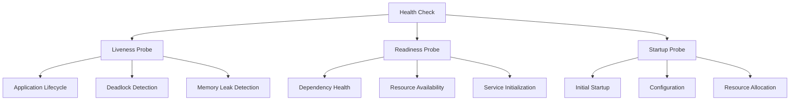
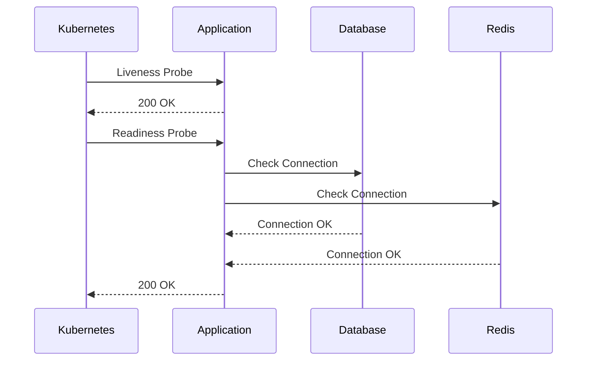
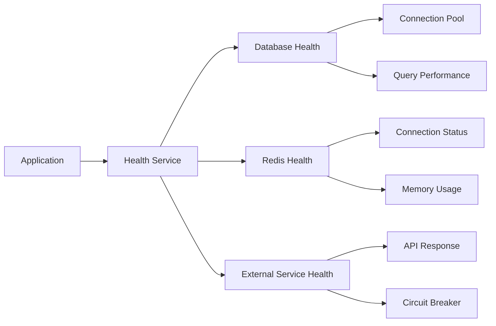

# 3.3 Health Checks & Heartbeats

## Overview

Health checks and heartbeats are essential monitoring mechanisms that ensure system components are functioning correctly. They enable early detection of issues, automated recovery, and informed load balancing decisions.







## Spring Boot Actuator Health Checks

### Basic Health Check Configuration

```java
@Configuration
public class HealthCheckConfig {
    
    @Bean
    public HealthContributorRegistry healthContributorRegistry() {
        return new DefaultHealthContributorRegistry();
    }
    
    @Bean
    public HealthEndpoint healthEndpoint(HealthContributorRegistry registry) {
        return new HealthEndpoint(registry, HealthEndpointGroups.of(
            Map.of("liveness", HealthEndpointGroup.of(
                Set.of("livenessStateHealthIndicator"), 
                StatusAggregator.getDefault(), 
                HttpCodeStatusMapper.DEFAULT, 
                Set.of("never")
            ),
            "readiness", HealthEndpointGroup.of(
                Set.of("readinessStateHealthIndicator", "db", "redis"), 
                StatusAggregator.getDefault(), 
                HttpCodeStatusMapper.DEFAULT, 
                Set.of("never")
            ))
        ));
    }
}
```

### Custom Health Indicators

```java
@Component
public class DatabaseHealthIndicator implements HealthIndicator {
    
    private final DataSource dataSource;
    
    public DatabaseHealthIndicator(DataSource dataSource) {
        this.dataSource = dataSource;
    }
    
    @Override
    public Health health() {
        Health.Builder builder = new Health.Builder();
        
        try (Connection connection = dataSource.getConnection()) {
            // Test database connectivity
            boolean isValid = connection.isValid(5); // 5 seconds timeout
            
            if (isValid) {
                // Additional health checks
                long responseTime = measureResponseTime(connection);
                int activeConnections = getActiveConnections();
                
                builder.up()
                    .withDetail("database", "PostgreSQL")
                    .withDetail("responseTime", responseTime + "ms")
                    .withDetail("activeConnections", activeConnections)
                    .withDetail("maxConnections", getMaxConnections());
            } else {
                builder.down()
                    .withDetail("error", "Database connection is not valid");
            }
            
        } catch (SQLException e) {
            builder.down()
                .withDetail("error", e.getMessage())
                .withException(e);
        }
        
        return builder.build();
    }
    
    private long measureResponseTime(Connection connection) {
        long startTime = System.currentTimeMillis();
        try (PreparedStatement stmt = connection.prepareStatement("SELECT 1")) {
            stmt.executeQuery();
            return System.currentTimeMillis() - startTime;
        } catch (SQLException e) {
            return -1;
        }
    }
    
    private int getActiveConnections() {
        if (dataSource instanceof HikariDataSource) {
            HikariPoolMXBean poolBean = ((HikariDataSource) dataSource).getHikariPoolMXBean();
            return poolBean.getActiveConnections();
        }
        return -1;
    }
    
    private int getMaxConnections() {
        if (dataSource instanceof HikariDataSource) {
            HikariPoolMXBean poolBean = ((HikariDataSource) dataSource).getHikariPoolMXBean();
            return poolBean.getTotalConnections();
        }
        return -1;
    }
}
```

### Redis Health Indicator

```java
@Component
@ConditionalOnProperty(name = "spring.redis.host")
public class RedisHealthIndicator implements HealthIndicator {
    
    private final RedisTemplate<String, Object> redisTemplate;
    
    public RedisHealthIndicator(RedisTemplate<String, Object> redisTemplate) {
        this.redisTemplate = redisTemplate;
    }
    
    @Override
    public Health health() {
        Health.Builder builder = new Health.Builder();
        
        try {
            // Test Redis connectivity with PING command
            String response = redisTemplate.getConnectionFactory()
                .getConnection()
                .ping();
                
            if ("PONG".equals(response)) {
                RedisConnectionInfo info = getRedisInfo();
                
                builder.up()
                    .withDetail("redis", "Available")
                    .withDetail("version", info.getVersion())
                    .withDetail("mode", info.getMode())
                    .withDetail("connectedClients", info.getConnectedClients())
                    .withDetail("usedMemory", info.getUsedMemoryHuman())
                    .withDetail("responseTime", measureRedisResponseTime() + "ms");
            } else {
                builder.down()
                    .withDetail("error", "Unexpected response: " + response);
            }
            
        } catch (Exception e) {
            builder.down()
                .withDetail("error", e.getMessage())
                .withException(e);
        }
        
        return builder.build();
    }
    
    private long measureRedisResponseTime() {
        long startTime = System.currentTimeMillis();
        try {
            redisTemplate.opsForValue().get("health-check-key");
            return System.currentTimeMillis() - startTime;
        } catch (Exception e) {
            return -1;
        }
    }
    
    private RedisConnectionInfo getRedisInfo() {
        // Implementation to get Redis server info
        return new RedisConnectionInfo("6.2.6", "standalone", 1, "1MB");
    }
    
    private static class RedisConnectionInfo {
        private final String version;
        private final String mode;
        private final int connectedClients;
        private final String usedMemoryHuman;
        
        public RedisConnectionInfo(String version, String mode, 
                                 int connectedClients, String usedMemoryHuman) {
            this.version = version;
            this.mode = mode;
            this.connectedClients = connectedClients;
            this.usedMemoryHuman = usedMemoryHuman;
        }
        
        // Getters...
        public String getVersion() { return version; }
        public String getMode() { return mode; }
        public int getConnectedClients() { return connectedClients; }
        public String getUsedMemoryHuman() { return usedMemoryHuman; }
    }
}
```

### External Service Health Indicator

```java
@Component
public class ExternalServiceHealthIndicator implements HealthIndicator {
    
    private final RestTemplate restTemplate;
    private final CircuitBreaker circuitBreaker;
    
    @Value("${external.service.health.url}")
    private String healthCheckUrl;
    
    public ExternalServiceHealthIndicator(RestTemplate restTemplate,
                                        CircuitBreakerRegistry registry) {
        this.restTemplate = restTemplate;
        this.circuitBreaker = registry.circuitBreaker("external-service-health");
    }
    
    @Override
    public Health health() {
        Health.Builder builder = new Health.Builder();
        
        try {
            Supplier<ResponseEntity<Map>> healthCheckSupplier = CircuitBreaker
                .decorateSupplier(circuitBreaker, () -> {
                    return restTemplate.getForEntity(healthCheckUrl, Map.class);
                });
            
            ResponseEntity<Map> response = healthCheckSupplier.get();
            
            if (response.getStatusCode().is2xxSuccessful()) {
                Map<String, Object> body = response.getBody();
                
                builder.up()
                    .withDetail("externalService", "Available")
                    .withDetail("responseTime", measureResponseTime())
                    .withDetail("status", body.get("status"))
                    .withDetail("version", body.get("version"));
            } else {
                builder.down()
                    .withDetail("error", "HTTP " + response.getStatusCode());
            }
            
        } catch (CallNotPermittedException e) {
            builder.down()
                .withDetail("error", "Circuit breaker is open")
                .withDetail("circuitBreakerState", circuitBreaker.getState());
                
        } catch (Exception e) {
            builder.down()
                .withDetail("error", e.getMessage())
                .withException(e);
        }
        
        return builder.build();
    }
    
    private long measureResponseTime() {
        long startTime = System.currentTimeMillis();
        try {
            restTemplate.headForHeaders(healthCheckUrl);
            return System.currentTimeMillis() - startTime;
        } catch (Exception e) {
            return -1;
        }
    }
}
```

## Kubernetes Health Checks

### Liveness and Readiness Probes

```yaml
# kubernetes/deployment.yaml
apiVersion: apps/v1
kind: Deployment
metadata:
  name: spring-boot-app
spec:
  replicas: 3
  selector:
    matchLabels:
      app: spring-boot-app
  template:
    metadata:
      labels:
        app: spring-boot-app
    spec:
      containers:
      - name: app
        image: spring-boot-app:latest
        ports:
        - containerPort: 8080
        
        # Liveness probe - checks if container should be restarted
        livenessProbe:
          httpGet:
            path: /actuator/health/liveness
            port: 8080
          initialDelaySeconds: 30
          periodSeconds: 10
          timeoutSeconds: 5
          failureThreshold: 3
          successThreshold: 1
        
        # Readiness probe - checks if container is ready to serve traffic
        readinessProbe:
          httpGet:
            path: /actuator/health/readiness
            port: 8080
          initialDelaySeconds: 15
          periodSeconds: 5
          timeoutSeconds: 3
          failureThreshold: 3
          successThreshold: 1
        
        # Startup probe - gives more time for slow-starting containers
        startupProbe:
          httpGet:
            path: /actuator/health/liveness
            port: 8080
          initialDelaySeconds: 10
          periodSeconds: 5
          timeoutSeconds: 3
          failureThreshold: 30
          successThreshold: 1
        
        resources:
          requests:
            memory: "256Mi"
            cpu: "250m"
          limits:
            memory: "512Mi"
            cpu: "500m"
        
        env:
        - name: SPRING_PROFILES_ACTIVE
          value: "kubernetes"
```

### Health Check Controller

```java
@RestController
@RequestMapping("/health")
public class HealthController {
    
    private final ApplicationReadinessChecker readinessChecker;
    private final ApplicationLivenessChecker livenessChecker;
    
    public HealthController(ApplicationReadinessChecker readinessChecker,
                           ApplicationLivenessChecker livenessChecker) {
        this.readinessChecker = readinessChecker;
        this.livenessChecker = livenessChecker;
    }
    
    @GetMapping("/liveness")
    public ResponseEntity<Map<String, Object>> liveness() {
        Map<String, Object> response = new HashMap<>();
        
        try {
            boolean isAlive = livenessChecker.check();
            
            if (isAlive) {
                response.put("status", "UP");
                response.put("timestamp", Instant.now());
                response.put("uptime", getUptime());
                return ResponseEntity.ok(response);
            } else {
                response.put("status", "DOWN");
                response.put("reason", "Application is not alive");
                return ResponseEntity.status(HttpStatus.SERVICE_UNAVAILABLE)
                    .body(response);
            }
            
        } catch (Exception e) {
            response.put("status", "DOWN");
            response.put("error", e.getMessage());
            return ResponseEntity.status(HttpStatus.SERVICE_UNAVAILABLE)
                .body(response);
        }
    }
    
    @GetMapping("/readiness")
    public ResponseEntity<Map<String, Object>> readiness() {
        Map<String, Object> response = new HashMap<>();
        
        try {
            ReadinessResult result = readinessChecker.check();
            
            if (result.isReady()) {
                response.put("status", "UP");
                response.put("dependencies", result.getDependencyStatus());
                response.put("timestamp", Instant.now());
                return ResponseEntity.ok(response);
            } else {
                response.put("status", "DOWN");
                response.put("failedDependencies", result.getFailedDependencies());
                response.put("dependencies", result.getDependencyStatus());
                return ResponseEntity.status(HttpStatus.SERVICE_UNAVAILABLE)
                    .body(response);
            }
            
        } catch (Exception e) {
            response.put("status", "DOWN");
            response.put("error", e.getMessage());
            return ResponseEntity.status(HttpStatus.SERVICE_UNAVAILABLE)
                .body(response);
        }
    }
    
    private String getUptime() {
        long uptimeMs = ManagementFactory.getRuntimeMXBean().getUptime();
        Duration uptime = Duration.ofMillis(uptimeMs);
        
        long days = uptime.toDays();
        long hours = uptime.toHours() % 24;
        long minutes = uptime.toMinutes() % 60;
        
        return String.format("%dd %dh %dm", days, hours, minutes);
    }
}
```

### Readiness and Liveness Checkers

```java
@Component
public class ApplicationReadinessChecker {
    
    private final List<HealthIndicator> healthIndicators;
    
    public ApplicationReadinessChecker(List<HealthIndicator> healthIndicators) {
        this.healthIndicators = healthIndicators;
    }
    
    public ReadinessResult check() {
        Map<String, Health> dependencyStatus = new HashMap<>();
        List<String> failedDependencies = new ArrayList<>();
        
        for (HealthIndicator indicator : healthIndicators) {
            String name = indicator.getClass().getSimpleName()
                .replace("HealthIndicator", "");
            
            try {
                Health health = indicator.health();
                dependencyStatus.put(name, health);
                
                if (health.getStatus() != Status.UP) {
                    failedDependencies.add(name);
                }
                
            } catch (Exception e) {
                Health errorHealth = Health.down()
                    .withDetail("error", e.getMessage())
                    .build();
                dependencyStatus.put(name, errorHealth);
                failedDependencies.add(name);
            }
        }
        
        boolean isReady = failedDependencies.isEmpty();
        return new ReadinessResult(isReady, dependencyStatus, failedDependencies);
    }
    
    public static class ReadinessResult {
        private final boolean ready;
        private final Map<String, Health> dependencyStatus;
        private final List<String> failedDependencies;
        
        public ReadinessResult(boolean ready, 
                             Map<String, Health> dependencyStatus,
                             List<String> failedDependencies) {
            this.ready = ready;
            this.dependencyStatus = dependencyStatus;
            this.failedDependencies = failedDependencies;
        }
        
        // Getters...
        public boolean isReady() { return ready; }
        public Map<String, Health> getDependencyStatus() { return dependencyStatus; }
        public List<String> getFailedDependencies() { return failedDependencies; }
    }
}

@Component
public class ApplicationLivenessChecker {
    
    private final AtomicBoolean alive = new AtomicBoolean(true);
    
    @EventListener
    public void handleContextClosedEvent(ContextClosedEvent event) {
        alive.set(false);
    }
    
    public boolean check() {
        // Check if application context is still alive
        if (!alive.get()) {
            return false;
        }
        
        // Additional liveness checks
        return checkMemoryUsage() && checkThreads();
    }
    
    private boolean checkMemoryUsage() {
        MemoryMXBean memoryBean = ManagementFactory.getMemoryMXBean();
        MemoryUsage heapUsage = memoryBean.getHeapMemoryUsage();
        
        double usagePercentage = (double) heapUsage.getUsed() / heapUsage.getMax();
        
        // Fail liveness if memory usage is above 95%
        return usagePercentage < 0.95;
    }
    
    private boolean checkThreads() {
        ThreadMXBean threadBean = ManagementFactory.getThreadMXBean();
        int threadCount = threadBean.getThreadCount();
        
        // Fail liveness if thread count is abnormally high
        return threadCount < 1000;
    }
}
```

## AWS Load Balancer Health Checks

### Application Load Balancer Configuration

```java
@RestController
@RequestMapping("/health")
public class ALBHealthController {
    
    private final HealthService healthService;
    
    public ALBHealthController(HealthService healthService) {
        this.healthService = healthService;
    }
    
    @GetMapping("/alb")
    public ResponseEntity<String> albHealthCheck(
            @RequestHeader(value = "User-Agent", required = false) String userAgent) {
        
        // AWS ALB health check user agent
        if ("ELB-HealthChecker/2.0".equals(userAgent)) {
            log.debug("ALB health check request received");
        }
        
        try {
            HealthStatus status = healthService.getOverallHealth();
            
            if (status.isHealthy()) {
                return ResponseEntity.ok("OK");
            } else {
                return ResponseEntity.status(HttpStatus.SERVICE_UNAVAILABLE)
                    .body("UNHEALTHY: " + status.getMessage());
            }
            
        } catch (Exception e) {
            log.error("Health check failed", e);
            return ResponseEntity.status(HttpStatus.SERVICE_UNAVAILABLE)
                .body("ERROR: " + e.getMessage());
        }
    }
    
    @GetMapping("/detailed")
    public ResponseEntity<Map<String, Object>> detailedHealthCheck() {
        Map<String, Object> health = healthService.getDetailedHealth();
        
        boolean isHealthy = (Boolean) health.getOrDefault("healthy", false);
        
        if (isHealthy) {
            return ResponseEntity.ok(health);
        } else {
            return ResponseEntity.status(HttpStatus.SERVICE_UNAVAILABLE)
                .body(health);
        }
    }
}
```

### Health Service Implementation

```java
@Service
public class HealthService {
    
    private final DataSource dataSource;
    private final RedisTemplate<String, Object> redisTemplate;
    private final RestTemplate restTemplate;
    
    @Value("${health.check.timeout:5000}")
    private long healthCheckTimeout;
    
    public HealthService(DataSource dataSource,
                        RedisTemplate<String, Object> redisTemplate,
                        RestTemplate restTemplate) {
        this.dataSource = dataSource;
        this.redisTemplate = redisTemplate;
        this.restTemplate = restTemplate;
    }
    
    public HealthStatus getOverallHealth() {
        List<CompletableFuture<HealthCheck>> healthChecks = Arrays.asList(
            checkDatabaseAsync(),
            checkRedisAsync(),
            checkExternalServicesAsync()
        );
        
        try {
            CompletableFuture.allOf(healthChecks.toArray(new CompletableFuture[0]))
                .get(healthCheckTimeout, TimeUnit.MILLISECONDS);
            
            List<HealthCheck> results = healthChecks.stream()
                .map(CompletableFuture::join)
                .collect(Collectors.toList());
            
            boolean allHealthy = results.stream().allMatch(HealthCheck::isHealthy);
            
            if (allHealthy) {
                return HealthStatus.healthy();
            } else {
                String failedChecks = results.stream()
                    .filter(check -> !check.isHealthy())
                    .map(HealthCheck::getName)
                    .collect(Collectors.joining(", "));
                    
                return HealthStatus.unhealthy("Failed checks: " + failedChecks);
            }
            
        } catch (TimeoutException e) {
            return HealthStatus.unhealthy("Health check timeout");
        } catch (Exception e) {
            return HealthStatus.unhealthy("Health check error: " + e.getMessage());
        }
    }
    
    public Map<String, Object> getDetailedHealth() {
        Map<String, Object> health = new HashMap<>();
        health.put("timestamp", Instant.now());
        health.put("service", "spring-boot-app");
        health.put("version", getClass().getPackage().getImplementationVersion());
        
        Map<String, Object> checks = new HashMap<>();
        
        // Database check
        HealthCheck dbCheck = checkDatabase();
        checks.put("database", Map.of(
            "status", dbCheck.isHealthy() ? "UP" : "DOWN",
            "responseTime", dbCheck.getResponseTime() + "ms",
            "details", dbCheck.getDetails()
        ));
        
        // Redis check
        HealthCheck redisCheck = checkRedis();
        checks.put("redis", Map.of(
            "status", redisCheck.isHealthy() ? "UP" : "DOWN",
            "responseTime", redisCheck.getResponseTime() + "ms",
            "details", redisCheck.getDetails()
        ));
        
        health.put("checks", checks);
        
        boolean allHealthy = checks.values().stream()
            .allMatch(check -> "UP".equals(((Map<String, Object>) check).get("status")));
            
        health.put("healthy", allHealthy);
        health.put("status", allHealthy ? "UP" : "DOWN");
        
        return health;
    }
    
    private CompletableFuture<HealthCheck> checkDatabaseAsync() {
        return CompletableFuture.supplyAsync(this::checkDatabase);
    }
    
    private CompletableFuture<HealthCheck> checkRedisAsync() {
        return CompletableFuture.supplyAsync(this::checkRedis);
    }
    
    private CompletableFuture<HealthCheck> checkExternalServicesAsync() {
        return CompletableFuture.supplyAsync(this::checkExternalServices);
    }
    
    private HealthCheck checkDatabase() {
        long startTime = System.currentTimeMillis();
        
        try (Connection connection = dataSource.getConnection()) {
            boolean isValid = connection.isValid(3);
            long responseTime = System.currentTimeMillis() - startTime;
            
            if (isValid) {
                return HealthCheck.healthy("database", responseTime, 
                    Map.of("driver", connection.getMetaData().getDriverName()));
            } else {
                return HealthCheck.unhealthy("database", responseTime, 
                    Map.of("error", "Connection not valid"));
            }
            
        } catch (SQLException e) {
            long responseTime = System.currentTimeMillis() - startTime;
            return HealthCheck.unhealthy("database", responseTime, 
                Map.of("error", e.getMessage()));
        }
    }
    
    private HealthCheck checkRedis() {
        long startTime = System.currentTimeMillis();
        
        try {
            String response = redisTemplate.getConnectionFactory()
                .getConnection()
                .ping();
            
            long responseTime = System.currentTimeMillis() - startTime;
            
            if ("PONG".equals(response)) {
                return HealthCheck.healthy("redis", responseTime, 
                    Map.of("response", response));
            } else {
                return HealthCheck.unhealthy("redis", responseTime, 
                    Map.of("error", "Unexpected response: " + response));
            }
            
        } catch (Exception e) {
            long responseTime = System.currentTimeMillis() - startTime;
            return HealthCheck.unhealthy("redis", responseTime, 
                Map.of("error", e.getMessage()));
        }
    }
    
    private HealthCheck checkExternalServices() {
        // Implementation for external service checks
        return HealthCheck.healthy("external-services", 100, Map.of());
    }
    
    // Helper classes
    public static class HealthStatus {
        private final boolean healthy;
        private final String message;
        
        private HealthStatus(boolean healthy, String message) {
            this.healthy = healthy;
            this.message = message;
        }
        
        public static HealthStatus healthy() {
            return new HealthStatus(true, "All systems operational");
        }
        
        public static HealthStatus unhealthy(String message) {
            return new HealthStatus(false, message);
        }
        
        public boolean isHealthy() { return healthy; }
        public String getMessage() { return message; }
    }
    
    public static class HealthCheck {
        private final String name;
        private final boolean healthy;
        private final long responseTime;
        private final Map<String, Object> details;
        
        private HealthCheck(String name, boolean healthy, long responseTime, 
                          Map<String, Object> details) {
            this.name = name;
            this.healthy = healthy;
            this.responseTime = responseTime;
            this.details = details;
        }
        
        public static HealthCheck healthy(String name, long responseTime, 
                                        Map<String, Object> details) {
            return new HealthCheck(name, true, responseTime, details);
        }
        
        public static HealthCheck unhealthy(String name, long responseTime, 
                                          Map<String, Object> details) {
            return new HealthCheck(name, false, responseTime, details);
        }
        
        // Getters...
        public String getName() { return name; }
        public boolean isHealthy() { return healthy; }
        public long getResponseTime() { return responseTime; }
        public Map<String, Object> getDetails() { return details; }
    }
}
```

This comprehensive health check implementation provides robust monitoring capabilities for Spring Boot applications across various deployment environments including Kubernetes and AWS.
