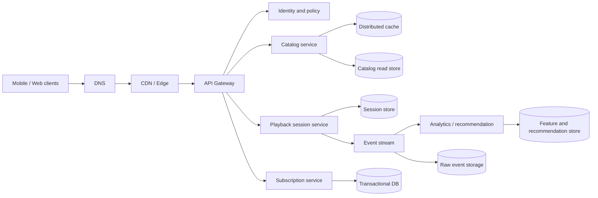

# Large-Scale System Design: A Spotify-Scale Scenario

This is a hypothetical music platform design exercise at Spotify scale; it does not claim to describe Spotify's private internal architecture. The goal is to reason end to end from requirements and capacity to request paths and recovery.

## Quick Decision

| Problem | First decision | Why |
| --- | --- | --- |
| 1B registered users | Domain-oriented stateless services | Registered users are not active traffic |
| 10M concurrent playback sessions | CDN and edge delivery | Media should not be served from the origin API |
| 200 ms control-plane p95 | Cache, short request path, async side effects | Separate media transfer latency |
| Global catalog | Read-heavy replicated store | Read scale and regional latency |
| Listening events | Append-only event stream | Decouple analytics and recommendations |
| Billing/subscriptions | Strong consistency and idempotency | Correctness differs from playback |

## Production Checklist

- Are registered users, DAU, concurrent sessions, and request rate separate numbers?
- Is it explicit which endpoint and percentile the 200 ms target covers?
- Do media and control planes have separate scaling and caching strategies?
- Is every data store's owner, consistency model, and recovery method clear?
- Have region loss, CDN miss storms, hot artists, and recommendation backlog been tested?

## Assumptions and Scope

```text
1B registered users
100M daily active users
10M concurrent playback sessions
Playback heartbeat: every 30 seconds
Control-plane API p95: 200 ms
Media segments are delivered through a CDN
```

If 10M playback sessions send a heartbeat every 30 seconds:

```text
Average heartbeat RPS = 10,000,000 / 30 ≈ 333,000 RPS
```

This traffic should not share the same request path as login or catalog search. Aggregate heartbeats, batch them at the edge, or use a separate ingestion path.

## End-to-End Architecture



## Plane Separation

### Control Plane

Login, catalog metadata, search, playlists, recommendation metadata, subscriptions, and playback tokens belong to the control plane. The 200 ms target primarily applies to these requests.

### Media Plane

Audio segments are served from object storage and a CDN. Use origin shielding, signed URLs, adaptive bitrate, and regional caching. Passing media bodies through the API gateway adds unnecessary latency and cost.

### Event Plane

Play, pause, skip, search, and impression events are written to an append-only stream. Recommendation and analytics consumers use separate consumer groups; the user request does not wait for all of them.

## Component Deep Dive

### API Gateway

Provides TLS, authentication, quotas, request IDs, routing, and coarse-grained rate limits. It should not run business queries; service timeouts must fit inside the total latency budget.

### Catalog

Artist, album, track, and rights metadata is read-heavy. Use cache-aside, versioned metadata, read replicas, and region-local read stores. Rights or territory filters must be part of the cache key.

### Playback Session

A low-latency TTL-capable store fits playback tokens and session state. Heartbeats must be idempotent; a late or duplicate heartbeat must not move the session backward.

### Subscriptions and Billing

Subscription and payment state belongs in a transactional source of truth. Process webhook duplicates with idempotency keys. Entitlement can be cached, but the cache is not the payment source of truth.

### Event Stream

Choose a user or session key to preserve required ordering. Partition count, retention, consumer lag, and hot-key distribution belong in capacity planning.

## Latency Budget

Example budget for a 200 ms control-plane p95:

```text
DNS/TLS/edge       25 ms
Gateway/auth       20 ms
Service logic      45 ms
Cache/database     70 ms
Serialization      15 ms
Headroom           25 ms
Total             200 ms
```

When an endpoint makes three downstream calls, calculate timeouts with parallelism and tail latency. Retry only when the budget and idempotency rules permit it.

## Data and Consistency

| Data | Store approach | Consistency |
| --- | --- | --- |
| Catalog metadata | Replicated read store plus cache | Eventual is acceptable |
| Playlist changes | User-owned transactional store | Read-your-writes may be required |
| Subscription/payment | Relational transactional database | Strong and auditable |
| Playback heartbeat | TTL session store | Latest-write or monotonic state |
| Listening events | Append-only stream plus raw lake | At-least-once and deduplication |

Every projection should carry the source event version and be rebuildable.

## Failure and Degradation Scenarios

- **CDN miss storm:** Origin shielding, request coalescing, prewarming, and stale assets.
- **Catalog store slow:** Serve stale metadata from cache and degrade search results in a controlled way.
- **Recommendation backlog:** Return the last known recommendation or a popular-content fallback.
- **Event broker lag:** Do not block playback requests; alert on lag and scale consumers.
- **Region loss:** Define DNS/traffic routing, read failover, and write-ownership policy.
- **Billing dependency down:** Pause new entitlement changes and apply a safe policy to existing sessions.

Use exponential backoff, jitter, circuit breakers, and bulkheads together to prevent retry storms.

## Security and Privacy

Identity-token validation, device/session binding, signed media URLs, entitlement checks, tenant/user authorization, secret rotation, and audit logs are required. Listening history and payment data need separate access policies and retention rules.

## Observability

Dashboards should include API p95/p99, CDN hit rate, origin egress, cache hit rate, heartbeat RPS, playback-start success, event lag, billing error rate, database saturation, and error-budget burn rate. Propagate trace context from API requests to stream consumers.

## Design Outcome

“Add more instances” is not the answer for every layer. The media plane scales with CDN, the control plane with cache and stateless services, the event plane with partitions and consumer groups, and billing with transactions and idempotency. Evaluate each layer with its own failure modes and SLOs.
