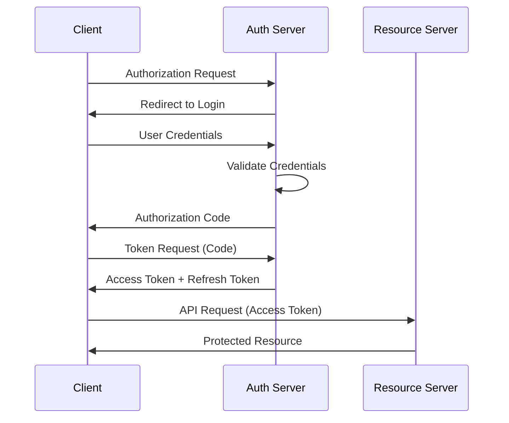
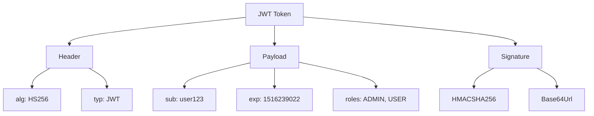
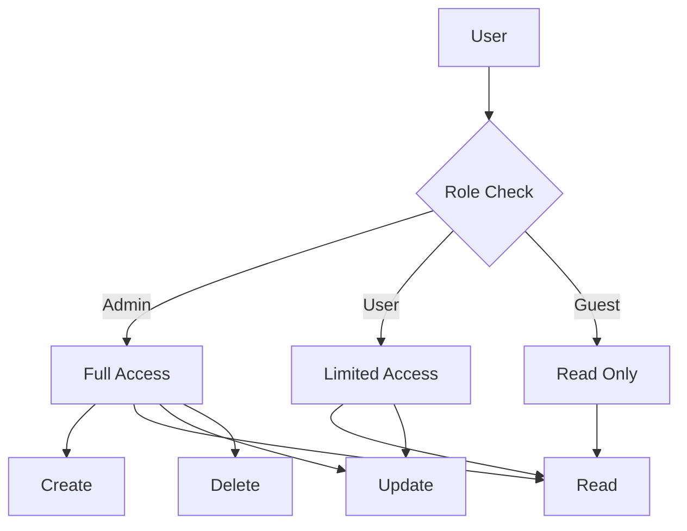

# Authentication vs Authorization - Spring Security Implementation

Modern applications require sophisticated authentication and authorization mechanisms to protect resources and ensure proper access control. This chapter covers OAuth2 implementation, JWT token management, method-level security, and Spring Security configuration with comprehensive Spring Boot examples.

## OAuth2 Implementation with Spring Boot

### OAuth2 Authorization Server Configuration

Setting up a complete OAuth2 Authorization Server with Spring Security:



```xml
<dependency>
    <groupId>org.springframework.security</groupId>
    <artifactId>spring-security-oauth2-authorization-server</artifactId>
</dependency>
<dependency>
    <groupId>org.springframework.security</groupId>
    <artifactId>spring-security-oauth2-resource-server</artifactId>
</dependency>
<dependency>
    <groupId>org.springframework.security</groupId>
    <artifactId>spring-security-oauth2-client</artifactId>
</dependency>
```

```java
@Configuration
@EnableAuthorizationServer
public class AuthorizationServerConfig {
    
    @Bean
    @Order(1)
    public SecurityFilterChain authorizationServerSecurityFilterChain(HttpSecurity http) 
            throws Exception {
        OAuth2AuthorizationServerConfiguration.applyDefaultSecurity(http);
        
        http
            .getConfigurer(OAuth2AuthorizationServerConfigurer.class)
            .oidc(Customizer.withDefaults());
        
        http
            .exceptionHandling(exceptions -> exceptions
                .defaultAuthenticationEntryPointFor(
                    new LoginUrlAuthenticationEntryPoint("/login"),
                    new MediaTypeRequestMatcher(MediaType.TEXT_HTML)
                )
            )
            .oauth2ResourceServer(resourceServer -> resourceServer
                .jwt(Customizer.withDefaults())
            );
        
        return http.build();
    }
    
    @Bean
    @Order(2)
    public SecurityFilterChain defaultSecurityFilterChain(HttpSecurity http) 
            throws Exception {
        http
            .authorizeHttpRequests(authorize -> authorize
                .requestMatchers("/oauth2/**", "/login", "/error").permitAll()
                .anyRequest().authenticated()
            )
            .formLogin(formLogin -> formLogin
                .loginPage("/login")
                .defaultSuccessUrl("/", true)
            );
        
        return http.build();
    }
    
    @Bean
    public RegisteredClientRepository registeredClientRepository() {
        RegisteredClient webClient = RegisteredClient.withId(UUID.randomUUID().toString())
            .clientId("web-client")
            .clientSecret("{noop}secret")
            .clientAuthenticationMethod(ClientAuthenticationMethod.CLIENT_SECRET_BASIC)
            .authorizationGrantType(AuthorizationGrantType.AUTHORIZATION_CODE)
            .authorizationGrantType(AuthorizationGrantType.REFRESH_TOKEN)
            .authorizationGrantType(AuthorizationGrantType.CLIENT_CREDENTIALS)
            .redirectUri("http://localhost:8080/login/oauth2/code/web-client")
            .redirectUri("http://localhost:8080/authorized")
            .scope(OidcScopes.OPENID)
            .scope(OidcScopes.PROFILE)
            .scope("read")
            .scope("write")
            .clientSettings(ClientSettings.builder()
                .requireAuthorizationConsent(true)
                .requireProofKey(false)
                .build())
            .tokenSettings(TokenSettings.builder()
                .accessTokenTimeToLive(Duration.ofMinutes(30))
                .refreshTokenTimeToLive(Duration.ofHours(8))
                .reuseRefreshTokens(false)
                .build())
            .build();
            
        RegisteredClient mobileClient = RegisteredClient.withId(UUID.randomUUID().toString())
            .clientId("mobile-client")
            .clientAuthenticationMethod(ClientAuthenticationMethod.NONE)
            .authorizationGrantType(AuthorizationGrantType.AUTHORIZATION_CODE)
            .authorizationGrantType(AuthorizationGrantType.REFRESH_TOKEN)
            .redirectUri("com.example.app://oauth/callback")
            .scope(OidcScopes.OPENID)
            .scope(OidcScopes.PROFILE)
            .scope("read")
            .clientSettings(ClientSettings.builder()
                .requireAuthorizationConsent(false)
                .requireProofKey(true)
                .build())
            .build();
        
        return new InMemoryRegisteredClientRepository(webClient, mobileClient);
    }
    
    @Bean
    public JWKSource<SecurityContext> jwkSource() {
        KeyPair keyPair = generateRsaKey();
        RSAPublicKey publicKey = (RSAPublicKey) keyPair.getPublic();
        RSAPrivateKey privateKey = (RSAPrivateKey) keyPair.getPrivate();
        
        RSAKey rsaKey = new RSAKey.Builder(publicKey)
            .privateKey(privateKey)
            .keyID(UUID.randomUUID().toString())
            .build();
        
        JWKSet jwkSet = new JWKSet(rsaKey);
        return new ImmutableJWKSet<>(jwkSet);
    }
    
    private static KeyPair generateRsaKey() {
        KeyPair keyPair;
        try {
            KeyPairGenerator keyPairGenerator = KeyPairGenerator.getInstance("RSA");
            keyPairGenerator.initialize(2048);
            keyPair = keyPairGenerator.generateKeyPair();
        } catch (Exception ex) {
            throw new IllegalStateException(ex);
        }
        return keyPair;
    }
    
    @Bean
    public JwtDecoder jwtDecoder(JWKSource<SecurityContext> jwkSource) {
        return OAuth2AuthorizationServerConfiguration.jwtDecoder(jwkSource);
    }
    
    @Bean
    public AuthorizationServerSettings authorizationServerSettings() {
        return AuthorizationServerSettings.builder()
            .issuer("http://localhost:9000")
            .build();
    }
}
```

### OAuth2 Resource Server Configuration

```java
@Configuration
@EnableWebSecurity
@EnableMethodSecurity(prePostEnabled = true)
public class ResourceServerConfig {
    
    @Bean
    public SecurityFilterChain resourceServerFilterChain(HttpSecurity http) throws Exception {
        http
            .securityMatcher("/api/**")
            .authorizeHttpRequests(authorize -> authorize
                .requestMatchers("/api/public/**").permitAll()
                .requestMatchers(HttpMethod.GET, "/api/users/me").hasAuthority("SCOPE_profile")
                .requestMatchers(HttpMethod.GET, "/api/data").hasAuthority("SCOPE_read")
                .requestMatchers(HttpMethod.POST, "/api/data").hasAuthority("SCOPE_write")
                .requestMatchers("/api/admin/**").hasRole("ADMIN")
                .anyRequest().authenticated()
            )
            .oauth2ResourceServer(oauth2 -> oauth2
                .jwt(jwt -> jwt
                    .jwtAuthenticationConverter(jwtAuthenticationConverter())
                    .jwtDecoder(customJwtDecoder())
                )
                .accessDeniedHandler(accessDeniedHandler())
                .authenticationEntryPoint(authenticationEntryPoint())
            )
            .sessionManagement(session -> session
                .sessionCreationPolicy(SessionCreationPolicy.STATELESS)
            )
            .cors(Customizer.withDefaults())
            .csrf(csrf -> csrf.disable());
        
        return http.build();
    }
    
    @Bean
    public JwtAuthenticationConverter jwtAuthenticationConverter() {
        JwtGrantedAuthoritiesConverter authoritiesConverter = 
            new JwtGrantedAuthoritiesConverter();
        authoritiesConverter.setAuthorityPrefix("SCOPE_");
        authoritiesConverter.setAuthoritiesClaimName("scope");
        
        JwtAuthenticationConverter converter = new JwtAuthenticationConverter();
        converter.setJwtGrantedAuthoritiesConverter(authoritiesConverter);
        converter.setPrincipalClaimName("sub");
        
        return converter;
    }
    
    @Bean
    public JwtDecoder customJwtDecoder() {
        NimbusJwtDecoder jwtDecoder = NimbusJwtDecoder
            .withJwkSetUri("http://localhost:9000/oauth2/jwks")
            .build();
        
        jwtDecoder.setJwtValidator(jwtValidator());
        return jwtDecoder;
    }
    
    @Bean
    public Oauth2TokenValidator<Jwt> jwtValidator() {
        List<Oauth2TokenValidator<Jwt>> validators = new ArrayList<>();
        validators.add(new JwtTimestampValidator());
        validators.add(new JwtIssuerValidator("http://localhost:9000"));
        validators.add(new JwtAudienceValidator(Arrays.asList("web-client", "mobile-client")));
        
        return new DelegatingOauth2TokenValidator<>(validators);
    }
    
    @Bean
    public AccessDeniedHandler accessDeniedHandler() {
        return (request, response, accessDeniedException) -> {
            response.setStatus(HttpServletResponse.SC_FORBIDDEN);
            response.setContentType("application/json");
            response.getWriter().write(
                "{\"error\":\"access_denied\",\"message\":\"Insufficient privileges\"}"
            );
        };
    }
    
    @Bean
    public AuthenticationEntryPoint authenticationEntryPoint() {
        return (request, response, authException) -> {
            response.setStatus(HttpServletResponse.SC_UNAUTHORIZED);
            response.setContentType("application/json");
            response.getWriter().write(
                "{\"error\":\"unauthorized\",\"message\":\"Authentication required\"}"
            );
        };
    }
}
```

## JWT Token Management

### JWT Token Structure and Validation



```java
@Component
public class JwtTokenProvider {
    
    private final JWTProcessor<SecurityContext> jwtProcessor;
    private final JWKSource<SecurityContext> jwkSource;
    
    public JwtTokenProvider(JWKSource<SecurityContext> jwkSource) {
        this.jwkSource = jwkSource;
        this.jwtProcessor = createJWTProcessor();
    }
    
    private JWTProcessor<SecurityContext> createJWTProcessor() {
        DefaultJWTProcessor<SecurityContext> jwtProcessor = new DefaultJWTProcessor<>();
        JWSKeySelector<SecurityContext> keySelector = 
            new JWSVerificationKeySelector<>(JWSAlgorithm.RS256, jwkSource);
        jwtProcessor.setJWSKeySelector(keySelector);
        
        jwtProcessor.setJWTClaimsSetVerifier(new DefaultJWTClaimsVerifier<>(
            new JWTClaimsSet.Builder()
                .issuer("http://localhost:9000")
                .build(),
            new HashSet<>(Arrays.asList("sub", "iat", "exp", "scope"))
        ));
        
        return jwtProcessor;
    }
    
    public boolean validateToken(String token) {
        try {
            jwtProcessor.process(token, null);
            return true;
        } catch (ParseException | BadJOSEException | JOSEException e) {
            log.error("JWT validation failed: {}", e.getMessage());
            return false;
        }
    }
    
    public Claims getClaimsFromToken(String token) {
        try {
            JWTClaimsSet claimsSet = jwtProcessor.process(token, null);
            return convertToSpringClaims(claimsSet);
        } catch (ParseException | BadJOSEException | JOSEException e) {
            throw new JwtException("Failed to parse JWT claims", e);
        }
    }
    
    private Claims convertToSpringClaims(JWTClaimsSet claimsSet) {
        Map<String, Object> claims = new HashMap<>();
        claims.put("sub", claimsSet.getSubject());
        claims.put("iss", claimsSet.getIssuer());
        claims.put("aud", claimsSet.getAudience());
        claims.put("exp", claimsSet.getExpirationTime());
        claims.put("iat", claimsSet.getIssueTime());
        claims.put("scope", claimsSet.getStringClaim("scope"));
        
        return new DefaultClaims(claims);
    }
}
```

### Custom JWT Authentication Filter

```java
@Component
public class JwtAuthenticationFilter extends OncePerRequestFilter {
    
    private final JwtTokenProvider tokenProvider;
    private final UserDetailsService userDetailsService;
    
    public JwtAuthenticationFilter(JwtTokenProvider tokenProvider, 
                                 UserDetailsService userDetailsService) {
        this.tokenProvider = tokenProvider;
        this.userDetailsService = userDetailsService;
    }
    
    @Override
    protected void doFilterInternal(HttpServletRequest request, 
                                  HttpServletResponse response, 
                                  FilterChain filterChain) throws ServletException, IOException {
        
        String token = extractTokenFromRequest(request);
        
        if (token != null && tokenProvider.validateToken(token)) {
            Authentication authentication = getAuthentication(token);
            SecurityContextHolder.getContext().setAuthentication(authentication);
        }
        
        filterChain.doFilter(request, response);
    }
    
    private String extractTokenFromRequest(HttpServletRequest request) {
        String bearerToken = request.getHeader("Authorization");
        if (StringUtils.hasText(bearerToken) && bearerToken.startsWith("Bearer ")) {
            return bearerToken.substring(7);
        }
        return null;
    }
    
    private Authentication getAuthentication(String token) {
        Claims claims = tokenProvider.getClaimsFromToken(token);
        String username = claims.getSubject();
        
        UserDetails userDetails = userDetailsService.loadUserByUsername(username);
        
        return new JwtAuthenticationToken(
            userDetails, 
            token, 
            userDetails.getAuthorities()
        );
    }
}
```

### Refresh Token Rotation

```java
@Service
public class RefreshTokenService {
    
    private final RefreshTokenRepository refreshTokenRepository;
    private final UserRepository userRepository;
    private final JwtTokenProvider tokenProvider;
    
    public RefreshTokenService(RefreshTokenRepository refreshTokenRepository,
                             UserRepository userRepository,
                             JwtTokenProvider tokenProvider) {
        this.refreshTokenRepository = refreshTokenRepository;
        this.userRepository = userRepository;
        this.tokenProvider = tokenProvider;
    }
    
    @Transactional
    public TokenResponse refreshAccessToken(String refreshToken) {
        RefreshToken storedToken = refreshTokenRepository.findByToken(refreshToken)
            .orElseThrow(() -> new InvalidTokenException("Invalid refresh token"));
        
        if (storedToken.isExpired()) {
            refreshTokenRepository.delete(storedToken);
            throw new TokenExpiredException("Refresh token expired");
        }
        
        User user = storedToken.getUser();
        
        // Revoke old refresh token
        refreshTokenRepository.delete(storedToken);
        
        // Generate new tokens
        String newAccessToken = tokenProvider.generateAccessToken(user);
        String newRefreshToken = generateRefreshToken(user);
        
        return TokenResponse.builder()
            .accessToken(newAccessToken)
            .refreshToken(newRefreshToken)
            .tokenType("Bearer")
            .expiresIn(1800) // 30 minutes
            .build();
    }
    
    private String generateRefreshToken(User user) {
        RefreshToken refreshToken = RefreshToken.builder()
            .token(UUID.randomUUID().toString())
            .user(user)
            .expiryDate(Instant.now().plus(Duration.ofDays(7)))
            .build();
        
        refreshTokenRepository.save(refreshToken);
        return refreshToken.getToken();
    }
    
    @Transactional
    public void revokeRefreshToken(String token) {
        refreshTokenRepository.findByToken(token)
            .ifPresent(refreshTokenRepository::delete);
    }
    
    @Scheduled(fixedRate = 3600000) // Every hour
    @Transactional
    public void cleanupExpiredTokens() {
        refreshTokenRepository.deleteByExpiryDateBefore(Instant.now());
    }
}
```

## Method-Level Security

### @PreAuthorize and @PostAuthorize



```java
@RestController
@RequestMapping("/api/data")
@PreAuthorize("hasRole('USER')")
public class DataController {
    
    private final DataService dataService;
    
    public DataController(DataService dataService) {
        this.dataService = dataService;
    }
    
    @GetMapping
    @PreAuthorize("hasAuthority('SCOPE_read')")
    public List<DataDto> getAllData() {
        return dataService.getAllData();
    }
    
    @GetMapping("/{id}")
    @PreAuthorize("hasAuthority('SCOPE_read') and @dataService.isOwner(#id, authentication.name)")
    public DataDto getDataById(@PathVariable Long id) {
        return dataService.getDataById(id);
    }
    
    @PostMapping
    @PreAuthorize("hasAuthority('SCOPE_write')")
    @PostAuthorize("@dataService.isOwner(returnObject.id, authentication.name)")
    public DataDto createData(@RequestBody @Valid CreateDataRequest request) {
        return dataService.createData(request, getCurrentUsername());
    }
    
    @PutMapping("/{id}")
    @PreAuthorize("hasAuthority('SCOPE_write') and @dataService.isOwner(#id, authentication.name)")
    public DataDto updateData(@PathVariable Long id, 
                            @RequestBody @Valid UpdateDataRequest request) {
        return dataService.updateData(id, request);
    }
    
    @DeleteMapping("/{id}")
    @PreAuthorize("hasRole('ADMIN') or @dataService.isOwner(#id, authentication.name)")
    public void deleteData(@PathVariable Long id) {
        dataService.deleteData(id);
    }
    
    @GetMapping("/admin/stats")
    @PreAuthorize("hasRole('ADMIN')")
    public AdminStatsDto getAdminStats() {
        return dataService.getAdminStats();
    }
    
    private String getCurrentUsername() {
        return SecurityContextHolder.getContext()
            .getAuthentication()
            .getName();
    }
}
```

### Role-Based Access Control (RBAC)

```java
@Entity
@Table(name = "users")
public class User {
    @Id
    @GeneratedValue(strategy = GenerationType.IDENTITY)
    private Long id;
    
    @Column(unique = true)
    private String username;
    
    private String password;
    
    private boolean enabled = true;
    
    @ManyToMany(fetch = FetchType.EAGER)
    @JoinTable(
        name = "user_roles",
        joinColumns = @JoinColumn(name = "user_id"),
        inverseJoinColumns = @JoinColumn(name = "role_id")
    )
    private Set<Role> roles = new HashSet<>();
    
    // getters and setters
}

@Entity
@Table(name = "roles")
public class Role {
    @Id
    @GeneratedValue(strategy = GenerationType.IDENTITY)
    private Long id;
    
    @Enumerated(EnumType.STRING)
    private RoleName name;
    
    @ManyToMany(fetch = FetchType.EAGER)
    @JoinTable(
        name = "role_permissions",
        joinColumns = @JoinColumn(name = "role_id"),
        inverseJoinColumns = @JoinColumn(name = "permission_id")
    )
    private Set<Permission> permissions = new HashSet<>();
    
    // getters and setters
}

@Entity
@Table(name = "permissions")
public class Permission {
    @Id
    @GeneratedValue(strategy = GenerationType.IDENTITY)
    private Long id;
    
    @Enumerated(EnumType.STRING)
    private PermissionName name;
    
    // getters and setters
}
```

### Custom Security Expressions

```java
@Component("dataService")
public class DataService {
    
    private final DataRepository dataRepository;
    
    public DataService(DataRepository dataRepository) {
        this.dataRepository = dataRepository;
    }
    
    public boolean isOwner(Long dataId, String username) {
        return dataRepository.findById(dataId)
            .map(data -> data.getOwner().getUsername().equals(username))
            .orElse(false);
    }
    
    public boolean canRead(Long dataId, String username) {
        return dataRepository.findById(dataId)
            .map(data -> data.getOwner().getUsername().equals(username) || 
                        data.getVisibility() == Visibility.PUBLIC)
            .orElse(false);
    }
    
    public boolean canWrite(Long dataId, String username) {
        return dataRepository.findById(dataId)
            .map(data -> data.getOwner().getUsername().equals(username) || 
                        data.getCollaborators().contains(username))
            .orElse(false);
    }
}
```

## Social Login Integration

### Google OAuth2 Configuration

```yaml
spring:
  security:
    oauth2:
      client:
        registration:
          google:
            client-id: ${GOOGLE_CLIENT_ID}
            client-secret: ${GOOGLE_CLIENT_SECRET}
            scope:
              - openid
              - profile
              - email
            redirect-uri: "{baseUrl}/login/oauth2/code/{registrationId}"
        provider:
          google:
            authorization-uri: https://accounts.google.com/o/oauth2/v2/auth
            token-uri: https://oauth2.googleapis.com/token
            user-info-uri: https://www.googleapis.com/oauth2/v3/userinfo
            user-name-attribute: sub
            jwk-set-uri: https://www.googleapis.com/oauth2/v3/certs
```

### OAuth2 Login Configuration

```java
@Configuration
@EnableWebSecurity
public class OAuth2LoginConfig {
    
    private final CustomOAuth2UserService customOAuth2UserService;
    private final OAuth2AuthenticationSuccessHandler successHandler;
    private final OAuth2AuthenticationFailureHandler failureHandler;
    
    public OAuth2LoginConfig(CustomOAuth2UserService customOAuth2UserService,
                           OAuth2AuthenticationSuccessHandler successHandler,
                           OAuth2AuthenticationFailureHandler failureHandler) {
        this.customOAuth2UserService = customOAuth2UserService;
        this.successHandler = successHandler;
        this.failureHandler = failureHandler;
    }
    
    @Bean
    public SecurityFilterChain oauth2SecurityFilterChain(HttpSecurity http) throws Exception {
        http
            .authorizeHttpRequests(authorize -> authorize
                .requestMatchers("/", "/auth/**", "/oauth2/**").permitAll()
                .anyRequest().authenticated()
            )
            .oauth2Login(oauth2 -> oauth2
                .loginPage("/auth/login")
                .redirectionEndpoint(redirection -> redirection
                    .baseUri("/oauth2/callback/*")
                )
                .userInfoEndpoint(userInfo -> userInfo
                    .userService(customOAuth2UserService)
                )
                .successHandler(successHandler)
                .failureHandler(failureHandler)
            )
            .logout(logout -> logout
                .logoutSuccessUrl("/")
                .deleteCookies("JSESSIONID")
            );
        
        return http.build();
    }
}
```

### Custom OAuth2 User Service

```java
@Service
public class CustomOAuth2UserService extends DefaultOAuth2UserService {
    
    private final UserRepository userRepository;
    
    public CustomOAuth2UserService(UserRepository userRepository) {
        this.userRepository = userRepository;
    }
    
    @Override
    public OAuth2User loadUser(OAuth2UserRequest userRequest) throws OAuth2AuthenticationException {
        OAuth2User oauth2User = super.loadUser(userRequest);
        
        try {
            return processOAuth2User(userRequest, oauth2User);
        } catch (Exception ex) {
            throw new OAuth2AuthenticationException("OAuth2 user processing failed", ex);
        }
    }
    
    private OAuth2User processOAuth2User(OAuth2UserRequest userRequest, OAuth2User oauth2User) {
        OAuth2UserInfo userInfo = OAuth2UserInfoFactory.getOAuth2UserInfo(
            userRequest.getClientRegistration().getRegistrationId(),
            oauth2User.getAttributes()
        );
        
        if (!StringUtils.hasText(userInfo.getEmail())) {
            throw new OAuth2AuthenticationException("Email not found from OAuth2 provider");
        }
        
        Optional<User> userOptional = userRepository.findByEmail(userInfo.getEmail());
        User user;
        
        if (userOptional.isPresent()) {
            user = userOptional.get();
            if (!user.getProvider().equals(AuthProvider.valueOf(
                    userRequest.getClientRegistration().getRegistrationId().toUpperCase()))) {
                throw new OAuth2AuthenticationException(
                    "Account already exists with different provider");
            }
            user = updateExistingUser(user, userInfo);
        } else {
            user = registerNewUser(userRequest, userInfo);
        }
        
        return UserPrincipal.create(user, oauth2User.getAttributes());
    }
    
    private User registerNewUser(OAuth2UserRequest userRequest, OAuth2UserInfo userInfo) {
        User user = new User();
        user.setUsername(userInfo.getName());
        user.setEmail(userInfo.getEmail());
        user.setImageUrl(userInfo.getImageUrl());
        user.setProvider(AuthProvider.valueOf(
            userRequest.getClientRegistration().getRegistrationId().toUpperCase()));
        user.setProviderId(userInfo.getId());
        user.setEnabled(true);
        
        return userRepository.save(user);
    }
    
    private User updateExistingUser(User existingUser, OAuth2UserInfo userInfo) {
        existingUser.setUsername(userInfo.getName());
        existingUser.setImageUrl(userInfo.getImageUrl());
        return userRepository.save(existingUser);
    }
}
```

This comprehensive authentication and authorization implementation provides a secure foundation for modern Spring Boot applications with OAuth2, JWT, and method-level security.
