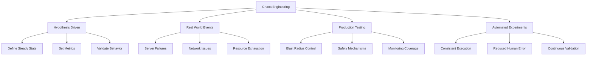
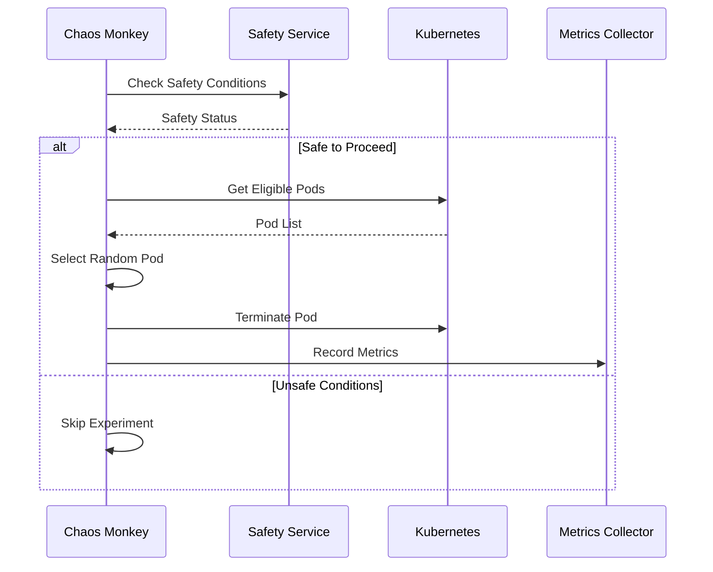
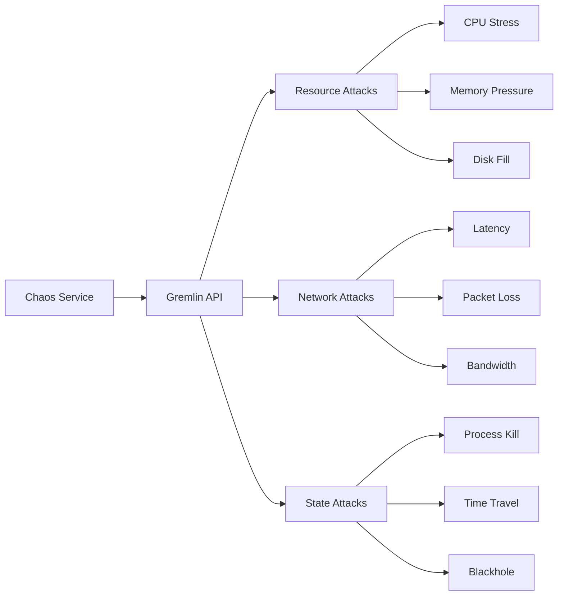
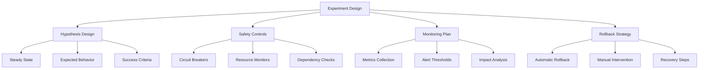

# Chapter 11.3: Chaos Engineering

Chaos Engineering is the discipline of experimenting on a system to build confidence in the system's capability to withstand turbulent conditions in production.

## 1. Chaos Engineering Principles

### Core Principles



### Chaos Engineering Maturity Model

```java
public enum ChaosMaturityLevel {
    
    LEVEL_1_MANUAL("Manual chaos testing in non-production environments"),
    LEVEL_2_AUTOMATED("Automated chaos testing in staging environments"),
    LEVEL_3_PRODUCTION("Manual chaos testing in production with safety controls"),
    LEVEL_4_CONTINUOUS("Automated chaos testing in production"),
    LEVEL_5_ADVANCED("Advanced chaos engineering with ML-driven experiments");
    
    private final String description;
    
    ChaosMaturityLevel(String description) {
        this.description = description;
    }
    
    public String getDescription() {
        return description;
    }
}

@Component
public class ChaosMaturityAssessment {
    
    public ChaosMaturityLevel assessCurrentLevel(ChaosCapabilities capabilities) {
        if (capabilities.hasAdvancedMLDrivenExperiments()) {
            return ChaosMaturityLevel.LEVEL_5_ADVANCED;
        } else if (capabilities.hasAutomatedProductionChaos()) {
            return ChaosMaturityLevel.LEVEL_4_CONTINUOUS;
        } else if (capabilities.hasManualProductionChaos()) {
            return ChaosMaturityLevel.LEVEL_3_PRODUCTION;
        } else if (capabilities.hasAutomatedStagingChaos()) {
            return ChaosMaturityLevel.LEVEL_2_AUTOMATED;
        } else {
            return ChaosMaturityLevel.LEVEL_1_MANUAL;
        }
    }
}
```

## 2. Chaos Monkey Implementation

### Basic Chaos Monkey Service



```java
@Service
@Slf4j
public class ChaosMonkeyService {
    
    private final InstanceRepository instanceRepository;
    private final CloudProvider cloudProvider;
    private final ChaosConfigurationService configService;
    private final SafetyService safetyService;
    private final MetricsCollector metricsCollector;
    
    @Scheduled(fixedDelay = 60000) // Run every minute
    public void executeChaosExperiments() {
        if (!configService.isChaosEnabled()) {
            return;
        }
        
        List<ChaosExperiment> scheduledExperiments = 
            configService.getScheduledExperiments();
        
        scheduledExperiments.forEach(this::executeExperiment);
    }
    
    private void executeExperiment(ChaosExperiment experiment) {
        try {
            // Check safety conditions
            if (!safetyService.isSafeToRunExperiment(experiment)) {
                log.info("Skipping experiment {} due to safety conditions", 
                    experiment.getName());
                return;
            }
            
            // Record experiment start
            metricsCollector.recordExperimentStart(experiment);
            
            // Execute the chaos action
            ChaosResult result = performChaosAction(experiment);
            
            // Monitor system behavior
            SystemBehavior behavior = monitorSystemBehavior(experiment);
            
            // Validate hypothesis
            HypothesisResult hypothesisResult = validateHypothesis(
                experiment.getHypothesis(), behavior);
            
            // Record results
            recordExperimentResults(experiment, result, behavior, hypothesisResult);
            
            // Cleanup if needed
            if (experiment.requiresCleanup()) {
                performCleanup(experiment, result);
            }
            
        } catch (Exception e) {
            log.error("Error executing chaos experiment: {}", experiment.getName(), e);
            handleExperimentFailure(experiment, e);
        }
    }
    
    private ChaosResult performChaosAction(ChaosExperiment experiment) {
        switch (experiment.getType()) {
            case INSTANCE_TERMINATION:
                return terminateRandomInstance(experiment);
            case NETWORK_LATENCY:
                return injectNetworkLatency(experiment);
            case CPU_STRESS:
                return injectCPUStress(experiment);
            case MEMORY_PRESSURE:
                return injectMemoryPressure(experiment);
            case DISK_FILL:
                return fillDiskSpace(experiment);
            case DEPENDENCY_FAILURE:
                return simulateDependencyFailure(experiment);
            default:
                throw new UnsupportedOperationException(
                    "Unsupported chaos type: " + experiment.getType());
        }
    }
    
    private ChaosResult terminateRandomInstance(ChaosExperiment experiment) {
        List<Instance> eligibleInstances = instanceRepository
            .findEligibleForChaos(experiment.getTargetCriteria());
        
        if (eligibleInstances.isEmpty()) {
            return ChaosResult.noTargetsFound();
        }
        
        Instance targetInstance = selectRandomInstance(eligibleInstances);
        
        log.info("Terminating instance {} for chaos experiment {}", 
            targetInstance.getId(), experiment.getName());
        
        cloudProvider.terminateInstance(targetInstance.getId());
        
        return ChaosResult.builder()
            .targetId(targetInstance.getId())
            .action("TERMINATE")
            .timestamp(Instant.now())
            .success(true)
            .build();
    }
    
    private ChaosResult injectNetworkLatency(ChaosExperiment experiment) {
        NetworkLatencyConfig config = experiment.getNetworkLatencyConfig();
        
        List<Instance> targets = selectTargetInstances(experiment);
        
        for (Instance instance : targets) {
            // Use tc (traffic control) to inject latency
            String command = String.format(
                "tc qdisc add dev eth0 root netem delay %dms %dms",
                config.getDelayMs(),
                config.getJitterMs()
            );
            
            executeRemoteCommand(instance, command);
        }
        
        // Schedule cleanup
        scheduleLatencyCleanup(targets, config.getDurationMs());
        
        return ChaosResult.builder()
            .targetIds(targets.stream().map(Instance::getId).collect(Collectors.toList()))
            .action("NETWORK_LATENCY")
            .timestamp(Instant.now())
            .success(true)
            .metadata(Map.of(
                "delay_ms", config.getDelayMs(),
                "jitter_ms", config.getJitterMs(),
                "duration_ms", config.getDurationMs()
            ))
            .build();
    }
}
```

### Advanced Chaos Experiments

```java
@Component
public class AdvancedChaosExperiments {
    
    private final KubernetesClient kubernetesClient;
    private final DatabaseService databaseService;
    private final MessageQueueService messageQueueService;
    
    public ChaosResult executePodsFailureExperiment(ChaosExperiment experiment) {
        PodFailureConfig config = experiment.getPodFailureConfig();
        
        // Get pods matching the criteria
        List<Pod> eligiblePods = kubernetesClient.listPods()
            .getItems()
            .stream()
            .filter(pod -> matchesCriteria(pod, config.getSelectionCriteria()))
            .collect(Collectors.toList());
        
        if (eligiblePods.isEmpty()) {
            return ChaosResult.noTargetsFound();
        }
        
        // Calculate number of pods to kill (percentage or fixed number)
        int podsToKill = calculatePodsToKill(eligiblePods.size(), config);
        
        List<Pod> selectedPods = selectRandomPods(eligiblePods, podsToKill);
        
        List<String> killedPods = new ArrayList<>();
        for (Pod pod : selectedPods) {
            try {
                kubernetesClient.pods()
                    .inNamespace(pod.getMetadata().getNamespace())
                    .withName(pod.getMetadata().getName())
                    .delete();
                
                killedPods.add(pod.getMetadata().getName());
                
                log.info("Killed pod {} in namespace {} for chaos experiment {}", 
                    pod.getMetadata().getName(), 
                    pod.getMetadata().getNamespace(), 
                    experiment.getName());
                
            } catch (Exception e) {
                log.error("Failed to kill pod {}: {}", 
                    pod.getMetadata().getName(), e.getMessage());
            }
        }
        
        return ChaosResult.builder()
            .targetIds(killedPods)
            .action("POD_KILL")
            .timestamp(Instant.now())
            .success(!killedPods.isEmpty())
            .metadata(Map.of(
                "target_percentage", config.getTargetPercentage(),
                "namespace", config.getNamespace(),
                "label_selector", config.getLabelSelector()
            ))
            .build();
    }
    
    public ChaosResult executeDatabaseLatencyExperiment(ChaosExperiment experiment) {
        DatabaseLatencyConfig config = experiment.getDatabaseLatencyConfig();
        
        // Inject database latency using proxy or database-specific tools
        DatabaseLatencyInjector injector = createDatabaseLatencyInjector(config);
        
        try {
            injector.injectLatency(
                config.getDelayMs(),
                config.getJitterMs(),
                config.getDurationMs()
            );
            
            return ChaosResult.builder()
                .targetId(config.getDatabaseId())
                .action("DATABASE_LATENCY")
                .timestamp(Instant.now())
                .success(true)
                .metadata(Map.of(
                    "delay_ms", config.getDelayMs(),
                    "jitter_ms", config.getJitterMs(),
                    "duration_ms", config.getDurationMs()
                ))
                .build();
                
        } catch (Exception e) {
            log.error("Failed to inject database latency: {}", e.getMessage());
            return ChaosResult.failed(e.getMessage());
        }
    }
    
    public ChaosResult executeMessageQueueChaos(ChaosExperiment experiment) {
        MessageQueueChaosConfig config = experiment.getMessageQueueConfig();
        
        switch (config.getChaosType()) {
            case MESSAGE_LOSS:
                return simulateMessageLoss(config);
            case MESSAGE_DELAY:
                return simulateMessageDelay(config);
            case QUEUE_OVERFLOW:
                return simulateQueueOverflow(config);
            case CONSUMER_FAILURE:
                return simulateConsumerFailure(config);
            default:
                throw new UnsupportedOperationException(
                    "Unsupported message queue chaos type: " + config.getChaosType());
        }
    }
    
    private ChaosResult simulateMessageLoss(MessageQueueChaosConfig config) {
        // Implement message loss simulation
        MessageLossSimulator simulator = new MessageLossSimulator(
            messageQueueService, config);
        
        simulator.startSimulation();
        
        // Schedule to stop simulation after duration
        scheduler.schedule(() -> {
            simulator.stopSimulation();
        }, config.getDurationMs(), TimeUnit.MILLISECONDS);
        
        return ChaosResult.builder()
            .targetId(config.getQueueName())
            .action("MESSAGE_LOSS")
            .timestamp(Instant.now())
            .success(true)
            .metadata(Map.of(
                "loss_percentage", config.getLossPercentage(),
                "duration_ms", config.getDurationMs()
            ))
            .build();
    }
}
```

## 3. Gremlin Integration

### Gremlin Configuration and Integration



```java
@Service
@Slf4j
public class GremlinIntegrationService {
    
    private final GremlinApiClient gremlinClient;
    private final ExperimentScheduler scheduler;
    private final SafetyService safetyService;
    private final MetricsCollector metricsCollector;
    
    public GremlinExperimentResult runResourceExhaustion(ResourceExhaustionRequest request) {
        // Validate safety conditions
        if (!safetyService.isSafeToRunResourceExhaustion(request)) {
            throw new UnsafeConditionsException("Unsafe to run resource exhaustion experiment");
        }
        
        GremlinAttack attack = GremlinAttack.builder()
            .type(AttackType.RESOURCE)
            .subtype(request.getResourceType())
            .targets(convertTargets(request.getTargets()))
            .args(buildResourceArgs(request))
            .build();
        
        try {
            GremlinAttackResponse response = gremlinClient.createAttack(attack);
            
            // Monitor the experiment
            monitorGremlinExperiment(response.getAttackId(), request.getDurationSeconds());
            
            return GremlinExperimentResult.builder()
                .attackId(response.getAttackId())
                .status(ExperimentStatus.RUNNING)
                .startTime(Instant.now())
                .build();
                
        } catch (GremlinApiException e) {
            log.error("Failed to create Gremlin attack: {}", e.getMessage());
            throw new ChaosExperimentException("Failed to start Gremlin experiment", e);
        }
    }
    
    public GremlinExperimentResult runNetworkAttack(NetworkAttackRequest request) {
        GremlinAttack attack = GremlinAttack.builder()
            .type(AttackType.NETWORK)
            .subtype(request.getAttackType())
            .targets(convertTargets(request.getTargets()))
            .args(buildNetworkArgs(request))
            .build();
        
        try {
            GremlinAttackResponse response = gremlinClient.createAttack(attack);
            
            return GremlinExperimentResult.builder()
                .attackId(response.getAttackId())
                .status(ExperimentStatus.RUNNING)
                .startTime(Instant.now())
                .build();
                
        } catch (GremlinApiException e) {
            log.error("Failed to create Gremlin network attack: {}", e.getMessage());
            throw new ChaosExperimentException("Failed to start Gremlin network experiment", e);
        }
    }
    
    private Map<String, Object> buildResourceArgs(ResourceExhaustionRequest request) {
        Map<String, Object> args = new HashMap<>();
        
        switch (request.getResourceType()) {
            case CPU:
                args.put("percent", request.getIntensityPercentage());
                args.put("length", request.getDurationSeconds());
                args.put("workers", request.getWorkerCount());
                break;
                
            case MEMORY:
                args.put("gb", request.getMemoryGb());
                args.put("length", request.getDurationSeconds());
                break;
                
            case DISK:
                args.put("gb", request.getDiskGb());
                args.put("length", request.getDurationSeconds());
                args.put("path", request.getDiskPath());
                break;
                
            case IO:
                args.put("mode", request.getIoMode());
                args.put("workers", request.getWorkerCount());
                args.put("length", request.getDurationSeconds());
                break;
        }
        
        return args;
    }
    
    private Map<String, Object> buildNetworkArgs(NetworkAttackRequest request) {
        Map<String, Object> args = new HashMap<>();
        
        switch (request.getAttackType()) {
            case LATENCY:
                args.put("ms", request.getDelayMs());
                args.put("length", request.getDurationSeconds());
                if (request.getJitterMs() != null) {
                    args.put("jitter", request.getJitterMs());
                }
                break;
                
            case PACKET_LOSS:
                args.put("percent", request.getLossPercentage());
                args.put("length", request.getDurationSeconds());
                break;
                
            case BANDWIDTH:
                args.put("rate", request.getBandwidthLimit());
                args.put("length", request.getDurationSeconds());
                break;
                
            case DNS:
                args.put("length", request.getDurationSeconds());
                if (request.getDnsServer() != null) {
                    args.put("dns_server", request.getDnsServer());
                }
                break;
        }
        
        return args;
    }
    
    @Async
    public void monitorGremlinExperiment(String attackId, int durationSeconds) {
        try {
            // Wait for experiment duration
            Thread.sleep(durationSeconds * 1000L);
            
            // Get experiment results
            GremlinAttackDetails details = gremlinClient.getAttackDetails(attackId);
            
            // Record metrics
            metricsCollector.recordGremlinExperiment(attackId, details);
            
            log.info("Gremlin experiment {} completed with status: {}", 
                attackId, details.getStatus());
                
        } catch (InterruptedException e) {
            Thread.currentThread().interrupt();
            log.warn("Gremlin experiment monitoring interrupted for attack: {}", attackId);
        } catch (Exception e) {
            log.error("Error monitoring Gremlin experiment {}: {}", attackId, e.getMessage());
        }
    }
    
    public List<GremlinExperimentSummary> getExperimentHistory(Duration period) {
        LocalDateTime since = LocalDateTime.now().minus(period);
        
        try {
            List<GremlinAttack> attacks = gremlinClient.getAttacks(since);
            
            return attacks.stream()
                .map(this::convertToSummary)
                .collect(Collectors.toList());
                
        } catch (GremlinApiException e) {
            log.error("Failed to retrieve Gremlin experiment history: {}", e.getMessage());
            return Collections.emptyList();
        }
    }
}
```

### Gremlin API Client

```java
@Component
public class GremlinApiClient {
    
    private final WebClient webClient;
    private final GremlinProperties properties;
    
    public GremlinApiClient(GremlinProperties properties) {
        this.properties = properties;
        this.webClient = WebClient.builder()
            .baseUrl(properties.getBaseUrl())
            .defaultHeader(HttpHeaders.AUTHORIZATION, "Bearer " + properties.getApiKey())
            .defaultHeader(HttpHeaders.CONTENT_TYPE, MediaType.APPLICATION_JSON_VALUE)
            .codecs(configurer -> configurer
                .defaultCodecs()
                .maxInMemorySize(1024 * 1024)) // 1MB
            .build();
    }
    
    public GremlinAttackResponse createAttack(GremlinAttack attack) {
        try {
            return webClient.post()
                .uri("/attacks")
                .body(BodyInserters.fromValue(attack))
                .retrieve()
                .bodyToMono(GremlinAttackResponse.class)
                .timeout(Duration.ofSeconds(properties.getTimeout()))
                .block();
                
        } catch (WebClientException e) {
            throw new GremlinApiException("Failed to create attack", e);
        }
    }
    
    public GremlinAttackDetails getAttackDetails(String attackId) {
        try {
            return webClient.get()
                .uri("/attacks/{attackId}", attackId)
                .retrieve()
                .bodyToMono(GremlinAttackDetails.class)
                .timeout(Duration.ofSeconds(properties.getTimeout()))
                .block();
                
        } catch (WebClientException e) {
            throw new GremlinApiException("Failed to get attack details", e);
        }
    }
    
    public List<GremlinAttack> getAttacks(LocalDateTime since) {
        try {
            String sinceParam = since.format(DateTimeFormatter.ISO_LOCAL_DATE_TIME);
            
            GremlinAttackListResponse response = webClient.get()
                .uri(uriBuilder -> uriBuilder
                    .path("/attacks")
                    .queryParam("since", sinceParam)
                    .queryParam("teamId", properties.getTeamId())
                    .build())
                .retrieve()
                .bodyToMono(GremlinAttackListResponse.class)
                .timeout(Duration.ofSeconds(properties.getTimeout()))
                .block();
                
            return response != null ? response.getAttacks() : Collections.emptyList();
            
        } catch (WebClientException e) {
            throw new GremlinApiException("Failed to get attacks", e);
        }
    }
    
    public void haltAttack(String attackId) {
        try {
            webClient.delete()
                .uri("/attacks/{attackId}", attackId)
                .retrieve()
                .bodyToMono(Void.class)
                .timeout(Duration.ofSeconds(properties.getTimeout()))
                .block();
                
        } catch (WebClientException e) {
            throw new GremlinApiException("Failed to halt attack", e);
        }
    }
}
```

## 4. Experiment Design and Safety

### Experiment Design Framework



### Safety Service Implementation

```java
@Service
@Slf4j
public class ChaosEngineeringSafetyService {
    
    private final MetricsService metricsService;
    private final HealthCheckService healthCheckService;
    private final ConfigurationService configService;
    private final AlertService alertService;
    
    public boolean isSafeToRunExperiment(ChaosExperiment experiment) {
        // Check system health
        if (!isSystemHealthy(experiment.getTargetService())) {
            log.warn("System health check failed for service: {}", 
                experiment.getTargetService());
            return false;
        }
        
        // Check resource utilization
        if (!isResourceUtilizationAcceptable(experiment.getTargetService())) {
            log.warn("Resource utilization too high for service: {}", 
                experiment.getTargetService());
            return false;
        }
        
        // Check business hours and blackout periods
        if (!isWithinAllowedTimeWindow()) {
            log.info("Current time is outside allowed chaos experiment window");
            return false;
        }
        
        // Check recent incidents
        if (hasRecentIncidents(experiment.getTargetService())) {
            log.warn("Recent incidents found for service: {}", 
                experiment.getTargetService());
            return false;
        }
        
        // Check deployment activity
        if (hasRecentDeployments(experiment.getTargetService())) {
            log.warn("Recent deployments found for service: {}", 
                experiment.getTargetService());
            return false;
        }
        
        // Check experiment concurrency
        if (hasConflictingExperiments(experiment)) {
            log.warn("Conflicting experiments detected for service: {}", 
                experiment.getTargetService());
            return false;
        }
        
        return true;
    }
    
    public void monitorsafetyDuringExperiment(ChaosExperiment experiment) {
        SafetyControls controls = experiment.getSafetyControls();
        
        // Monitor circuit breakers
        controls.getCircuitBreakers().forEach(breaker -> {
            double currentValue = metricsService.getCurrentMetricValue(
                experiment.getTargetService(), breaker.getMetric());
            
            if (currentValue > breaker.getThreshold()) {
                handleSafetyBreach(experiment, breaker);
            }
        });
        
        // Monitor resource usage
        controls.getResourceMonitors().forEach(monitor -> {
            double currentUsage = metricsService.getResourceUsage(
                experiment.getTargetService(), monitor.getResource());
            
            if (currentUsage > monitor.getThreshold()) {
                handleResourceBreach(experiment, monitor);
            }
        });
        
        // Check dependency health
        controls.getDependencyChecks().forEach(check -> {
            boolean isHealthy = healthCheckService.checkDependencyHealth(
                check.getDependency());
            
            if (!isHealthy) {
                handleDependencyFailure(experiment, check);
            }
        });
    }
    
    private void handleSafetyBreach(ChaosExperiment experiment, CircuitBreaker breaker) {
        log.error("Safety breach detected for experiment {}: {} threshold exceeded", 
            experiment.getName(), breaker.getMetric());
        
        switch (breaker.getAction()) {
            case HALT_EXPERIMENT:
                haltExperiment(experiment, "Safety breach: " + breaker.getMetric());
                break;
            case REDUCE_BLAST_RADIUS:
                reduceBlastRadius(experiment);
                break;
            case ALERT_ONLY:
                alertService.sendSafetyAlert(experiment, breaker);
                break;
        }
    }
    
    private void haltExperiment(ChaosExperiment experiment, String reason) {
        try {
            // Stop the chaos action
            stopChaosAction(experiment);
            
            // Execute rollback strategy
            executeRollback(experiment);
            
            // Mark experiment as halted
            experiment.setStatus(ExperimentStatus.HALTED);
            experiment.setHaltReason(reason);
            experiment.setHaltedAt(Instant.now());
            
            // Send alerts
            alertService.sendExperimentHaltAlert(experiment, reason);
            
            log.error("Experiment {} halted due to: {}", experiment.getName(), reason);
            
        } catch (Exception e) {
            log.error("Failed to halt experiment {}: {}", experiment.getName(), e.getMessage());
            alertService.sendCriticalAlert("Failed to halt chaos experiment", e);
        }
    }
    
    private boolean isSystemHealthy(String service) {
        try {
            // Check error rate
            double errorRate = metricsService.getErrorRate(service, Duration.ofMinutes(5));
            if (errorRate > configService.getMaxErrorRateForChaos()) {
                return false;
            }
            
            // Check response time
            double p99ResponseTime = metricsService.getResponseTimeP99(service, Duration.ofMinutes(5));
            if (p99ResponseTime > configService.getMaxResponseTimeForChaos()) {
                return false;
            }
            
            // Check availability
            double availability = metricsService.getAvailability(service, Duration.ofMinutes(5));
            if (availability < configService.getMinAvailabilityForChaos()) {
                return false;
            }
            
            return true;
            
        } catch (Exception e) {
            log.error("Error checking system health for service {}: {}", service, e.getMessage());
            return false; // Fail safe
        }
    }
}
```

### Chaos Experiment Scheduler

```java
@Service
@Slf4j
public class ChaosExperimentScheduler {
    
    private final ExperimentRepository experimentRepository;
    private final ChaosExecutionService executionService;
    private final SafetyService safetyService;
    private final ScheduledExecutorService scheduler;
    
    @PostConstruct
    public void initializeScheduler() {
        this.scheduler = Executors.newScheduledThreadPool(10);
        scheduleExperiments();
    }
    
    public void scheduleExperiment(ChaosExperiment experiment) {
        ExperimentSchedule schedule = experiment.getSchedule();
        
        if (schedule.getType() == ScheduleType.ONE_TIME) {
            scheduleOneTimeExperiment(experiment);
        } else if (schedule.getType() == ScheduleType.RECURRING) {
            scheduleRecurringExperiment(experiment);
        }
    }
    
    private void scheduleOneTimeExperiment(ChaosExperiment experiment) {
        long delay = calculateDelay(experiment.getSchedule().getScheduledTime());
        
        scheduler.schedule(() -> {
            executeScheduledExperiment(experiment);
        }, delay, TimeUnit.MILLISECONDS);
        
        log.info("Scheduled one-time chaos experiment: {} for {}", 
            experiment.getName(), experiment.getSchedule().getScheduledTime());
    }
    
    private void scheduleRecurringExperiment(ChaosExperiment experiment) {
        RecurringSchedule recurring = experiment.getSchedule().getRecurringSchedule();
        
        long initialDelay = calculateInitialDelay(recurring);
        long period = recurring.getIntervalMillis();
        
        scheduler.scheduleAtFixedRate(() -> {
            if (shouldRunRecurringExperiment(experiment)) {
                executeScheduledExperiment(experiment);
            }
        }, initialDelay, period, TimeUnit.MILLISECONDS);
        
        log.info("Scheduled recurring chaos experiment: {} with interval: {}ms", 
            experiment.getName(), period);
    }
    
    private void executeScheduledExperiment(ChaosExperiment experiment) {
        try {
            log.info("Executing scheduled chaos experiment: {}", experiment.getName());
            
            // Pre-execution safety check
            if (!safetyService.isSafeToRunExperiment(experiment)) {
                log.warn("Skipping experiment {} due to safety conditions", 
                    experiment.getName());
                recordSkippedExecution(experiment, "Safety conditions not met");
                return;
            }
            
            // Execute the experiment
            ExperimentResult result = executionService.executeExperiment(experiment);
            
            // Record the execution
            recordExperimentExecution(experiment, result);
            
            log.info("Completed scheduled chaos experiment: {} with result: {}", 
                experiment.getName(), result.getStatus());
                
        } catch (Exception e) {
            log.error("Error executing scheduled chaos experiment {}: {}", 
                experiment.getName(), e.getMessage(), e);
            recordFailedExecution(experiment, e);
        }
    }
    
    private boolean shouldRunRecurringExperiment(ChaosExperiment experiment) {
        RecurringSchedule schedule = experiment.getSchedule().getRecurringSchedule();
        
        // Check day of week constraints
        if (schedule.getDaysOfWeek() != null && !schedule.getDaysOfWeek().isEmpty()) {
            DayOfWeek currentDay = LocalDateTime.now().getDayOfWeek();
            if (!schedule.getDaysOfWeek().contains(currentDay)) {
                return false;
            }
        }
        
        // Check time of day constraints
        if (schedule.getTimeOfDay() != null) {
            LocalTime currentTime = LocalTime.now();
            LocalTime scheduleTime = schedule.getTimeOfDay();
            LocalTime tolerance = LocalTime.of(0, schedule.getToleranceMinutes());
            
            if (currentTime.isBefore(scheduleTime.minus(tolerance)) ||
                currentTime.isAfter(scheduleTime.plus(tolerance))) {
                return false;
            }
        }
        
        // Check if experiment was run recently
        Optional<ExperimentExecution> lastExecution = getLastExecution(experiment.getId());
        if (lastExecution.isPresent()) {
            Duration timeSinceLastRun = Duration.between(
                lastExecution.get().getExecutedAt(), Instant.now());
            
            if (timeSinceLastRun.toMillis() < schedule.getMinIntervalMillis()) {
                return false;
            }
        }
        
        return true;
    }
}
```

This comprehensive Chaos Engineering implementation provides the foundation for building resilient systems through controlled experimentation. The integration with tools like Gremlin, combined with robust safety controls and experiment scheduling, enables teams to continuously validate system reliability in production environments.
