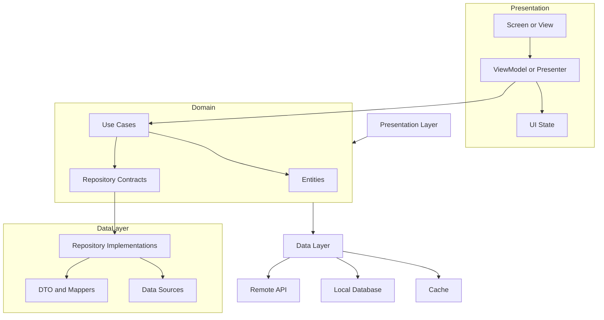
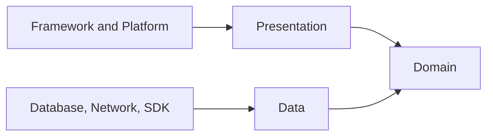
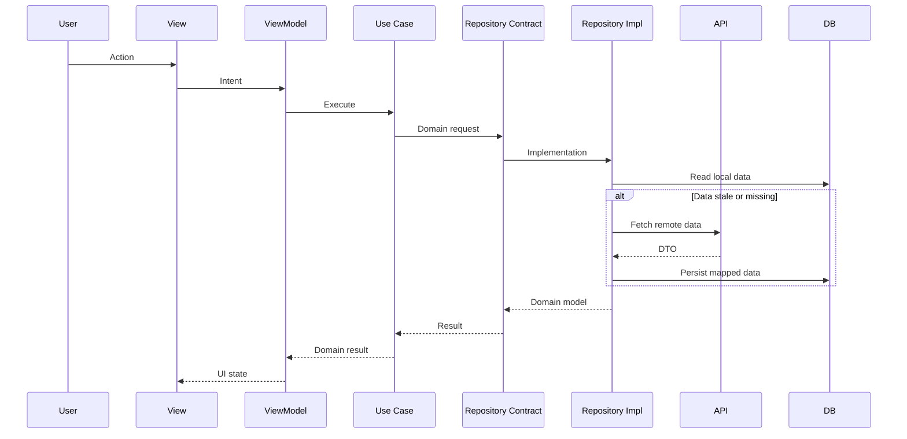

# Clean Architecture

Clean Architecture separates UI, business rules, and data access with clear boundaries. The goal is not to split every screen into layers for its own sake; the goal is to protect long-lived business rules from framework, network, database, and UI details.

This approach is most valuable in long-lived applications, offline-first products, cross-platform domains, and teams that need to develop features in parallel. For small prototypes, it can create unnecessary file and abstraction overhead.

## Layers



### Presentation Layer

The presentation layer owns what the user can see and do. Screens should not fetch data directly, know cache strategy, or pass API models through the UI. ViewModel, Presenter, Bloc, or equivalent components turn user actions into domain calls and expose UI state.

Keep these concerns here:

- Screen state models
- Loading, empty, success, and error states
- Translation of user actions into domain commands
- Validation rules that belong only to the screen

### Domain Layer

The domain layer holds business decisions. Entities, value objects, use cases, and repository contracts live here. This layer should not know Android, iOS, Flutter, React Native, HTTP, SQLite, or Firebase.

A good use case represents one business intention: `GetAccountSummary`, `SyncPendingOrders`, or `CalculateDeliveryPrice`. It should be readable and testable without opening the UI.

### Data Layer

The data layer implements domain contracts. API calls, local database access, cache, mappers, retry, pagination, and sync details live here. DTOs and domain entities should not be the same object; API changes should not break the domain model.

Key decisions in this layer:

- Priority between remote and local data sources
- Cache invalidation and stale data policy
- DTO to domain mapper boundaries
- Network error, timeout, and offline fallback behavior
- Migration and backward compatibility strategy

## Dependency Rule

The main rule is that dependencies point inward. UI knows the domain. The domain does not know data implementations. Repository interfaces live in the domain layer; implementations live in the data layer.



This rule improves testability. The domain layer can be tested with fake repositories, the data layer can be tested with contract tests, and the UI can be verified through state.

## Platform Implementations

### Android

On Android, the common structure uses `ui`, `domain`, and `data` packages or modules. Jetpack ViewModel is the presentation boundary, use case classes are the domain boundary, and Retrofit/Room repository implementations are the data boundary.

Minimal example:

```kotlin
class GetUserProfile(
    private val repository: UserRepository
) {
    suspend operator fun invoke(userId: UserId): UserProfile {
        return repository.getProfile(userId)
    }
}
```

### iOS

On iOS, SwiftUI or UIKit screens stay in the presentation layer. Use cases can be Swift structs or final classes in the domain layer, while URLSession/CoreData implementations live in the data layer.

```swift
struct GetUserProfile {
    let repository: UserRepository

    func callAsFunction(userId: UserID) async throws -> UserProfile {
        try await repository.profile(userId: userId)
    }
}
```

### Flutter

In Flutter, feature-based `presentation`, `domain`, and `data` folders scale better than app-wide layers. The widget tree reads state only; repository and data source dependencies come from a DI container or provider layer.

```dart
class GetUserProfile {
  GetUserProfile(this.repository);

  final UserRepository repository;

  Future<UserProfile> call(UserId userId) {
    return repository.getProfile(userId);
  }
}
```

## Data Flow



## When To Use It

Clean Architecture is strong when:

- Business rules outlive UI choices
- Offline-first, sync, or cache behavior is complex
- The app has multiple data sources
- Testability is critical
- Teams work in parallel by feature
- Android, iOS, and backend teams need a shared domain language

Stay simpler when:

- The app is a one-screen prototype
- There is almost no domain logic
- The team is too small to carry the architecture cost
- The abstraction only exists because it may be useful someday

## Common Mistakes

- Creating an interface for every repository without a real boundary need
- Using the same class as DTO and domain model
- Turning use cases into empty wrappers around repository calls
- Passing API responses through UI state
- Importing platform SDKs in the domain layer
- Leaving large model mappers untested

## Checklist

- [ ] The domain layer contains no platform imports.
- [ ] API DTOs do not reach the UI.
- [ ] Use case names describe business intent, not technical work.
- [ ] Repository contracts live in domain and implementations live in data.
- [ ] Offline, cache, and error behavior is explicit in the data layer.
- [ ] ViewModels only produce UI state and call use cases.
- [ ] Critical use cases can be tested with fake repositories.
