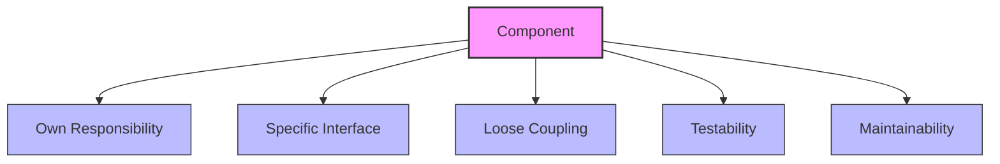
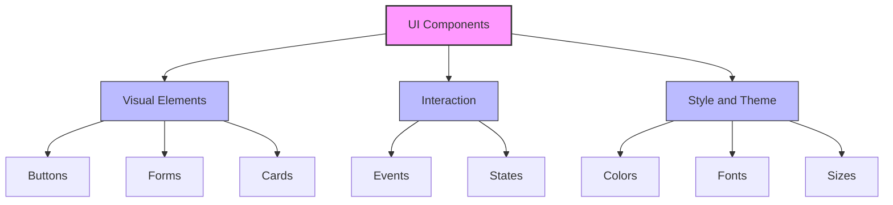
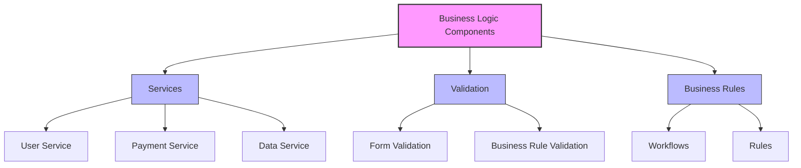
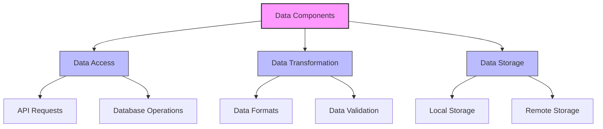

# Component-Based Architecture

## Introduction

Component-based architecture is a design approach that organizes mobile applications into reusable, testable, and maintainable components. This approach simplifies the development process by breaking complex applications into smaller, manageable parts.

## Core Concepts

### What is a Component?

A component is an independent and reusable unit of code that encapsulates specific functionality. Each component:

- **Has its own responsibility**
- **Provides a specific interface**
- **Is loosely coupled with other components**
- **Is testable and maintainable**



### Types of Components

#### 1. UI Components
```swift
// iOS - SwiftUI Component Example
struct CustomButton: View {
    let title: String
    let action: () -> Void
    
    var body: some View {
        Button(action: action) {
            Text(title)
                .font(.headline)
                .foregroundColor(.white)
                .padding()
                .background(Color.blue)
                .cornerRadius(8)
        }
    }
}

// Usage
CustomButton(title: "Save") {
    saveData()
}
```



#### 2. Business Logic Components
```kotlin
// Android - Business Logic Component
class UserService {
    private val userRepository: UserRepository
    private val validationService: ValidationService
    
    constructor(
        userRepository: UserRepository,
        validationService: ValidationService
    ) {
        this.userRepository = userRepository
        this.validationService = validationService
    }
    
    suspend fun createUser(userData: UserData): Result<User> {
        return try {
            validationService.validateUser(userData)
            val user = userRepository.save(userData)
            Result.success(user)
        } catch (e: ValidationException) {
            Result.failure(e)
        }
    }
}
```



#### 3. Data Components
```typescript
// React Native - Data Component
interface DataService<T> {
  get(id: string): Promise<T>;
  save(item: T): Promise<T>;
  delete(id: string): Promise<void>;
  list(): Promise<T[]>;
}

class UserDataService implements DataService<User> {
  private storage: AsyncStorage;
  
  constructor(storage: AsyncStorage) {
    this.storage = storage;
  }
  
  async get(id: string): Promise<User> {
    const userData = await this.storage.getItem(`user_${id}`);
    return userData ? JSON.parse(userData) : null;
  }
  
  async save(user: User): Promise<User> {
    await this.storage.setItem(`user_${user.id}`, JSON.stringify(user));
    return user;
  }
  
  async delete(id: string): Promise<void> {
    await this.storage.removeItem(`user_${id}`);
  }
  
  async list(): Promise<User[]> {
    const keys = await this.storage.getAllKeys();
    const userKeys = keys.filter(key => key.startsWith('user_'));
    const users = await Promise.all(
      userKeys.map(key => this.storage.getItem(key))
    );
    return users.map(userData => JSON.parse(userData));
  }
}
```



## Component Design Principles

### 1. Single Responsibility Principle
Each component should be responsible for only one functionality.

```swift
// Wrong - Too many responsibilities
class UserProfileViewController {
    func loadUserData() { /* ... */ }
    func validateUserInput() { /* ... */ }
    func saveUserData() { /* ... */ }
    func sendNotification() { /* ... */ }
    func logAnalytics() { /* ... */ }
}

// Correct - Single responsibility
class UserProfileViewController {
    private let userService: UserService
    private let validationService: ValidationService
    private let notificationService: NotificationService
    private let analyticsService: AnalyticsService
    
    func updateProfile(_ profile: UserProfile) {
        guard validationService.validate(profile) else { return }
        
        userService.save(profile) { [weak self] result in
            switch result {
            case .success:
                self?.notificationService.showSuccess()
                self?.analyticsService.trackEvent("profile_updated")
            case .failure(let error):
                self?.handleError(error)
            }
        }
    }
}
```

### 2. Open/Closed Principle
Components should be open for extension, closed for modification.

```kotlin
// Base validator interface
interface Validator<T> {
    fun validate(item: T): ValidationResult
}

// Extensible validator implementation
class CompositeValidator<T> : Validator<T> {
    private val validators = mutableListOf<Validator<T>>()
    
    fun addValidator(validator: Validator<T>) {
        validators.add(validator)
    }
    
    override fun validate(item: T): ValidationResult {
        validators.forEach { validator ->
            val result = validator.validate(item)
            if (!result.isValid) {
                return result
            }
        }
        return ValidationResult.success()
    }
}

// Usage
val userValidator = CompositeValidator<User>()
userValidator.addValidator(EmailValidator())
userValidator.addValidator(PasswordValidator())
userValidator.addValidator(AgeValidator())
```

### 3. Dependency Inversion Principle
High-level modules should not depend on low-level modules.

```typescript
// Interface definition
interface StorageService {
  save(key: string, value: any): Promise<void>;
  load(key: string): Promise<any>;
  remove(key: string): Promise<void>;
}

// Concrete implementations
class LocalStorageService implements StorageService {
  async save(key: string, value: any): Promise<void> {
    await AsyncStorage.setItem(key, JSON.stringify(value));
  }
  
  async load(key: string): Promise<any> {
    const value = await AsyncStorage.getItem(key);
    return value ? JSON.parse(value) : null;
  }
  
  async remove(key: string): Promise<void> {
    await AsyncStorage.removeItem(key);
  }
}

class CloudStorageService implements StorageService {
  async save(key: string, value: any): Promise<void> {
    // Cloud storage implementation
  }
  
  async load(key: string): Promise<any> {
    // Cloud storage implementation
  }
  
  async remove(key: string): Promise<void> {
    // Cloud storage implementation
  }
}

// High-level module
class UserManager {
  constructor(private storageService: StorageService) {}
  
  async saveUser(user: User): Promise<void> {
    await this.storageService.save(`user_${user.id}`, user);
  }
}
```

## Platform-Specific Implementations

### iOS - SwiftUI Component System

```swift
// Base Component Protocol
protocol ViewComponent {
    associatedtype Content: View
    var body: Content { get }
}

// Reusable Card Component
struct CardView<Content: View>: View, ViewComponent {
    let content: Content
    let padding: CGFloat
    let cornerRadius: CGFloat
    
    init(
        padding: CGFloat = 16,
        cornerRadius: CGFloat = 12,
        @ViewBuilder content: () -> Content
    ) {
        self.content = content()
        self.padding = padding
        self.cornerRadius = cornerRadius
    }
    
    var body: some View {
        content
            .padding(padding)
            .background(Color.white)
            .cornerRadius(cornerRadius)
            .shadow(radius: 2)
    }
}

// Form Input Component
struct FormInput: View, ViewComponent {
    @Binding var text: String
    let title: String
    let placeholder: String
    let validator: (String) -> Bool
    
    @State private var isValid = true
    
    var body: some View {
        VStack(alignment: .leading, spacing: 8) {
            Text(title)
                .font(.headline)
            
            TextField(placeholder, text: $text)
                .textFieldStyle(RoundedBorderTextFieldStyle())
                .onChange(of: text) { newValue in
                    isValid = validator(newValue)
                }
            
            if !isValid {
                Text("Invalid input")
                    .foregroundColor(.red)
                    .font(.caption)
            }
        }
    }
}
```

### Android - Jetpack Compose Component System

```kotlin
// Base Composable Components
@Composable
fun AppCard(
    modifier: Modifier = Modifier,
    elevation: Dp = 4.dp,
    content: @Composable ColumnScope.() -> Unit
) {
    Card(
        modifier = modifier.fillMaxWidth(),
        elevation = elevation,
        shape = RoundedCornerShape(12.dp)
    ) {
        Column(
            modifier = Modifier.padding(16.dp),
            content = content
        )
    }
}

@Composable
fun AppTextField(
    value: String,
    onValueChange: (String) -> Unit,
    label: String,
    placeholder: String = "",
    isError: Boolean = false,
    errorMessage: String = "",
    validator: (String) -> Boolean = { true }
) {
    var hasError by remember { mutableStateOf(false) }
    
    Column {
        OutlinedTextField(
            value = value,
            onValueChange = { newValue ->
                onValueChange(newValue)
                hasError = !validator(newValue)
            },
            label = { Text(label) },
            placeholder = { Text(placeholder) },
            isError = hasError || isError,
            modifier = Modifier.fillMaxWidth()
        )
        
        if (hasError || isError) {
            Text(
                text = errorMessage.ifEmpty { "Invalid input" },
                color = MaterialTheme.colors.error,
                style = MaterialTheme.typography.caption,
                modifier = Modifier.padding(start = 16.dp, top = 4.dp)
            )
        }
    }
}
```

### React Native - Functional Component System

```typescript
// Base Components
interface CardProps {
  children: React.ReactNode;
  style?: ViewStyle;
  elevation?: number;
}

const Card: React.FC<CardProps> = ({ 
  children, 
  style, 
  elevation = 2 
}) => {
  return (
    <View style={[styles.card, { elevation }, style]}>
      {children}
    </View>
  );
};

interface InputFieldProps {
  label: string;
  value: string;
  onChangeText: (text: string) => void;
  placeholder?: string;
  validator?: (text: string) => boolean;
  errorMessage?: string;
}

const InputField: React.FC<InputFieldProps> = ({
  label,
  value,
  onChangeText,
  placeholder,
  validator,
  errorMessage
}) => {
  const [isValid, setIsValid] = useState(true);
  
  const handleTextChange = (text: string) => {
    onChangeText(text);
    if (validator) {
      setIsValid(validator(text));
    }
  };
  
  return (
    <View style={styles.inputContainer}>
      <Text style={styles.label}>{label}</Text>
      <TextInput
        style={[styles.input, !isValid && styles.inputError]}
        value={value}
        onChangeText={handleTextChange}
        placeholder={placeholder}
      />
      {!isValid && (
        <Text style={styles.errorText}>
          {errorMessage || 'Invalid input'}
        </Text>
      )}
    </View>
  );
};
```

## Best Practices

### 1. Component Composition
- Create small, focused components
- Prefer composition over inheritance
- Use Higher-Order Components (HOC)

### 2. Props and State Management
- Keep props minimal
- Keep state as local as possible
- Use immutable data structures

### 3. Performance Optimization
- Prevent unnecessary re-renders
- Implement lazy loading
- Use memoization

### 4. Testability
- Make components isolatable
- Use mock dependencies
- Write unit and integration tests

### 5. Code Reusability
- Create generic components
- Use configuration patterns
- Develop component libraries

## Conclusion

Component-based architecture provides scalable, maintainable, and testable solutions in mobile application development. With proper design principles and implementation practices, it's possible to organize complex applications into manageable components.