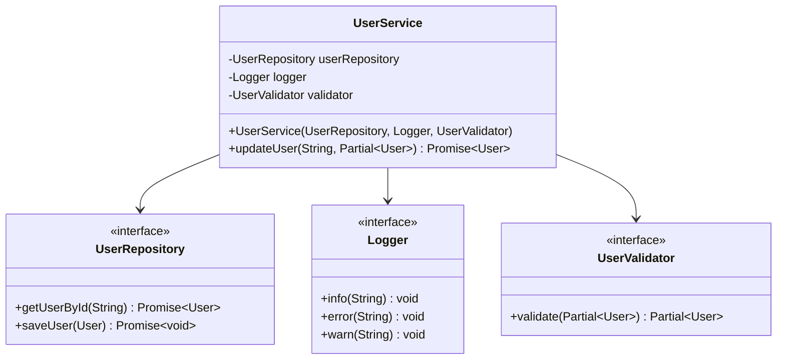
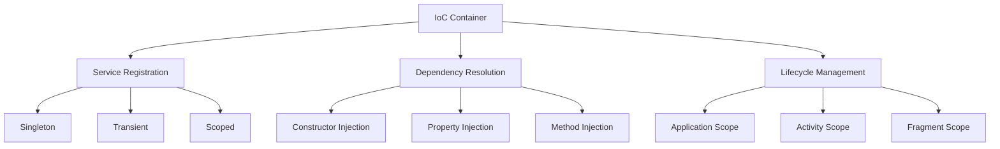
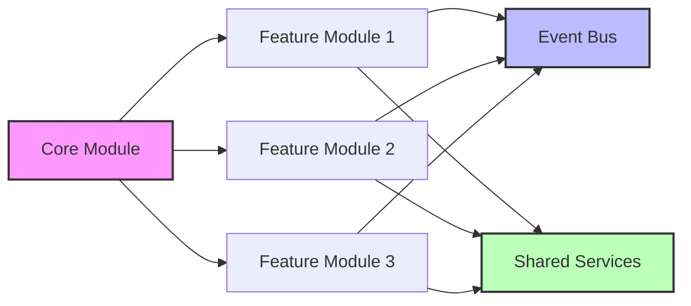

# Dependency Injection and IoC Containers

In modern mobile application architecture, Dependency Injection (DI) represents a fundamental design pattern that implements loose coupling and high cohesion principles. This approach enables the creation of testable, maintainable, and scalable code structures by injecting dependencies from external sources rather than creating them internally.

## Fundamentals of Dependency Injection Pattern

Dependency Injection builds upon SOLID principles, particularly supporting the Dependency Inversion Principle through practical implementation techniques. In traditional approaches, a class directly instantiates its required dependencies; in the DI pattern, these dependencies are provided externally.

### Constructor Injection Strategy

Constructor injection represents the most widely used and type-safe DI technique. In this approach, all critical dependencies of a class are received as constructor parameters and assigned to immutable fields.

```typescript
// Repository interface definition
interface UserRepository {
  getUserById(id: string): Promise<User>;
  saveUser(user: User): Promise<void>;
}

// Service class with constructor injection
class UserService {
  constructor(
    private readonly userRepository: UserRepository,
    private readonly logger: Logger,
    private readonly validator: UserValidator
  ) {}

  async updateUser(userId: string, userData: Partial<User>): Promise<User> {
    this.logger.info(`Updating user ${userId}`);
    
    const existingUser = await this.userRepository.getUserById(userId);
    const validatedData = this.validator.validate(userData);
    
    const updatedUser = { ...existingUser, ...validatedData };
    await this.userRepository.saveUser(updatedUser);
    
    return updatedUser;
  }
}
```

This approach enables compile-time detection of missing dependencies and facilitates easy injection of mock objects during unit testing.



### Property and Method Injection Techniques

Property injection is preferred for optional dependencies or framework-specific scenarios. This approach allows dependencies to be set through properties after constructor execution.

```swift
// Property injection example in Swift
class NetworkManager {
    var logger: Logger?
    var cacheManager: CacheManager?
    
    func performRequest<T: Codable>(_ request: APIRequest) -> AnyPublisher<T, APIError> {
        logger?.log("Performing request: \(request.endpoint)")
        
        // Check cache first
        if let cachedData = cacheManager?.getCachedData(for: request.cacheKey) {
            logger?.log("Returning cached data")
            return Just(cachedData)
                .setFailureType(to: APIError.self)
                .eraseToAnyPublisher()
        }
        
        // Network request implementation
        return performNetworkRequest(request)
    }
}
```

Method injection is used when dynamic dependencies need to be provided at runtime and is typically implemented in framework callback methods.

## IoC Container Architectures

Inversion of Control (IoC) containers are sophisticated systems that enable centralized dependency management and automatic injection. In enterprise-level mobile applications, these containers play a critical role in managing complex dependency graphs.



### Service Registration Patterns

IoC containers use registration patterns that determine service lifecycles and instantiation strategies. Three fundamental registration types exist: singleton pattern, factory pattern, and transient pattern.

```kotlin
// Dagger/Hilt IoC container configuration in Kotlin
@Module
@InstallIn(SingletonComponent::class)
abstract class DataModule {
    
    @Binds
    @Singleton
    abstract fun bindUserRepository(
        userRepositoryImpl: UserRepositoryImpl
    ): UserRepository
    
    @Binds
    abstract fun bindUserValidator(
        userValidatorImpl: UserValidatorImpl
    ): UserValidator
    
    @Provides
    @Singleton
    fun provideNetworkClient(
        @ApplicationContext context: Context,
        logger: Logger
    ): NetworkClient {
        return NetworkClient.Builder()
            .context(context)
            .logger(logger)
            .build()
    }
}
```

This configuration ensures UserRepository is instantiated as a singleton while UserValidator is created as transient. Singleton services optimize memory footprint while transient services guarantee state isolation.

### Scope Management Strategies

Modern IoC containers implement sophisticated scope management mechanisms. Lifecycle-aware scopes such as activity scope, fragment scope, and application scope ensure proper allocation and deallocation of resources at appropriate times.

```swift
// Dependency injection scope management in SwiftUI
class DependencyContainer: ObservableObject {
    private var services: [String: Any] = [:]
    
    func register<T>(_ type: T.Type, scope: ServiceScope, factory: @escaping () -> T) {
        let key = String(describing: type)
        
        switch scope {
        case .singleton:
            services[key] = Singleton(factory: factory)
        case .transient:
            services[key] = TransientFactory(factory: factory)
        case .scoped(let scopeId):
            services[key] = ScopedService(scopeId: scopeId, factory: factory)
        }
    }
    
    func resolve<T>(_ type: T.Type) -> T {
        let key = String(describing: type)
        
        if let singleton = services[key] as? Singleton<T> {
            return singleton.instance
        } else if let factory = services[key] as? TransientFactory<T> {
            return factory.create()
        } else if let scoped = services[key] as? ScopedService<T> {
            return scoped.getInstance()
        }
        
        fatalError("Service \(key) not registered")
    }
}
```

## Multi-Module Dependency Architecture

In large-scale mobile applications, DI systems used in conjunction with modular architecture patterns require sophisticated mechanisms that facilitate cross-module communication. In this architecture, each module declares its own dependencies and specifies what it will expose.



### Module Boundary Definition

Clear definition of module boundaries prevents dependency leakage and ensures strong encapsulation. Each module serves other modules through its public interface while hiding internal implementation details.

```typescript
// Feature module dependency definition
export interface FeatureModuleDependencies {
  userRepository: UserRepository;
  analyticsService: AnalyticsService;
  logger: Logger;
}

export interface FeatureModuleExports {
  userService: UserService;
  userViewModel: UserViewModel;
}

export class UserFeatureModule implements FeatureModule<FeatureModuleDependencies, FeatureModuleExports> {
  private dependencies: FeatureModuleDependencies;
  
  constructor(dependencies: FeatureModuleDependencies) {
    this.dependencies = dependencies;
  }
  
  configure(container: DependencyContainer): FeatureModuleExports {
    // Internal dependencies registration
    container.register(UserService, () => new UserService(
      this.dependencies.userRepository,
      this.dependencies.logger
    ));
    
    container.register(UserViewModel, () => new UserViewModel(
      container.resolve(UserService),
      this.dependencies.analyticsService
    ));
    
    return {
      userService: container.resolve(UserService),
      userViewModel: container.resolve(UserViewModel)
    };
  }
}
```

### Cross-Module Communication Patterns

Inter-module communication is implemented through well-defined interfaces and event-driven architecture. This approach enables modules to be developed, tested, and deployed independently while maintaining system-wide consistency.

Event-driven communication allows modules to interact without direct dependencies. The event bus pattern works as a central mediator and implements type-safe event routing.

```kotlin
// Event-driven inter-module communication
@Singleton
class EventBus @Inject constructor() {
    private val events = PublishSubject.create<DomainEvent>()
    
    fun publish(event: DomainEvent) {
        events.onNext(event)
    }
    
    inline fun <reified T : DomainEvent> subscribe(): Observable<T> {
        return events
            .ofType(T::class.java)
            .observeOn(AndroidSchedulers.mainThread())
    }
}

// Event publishing from user module
class UserService @Inject constructor(
    private val eventBus: EventBus,
    private val userRepository: UserRepository
) {
    suspend fun updateUserProfile(userId: String, profile: UserProfile) {
        userRepository.updateProfile(userId, profile)
        
        // Notification to other modules
        eventBus.publish(UserProfileUpdatedEvent(userId, profile))
    }
}

// Event subscription in analytics module
class AnalyticsService @Inject constructor(
    private val eventBus: EventBus,
    private val analyticsClient: AnalyticsClient
) {
    init {
        eventBus.subscribe<UserProfileUpdatedEvent>()
            .subscribe { event ->
                analyticsClient.track("user_profile_updated", mapOf(
                    "user_id" to event.userId,
                    "updated_fields" to event.profile.getChangedFields()
                ))
            }
    }
}
```

## Testing and Mocking Strategies

One of the most significant advantages of dependency injection is facilitating the implementation of comprehensive testing strategies. Mock objects, test doubles, and stub implementations create isolated unit testing environments.

### Mock Object Implementation

In professional testing environments, sophisticated mock objects simulate production code behavior while enabling control of test scenarios. This approach makes it possible to test edge cases and obtain deterministic test results.

```swift
// Mock implementation in Swift
protocol NetworkService {
    func fetchUser(id: String) async throws -> User
    func updateUser(_ user: User) async throws -> User
}

class MockNetworkService: NetworkService {
    var fetchUserResult: Result<User, Error>?
    var updateUserResult: Result<User, Error>?
    
    private(set) var fetchUserCallCount = 0
    private(set) var updateUserCallCount = 0
    private(set) var lastFetchedUserId: String?
    private(set) var lastUpdatedUser: User?
    
    func fetchUser(id: String) async throws -> User {
        fetchUserCallCount += 1
        lastFetchedUserId = id
        
        switch fetchUserResult {
        case .success(let user):
            return user
        case .failure(let error):
            throw error
        case .none:
            throw NetworkError.notConfigured
        }
    }
    
    func updateUser(_ user: User) async throws -> User {
        updateUserCallCount += 1
        lastUpdatedUser = user
        
        switch updateUserResult {
        case .success(let updatedUser):
            return updatedUser
        case .failure(let error):
            throw error
        case .none:
            throw NetworkError.notConfigured
        }
    }
}
```

### Test Container Configuration

In test environments, test-specific implementations replace production dependencies. Test container configuration creates isolated and predictable test execution environments.

```typescript
// Test-specific dependency configuration
describe('UserService', () => {
  let userService: UserService;
  let mockRepository: jest.Mocked<UserRepository>;
  let mockLogger: jest.Mocked<Logger>;
  let mockValidator: jest.Mocked<UserValidator>;
  
  beforeEach(() => {
    // Mock implementations
    mockRepository = {
      getUserById: jest.fn(),
      saveUser: jest.fn(),
    };
    
    mockLogger = {
      info: jest.fn(),
      error: jest.fn(),
      warn: jest.fn(),
    };
    
    mockValidator = {
      validate: jest.fn(),
    };
    
    // Dependency injection with mocks
    userService = new UserService(
      mockRepository,
      mockLogger,
      mockValidator
    );
  });
  
  it('should update user successfully', async () => {
    // Arrange
    const userId = 'user-123';
    const userData = { name: 'Updated Name' };
    const existingUser = { id: userId, name: 'Original Name', email: 'user@example.com' };
    const expectedUser = { ...existingUser, ...userData };
    
    mockRepository.getUserById.mockResolvedValue(existingUser);
    mockValidator.validate.mockReturnValue(userData);
    mockRepository.saveUser.mockResolvedValue();
    
    // Act
    const result = await userService.updateUser(userId, userData);
    
    // Assert
    expect(result).toEqual(expectedUser);
    expect(mockRepository.getUserById).toHaveBeenCalledWith(userId);
    expect(mockValidator.validate).toHaveBeenCalledWith(userData);
    expect(mockRepository.saveUser).toHaveBeenCalledWith(expectedUser);
    expect(mockLogger.info).toHaveBeenCalledWith(`Updating user ${userId}`);
  });
});
```

This comprehensive testing approach maximizes code coverage while enabling early detection of regression bugs and increasing refactoring confidence.

## Dependency Injection Best Practices

DI implementation in enterprise-level mobile applications must follow several best practices. These practices facilitate the development of maintainable, performant, and reliable systems.

Controlling the number of constructor parameters indicates class adherence to single responsibility. Excessive parameters suggest the class has too many responsibilities and indicates the need for refactoring.

Application of the interface segregation principle ensures clients depend only on the methods they need. This approach promotes loose coupling and increases system flexibility.

Prevention of circular dependencies indicates the health of system architecture. Circular dependencies suggest design flaws and can cause runtime issues.

```java
// Circular dependency prevention in Java
@Component
public class UserService {
    private final UserRepository userRepository;
    private final NotificationService notificationService;
    
    public UserService(
        UserRepository userRepository,
        @Lazy NotificationService notificationService // Lazy injection breaks cycle
    ) {
        this.userRepository = userRepository;
        this.notificationService = notificationService;
    }
}

@Component  
public class NotificationService {
    private final UserService userService;
    
    public NotificationService(UserService userService) {
        this.userService = userService;
    }
}
```

Resource management and prevention of memory leaks are of critical importance, especially in mobile environments. Careful implementation of singleton services and establishment of proper cleanup mechanisms ensure application stability.

Correct implementation of the dependency injection pattern forms the foundation of scalable, maintainable, and testable architecture in modern mobile applications. This systematic approach increases development team productivity while significantly improving code quality metrics.
