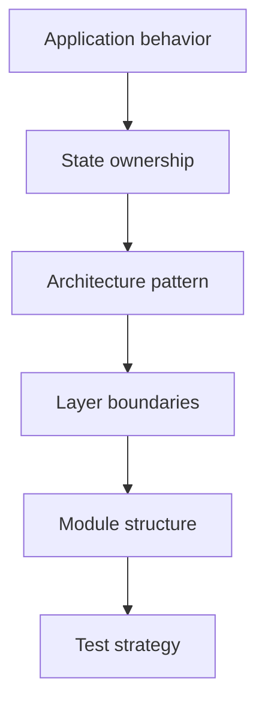

# Mobile Application Architectures and State Management

Mobile architecture is more than how screens are rendered. Data flow, state ownership, module boundaries, testability, and platform dependencies are parts of the same decision set.

This chapter collects the main architectural approaches that keep an application readable, testable, and changeable as it grows.

## Chapter Map

- [Architectural Patterns](/en/mobile/architecture/patterns): Compares MVP, MVVM, MVI, Redux, and BLoC.
- [State Management Strategies](/en/mobile/architecture/state-management): Explains UI state, server state, local state, and global state boundaries.
- [Clean Architecture](/en/mobile/architecture/clean-architecture): Defines the boundaries between presentation, domain, and data layers.
- [Component-Based Architecture](/en/mobile/architecture/component-based): Covers reusable UI and feature component design.
- [Dependency Injection and IoC](/en/mobile/architecture/dependency-injection): Explains how dependencies are wired and replaced in tests.
- [Modular Architecture Patterns](/en/mobile/architecture/modular-architecture): Examines feature-first, layer-first, and hybrid module structures.

## Decision Order

A good architecture decision usually follows this order:

- Write the user flow and critical failure states.
- Decide where screen state will live.
- Decide whether domain logic must be separated from UI logic.
- Clarify data sources and repository boundaries.
- Choose module structure based on team and product size.
- Validate the architecture with tests and release workflows.

## Quick Selection Guide

| Situation | Starting approach | Watch out for |
| --- | --- | --- |
| Small prototype | Simple MVVM or one ViewModel | Do not abstract too early |
| Offline-first app | Clean Architecture + repository boundary | Decide sync and conflict behavior early |
| Large team | Feature-first modular structure | Define ownership and public API boundaries |
| Heavy UI state | MVI, BLoC, or reducer approach | Keep state transitions observable |
| Cross-platform domain | Domain-first modeling | Keep platform SDKs out of the domain |

## Architecture Checklist

- [ ] UI state, domain model, and API DTO are not the same object.
- [ ] Each screen has explicit loading, empty, success, and error states.
- [ ] Repository boundaries hide data source details from the UI.
- [ ] Dependency injection makes fake implementations easy in tests.
- [ ] Module structure helps team workflow without creating package noise.
- [ ] Critical screens measure rebuild, render, and memory behavior.
