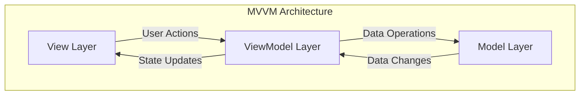
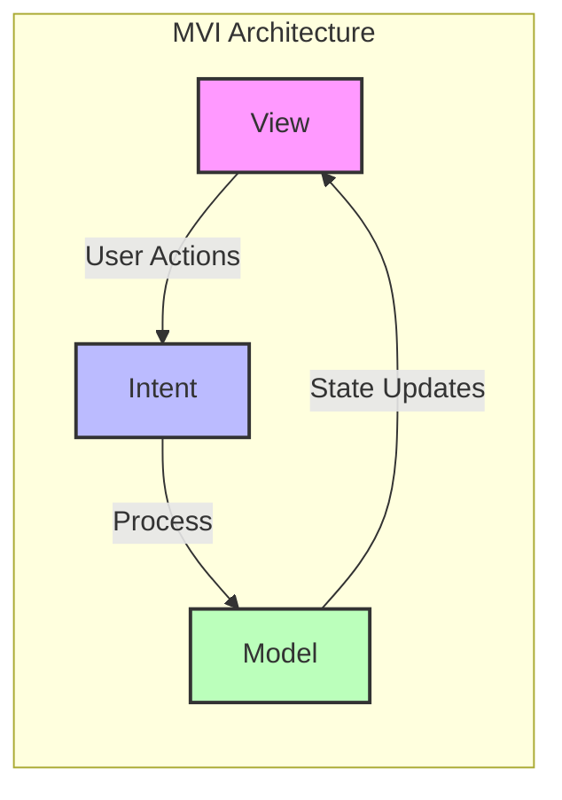
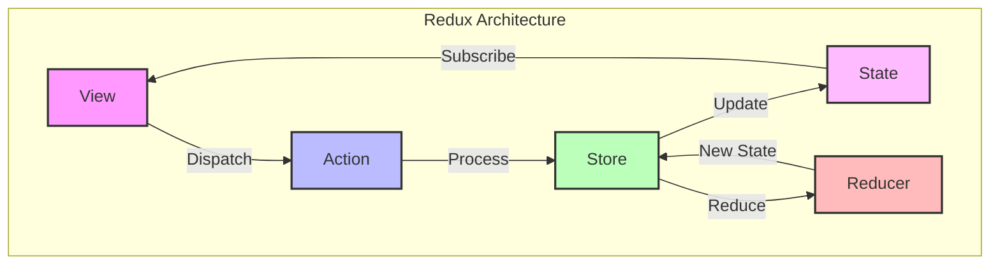

# State Management Strategies

In modern mobile applications, state management is a critical factor that directly affects the quality of user experience and application performance. In this section, we will deeply analyze industry-proven state management approaches and examine optimal implementation of each in specific use cases.

## MVVM (Model-View-ViewModel) Comprehensive Analysis

### Architectural Foundation of MVVM Pattern

The Model-View-ViewModel architecture pattern is an approach that sophisticatedly implements the separation of concerns principle in mobile development context. The conceptual framework of this pattern significantly enhances maintainability and testability by organizing application logic into three distinct layers.

The Model layer encapsulates the application's core business logic and data structures. This layer abstracts interactions with external data sources (REST APIs, local databases, caching systems) while providing a consistent data access interface. Model components enforce domain-specific business rules while executing data validation and transformation operations.

The View layer manages user interface components and user interaction handling. This layer utilizes platform-specific UI frameworks to create responsive and intuitive user experiences. View components observe state changes from the ViewModel and perform automatic UI updates.

The ViewModel layer provides sophisticated bridge functionality between Model and View. This layer completely separates business logic from View while executing UI-specific state management operations. ViewModels transform user actions into business operations while coordinating asynchronous operations.



### Platform-Specific MVVM Implementations

In the Android ecosystem, Jetpack Architecture Components provide comprehensive MVVM support. Jetpack ViewModel classes survive configuration changes while enabling reactive data binding with LiveData and StateFlow. The Data Binding library provides two-way binding capabilities, while Jetpack Compose supports modern MVVM implementation with remember and collectAsState functions.

```kotlin
class UserProfileViewModel : ViewModel() {
    private val _userState = MutableStateFlow(UserProfileState())
    val userState: StateFlow<UserProfileState> = _userState.asStateFlow()
    
    fun updateUserProfile(profile: UserProfile) {
        viewModelScope.launch {
            _userState.value = _userState.value.copy(
                isLoading = true,
                errorMessage = null
            )
            
            try {
                val updatedProfile = userRepository.updateProfile(profile)
                _userState.value = _userState.value.copy(
                    userProfile = updatedProfile,
                    isLoading = false,
                    isSuccess = true
                )
            } catch (exception: Exception) {
                _userState.value = _userState.value.copy(
                    isLoading = false,
                    errorMessage = exception.message
                )
            }
        }
    }
}
```

In iOS development, the SwiftUI framework natively supports the MVVM pattern with the ObservableObject protocol. @Published property wrappers provide automatic change notifications while the Combine framework enables sophisticated reactive programming capabilities. @StateObject and @ObservedObject property wrappers guarantee automatic UI updates.

```swift
class UserProfileViewModel: ObservableObject {
    @Published var userProfile: UserProfile?
    @Published var isLoading: Bool = false
    @Published var errorMessage: String?
    
    private let userRepository: UserRepository
    private var cancellables = Set<AnyCancellable>()
    
    func updateUserProfile(_ profile: UserProfile) {
        isLoading = true
        errorMessage = nil
        
        userRepository.updateProfile(profile)
            .receive(on: DispatchQueue.main)
            .sink(
                receiveCompletion: { [weak self] completion in
                    self?.isLoading = false
                    if case .failure(let error) = completion {
                        self?.errorMessage = error.localizedDescription
                    }
                },
                receiveValue: { [weak self] updatedProfile in
                    self?.userProfile = updatedProfile
                }
            )
            .store(in: &cancellables)
    }
}
```

In the Flutter ecosystem, comprehensive MVVM implementation options are provided through Provider pattern with ChangeNotifier, Riverpod with immutable state management, and ViewModel-style usage of the flutter_bloc package.

## MVI (Model-View-Intent) Advanced Architecture

### Unidirectional Data Flow Mastery

The Model-View-Intent pattern is an advanced architectural approach that implements predictable state management through strict unidirectional data flow. The fundamental philosophy of this pattern is maintaining application state as a single source of truth and executing state mutations in a completely controlled manner.

The Intent component defines immutable objects that represent user interactions and system events. This approach models user actions as explicit contracts, enabling comprehensive traceability of application behavior. Since Intents are defined in a type-safe manner, they provide compile-time validation.

The Model component maintains a complete representation of application state with immutable data structures. Each state transition creates a completely new state object from the previous state, preventing accidental mutations. This approach dramatically enhances state history tracking and debugging capabilities.

The View component renders the UI representation of the current state while transforming user interactions into Intent objects. Since Views are stateless, testing and debugging are significantly simplified.



### Advanced MVI Implementation Patterns

State immutability enforcement optimizes memory efficiency with copy-on-write mechanisms while maintaining performance with structural sharing algorithms. Intent processing pipelines execute complex business logic operations in a sequential manner while integrating error handling and recovery mechanisms.

Side effects management ensures that Intent processing executes external interactions (network requests, database operations, analytics events) in a controlled manner. This approach guarantees that application behavior is predictable and testable.

```dart
// Flutter MVI Implementation
abstract class UserIntent {}

class LoadUserIntent extends UserIntent {}
class UpdateUserIntent extends UserIntent {
  final UserProfile profile;
  UpdateUserIntent(this.profile);
}

@immutable
class UserState {
  final UserProfile? userProfile;
  final bool isLoading;
  final String? errorMessage;
  
  const UserState({
    this.userProfile,
    this.isLoading = false,
    this.errorMessage,
  });
  
  UserState copyWith({
    UserProfile? userProfile,
    bool? isLoading,
    String? errorMessage,
  }) {
    return UserState(
      userProfile: userProfile ?? this.userProfile,
      isLoading: isLoading ?? this.isLoading,
      errorMessage: errorMessage ?? this.errorMessage,
    );
  }
}

class UserBloc extends Bloc<UserIntent, UserState> {
  UserBloc() : super(const UserState()) {
    on<LoadUserIntent>(_onLoadUser);
    on<UpdateUserIntent>(_onUpdateUser);
  }
  
  Future<void> _onLoadUser(LoadUserIntent event, Emitter<UserState> emit) async {
    emit(state.copyWith(isLoading: true, errorMessage: null));
    
    try {
      final userProfile = await userRepository.getCurrentUser();
      emit(state.copyWith(userProfile: userProfile, isLoading: false));
    } catch (error) {
      emit(state.copyWith(isLoading: false, errorMessage: error.toString()));
    }
  }
}
```

## Redux Pattern and Centralized State Architecture

### Redux Ecosystem Comprehensive Overview

The Redux pattern is a functional programming approach that implements the predictable state container concept. The core philosophy of this pattern is the centralized management of entire application state within a single immutable store and the predictable execution of state changes through pure functions (reducers).

The Store component maintains the application's complete state tree while managing state subscriptions. The dispatch mechanism routes actions to reducers while executing middleware pipelines. This centralized approach dramatically reduces state management complexity while enhancing debugging capabilities.

Actions are plain objects that describe state change intentions. Action creators provide type-safe action generation while ensuring payload validation. This approach enables explicit documentation of application operations.

Reducers are pure functions that receive current state and action as input and return a new state object. Reducer composition organizes complex state management into manageable pieces while state normalization enables optimal data structures.



### Advanced Redux Implementation Strategies

The middleware ecosystem handles asynchronous operations while integrating cross-cutting concerns (logging, analytics, error handling). Middleware solutions like Redux-thunk and redux-saga elegantly manage complex async flows.

```javascript
// Redux Middleware Implementation
const userMiddleware = store => next => action => {
  console.log('Dispatching action:', action);
  
  if (action.type === 'USER_UPDATE_ASYNC') {
    // Async operation handling
    userAPI.updateProfile(action.payload)
      .then(updatedProfile => {
        store.dispatch({
          type: 'USER_UPDATE_SUCCESS',
          payload: updatedProfile
        });
      })
      .catch(error => {
        store.dispatch({
          type: 'USER_UPDATE_FAILURE',
          payload: error.message
        });
      });
  }
  
  return next(action);
};

const userReducer = (state = initialState, action) => {
  switch (action.type) {
    case 'USER_UPDATE_REQUEST':
      return {
        ...state,
        isLoading: true,
        error: null
      };
    case 'USER_UPDATE_SUCCESS':
      return {
        ...state,
        userProfile: action.payload,
        isLoading: false,
        error: null
      };
    case 'USER_UPDATE_FAILURE':
      return {
        ...state,
        isLoading: false,
        error: action.payload
      };
    default:
      return state;
  }
};
```

DevTools integration provides state inspection and time-travel debugging capabilities while significantly enhancing development productivity. State selectors enable memoized state queries, preventing unnecessary re-computations.

## BLoC (Business Logic Component) Flutter Excellence

### Stream-Based Reactive Architecture

The Business Logic Component pattern is a stream-based state management approach specifically optimized for the Flutter ecosystem. The fundamental concept of this pattern is achieving efficient and predictable state management by utilizing reactive programming paradigms.

BLoC architecture consists of three primary components: Events (user interactions and system events), States (different representations of UI), and Bloc (business logic encapsulation that transforms Events to States).

Event-driven architecture models user interactions as explicit event objects, ensuring traceability of application behavior. State representations define possible UI configurations with immutable objects, guaranteeing predictable UI updates.

```dart
// BLoC Implementation Example
abstract class AuthenticationEvent extends Equatable {
  const AuthenticationEvent();
}

class AuthenticationStarted extends AuthenticationEvent {
  @override
  List<Object> get props => [];
}

class AuthenticationLoggedIn extends AuthenticationEvent {
  final User user;
  
  const AuthenticationLoggedIn({required this.user});
  
  @override
  List<Object> get props => [user];
}

abstract class AuthenticationState extends Equatable {
  const AuthenticationState();
}

class AuthenticationInitial extends AuthenticationState {
  @override
  List<Object> get props => [];
}

class AuthenticationAuthenticated extends AuthenticationState {
  final User user;
  
  const AuthenticationAuthenticated({required this.user});
  
  @override
  List<Object> get props => [user];
}

class AuthenticationBloc extends Bloc<AuthenticationEvent, AuthenticationState> {
  final AuthenticationRepository authenticationRepository;
  late StreamSubscription<User> userSubscription;
  
  AuthenticationBloc({required this.authenticationRepository}) 
      : super(AuthenticationInitial()) {
    
    on<AuthenticationStarted>(_onAuthenticationStarted);
    on<AuthenticationLoggedIn>(_onAuthenticationLoggedIn);
    
    userSubscription = authenticationRepository.user.listen(
      (user) => add(AuthenticationLoggedIn(user: user)),
    );
  }
  
  Future<void> _onAuthenticationStarted(
    AuthenticationStarted event,
    Emitter<AuthenticationState> emit,
  ) async {
    final isAuthenticated = await authenticationRepository.isAuthenticated();
    
    if (isAuthenticated) {
      final user = await authenticationRepository.getCurrentUser();
      emit(AuthenticationAuthenticated(user: user));
    } else {
      emit(AuthenticationUnauthenticated());
    }
  }
}
```

### Advanced BLoC Performance Optimizations

Stream subscription optimization eliminates unnecessary event processing while maintaining memory efficiency. State comparison mechanisms prevent redundant UI updates from identical states, optimizing rendering performance.

Memory management strategies ensure proper disposal of BLoC instances while preventing resource leaks. Event debouncing and throttling mechanisms efficiently handle rapid user interactions while maintaining application responsiveness.

Background processing capabilities isolate long-running operations from the main UI thread while preserving user experience. State persistence mechanisms maintain critical application state data in local storage, providing resilience to application restarts.

Testing architecture enables isolated testing of BLoC components while achieving comprehensive test coverage with mock dependencies. Integration testing capabilities provide end-to-end validation of user flow scenarios.

These comprehensive state management strategies enable scalable, maintainable, and performant solutions in enterprise-level mobile applications while maximizing development team productivity.
