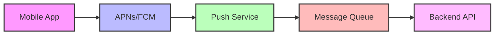
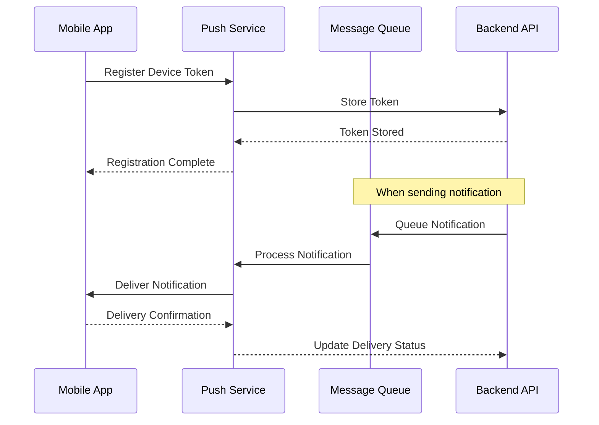

# Push Notification Architecture

## Introduction to Push Notifications

Push notifications are a critical component of modern mobile applications, enabling real-time communication with users even when the app is not active. They provide a way to re-engage users, deliver timely information, and maintain app relevance.





## Platform-Specific Implementation

### iOS Push Notifications (APNs)

#### Basic APNs Integration
```swift
import UserNotifications
import UIKit

class PushNotificationManager: NSObject {
    static let shared = PushNotificationManager()
    
    private override init() {
        super.init()
    }
    
    func registerForPushNotifications() {
        UNUserNotificationCenter.current().delegate = self
        
        UNUserNotificationCenter.current().requestAuthorization(
            options: [.alert, .sound, .badge, .provisional]
        ) { [weak self] granted, error in
            print("Push notification permission granted: \(granted)")
            
            guard granted else { return }
            
            DispatchQueue.main.async {
                UIApplication.shared.registerForRemoteNotifications()
            }
        }
    }
    
    func handleDeviceToken(_ deviceToken: Data) {
        let tokenParts = deviceToken.map { data in String(format: "%02.2hhx", data) }
        let token = tokenParts.joined()
        print("Device Token: \(token)")
        
        // Send token to your server
        sendTokenToServer(token)
    }
    
    private func sendTokenToServer(_ token: String) {
        let endpoint = URL(string: "https://api.yourapp.com/devices/register")!
        var request = URLRequest(url: endpoint)
        request.httpMethod = "POST"
        request.setValue("application/json", forHTTPHeaderField: "Content-Type")
        
        let payload = [
            "device_token": token,
            "platform": "ios",
            "app_version": Bundle.main.infoDictionary?["CFBundleShortVersionString"] as? String ?? "unknown"
        ]
        
        do {
            request.httpBody = try JSONSerialization.data(withJSONObject: payload)
            
            URLSession.shared.dataTask(with: request) { data, response, error in
                if let error = error {
                    print("Failed to register device token: \(error)")
                } else {
                    print("Device token registered successfully")
                }
            }.resume()
        } catch {
            print("Failed to serialize device token payload: \(error)")
        }
    }
}

// AppDelegate integration
extension AppDelegate {
    func application(
        _ application: UIApplication,
        didRegisterForRemoteNotificationsWithDeviceToken deviceToken: Data
    ) {
        PushNotificationManager.shared.handleDeviceToken(deviceToken)
    }
    
    func application(
        _ application: UIApplication,
        didFailToRegisterForRemoteNotificationsWithError error: Error
    ) {
        print("Failed to register for remote notifications: \(error)")
    }
}

extension PushNotificationManager: UNUserNotificationCenterDelegate {
    // Handle notification when app is in foreground
    func userNotificationCenter(
        _ center: UNUserNotificationCenter,
        willPresent notification: UNNotification,
        withCompletionHandler completionHandler: @escaping (UNNotificationPresentationOptions) -> Void
    ) {
        let userInfo = notification.request.content.userInfo
        handleNotificationData(userInfo)
        
        // Show notification even when app is in foreground
        completionHandler([.alert, .sound, .badge])
    }
    
    // Handle notification tap
    func userNotificationCenter(
        _ center: UNUserNotificationCenter,
        didReceive response: UNNotificationResponse,
        withCompletionHandler completionHandler: @escaping () -> Void
    ) {
        let userInfo = response.notification.request.content.userInfo
        let actionIdentifier = response.actionIdentifier
        
        switch actionIdentifier {
        case UNNotificationDefaultActionIdentifier:
            // User tapped the notification
            handleNotificationTap(userInfo)
        case "ACCEPT_ACTION":
            handleAcceptAction(userInfo)
        case "DECLINE_ACTION":
            handleDeclineAction(userInfo)
        default:
            break
        }
        
        completionHandler()
    }
    
    private func handleNotificationData(_ userInfo: [AnyHashable: Any]) {
        // Parse notification data and update app state
        if let notificationType = userInfo["type"] as? String {
            NotificationRouter.shared.route(type: notificationType, data: userInfo)
        }
    }
    
    private func handleNotificationTap(_ userInfo: [AnyHashable: Any]) {
        // Navigate to specific screen based on notification content
        if let deepLink = userInfo["deep_link"] as? String {
            DeepLinkHandler.shared.handle(deepLink)
        }
    }
}
```

#### Rich Notifications with Media
```swift
class RichNotificationManager {
    func scheduleRichNotification(
        title: String,
        body: String,
        imageURL: String,
        identifier: String
    ) {
        let content = UNMutableNotificationContent()
        content.title = title
        content.body = body
        content.sound = .default
        
        // Add image attachment
        if let url = URL(string: imageURL) {
            downloadImageAndAttach(url: url, to: content) { [weak self] in
                let request = UNNotificationRequest(
                    identifier: identifier,
                    content: content,
                    trigger: nil
                )
                
                UNUserNotificationCenter.current().add(request) { error in
                    if let error = error {
                        print("Failed to schedule rich notification: \(error)")
                    }
                }
            }
        }
    }
    
    private func downloadImageAndAttach(
        url: URL,
        to content: UNMutableNotificationContent,
        completion: @escaping () -> Void
    ) {
        URLSession.shared.dataTask(with: url) { data, response, error in
            guard let data = data,
                  let image = UIImage(data: data),
                  let jpegData = image.jpegData(compressionQuality: 0.8) else {
                completion()
                return
            }
            
            let tempDirectory = NSTemporaryDirectory()
            let fileName = url.lastPathComponent
            let fileURL = URL(fileURLWithPath: tempDirectory).appendingPathComponent(fileName)
            
            do {
                try jpegData.write(to: fileURL)
                let attachment = try UNNotificationAttachment(
                    identifier: "image",
                    url: fileURL,
                    options: nil
                )
                content.attachments = [attachment]
            } catch {
                print("Failed to create notification attachment: \(error)")
            }
            
            completion()
        }.resume()
    }
}
```

### Android Push Notifications (FCM)

#### Firebase Cloud Messaging Setup
```kotlin
class PushNotificationManager {
    companion object {
        private const val TAG = "PushNotificationManager"
    }
    
    fun initialize(context: Context) {
        FirebaseMessaging.getInstance().token.addOnCompleteListener { task ->
            if (!task.isSuccessful) {
                Log.w(TAG, "Fetching FCM registration token failed", task.exception)
                return@addOnCompleteListener
            }
            
            // Get new FCM registration token
            val token = task.result
            Log.d(TAG, "FCM Registration Token: $token")
            
            // Send token to your app server
            sendTokenToServer(context, token)
        }
        
        // Subscribe to topics
        subscribeToTopics()
    }
    
    private fun sendTokenToServer(context: Context, token: String) {
        val retrofit = Retrofit.Builder()
            .baseUrl("https://api.yourapp.com/")
            .addConverterFactory(GsonConverterFactory.create())
            .build()
        
        val apiService = retrofit.create(ApiService::class.java)
        
        val deviceInfo = DeviceRegistration(
            token = token,
            platform = "android",
            appVersion = getAppVersion(context),
            deviceModel = Build.MODEL,
            osVersion = Build.VERSION.RELEASE
        )
        
        apiService.registerDevice(deviceInfo).enqueue(object : Callback<ApiResponse> {
            override fun onResponse(call: Call<ApiResponse>, response: Response<ApiResponse>) {
                if (response.isSuccessful) {
                    Log.d(TAG, "Device token registered successfully")
                } else {
                    Log.e(TAG, "Failed to register device token: ${response.code()}")
                }
            }
            
            override fun onFailure(call: Call<ApiResponse>, t: Throwable) {
                Log.e(TAG, "Network error registering device token", t)
            }
        })
    }
    
    private fun subscribeToTopics() {
        // Subscribe to general notifications
        FirebaseMessaging.getInstance().subscribeToTopic("general")
            .addOnCompleteListener { task ->
                val msg = if (task.isSuccessful) "Subscribed to general topic" else "Failed to subscribe"
                Log.d(TAG, msg)
            }
        
        // Subscribe to user-specific topics based on preferences
        val userPreferences = getUserNotificationPreferences()
        userPreferences.forEach { topic ->
            FirebaseMessaging.getInstance().subscribeToTopic(topic)
        }
    }
    
    fun unsubscribeFromTopic(topic: String) {
        FirebaseMessaging.getInstance().unsubscribeFromTopic(topic)
            .addOnCompleteListener { task ->
                val msg = if (task.isSuccessful) "Unsubscribed from $topic" else "Failed to unsubscribe from $topic"
                Log.d(TAG, msg)
            }
    }
}

class MyFirebaseMessagingService : FirebaseMessagingService() {
    
    override fun onNewToken(token: String) {
        Log.d(TAG, "Refreshed token: $token")
        
        // Send the new token to your app server
        PushNotificationManager().sendTokenToServer(this, token)
    }
    
    override fun onMessageReceived(remoteMessage: RemoteMessage) {
        Log.d(TAG, "From: ${remoteMessage.from}")
        
        // Handle data payload
        if (remoteMessage.data.isNotEmpty()) {
            Log.d(TAG, "Message data payload: ${remoteMessage.data}")
            handleDataMessage(remoteMessage.data)
        }
        
        // Handle notification payload
        remoteMessage.notification?.let {
            Log.d(TAG, "Message Notification Body: ${it.body}")
            showNotification(it.title, it.body, remoteMessage.data)
        }
    }
    
    private fun handleDataMessage(data: Map<String, String>) {
        val notificationType = data["type"]
        val notificationData = data["data"]
        
        when (notificationType) {
            "message" -> handleNewMessage(notificationData)
            "update" -> handleAppUpdate(notificationData)
            "promotion" -> handlePromotion(notificationData)
            else -> showGenericNotification(data)
        }
    }
    
    private fun showNotification(title: String?, body: String?, data: Map<String, String>) {
        val intent = Intent(this, MainActivity::class.java).apply {
            addFlags(Intent.FLAG_ACTIVITY_CLEAR_TOP)
            // Add extra data for deep linking
            data.forEach { (key, value) ->
                putExtra(key, value)
            }
        }
        
        val pendingIntent = PendingIntent.getActivity(
            this, 0, intent,
            PendingIntent.FLAG_ONE_SHOT or PendingIntent.FLAG_IMMUTABLE
        )
        
        val channelId = "default_channel"
        val notificationBuilder = NotificationCompat.Builder(this, channelId)
            .setSmallIcon(R.drawable.ic_notification)
            .setContentTitle(title ?: getString(R.string.app_name))
            .setContentText(body ?: "New notification")
            .setAutoCancel(true)
            .setSound(RingtoneManager.getDefaultUri(RingtoneManager.TYPE_NOTIFICATION))
            .setContentIntent(pendingIntent)
            .setPriority(NotificationCompat.PRIORITY_HIGH)
        
        // Add action buttons if needed
        addNotificationActions(notificationBuilder, data)
        
        val notificationManager = getSystemService(Context.NOTIFICATION_SERVICE) as NotificationManager
        
        // Create notification channel for Android O and above
        if (Build.VERSION.SDK_INT >= Build.VERSION_CODES.O) {
            val channel = NotificationChannel(
                channelId,
                "Default Channel",
                NotificationManager.IMPORTANCE_HIGH
            ).apply {
                description = "Default notification channel"
                enableLights(true)
                lightColor = Color.BLUE
                enableVibration(true)
            }
            notificationManager.createNotificationChannel(channel)
        }
        
        notificationManager.notify(System.currentTimeMillis().toInt(), notificationBuilder.build())
    }
    
    private fun addNotificationActions(
        builder: NotificationCompat.Builder,
        data: Map<String, String>
    ) {
        val notificationType = data["type"]
        
        when (notificationType) {
            "message" -> {
                // Add reply action
                val replyIntent = Intent(this, QuickReplyService::class.java)
                val replyPendingIntent = PendingIntent.getService(
                    this, 0, replyIntent, PendingIntent.FLAG_IMMUTABLE
                )
                
                builder.addAction(
                    R.drawable.ic_reply,
                    "Reply",
                    replyPendingIntent
                )
            }
            "friend_request" -> {
                // Add accept/decline actions
                val acceptIntent = Intent(this, FriendRequestService::class.java).apply {
                    putExtra("action", "accept")
                    putExtra("request_id", data["request_id"])
                }
                val acceptPendingIntent = PendingIntent.getService(
                    this, 1, acceptIntent, PendingIntent.FLAG_IMMUTABLE
                )
                
                val declineIntent = Intent(this, FriendRequestService::class.java).apply {
                    putExtra("action", "decline")
                    putExtra("request_id", data["request_id"])
                }
                val declinePendingIntent = PendingIntent.getService(
                    this, 2, declineIntent, PendingIntent.FLAG_IMMUTABLE
                )
                
                builder.addAction(R.drawable.ic_check, "Accept", acceptPendingIntent)
                builder.addAction(R.drawable.ic_close, "Decline", declinePendingIntent)
            }
        }
    }
    
    companion object {
        private const val TAG = "MyFirebaseMsgService"
    }
}
```

### React Native Push Notifications

#### Using @react-native-firebase/messaging
```typescript
import messaging from '@react-native-firebase/messaging';
import notifee, { AndroidImportance } from '@notifee/react-native';
import { Platform } from 'react-native';

class PushNotificationManager {
  async initialize(): Promise<void> {
    // Request permission
    const authStatus = await messaging().requestPermission();
    const enabled =
      authStatus === messaging.AuthorizationStatus.AUTHORIZED ||
      authStatus === messaging.AuthorizationStatus.PROVISIONAL;

    if (enabled) {
      console.log('Push notification permission granted');
      await this.setupNotificationHandlers();
      await this.getToken();
    }
  }

  async getToken(): Promise<string | null> {
    try {
      const token = await messaging().getToken();
      console.log('FCM Token:', token);
      
      // Send token to your server
      await this.sendTokenToServer(token);
      
      return token;
    } catch (error) {
      console.error('Failed to get FCM token:', error);
      return null;
    }
  }

  private async sendTokenToServer(token: string): Promise<void> {
    try {
      const response = await fetch('https://api.yourapp.com/devices/register', {
        method: 'POST',
        headers: {
          'Content-Type': 'application/json',
        },
        body: JSON.stringify({
          token,
          platform: Platform.OS,
          appVersion: '1.0.0', // Get from app config
        }),
      });

      if (!response.ok) {
        throw new Error(`HTTP ${response.status}`);
      }

      console.log('Token registered successfully');
    } catch (error) {
      console.error('Failed to register token:', error);
    }
  }

  private async setupNotificationHandlers(): Promise<void> {
    // Handle background messages
    messaging().setBackgroundMessageHandler(async (remoteMessage) => {
      console.log('Message handled in the background!', remoteMessage);
      await this.displayNotification(remoteMessage);
    });

    // Handle foreground messages
    messaging().onMessage(async (remoteMessage) => {
      console.log('A new FCM message arrived!', remoteMessage);
      await this.displayNotification(remoteMessage);
    });

    // Handle notification open app
    messaging().onNotificationOpenedApp((remoteMessage) => {
      console.log('Notification caused app to open from background state:', remoteMessage);
      this.handleNotificationNavigation(remoteMessage);
    });

    // Check whether an initial notification is available
    messaging()
      .getInitialNotification()
      .then((remoteMessage) => {
        if (remoteMessage) {
          console.log('Notification caused app to open from quit state:', remoteMessage);
          this.handleNotificationNavigation(remoteMessage);
        }
      });

    // Handle token refresh
    messaging().onTokenRefresh((token) => {
      console.log('FCM token refreshed:', token);
      this.sendTokenToServer(token);
    });
  }

  private async displayNotification(remoteMessage: any): Promise<void> {
    const { notification, data } = remoteMessage;

    // Create a channel (required for Android)
    const channelId = await notifee.createChannel({
      id: 'default',
      name: 'Default Channel',
      importance: AndroidImportance.HIGH,
    });

    // Display notification
    await notifee.displayNotification({
      title: notification?.title || 'New Notification',
      body: notification?.body || 'You have a new message',
      data: data,
      android: {
        channelId,
        smallIcon: 'ic_launcher',
        largeIcon: data?.image_url,
        pressAction: {
          id: 'default',
        },
        actions: this.getNotificationActions(data),
      },
      ios: {
        attachments: data?.image_url ? [{ url: data.image_url }] : [],
      },
    });
  }

  private getNotificationActions(data: any): any[] {
    const actions = [];

    switch (data?.type) {
      case 'message':
        actions.push({
          title: 'Reply',
          pressAction: { id: 'reply' },
        });
        break;
      case 'friend_request':
        actions.push(
          {
            title: 'Accept',
            pressAction: { id: 'accept' },
          },
          {
            title: 'Decline',
            pressAction: { id: 'decline' },
          }
        );
        break;
    }

    return actions;
  }

  private handleNotificationNavigation(remoteMessage: any): void {
    const { data } = remoteMessage;
    
    // Navigate based on notification data
    if (data?.screen) {
      // Use your navigation library to navigate
      // NavigationService.navigate(data.screen, data.params);
    }
  }

  async subscribeToTopic(topic: string): Promise<void> {
    try {
      await messaging().subscribeToTopic(topic);
      console.log(`Subscribed to topic: ${topic}`);
    } catch (error) {
      console.error(`Failed to subscribe to topic ${topic}:`, error);
    }
  }

  async unsubscribeFromTopic(topic: string): Promise<void> {
    try {
      await messaging().unsubscribeFromTopic(topic);
      console.log(`Unsubscribed from topic: ${topic}`);
    } catch (error) {
      console.error(`Failed to unsubscribe from topic ${topic}:`, error);
    }
  }
}

// Usage
const pushNotificationManager = new PushNotificationManager();
pushNotificationManager.initialize();
```

### Flutter Push Notifications

#### Using firebase_messaging package
```dart
class PushNotificationManager {
  static final FirebaseMessaging _firebaseMessaging = FirebaseMessaging.instance;
  
  static Future<void> initialize() async {
    // Request permission
    NotificationSettings settings = await _firebaseMessaging.requestPermission(
      alert: true,
      announcement: false,
      badge: true,
      carPlay: false,
      criticalAlert: false,
      provisional: false,
      sound: true,
    );

    if (settings.authorizationStatus == AuthorizationStatus.authorized) {
      print('User granted permission');
      await _setupMessageHandlers();
      await _getToken();
    } else {
      print('User declined or has not accepted permission');
    }
  }

  static Future<void> _getToken() async {
    try {
      String? token = await _firebaseMessaging.getToken();
      print('FCM Token: $token');
      
      if (token != null) {
        await _sendTokenToServer(token);
      }
    } catch (e) {
      print('Failed to get FCM token: $e');
    }
  }

  static Future<void> _sendTokenToServer(String token) async {
    try {
      final response = await http.post(
        Uri.parse('https://api.yourapp.com/devices/register'),
        headers: {'Content-Type': 'application/json'},
        body: jsonEncode({
          'token': token,
          'platform': Platform.operatingSystem,
          'app_version': '1.0.0',
        }),
      );

      if (response.statusCode == 200) {
        print('Token registered successfully');
      } else {
        print('Failed to register token: ${response.statusCode}');
      }
    } catch (e) {
      print('Error registering token: $e');
    }
  }

  static Future<void> _setupMessageHandlers() async {
    // Handle background messages
    FirebaseMessaging.onBackgroundMessage(_firebaseMessagingBackgroundHandler);

    // Handle foreground messages
    FirebaseMessaging.onMessage.listen((RemoteMessage message) {
      print('Got a message whilst in the foreground!');
      print('Message data: ${message.data}');

      if (message.notification != null) {
        print('Message also contained a notification: ${message.notification}');
        _showLocalNotification(message);
      }
    });

    // Handle notification taps when app is in background
    FirebaseMessaging.onMessageOpenedApp.listen((RemoteMessage message) {
      print('A new onMessageOpenedApp event was published!');
      _handleNotificationTap(message);
    });

    // Handle notification taps when app is terminated
    RemoteMessage? initialMessage = await FirebaseMessaging.instance.getInitialMessage();
    if (initialMessage != null) {
      _handleNotificationTap(initialMessage);
    }

    // Handle token refresh
    FirebaseMessaging.instance.onTokenRefresh.listen((String token) {
      print('FCM token refreshed: $token');
      _sendTokenToServer(token);
    });
  }

  static Future<void> _showLocalNotification(RemoteMessage message) async {
    const AndroidNotificationDetails androidPlatformChannelSpecifics =
        AndroidNotificationDetails(
      'default_channel',
      'Default Channel',
      channelDescription: 'Default notification channel',
      importance: Importance.max,
      priority: Priority.high,
      ticker: 'ticker',
    );

    const NotificationDetails platformChannelSpecifics =
        NotificationDetails(android: androidPlatformChannelSpecifics);

    await FlutterLocalNotificationsPlugin().show(
      message.hashCode,
      message.notification?.title ?? 'New Notification',
      message.notification?.body ?? 'You have a new message',
      platformChannelSpecifics,
      payload: jsonEncode(message.data),
    );
  }

  static void _handleNotificationTap(RemoteMessage message) {
    final data = message.data;
    
    if (data.containsKey('screen')) {
      // Navigate to specific screen
      NavigationService.navigateTo(data['screen'], arguments: data);
    }
  }

  static Future<void> subscribeToTopic(String topic) async {
    try {
      await _firebaseMessaging.subscribeToTopic(topic);
      print('Subscribed to topic: $topic');
    } catch (e) {
      print('Failed to subscribe to topic $topic: $e');
    }
  }

  static Future<void> unsubscribeFromTopic(String topic) async {
    try {
      await _firebaseMessaging.unsubscribeFromTopic(topic);
      print('Unsubscribed from topic: $topic');
    } catch (e) {
      print('Failed to unsubscribe from topic $topic: $e');
    }
  }
}

// Background message handler
Future<void> _firebaseMessagingBackgroundHandler(RemoteMessage message) async {
  await Firebase.initializeApp();
  print("Handling a background message: ${message.messageId}");
  
  // Process the message data
  await _processBackgroundMessage(message);
}

Future<void> _processBackgroundMessage(RemoteMessage message) async {
  // Update local database or perform background sync
  final data = message.data;
  
  switch (data['type']) {
    case 'new_message':
      await _handleNewMessage(data);
      break;
    case 'sync_request':
      await _performBackgroundSync();
      break;
    default:
      print('Unknown background message type: ${data['type']}');
  }
}
```

## Server-Side Push Notification Implementation

### Node.js Backend with Firebase Admin SDK
```typescript
import admin from 'firebase-admin';
import { getMessaging } from 'firebase-admin/messaging';

class PushNotificationService {
  constructor() {
    // Initialize Firebase Admin SDK
    admin.initializeApp({
      credential: admin.credential.cert({
        projectId: process.env.FIREBASE_PROJECT_ID,
        clientEmail: process.env.FIREBASE_CLIENT_EMAIL,
        privateKey: process.env.FIREBASE_PRIVATE_KEY?.replace(/\\n/g, '\n'),
      }),
    });
  }

  async sendToDevice(token: string, notification: NotificationPayload): Promise<boolean> {
    try {
      const message = {
        token,
        notification: {
          title: notification.title,
          body: notification.body,
          imageUrl: notification.imageUrl,
        },
        data: notification.data || {},
        android: {
          priority: 'high' as const,
          notification: {
            sound: 'default',
            clickAction: 'FLUTTER_NOTIFICATION_CLICK',
          },
        },
        apns: {
          payload: {
            aps: {
              badge: notification.badge || 1,
              sound: 'default',
            },
          },
        },
      };

      const response = await getMessaging().send(message);
      console.log('Successfully sent message:', response);
      return true;
    } catch (error) {
      console.error('Error sending message:', error);
      return false;
    }
  }

  async sendToMultipleDevices(
    tokens: string[],
    notification: NotificationPayload
  ): Promise<BatchResponse> {
    try {
      const message = {
        notification: {
          title: notification.title,
          body: notification.body,
          imageUrl: notification.imageUrl,
        },
        data: notification.data || {},
        tokens,
      };

      const response = await getMessaging().sendMulticast(message);
      console.log(`${response.successCount} messages were sent successfully`);
      
      if (response.failureCount > 0) {
        response.responses.forEach((resp, idx) => {
          if (!resp.success) {
            console.error(`Failed to send to token ${tokens[idx]}:`, resp.error);
          }
        });
      }

      return response;
    } catch (error) {
      console.error('Error sending multicast message:', error);
      throw error;
    }
  }

  async sendToTopic(topic: string, notification: NotificationPayload): Promise<boolean> {
    try {
      const message = {
        topic,
        notification: {
          title: notification.title,
          body: notification.body,
          imageUrl: notification.imageUrl,
        },
        data: notification.data || {},
      };

      const response = await getMessaging().send(message);
      console.log('Successfully sent topic message:', response);
      return true;
    } catch (error) {
      console.error('Error sending topic message:', error);
      return false;
    }
  }

  async scheduleNotification(
    token: string,
    notification: NotificationPayload,
    scheduledTime: Date
  ): Promise<void> {
    const delay = scheduledTime.getTime() - Date.now();
    
    if (delay <= 0) {
      await this.sendToDevice(token, notification);
      return;
    }

    setTimeout(async () => {
      await this.sendToDevice(token, notification);
    }, delay);
  }

  async sendPersonalizedNotifications(
    userNotifications: Array<{ token: string; notification: NotificationPayload }>
  ): Promise<void> {
    const chunks = this.chunkArray(userNotifications, 500); // FCM limit

    for (const chunk of chunks) {
      const promises = chunk.map(({ token, notification }) =>
        this.sendToDevice(token, notification)
      );

      await Promise.allSettled(promises);
      
      // Add delay between batches to respect rate limits
      await this.delay(100);
    }
  }

  private chunkArray<T>(array: T[], size: number): T[][] {
    const chunks: T[][] = [];
    for (let i = 0; i < array.length; i += size) {
      chunks.push(array.slice(i, i + size));
    }
    return chunks;
  }

  private delay(ms: number): Promise<void> {
    return new Promise(resolve => setTimeout(resolve, ms));
  }
}

interface NotificationPayload {
  title: string;
  body: string;
  imageUrl?: string;
  badge?: number;
  data?: Record<string, string>;
}

interface BatchResponse {
  responses: Array<{ success: boolean; error?: any }>;
  successCount: number;
  failureCount: number;
}
```

## Advanced Features

### Rich Notifications with Actions
```swift
// iOS - Custom notification actions
class RichNotificationSetup {
    func setupNotificationCategories() {
        // Message category with reply action
        let replyAction = UNTextInputNotificationAction(
            identifier: "REPLY_ACTION",
            title: "Reply",
            options: [],
            textInputButtonTitle: "Send",
            textInputPlaceholder: "Type your reply..."
        )
        
        let messageCategory = UNNotificationCategory(
            identifier: "MESSAGE_CATEGORY",
            actions: [replyAction],
            intentIdentifiers: [],
            options: []
        )
        
        // Friend request category
        let acceptAction = UNNotificationAction(
            identifier: "ACCEPT_ACTION",
            title: "Accept",
            options: [.foreground]
        )
        
        let declineAction = UNNotificationAction(
            identifier: "DECLINE_ACTION",
            title: "Decline",
            options: []
        )
        
        let friendRequestCategory = UNNotificationCategory(
            identifier: "FRIEND_REQUEST_CATEGORY",
            actions: [acceptAction, declineAction],
            intentIdentifiers: [],
            options: []
        )
        
        UNUserNotificationCenter.current().setNotificationCategories([
            messageCategory,
            friendRequestCategory
        ])
    }
}
```

### Analytics and Performance Monitoring
```typescript
class NotificationAnalytics {
  private analytics: AnalyticsService;
  
  constructor(analytics: AnalyticsService) {
    this.analytics = analytics;
  }

  trackNotificationSent(
    notificationId: string,
    userId: string,
    type: string,
    channel: string
  ): void {
    this.analytics.track('notification_sent', {
      notification_id: notificationId,
      user_id: userId,
      type,
      channel,
      timestamp: new Date().toISOString(),
    });
  }

  trackNotificationDelivered(
    notificationId: string,
    userId: string,
    deliveryTime: number
  ): void {
    this.analytics.track('notification_delivered', {
      notification_id: notificationId,
      user_id: userId,
      delivery_time_ms: deliveryTime,
      timestamp: new Date().toISOString(),
    });
  }

  trackNotificationOpened(
    notificationId: string,
    userId: string,
    openedAt: Date
  ): void {
    this.analytics.track('notification_opened', {
      notification_id: notificationId,
      user_id: userId,
      opened_at: openedAt.toISOString(),
    });
  }

  async generateEngagementReport(
    startDate: Date,
    endDate: Date
  ): Promise<EngagementReport> {
    const sent = await this.analytics.count('notification_sent', startDate, endDate);
    const delivered = await this.analytics.count('notification_delivered', startDate, endDate);
    const opened = await this.analytics.count('notification_opened', startDate, endDate);

    return {
      sent,
      delivered,
      opened,
      deliveryRate: delivered / sent,
      openRate: opened / delivered,
      period: { startDate, endDate },
    };
  }
}

interface EngagementReport {
  sent: number;
  delivered: number;
  opened: number;
  deliveryRate: number;
  openRate: number;
  period: { startDate: Date; endDate: Date };
}
```

## Best Practices

### 1. **User Experience**
- Request permission at the right moment
- Provide clear value proposition for notifications
- Allow granular notification preferences
- Respect user's notification settings

### 2. **Performance Optimization**
- Batch notification sends to respect rate limits
- Implement retry logic with exponential backoff
- Monitor notification delivery rates
- Clean up invalid tokens regularly

### 3. **Security Considerations**
- Validate notification payloads on the server
- Use HTTPS for all API communications
- Implement proper authentication for notification endpoints
- Sanitize user-generated content in notifications

### 4. **Platform-Specific Guidelines**
```typescript
class NotificationBestPractices {
  static validateNotificationContent(notification: NotificationPayload): boolean {
    // Title length limits
    if (notification.title.length > 50) {
      console.warn('Notification title too long, will be truncated');
    }
    
    // Body length limits
    if (notification.body.length > 200) {
      console.warn('Notification body too long, will be truncated');
    }
    
    // Image size validation
    if (notification.imageUrl && !this.isValidImageSize(notification.imageUrl)) {
      console.warn('Notification image may be too large');
      return false;
    }
    
    return true;
  }

  static optimizeForBattery(notifications: NotificationPayload[]): NotificationPayload[] {
    // Group similar notifications
    const grouped = this.groupSimilarNotifications(notifications);
    
    // Create summary notifications for groups with more than 3 items
    return grouped.map(group => {
      if (group.length > 3) {
        return this.createSummaryNotification(group);
      }
      return group[0];
    });
  }

  private static createSummaryNotification(
    notifications: NotificationPayload[]
  ): NotificationPayload {
    return {
      title: `${notifications.length} new messages`,
      body: 'Tap to view all messages',
      data: {
        type: 'summary',
        count: notifications.length.toString(),
        items: JSON.stringify(notifications.map(n => n.data)),
      },
    };
  }
}
```

## Conclusion

Push notifications are a powerful tool for user engagement, but they must be implemented thoughtfully to provide value without being intrusive. Key considerations include:

- **Platform-specific implementation** using APNs for iOS and FCM for Android
- **Rich notification features** like images, actions, and interactive elements
- **Server-side infrastructure** for reliable message delivery and analytics
- **User experience optimization** through personalization and timing
- **Performance monitoring** to track delivery rates and engagement metrics

Success with push notifications comes from balancing technical implementation excellence with user-centric design principles.
