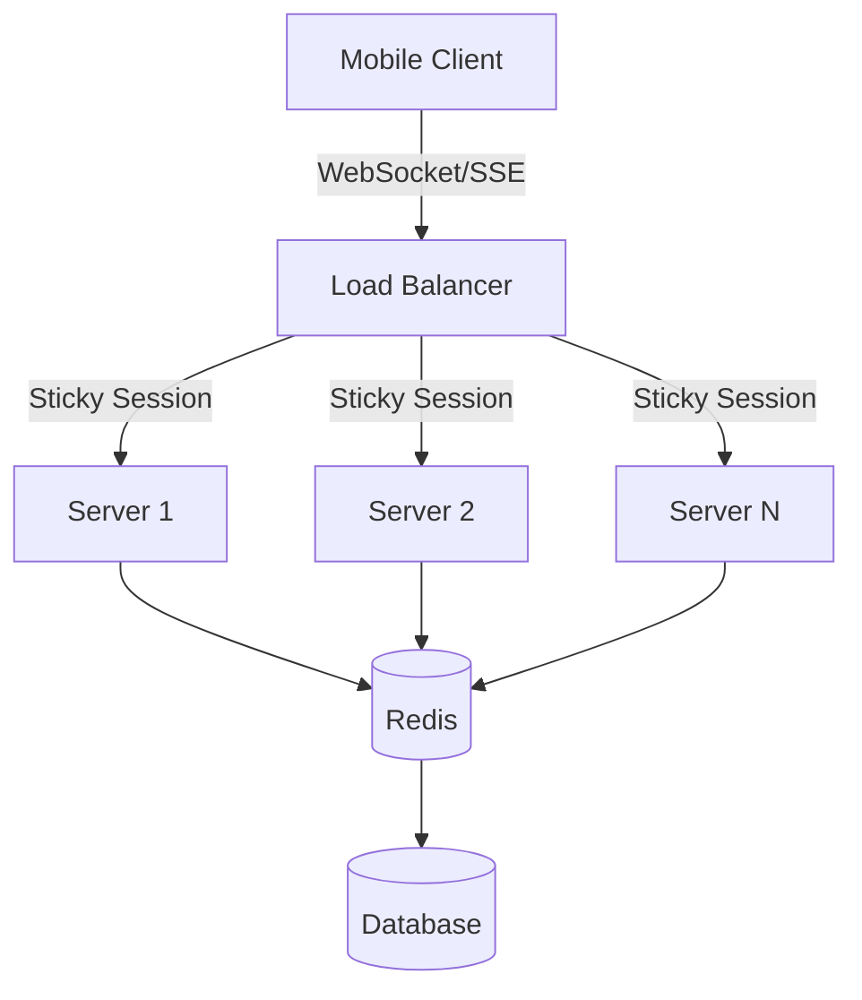
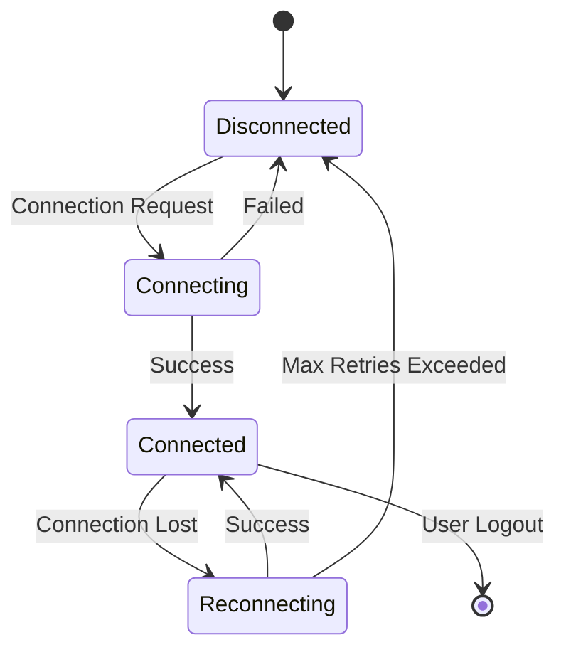
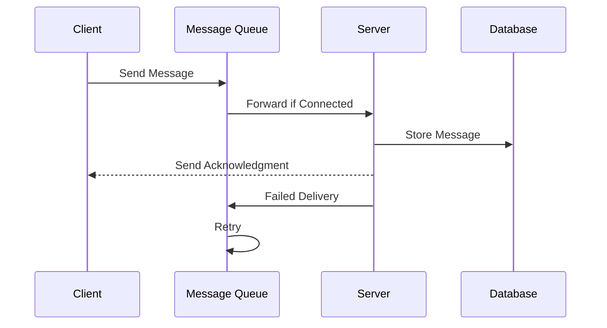
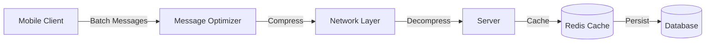

# Real-time Communication

## Introduction to Real-time Communication

Real-time communication enables instantaneous data exchange between mobile clients and servers, providing users with immediate updates and interactive experiences. This includes chat messaging, live updates, collaborative editing, gaming, and live streaming features.

## System Architecture



## Connection Management



## Message Processing Flow



## Performance Optimization



## Core Technologies and Protocols

### WebSocket Implementation

#### Native iOS WebSocket
```swift
import Foundation
import Network

class WebSocketManager: NSObject {
    private var webSocketTask: URLSessionWebSocketTask?
    private var urlSession: URLSession?
    private let connectionQueue = DispatchQueue(label: "websocket.connection")
    
    private var isConnected = false
    private var reconnectAttempts = 0
    private let maxReconnectAttempts = 5
    private var reconnectTimer: Timer?
    
    weak var delegate: WebSocketManagerDelegate?
    
    func connect(to url: URL) {
        connectionQueue.async { [weak self] in
            self?.establishConnection(to: url)
        }
    }
    
    private func establishConnection(to url: URL) {
        let config = URLSessionConfiguration.default
        config.timeoutIntervalForRequest = 30
        config.timeoutIntervalForResource = 30
        
        urlSession = URLSession(configuration: config, delegate: self, delegateQueue: nil)
        webSocketTask = urlSession?.webSocketTask(with: url)
        
        webSocketTask?.resume()
        listen()
        
        // Send ping to keep connection alive
        scheduleHeartbeat()
    }
    
    private func listen() {
        webSocketTask?.receive { [weak self] result in
            switch result {
            case .success(let message):
                self?.handleMessage(message)
                self?.listen() // Continue listening
                
            case .failure(let error):
                self?.handleError(error)
            }
        }
    }
    
    private func handleMessage(_ message: URLSessionWebSocketTask.Message) {
        switch message {
        case .string(let text):
            DispatchQueue.main.async { [weak self] in
                self?.delegate?.didReceiveMessage(text)
            }
            
        case .data(let data):
            if let text = String(data: data, encoding: .utf8) {
                DispatchQueue.main.async { [weak self] in
                    self?.delegate?.didReceiveMessage(text)
                }
            }
            
        @unknown default:
            break
        }
    }
    
    func sendMessage(_ message: String) {
        let webSocketMessage = URLSessionWebSocketTask.Message.string(message)
        webSocketTask?.send(webSocketMessage) { [weak self] error in
            if let error = error {
                print("WebSocket send error: \(error)")
                self?.delegate?.didEncounterError(error)
            }
        }
    }
    
    func sendData(_ data: Data) {
        let webSocketMessage = URLSessionWebSocketTask.Message.data(data)
        webSocketTask?.send(webSocketMessage) { [weak self] error in
            if let error = error {
                print("WebSocket send error: \(error)")
                self?.delegate?.didEncounterError(error)
            }
        }
    }
    
    private func scheduleHeartbeat() {
        DispatchQueue.main.async { [weak self] in
            self?.reconnectTimer?.invalidate()
            self?.reconnectTimer = Timer.scheduledTimer(withTimeInterval: 30.0, repeats: true) { _ in
                self?.sendPing()
            }
        }
    }
    
    private func sendPing() {
        webSocketTask?.sendPing { [weak self] error in
            if let error = error {
                print("WebSocket ping failed: \(error)")
                self?.handleError(error)
            }
        }
    }
    
    private func handleError(_ error: Error) {
        print("WebSocket error: \(error)")
        isConnected = false
        
        DispatchQueue.main.async { [weak self] in
            self?.delegate?.didEncounterError(error)
        }
        
        attemptReconnection()
    }
    
    private func attemptReconnection() {
        guard reconnectAttempts < maxReconnectAttempts else {
            print("Max reconnection attempts reached")
            return
        }
        
        reconnectAttempts += 1
        let delay = TimeInterval(min(30, pow(2.0, Double(reconnectAttempts))))
        
        DispatchQueue.main.asyncAfter(deadline: .now() + delay) { [weak self] in
            guard let self = self,
                  let url = self.webSocketTask?.originalRequest?.url else { return }
            
            print("Attempting reconnection #\(self.reconnectAttempts)")
            self.connect(to: url)
        }
    }
    
    func disconnect() {
        reconnectTimer?.invalidate()
        webSocketTask?.cancel(with: .goingAway, reason: nil)
        urlSession?.invalidateAndCancel()
        isConnected = false
        reconnectAttempts = 0
    }
}

extension WebSocketManager: URLSessionWebSocketDelegate {
    func urlSession(_ session: URLSession, webSocketTask: URLSessionWebSocketTask, didOpenWithProtocol protocol: String?) {
        print("WebSocket connected")
        isConnected = true
        reconnectAttempts = 0
        
        DispatchQueue.main.async { [weak self] in
            self?.delegate?.didConnect()
        }
    }
    
    func urlSession(_ session: URLSession, webSocketTask: URLSessionWebSocketTask, didCloseWith closeCode: URLSessionWebSocketTask.CloseCode, reason: Data?) {
        print("WebSocket disconnected with code: \(closeCode)")
        isConnected = false
        
        DispatchQueue.main.async { [weak self] in
            self?.delegate?.didDisconnect()
        }
        
        if closeCode != .goingAway {
            attemptReconnection()
        }
    }
}

protocol WebSocketManagerDelegate: AnyObject {
    func didConnect()
    func didDisconnect()
    func didReceiveMessage(_ message: String)
    func didEncounterError(_ error: Error)
}
```

#### Android WebSocket with OkHttp
```kotlin
import okhttp3.*
import okio.ByteString
import org.json.JSONObject
import java.util.concurrent.TimeUnit

class WebSocketManager(private val listener: WebSocketListener) {
    private var webSocket: WebSocket? = null
    private val client = OkHttpClient.Builder()
        .readTimeout(30, TimeUnit.SECONDS)
        .writeTimeout(30, TimeUnit.SECONDS)
        .pingInterval(30, TimeUnit.SECONDS)
        .build()
    
    private var isConnected = false
    private var reconnectAttempts = 0
    private val maxReconnectAttempts = 5
    private var reconnectHandler = android.os.Handler(android.os.Looper.getMainLooper())
    
    interface WebSocketListener {
        fun onConnected()
        fun onDisconnected()
        fun onMessageReceived(message: String)
        fun onError(error: Throwable)
    }
    
    fun connect(url: String) {
        val request = Request.Builder()
            .url(url)
            .addHeader("Authorization", "Bearer ${getAuthToken()}")
            .build()
        
        webSocket = client.newWebSocket(request, object : okhttp3.WebSocketListener() {
            override fun onOpen(webSocket: WebSocket, response: Response) {
                isConnected = true
                reconnectAttempts = 0
                listener.onConnected()
            }
            
            override fun onMessage(webSocket: WebSocket, text: String) {
                listener.onMessageReceived(text)
            }
            
            override fun onMessage(webSocket: WebSocket, bytes: ByteString) {
                listener.onMessageReceived(bytes.utf8())
            }
            
            override fun onClosed(webSocket: WebSocket, code: Int, reason: String) {
                isConnected = false
                listener.onDisconnected()
                
                if (code != 1000) { // Not normal closure
                    attemptReconnection(url)
                }
            }
            
            override fun onFailure(webSocket: WebSocket, t: Throwable, response: Response?) {
                isConnected = false
                listener.onError(t)
                attemptReconnection(url)
            }
        })
    }
    
    fun sendMessage(message: String): Boolean {
        return webSocket?.send(message) ?: false
    }
    
    fun sendMessage(data: ByteArray): Boolean {
        return webSocket?.send(ByteString.of(*data)) ?: false
    }
    
    private fun attemptReconnection(url: String) {
        if (reconnectAttempts >= maxReconnectAttempts) {
            listener.onError(Exception("Max reconnection attempts reached"))
            return
        }
        
        reconnectAttempts++
        val delay = (kotlin.math.min(30, kotlin.math.pow(2.0, reconnectAttempts.toDouble())) * 1000).toLong()
        
        reconnectHandler.postDelayed({
            connect(url)
        }, delay)
    }
    
    fun disconnect() {
        webSocket?.close(1000, "User disconnect")
        isConnected = false
        reconnectAttempts = 0
    }
    
    private fun getAuthToken(): String {
        // Return your authentication token
        return "your_auth_token"
    }
}

// Usage
class ChatActivity : AppCompatActivity(), WebSocketManager.WebSocketListener {
    private lateinit var webSocketManager: WebSocketManager
    
    override fun onCreate(savedInstanceState: Bundle?) {
        super.onCreate(savedInstanceState)
        
        webSocketManager = WebSocketManager(this)
        webSocketManager.connect("wss://api.yourapp.com/chat")
    }
    
    override fun onConnected() {
        runOnUiThread {
            // Update UI to show connected state
            updateConnectionStatus(true)
        }
    }
    
    override fun onDisconnected() {
        runOnUiThread {
            // Update UI to show disconnected state
            updateConnectionStatus(false)
        }
    }
    
    override fun onMessageReceived(message: String) {
        runOnUiThread {
            try {
                val messageObj = JSONObject(message)
                when (messageObj.getString("type")) {
                    "chat_message" -> handleChatMessage(messageObj)
                    "user_typing" -> handleTypingIndicator(messageObj)
                    "presence_update" -> handlePresenceUpdate(messageObj)
                }
            } catch (e: Exception) {
                onError(e)
            }
        }
    }
    
    override fun onError(error: Throwable) {
        runOnUiThread {
            // Show error message to user
            showErrorMessage(error.message ?: "Connection error")
        }
    }
    
    private fun sendChatMessage(text: String) {
        val message = JSONObject().apply {
            put("type", "chat_message")
            put("text", text)
            put("timestamp", System.currentTimeMillis())
            put("user_id", getCurrentUserId())
        }
        
        webSocketManager.sendMessage(message.toString())
    }
}
```

### React Native Real-time Implementation

#### Using Socket.IO Client
```typescript
import io, { Socket } from 'socket.io-client';
import { NetInfo } from '@react-native-async-storage/async-storage';

class RealTimeManager {
  private socket: Socket | null = null;
  private connectionOptions: any;
  private listeners: Map<string, Function[]> = new Map();
  private isConnected = false;
  private reconnectAttempts = 0;
  private maxReconnectAttempts = 5;

  constructor(url: string, options: any = {}) {
    this.connectionOptions = {
      transports: ['websocket'],
      autoConnect: false,
      reconnection: true,
      reconnectionAttempts: this.maxReconnectAttempts,
      reconnectionDelay: 1000,
      timeout: 20000,
      ...options,
    };

    this.socket = io(url, this.connectionOptions);
    this.setupEventHandlers();
    this.setupNetworkListener();
  }

  private setupEventHandlers(): void {
    if (!this.socket) return;

    this.socket.on('connect', () => {
      console.log('Socket connected');
      this.isConnected = true;
      this.reconnectAttempts = 0;
      this.emit('connected');
    });

    this.socket.on('disconnect', (reason: string) => {
      console.log('Socket disconnected:', reason);
      this.isConnected = false;
      this.emit('disconnected', reason);
    });

    this.socket.on('connect_error', (error: Error) => {
      console.error('Socket connection error:', error);
      this.emit('error', error);
    });

    this.socket.on('reconnect', (attemptNumber: number) => {
      console.log('Socket reconnected after', attemptNumber, 'attempts');
      this.emit('reconnected', attemptNumber);
    });

    this.socket.on('reconnect_error', (error: Error) => {
      console.error('Socket reconnection error:', error);
      this.reconnectAttempts++;
      this.emit('reconnect_error', error);
    });
  }

  private setupNetworkListener(): void {
    NetInfo.addEventListener(state => {
      if (state.isConnected && !this.isConnected) {
        // Network is back, attempt to reconnect
        this.connect();
      } else if (!state.isConnected && this.isConnected) {
        // Network is lost
        this.emit('network_lost');
      }
    });
  }

  connect(): void {
    if (this.socket && !this.isConnected) {
      this.socket.connect();
    }
  }

  disconnect(): void {
    if (this.socket) {
      this.socket.disconnect();
      this.isConnected = false;
    }
  }

  on(event: string, callback: Function): void {
    if (!this.listeners.has(event)) {
      this.listeners.set(event, []);
    }
    this.listeners.get(event)!.push(callback);

    // Also register with socket.io
    if (this.socket) {
      this.socket.on(event, callback);
    }
  }

  off(event: string, callback?: Function): void {
    if (callback) {
      const listeners = this.listeners.get(event) || [];
      const index = listeners.indexOf(callback);
      if (index > -1) {
        listeners.splice(index, 1);
      }
      
      if (this.socket) {
        this.socket.off(event, callback);
      }
    } else {
      this.listeners.delete(event);
      if (this.socket) {
        this.socket.off(event);
      }
    }
  }

  emit(event: string, data?: any): void {
    if (this.socket && this.isConnected) {
      this.socket.emit(event, data);
    } else {
      // Queue the event for when connection is restored
      this.queueEvent(event, data);
    }
  }

  private queueEvent(event: string, data?: any): void {
    // Implement event queuing for offline scenarios
    const queuedEvents = this.getQueuedEvents();
    queuedEvents.push({ event, data, timestamp: Date.now() });
    this.saveQueuedEvents(queuedEvents);
  }

  private getQueuedEvents(): Array<{ event: string; data: any; timestamp: number }> {
    // Implement persistent storage for queued events
    return [];
  }

  private saveQueuedEvents(events: Array<{ event: string; data: any; timestamp: number }>): void {
    // Implement persistent storage
  }

  joinRoom(roomId: string): void {
    this.emit('join_room', { roomId });
  }

  leaveRoom(roomId: string): void {
    this.emit('leave_room', { roomId });
  }

  sendMessage(roomId: string, message: any): void {
    const messageData = {
      roomId,
      message,
      timestamp: Date.now(),
      messageId: this.generateMessageId(),
    };

    this.emit('send_message', messageData);
  }

  private generateMessageId(): string {
    return `${Date.now()}_${Math.random().toString(36).substr(2, 9)}`;
  }

  getConnectionStatus(): boolean {
    return this.isConnected;
  }
}

// Usage in React Native component
import React, { useEffect, useState } from 'react';
import { View, Text, TextInput, Button, FlatList } from 'react-native';

const ChatScreen: React.FC = () => {
  const [realTimeManager] = useState(() => new RealTimeManager('ws://localhost:3000'));
  const [messages, setMessages] = useState<any[]>([]);
  const [messageText, setMessageText] = useState('');
  const [isConnected, setIsConnected] = useState(false);

  useEffect(() => {
    realTimeManager.on('connected', () => {
      setIsConnected(true);
      realTimeManager.joinRoom('general');
    });

    realTimeManager.on('disconnected', () => {
      setIsConnected(false);
    });

    realTimeManager.on('new_message', (message: any) => {
      setMessages(prev => [...prev, message]);
    });

    realTimeManager.connect();

    return () => {
      realTimeManager.disconnect();
    };
  }, []);

  const sendMessage = () => {
    if (messageText.trim() && isConnected) {
      realTimeManager.sendMessage('general', {
        text: messageText,
        user: 'current_user',
      });
      setMessageText('');
    }
  };

  return (
    <View style={{ flex: 1, padding: 20 }}>
      <Text style={{ color: isConnected ? 'green' : 'red' }}>
        Status: {isConnected ? 'Connected' : 'Disconnected'}
      </Text>
      
      <FlatList
        data={messages}
        keyExtractor={(item, index) => index.toString()}
        renderItem={({ item }) => (
          <View style={{ padding: 10, borderBottomWidth: 1 }}>
            <Text>{item.user}: {item.text}</Text>
          </View>
        )}
      />
      
      <View style={{ flexDirection: 'row', marginTop: 20 }}>
        <TextInput
          style={{ flex: 1, borderWidth: 1, padding: 10 }}
          value={messageText}
          onChangeText={setMessageText}
          placeholder="Type a message..."
        />
        <Button title="Send" onPress={sendMessage} />
      </View>
    </View>
  );
};
```

### Flutter Real-time Implementation

#### Using WebSocket and Stream Controllers
```dart
import 'dart:async';
import 'dart:convert';
import 'dart:io';
import 'package:flutter/foundation.dart';

class RealTimeManager {
  WebSocket? _socket;
  Timer? _heartbeatTimer;
  Timer? _reconnectTimer;
  
  bool _isConnected = false;
  int _reconnectAttempts = 0;
  final int _maxReconnectAttempts = 5;
  
  final String _url;
  final Map<String, String> _headers;
  
  // Stream controllers for different event types
  final StreamController<bool> _connectionController = StreamController<bool>.broadcast();
  final StreamController<Map<String, dynamic>> _messageController = StreamController<Map<String, dynamic>>.broadcast();
  final StreamController<String> _errorController = StreamController<String>.broadcast();
  
  // Streams
  Stream<bool> get connectionStream => _connectionController.stream;
  Stream<Map<String, dynamic>> get messageStream => _messageController.stream;
  Stream<String> get errorStream => _errorController.stream;
  
  RealTimeManager(this._url, {Map<String, String>? headers}) 
      : _headers = headers ?? {};
  
  Future<void> connect() async {
    try {
      _socket = await WebSocket.connect(_url, headers: _headers);
      _isConnected = true;
      _reconnectAttempts = 0;
      
      _connectionController.add(true);
      _startHeartbeat();
      _listenToMessages();
      
      print('WebSocket connected');
    } catch (e) {
      print('WebSocket connection failed: $e');
      _handleConnectionError(e.toString());
    }
  }
  
  void _listenToMessages() {
    _socket?.listen(
      (data) {
        try {
          final message = jsonDecode(data);
          _messageController.add(message);
        } catch (e) {
          print('Error parsing message: $e');
        }
      },
      onError: (error) {
        print('WebSocket error: $error');
        _handleConnectionError(error.toString());
      },
      onDone: () {
        print('WebSocket connection closed');
        _isConnected = false;
        _connectionController.add(false);
        _attemptReconnection();
      },
    );
  }
  
  void _startHeartbeat() {
    _heartbeatTimer?.cancel();
    _heartbeatTimer = Timer.periodic(const Duration(seconds: 30), (timer) {
      if (_isConnected) {
        _sendHeartbeat();
      }
    });
  }
  
  void _sendHeartbeat() {
    sendMessage({
      'type': 'ping',
      'timestamp': DateTime.now().millisecondsSinceEpoch,
    });
  }
  
  void _handleConnectionError(String error) {
    _isConnected = false;
    _connectionController.add(false);
    _errorController.add(error);
    _attemptReconnection();
  }
  
  void _attemptReconnection() {
    if (_reconnectAttempts >= _maxReconnectAttempts) {
      _errorController.add('Max reconnection attempts reached');
      return;
    }
    
    _reconnectAttempts++;
    final delay = Duration(seconds: math.min(30, math.pow(2, _reconnectAttempts).toInt()));
    
    _reconnectTimer?.cancel();
    _reconnectTimer = Timer(delay, () {
      print('Attempting reconnection #$_reconnectAttempts');
      connect();
    });
  }
  
  void sendMessage(Map<String, dynamic> message) {
    if (_isConnected && _socket != null) {
      try {
        final jsonMessage = jsonEncode(message);
        _socket!.add(jsonMessage);
      } catch (e) {
        print('Error sending message: $e');
        _errorController.add('Failed to send message: $e');
      }
    } else {
      print('Cannot send message: WebSocket not connected');
      _queueMessage(message);
    }
  }
  
  final List<Map<String, dynamic>> _messageQueue = [];
  
  void _queueMessage(Map<String, dynamic> message) {
    _messageQueue.add(message);
    
    // Limit queue size
    if (_messageQueue.length > 100) {
      _messageQueue.removeAt(0);
    }
  }
  
  void _processQueuedMessages() {
    while (_messageQueue.isNotEmpty && _isConnected) {
      final message = _messageQueue.removeAt(0);
      try {
        sendMessage(message);
      } catch (error) {
        // Re-queue with increased retry count
        _queueMessage(message);
        break; // Stop processing if one fails
      }
    }
  }
  
  void joinRoom(String roomId) {
    sendMessage({
      'type': 'join_room',
      'roomId': roomId,
      'timestamp': DateTime.now().millisecondsSinceEpoch,
    });
  }
  
  void leaveRoom(String roomId) {
    sendMessage({
      'type': 'leave_room',
      'roomId': roomId,
      'timestamp': DateTime.now().millisecondsSinceEpoch,
    });
  }
  
  void sendChatMessage(String roomId, String text) {
    sendMessage({
      'type': 'chat_message',
      'roomId': roomId,
      'text': text,
      'messageId': _generateMessageId(),
      'timestamp': DateTime.now().millisecondsSinceEpoch,
    });
  }
  
  String _generateMessageId() {
    return '${DateTime.now().millisecondsSinceEpoch}_${math.Random().nextInt(999999)}';
  }
  
  void disconnect() {
    _heartbeatTimer?.cancel();
    _reconnectTimer?.cancel();
    _socket?.close();
    _isConnected = false;
    _connectionController.add(false);
  }
  
  void dispose() {
    disconnect();
    _connectionController.close();
    _messageController.close();
    _errorController.close();
  }
  
  bool get isConnected => _isConnected;
}

// Flutter Widget Usage
class ChatScreen extends StatefulWidget {
  @override
  _ChatScreenState createState() => _ChatScreenState();
}

class _ChatScreenState extends State<ChatScreen> {
  late RealTimeManager _realTimeManager;
  final List<ChatMessage> _messages = [];
  final TextEditingController _messageController = TextEditingController();
  StreamSubscription? _connectionSubscription;
  StreamSubscription? _messageSubscription;
  bool _isConnected = false;
  
  @override
  void initState() {
    super.initState();
    _initializeRealTime();
  }
  
  void _initializeRealTime() {
    _realTimeManager = RealTimeManager(
      'ws://localhost:3000',
      headers: {'Authorization': 'Bearer ${getAuthToken()}'},
    );
    
    _connectionSubscription = _realTimeManager.connectionStream.listen((isConnected) {
      setState(() {
        _isConnected = isConnected;
      });
      
      if (isConnected) {
        _realTimeManager.joinRoom('general');
      }
    });
    
    _messageSubscription = _realTimeManager.messageStream.listen((message) {
      _handleMessage(message);
    });
    
    _realTimeManager.connect();
  }
  
  void _handleMessage(Map<String, dynamic> message) {
    switch (message['type']) {
      case 'chat_message':
        setState(() {
          _messages.add(ChatMessage.fromJson(message));
        });
        break;
      case 'user_typing':
        _handleTypingIndicator(message);
        break;
      case 'presence_update':
        _handlePresenceUpdate(message);
        break;
    }
  }
  
  void _sendMessage() {
    final text = _messageController.text.trim();
    if (text.isNotEmpty && _isConnected) {
      _realTimeManager.sendChatMessage('general', text);
      _messageController.clear();
    }
  }
  
  @override
  Widget build(BuildContext context) {
    return Scaffold(
      appBar: AppBar(
        title: Text('Chat'),
        backgroundColor: _isConnected ? Colors.green : Colors.red,
        actions: [
          Icon(_isConnected ? Icons.cloud_done : Icons.cloud_off),
        ],
      ),
      body: Column(
        children: [
          Expanded(
            child: ListView.builder(
              itemCount: _messages.length,
              itemBuilder: (context, index) {
                final message = _messages[index];
                return ListTile(
                  title: Text(message.text),
                  subtitle: Text(message.sender),
                  trailing: Text(
                    DateFormat('HH:mm').format(message.timestamp),
                  ),
                );
              },
            ),
          ),
          Padding(
            padding: const EdgeInsets.all(8.0),
            child: Row(
              children: [
                Expanded(
                  child: TextField(
                    controller: _messageController,
                    decoration: InputDecoration(
                      hintText: 'Type a message...',
                      border: OutlineInputBorder(),
                    ),
                    onSubmitted: (_) => _sendMessage(),
                  ),
                ),
                SizedBox(width: 8),
                IconButton(
                  icon: Icon(Icons.send),
                  onPressed: _isConnected ? _sendMessage : null,
                ),
              ],
            ),
          ),
        ],
      ),
    );
  }
  
  @override
  void dispose() {
    _connectionSubscription?.cancel();
    _messageSubscription?.cancel();
    _realTimeManager.dispose();
    _messageController.dispose();
    super.dispose();
  }
}

class ChatMessage {
  final String id;
  final String text;
  final String sender;
  final DateTime timestamp;
  
  ChatMessage({
    required this.id,
    required this.text,
    required this.sender,
    required this.timestamp,
  });
  
  factory ChatMessage.fromJson(Map<String, dynamic> json) {
    return ChatMessage(
      id: json['messageId'],
      text: json['text'],
      sender: json['sender'],
      timestamp: DateTime.fromMillisecondsSinceEpoch(json['timestamp']),
    );
  }
}
```

## Advanced Real-time Features

### Presence and User Status
```typescript
class PresenceManager {
  private realTimeManager: RealTimeManager;
  private presenceUpdateInterval: NodeJS.Timeout | null = null;
  private userStatuses: Map<string, UserStatus> = new Map();
  private listeners: Set<PresenceListener> = new Set();

  constructor(realTimeManager: RealTimeManager) {
    this.realTimeManager = realTimeManager;
    this.setupPresenceHandlers();
  }

  private setupPresenceHandlers(): void {
    this.realTimeManager.on('presence_update', (data: any) => {
      this.handlePresenceUpdate(data);
    });

    this.realTimeManager.on('user_joined', (data: any) => {
      this.handleUserJoined(data);
    });

    this.realTimeManager.on('user_left', (data: any) => {
      this.handleUserLeft(data);
    });
  }

  startPresenceUpdates(): void {
    // Send periodic presence updates
    this.presenceUpdateInterval = setInterval(() => {
      this.sendPresenceUpdate();
    }, 30000); // Every 30 seconds

    // Send initial presence
    this.sendPresenceUpdate();
  }

  stopPresenceUpdates(): void {
    if (this.presenceUpdateInterval) {
      clearInterval(this.presenceUpdateInterval);
      this.presenceUpdateInterval = null;
    }
  }

  private sendPresenceUpdate(): void {
    this.realTimeManager.emit('presence_update', {
      status: 'online',
      lastSeen: Date.now(),
      activity: this.getCurrentActivity(),
    });
  }

  private getCurrentActivity(): string {
    // Determine current user activity
    return 'active'; // Could be 'typing', 'viewing', 'idle', etc.
  }

  setUserStatus(status: 'online' | 'away' | 'busy' | 'offline'): void {
    this.realTimeManager.emit('status_change', {
      status,
      timestamp: Date.now(),
    });
  }

  subscribeToPresence(userId: string): void {
    this.realTimeManager.emit('subscribe_presence', { userId });
  }

  unsubscribeFromPresence(userId: string): void {
    this.realTimeManager.emit('unsubscribe_presence', { userId });
  }

  private handlePresenceUpdate(data: any): void {
    const { userId, status, lastSeen, activity } = data;
    
    this.userStatuses.set(userId, {
      status,
      lastSeen: new Date(lastSeen),
      activity,
      updatedAt: new Date(),
    });

    this.notifyListeners('presence_updated', { userId, status, activity });
  }

  private handleUserJoined(data: any): void {
    this.notifyListeners('user_joined', data);
  }

  private handleUserLeft(data: any): void {
    this.notifyListeners('user_left', data);
  }

  getUserStatus(userId: string): UserStatus | null {
    return this.userStatuses.get(userId) || null;
  }

  addListener(listener: PresenceListener): void {
    this.listeners.add(listener);
  }

  removeListener(listener: PresenceListener): void {
    this.listeners.delete(listener);
  }

  private notifyListeners(event: string, data: any): void {
    this.listeners.forEach(listener => {
      if (listener[event]) {
        listener[event](data);
      }
    });
  }
}

interface UserStatus {
  status: 'online' | 'away' | 'busy' | 'offline';
  lastSeen: Date;
  activity: string;
  updatedAt: Date;
}

interface PresenceListener {
  presence_updated?(data: any): void;
  user_joined?(data: any): void;
  user_left?(data: any): void;
}
```

### Typing Indicators
```swift
class TypingIndicatorManager {
    private let realTimeManager: RealTimeManager
    private var typingTimer: Timer?
    private let typingTimeout: TimeInterval = 3.0
    private var isTyping = false
    
    init(realTimeManager: RealTimeManager) {
        self.realTimeManager = realTimeManager
        setupTypingHandlers()
    }
    
    private func setupTypingHandlers() {
        realTimeManager.on("user_typing") { [weak self] data in
            self?.handleUserTyping(data)
        }
        
        realTimeManager.on("user_stopped_typing") { [weak self] data in
            self?.handleUserStoppedTyping(data)
        }
    }
    
    func startTyping(in roomId: String) {
        guard !isTyping else { return }
        
        isTyping = true
        realTimeManager.emit("start_typing", ["roomId": roomId])
        
        // Reset typing timer
        typingTimer?.invalidate()
        typingTimer = Timer.scheduledTimer(withTimeInterval: typingTimeout, repeats: false) { [weak self] _ in
            self?.stopTyping(in: roomId)
        }
    }
    
    func stopTyping(in roomId: String) {
        guard isTyping else { return }
        
        isTyping = false
        typingTimer?.invalidate()
        typingTimer = nil
        
        realTimeManager.emit("stop_typing", ["roomId": roomId])
    }
    
    func updateTyping(in roomId: String) {
        if isTyping {
            // Reset the timer
            typingTimer?.invalidate()
            typingTimer = Timer.scheduledTimer(withTimeInterval: typingTimeout, repeats: false) { [weak self] _ in
                self?.stopTyping(in: roomId)
            }
        } else {
            startTyping(in: roomId)
        }
    }
    
    private func handleUserTyping(_ data: [String: Any]) {
        guard let userId = data["userId"] as? String,
              let roomId = data["roomId"] as? String else { return }
        
        NotificationCenter.default.post(
            name: .userStartedTyping,
            object: nil,
            userInfo: ["userId": userId, "roomId": roomId]
        )
    }
    
    private func handleUserStoppedTyping(_ data: [String: Any]) {
        guard let userId = data["userId"] as? String,
              let roomId = data["roomId"] as? String else { return }
        
        NotificationCenter.default.post(
            name: .userStoppedTyping,
            object: nil,
            userInfo: ["userId": userId, "roomId": roomId]
        )
    }
}

extension Notification.Name {
    static let userStartedTyping = Notification.Name("userStartedTyping")
    static let userStoppedTyping = Notification.Name("userStoppedTyping")
}
```

## Performance Optimization

### Connection Pooling and Load Balancing
```javascript
// Server-side Node.js implementation
const cluster = require('cluster');
const sticky = require('sticky-session');
const socketio = require('socket.io');
const redis = require('redis');
const redisAdapter = require('socket.io-redis');

class RealTimeServer {
  constructor() {
    this.redisClient = redis.createClient(process.env.REDIS_URL);
    this.connections = new Map();
    this.rooms = new Map();
  }

  initialize() {
    const server = require('http').createServer();
    const io = socketio(server, {
      transports: ['websocket'],
      pingTimeout: 60000,
      pingInterval: 25000,
      upgradeTimeout: 30000,
      maxHttpBufferSize: 1e6, // 1MB
      cors: {
        origin: process.env.ALLOWED_ORIGINS?.split(',') || "*",
        methods: ["GET", "POST"]
      }
    });

    // Use Redis adapter for horizontal scaling
    io.adapter(redisAdapter({ 
      host: process.env.REDIS_HOST, 
      port: process.env.REDIS_PORT 
    }));

    io.use(this.authenticateSocket.bind(this));
    io.on('connection', this.handleConnection.bind(this));

    return server;
  }

  async authenticateSocket(socket, next) {
    try {
      const token = socket.handshake.auth.token;
      const user = await this.verifyToken(token);
      
      if (user) {
        socket.userId = user.id;
        socket.userData = user;
        next();
      } else {
        next(new Error('Authentication failed'));
      }
    } catch (error) {
      next(error);
    }
  }

  handleConnection(socket) {
    console.log(`User ${socket.userId} connected`);
    
    // Store connection
    this.connections.set(socket.userId, {
      socket,
      connectedAt: new Date(),
      lastActivity: new Date()
    });

    // Update user presence
    this.updateUserPresence(socket.userId, 'online');

    socket.on('join_room', (data) => this.handleJoinRoom(socket, data));
    socket.on('leave_room', (data) => this.handleLeaveRoom(socket, data));
    socket.on('send_message', (data) => this.handleMessage(socket, data));
    socket.on('start_typing', (data) => this.handleStartTyping(socket, data));
    socket.on('stop_typing', (data) => this.handleStopTyping(socket, data));
    socket.on('ping', () => this.handlePing(socket));

    socket.on('disconnect', () => this.handleDisconnection(socket));
  }

  handleJoinRoom(socket, { roomId }) {
    socket.join(roomId);
    
    // Track room membership
    if (!this.rooms.has(roomId)) {
      this.rooms.set(roomId, new Set());
    }
    this.rooms.get(roomId).add(socket.userId);

    // Notify other users in the room
    socket.to(roomId).emit('user_joined', {
      userId: socket.userId,
      userData: socket.userData,
      timestamp: Date.now()
    });

    // Send room info to the joining user
    socket.emit('room_joined', {
      roomId,
      members: Array.from(this.rooms.get(roomId)),
      timestamp: Date.now()
    });
  }

  handleMessage(socket, messageData) {
    const { roomId, message, messageId } = messageData;
    
    // Validate and sanitize message
    if (!this.validateMessage(message)) {
      socket.emit('error', { message: 'Invalid message format' });
      return;
    }

    // Store message in database
    this.storeMessage({
      id: messageId,
      roomId,
      senderId: socket.userId,
      content: message,
      timestamp: Date.now()
    });

    // Broadcast to room members
    socket.to(roomId).emit('new_message', {
      messageId,
      message,
      sender: socket.userData,
      roomId,
      timestamp: Date.now()
    });

    // Update last activity
    this.updateLastActivity(socket.userId);
  }

  async storeMessage(messageData) {
    // Store in database
    try {
      await this.database.messages.create(messageData);
      
      // Also cache recent messages in Redis
      await this.redisClient.lpush(
        `room:${messageData.roomId}:messages`,
        JSON.stringify(messageData)
      );
      
      // Keep only last 100 messages in cache
      await this.redisClient.ltrim(
        `room:${messageData.roomId}:messages`,
        0, 99
      );
    } catch (error) {
      console.error('Failed to store message:', error);
    }
  }

  updateUserPresence(userId, status) {
    this.redisClient.setex(`presence:${userId}`, 300, JSON.stringify({
      status,
      lastSeen: Date.now(),
      serverId: process.env.SERVER_ID
    }));

    // Broadcast presence update
    this.io.emit('presence_update', {
      userId,
      status,
      timestamp: Date.now()
    });
  }
}

// Start server with sticky sessions for load balancing
if (!sticky.listen(new RealTimeServer().initialize(), process.env.PORT || 3000)) {
  // Master process
  console.log('Master process started');
} else {
  // Worker process
  console.log(`Worker ${process.pid} started`);
}
```

## Error Handling and Resilience

### Comprehensive Error Management
```typescript
class ResilientRealTimeManager {
  private connectionRetryStrategy: RetryStrategy;
  private messageRetryStrategy: RetryStrategy;
  private circuitBreaker: CircuitBreaker;
  private messageQueue: MessageQueue;
  
  constructor(config: RealTimeConfig) {
    this.connectionRetryStrategy = new ExponentialBackoffRetry({
      maxAttempts: 5,
      baseDelay: 1000,
      maxDelay: 30000,
      jitter: true
    });
    
    this.messageRetryStrategy = new LinearRetry({
      maxAttempts: 3,
      delay: 2000
    });
    
    this.circuitBreaker = new CircuitBreaker({
      failureThreshold: 5,
      timeoutThreshold: 10000,
      resetTimeout: 60000
    });
    
    this.messageQueue = new MessageQueue({
      maxSize: 1000,
      persistence: true
    });
  }

  async connect(): Promise<void> {
    return this.connectionRetryStrategy.execute(async () => {
      if (this.circuitBreaker.isOpen()) {
        throw new Error('Circuit breaker is open');
      }
      
      try {
        await this.establishConnection();
        this.circuitBreaker.recordSuccess();
      } catch (error) {
        this.circuitBreaker.recordFailure();
        throw error;
      }
    });
  }

  async sendMessage(message: any): Promise<void> {
    if (!this.isConnected()) {
      this.messageQueue.enqueue(message);
      return;
    }

    return this.messageRetryStrategy.execute(async () => {
      try {
        await this.transmitMessage(message);
      } catch (error) {
        // If sending fails, queue for retry
        this.messageQueue.enqueue(message);
        throw error;
      }
    });
  }

  private async processQueuedMessages(): Promise<void> {
    while (!this.messageQueue.isEmpty() && this.isConnected()) {
      const message = this.messageQueue.dequeue();
      try {
        await this.transmitMessage(message);
      } catch (error) {
        // Re-queue with increased retry count
        this.messageQueue.enqueue(message, { increaseRetryCount: true });
        break; // Stop processing if one fails
      }
    }
  }
}

class ExponentialBackoffRetry implements RetryStrategy {
  constructor(private config: ExponentialBackoffConfig) {}

  async execute<T>(operation: () => Promise<T>): Promise<T> {
    let attempt = 0;
    let delay = this.config.baseDelay;

    while (attempt < this.config.maxAttempts) {
      try {
        return await operation();
      } catch (error) {
        attempt++;
        
        if (attempt >= this.config.maxAttempts) {
          throw new Error(`Operation failed after ${attempt} attempts: ${error.message}`);
        }

        // Calculate next delay with jitter
        if (this.config.jitter) {
          delay = delay * (0.5 + Math.random() * 0.5);
        }
        delay = Math.min(delay * 2, this.config.maxDelay);

        await this.sleep(delay);
      }
    }

    throw new Error('Retry execution should not reach here');
  }

  private sleep(ms: number): Promise<void> {
    return new Promise(resolve => setTimeout(resolve, ms));
  }
}

class CircuitBreaker {
  private state: 'CLOSED' | 'OPEN' | 'HALF_OPEN' = 'CLOSED';
  private failureCount = 0;
  private lastFailureTime = 0;

  constructor(private config: CircuitBreakerConfig) {}

  isOpen(): boolean {
    if (this.state === 'OPEN') {
      // Check if reset timeout has passed
      if (Date.now() - this.lastFailureTime > this.config.resetTimeout) {
        this.state = 'HALF_OPEN';
        return false;
      }
      return true;
    }
    return false;
  }

  recordSuccess(): void {
    this.failureCount = 0;
    this.state = 'CLOSED';
  }

  recordFailure(): void {
    this.failureCount++;
    this.lastFailureTime = Date.now();
    
    if (this.failureCount >= this.config.failureThreshold) {
      this.state = 'OPEN';
    }
  }
}
```

## Best Practices

### 1. **Connection Management**
- Implement automatic reconnection with exponential backoff
- Use heartbeat/ping mechanisms to detect connection health
- Handle network state changes gracefully
- Implement connection pooling for multiple rooms/channels

### 2. **Message Reliability**
- Queue messages when offline for later delivery
- Implement message acknowledgments for critical messages
- Use unique message IDs to prevent duplicates
- Store important messages locally until confirmed delivered

### 3. **Performance Optimization**
```typescript
class RealTimeOptimizer {
  // Batch small messages to reduce overhead
  static batchMessages(messages: any[], maxBatchSize: number = 10): any[][] {
    const batches = [];
    for (let i = 0; i < messages.length; i += maxBatchSize) {
      batches.push(messages.slice(i, i + maxBatchSize));
    }
    return batches;
  }

  // Throttle typing indicators
  static createTypingThrottle(callback: Function, delay: number = 1000) {
    let timeout: NodeJS.Timeout | null = null;
    let isTyping = false;

    return () => {
      if (!isTyping) {
        callback(true);
        isTyping = true;
      }

      if (timeout) {
        clearTimeout(timeout);
      }

      timeout = setTimeout(() => {
        callback(false);
        isTyping = false;
      }, delay);
    };
  }

  // Debounce presence updates
  static createPresenceDebounce(callback: Function, delay: number = 5000) {
    let timeout: NodeJS.Timeout | null = null;

    return (status: string) => {
      if (timeout) {
        clearTimeout(timeout);
      }

      timeout = setTimeout(() => {
        callback(status);
      }, delay);
    };
  }
}
```

### 4. **Security Considerations**
- Authenticate all WebSocket connections
- Validate and sanitize all incoming messages
- Implement rate limiting to prevent abuse
- Use secure WebSocket (WSS) in production
- Validate user permissions for room access

### 5. **Monitoring and Analytics**
```typescript
class RealTimeAnalytics {
  private metrics: RealTimeMetrics = {
    connectionsPerSecond: 0,
    messagesPerSecond: 0,
    averageLatency: 0,
    errorRate: 0,
    activeConnections: 0
  };

  trackConnection(userId: string, connectionTime: number): void {
    this.metrics.activeConnections++;
    this.recordMetric('connection_established', {
      userId,
      connectionTime,
      timestamp: Date.now()
    });
  }

  trackMessage(messageId: string, latency: number): void {
    this.metrics.messagesPerSecond++;
    this.updateAverageLatency(latency);
    
    this.recordMetric('message_sent', {
      messageId,
      latency,
      timestamp: Date.now()
    });
  }

  trackError(error: Error, context: any): void {
    this.metrics.errorRate++;
    this.recordMetric('error_occurred', {
      error: error.message,
      context,
      timestamp: Date.now()
    });
  }

  private updateAverageLatency(newLatency: number): void {
    // Use moving average
    this.metrics.averageLatency = 
      (this.metrics.averageLatency * 0.9) + (newLatency * 0.1);
  }

  generateReport(): RealTimeReport {
    return {
      metrics: this.metrics,
      timestamp: Date.now(),
      recommendations: this.generateRecommendations()
    };
  }
}
```

## Conclusion

Real-time communication is essential for modern mobile applications, enabling features like chat, live updates, and collaborative experiences. Success requires:

- **Robust connection management** with automatic reconnection and error handling
- **Platform-specific optimizations** for iOS, Android, React Native, and Flutter
- **Scalable server architecture** with load balancing and horizontal scaling
- **Performance optimization** through message batching, throttling, and caching
- **Security measures** including authentication, validation, and rate limiting
- **Comprehensive monitoring** to track performance and user experience metrics

The key to successful real-time communication is building resilient systems that gracefully handle network issues while providing smooth, responsive user experiences across all platforms.
