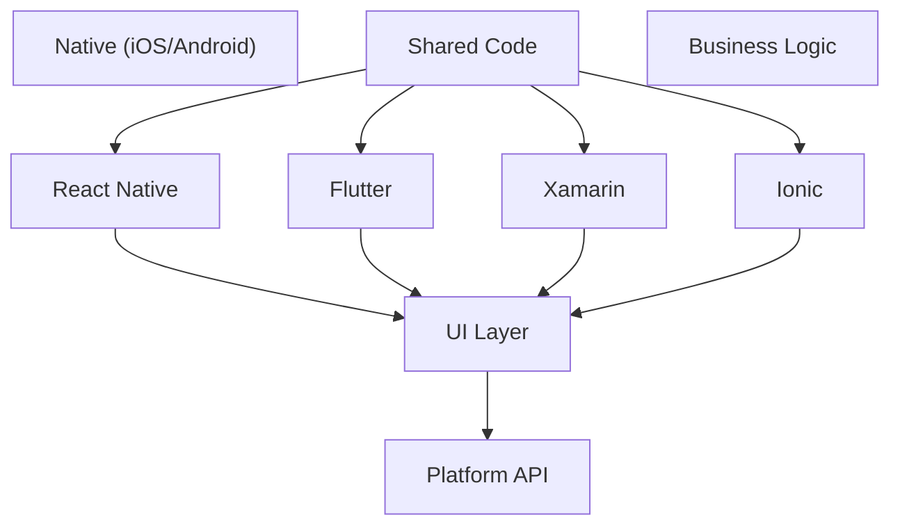

# Cross-Platform Mobile Development Guide

## Framework Comparison Diagram



## Overview

This comprehensive guide covers modern cross-platform mobile development strategies, comparing frameworks, architectural patterns, and providing production-ready implementations for React Native, Flutter, Xamarin, and other solutions.

## Framework Comparison Matrix

### Feature Comparison

```typescript
interface FrameworkComparison {
  framework: string;
  language: string;
  performance: PerformanceRating;
  developmentSpeed: number; // 1-10
  codeSharing: number; // Percentage
  nativeFeatures: AccessLevel;
  communitySupport: SupportLevel;
  learningCurve: DifficultyLevel;
}

const frameworkComparison: FrameworkComparison[] = [
  {
    framework: 'React Native',
    language: 'JavaScript/TypeScript',
    performance: 'Good',
    developmentSpeed: 8,
    codeSharing: 85,
    nativeFeatures: 'High',
    communitySupport: 'Excellent',
    learningCurve: 'Medium'
  },
  {
    framework: 'Flutter',
    language: 'Dart',
    performance: 'Excellent',
    developmentSpeed: 9,
    codeSharing: 95,
    nativeFeatures: 'High',
    communitySupport: 'Very Good',
    learningCurve: 'Medium-High'
  },
  {
    framework: 'Xamarin',
    language: 'C#',
    performance: 'Very Good',
    developmentSpeed: 7,
    codeSharing: 75,
    nativeFeatures: 'Excellent',
    communitySupport: 'Good',
    learningCurve: 'High'
  },
  {
    framework: 'Ionic',
    language: 'JavaScript/TypeScript',
    performance: 'Fair',
    developmentSpeed: 9,
    codeSharing: 90,
    nativeFeatures: 'Medium',
    communitySupport: 'Good',
    learningCurve: 'Low-Medium'
  }
];
```

## React Native Implementation

### Architecture Setup

```typescript
// React Native Cross-Platform Architecture
import { Platform } from 'react-native';
import { createNativeStackNavigator } from '@react-navigation/native-stack';
import { NavigationContainer } from '@react-navigation/native';

// Platform-specific service abstraction
interface PlatformService {
  initialize(): Promise<void>;
  getDeviceInfo(): DeviceInfo;
  handleDeepLink(url: string): void;
  requestPermissions(): Promise<PermissionStatus>;
}

class IOSPlatformService implements PlatformService {
  async initialize(): Promise<void> {
    // iOS-specific initialization
    await this.setupIOSSpecificFeatures();
  }
  
  getDeviceInfo(): DeviceInfo {
    return {
      platform: 'ios',
      version: Platform.Version as string,
      model: 'iPhone', // Use react-native-device-info for actual model
    };
  }
  
  handleDeepLink(url: string): void {
    // iOS deep link handling
    console.log('iOS deep link:', url);
  }
  
  async requestPermissions(): Promise<PermissionStatus> {
    // iOS permission handling
    return 'granted';
  }
  
  private async setupIOSSpecificFeatures(): Promise<void> {
    // Setup iOS-specific features like Push Notifications, Touch ID, etc.
  }
}

class AndroidPlatformService implements PlatformService {
  async initialize(): Promise<void> {
    // Android-specific initialization
    await this.setupAndroidSpecificFeatures();
  }
  
  getDeviceInfo(): DeviceInfo {
    return {
      platform: 'android',
      version: Platform.Version.toString(),
      model: 'Android Device',
    };
  }
  
  handleDeepLink(url: string): void {
    // Android deep link handling
    console.log('Android deep link:', url);
  }
  
  async requestPermissions(): Promise<PermissionStatus> {
    // Android permission handling
    return 'granted';
  }
  
  private async setupAndroidSpecificFeatures(): Promise<void> {
    // Setup Android-specific features
  }
}

// Platform Service Factory
class PlatformServiceFactory {
  static create(): PlatformService {
    return Platform.OS === 'ios' 
      ? new IOSPlatformService()
      : new AndroidPlatformService();
  }
}

// Cross-Platform App Component
const App: React.FC = () => {
  const [platformService] = useState(() => PlatformServiceFactory.create());
  
  useEffect(() => {
    platformService.initialize();
  }, []);
  
  return (
    <NavigationContainer>
      <AppNavigator />
    </NavigationContainer>
  );
};

// Platform-specific styling
const styles = StyleSheet.create({
  container: {
    flex: 1,
    paddingTop: Platform.select({
      ios: 44, // iOS status bar height
      android: 25, // Android status bar height
    }),
  },
  button: {
    backgroundColor: Platform.select({
      ios: '#007AFF',
      android: '#2196F3',
    }),
    borderRadius: Platform.select({
      ios: 8,
      android: 4,
    }),
  },
});
```

### Cross-Platform Component Library

```typescript
// Reusable Cross-Platform Components
import React from 'react';
import { View, Text, TouchableOpacity, Platform } from 'react-native';

interface ButtonProps {
  title: string;
  onPress: () => void;
  variant?: 'primary' | 'secondary';
  disabled?: boolean;
}

export const CrossPlatformButton: React.FC<ButtonProps> = ({
  title,
  onPress,
  variant = 'primary',
  disabled = false,
}) => {
  const buttonStyle = [
    styles.button,
    styles[`button${variant.charAt(0).toUpperCase() + variant.slice(1)}`],
    disabled && styles.buttonDisabled,
  ];
  
  const textStyle = [
    styles.buttonText,
    styles[`buttonText${variant.charAt(0).toUpperCase() + variant.slice(1)}`],
    disabled && styles.buttonTextDisabled,
  ];
  
  return (
    <TouchableOpacity
      style={buttonStyle}
      onPress={onPress}
      disabled={disabled}
      activeOpacity={0.7}
    >
      <Text style={textStyle}>{title}</Text>
    </TouchableOpacity>
  );
};

// Platform-specific input handling
interface InputProps {
  placeholder: string;
  value: string;
  onChangeText: (text: string) => void;
  secureTextEntry?: boolean;
  keyboardType?: 'default' | 'email-address' | 'numeric';
}

export const CrossPlatformInput: React.FC<InputProps> = ({
  placeholder,
  value,
  onChangeText,
  secureTextEntry = false,
  keyboardType = 'default',
}) => {
  return (
    <TextInput
      style={styles.input}
      placeholder={placeholder}
      value={value}
      onChangeText={onChangeText}
      secureTextEntry={secureTextEntry}
      keyboardType={keyboardType}
      autoCapitalize="none"
      autoCorrect={false}
      placeholderTextColor={Platform.select({
        ios: '#999',
        android: '#666',
      })}
    />
  );
};

const styles = StyleSheet.create({
  button: {
    paddingHorizontal: 16,
    paddingVertical: 12,
    borderRadius: Platform.select({ ios: 8, android: 6 }),
    alignItems: 'center',
    justifyContent: 'center',
  },
  buttonPrimary: {
    backgroundColor: Platform.select({
      ios: '#007AFF',
      android: '#2196F3',
    }),
  },
  buttonSecondary: {
    backgroundColor: 'transparent',
    borderWidth: 1,
    borderColor: Platform.select({
      ios: '#007AFF',
      android: '#2196F3',
    }),
  },
  input: {
    borderWidth: 1,
    borderColor: '#ddd',
    borderRadius: Platform.select({ ios: 8, android: 4 }),
    paddingHorizontal: 12,
    paddingVertical: Platform.select({ ios: 12, android: 8 }),
    fontSize: 16,
  },
});
```

## Flutter Implementation

### Cross-Platform Architecture

```dart
// Flutter Cross-Platform Architecture
import 'package:flutter/material.dart';
import 'package:flutter/foundation.dart';

// Platform Service Abstraction
abstract class PlatformService {
  Future<void> initialize();
  DeviceInfo getDeviceInfo();
  Future<void> handleDeepLink(String url);
  Future<PermissionStatus> requestPermissions();
}

class IOSPlatformService implements PlatformService {
  @override
  Future<void> initialize() async {
    // iOS-specific initialization
    await _setupIOSFeatures();
  }
  
  @override
  DeviceInfo getDeviceInfo() {
    return DeviceInfo(
      platform: 'ios',
      version: '16.0', // Use device_info_plus for actual version
      model: 'iPhone',
    );
  }
  
  @override
  Future<void> handleDeepLink(String url) async {
    // iOS deep link handling
    debugPrint('iOS deep link: $url');
  }
  
  @override
  Future<PermissionStatus> requestPermissions() async {
    // iOS permission handling
    return PermissionStatus.granted;
  }
  
  Future<void> _setupIOSFeatures() async {
    // Setup iOS-specific features
  }
}

class AndroidPlatformService implements PlatformService {
  @override
  Future<void> initialize() async {
    // Android-specific initialization
    await _setupAndroidFeatures();
  }
  
  @override
  DeviceInfo getDeviceInfo() {
    return DeviceInfo(
      platform: 'android',
      version: '13.0',
      model: 'Android Device',
    );
  }
  
  @override
  Future<void> handleDeepLink(String url) async {
    // Android deep link handling
    debugPrint('Android deep link: $url');
  }
  
  @override
  Future<PermissionStatus> requestPermissions() async {
    // Android permission handling
    return PermissionStatus.granted;
  }
  
  Future<void> _setupAndroidFeatures() async {
    // Setup Android-specific features
  }
}

// Platform Service Factory
class PlatformServiceFactory {
  static PlatformService create() {
    switch (defaultTargetPlatform) {
      case TargetPlatform.iOS:
        return IOSPlatformService();
      case TargetPlatform.android:
        return AndroidPlatformService();
      default:
        throw UnsupportedError('Platform not supported');
    }
  }
}

// Main App
class CrossPlatformApp extends StatefulWidget {
  @override
  _CrossPlatformAppState createState() => _CrossPlatformAppState();
}

class _CrossPlatformAppState extends State<CrossPlatformApp> {
  late final PlatformService _platformService;
  
  @override
  void initState() {
    super.initState();
    _platformService = PlatformServiceFactory.create();
    _initializePlatform();
  }
  
  Future<void> _initializePlatform() async {
    await _platformService.initialize();
  }
  
  @override
  Widget build(BuildContext context) {
    return MaterialApp(
      title: 'Cross-Platform App',
      theme: _buildTheme(),
      home: HomePage(),
    );
  }
  
  ThemeData _buildTheme() {
    if (defaultTargetPlatform == TargetPlatform.iOS) {
      return ThemeData(
        primarySwatch: Colors.blue,
        fontFamily: 'SF Pro Display',
      );
    } else {
      return ThemeData(
        primarySwatch: Colors.blue,
        fontFamily: 'Roboto',
      );
    }
  }
}
```

### Cross-Platform Widget Library

```dart
// Cross-Platform Widget Library
class CrossPlatformButton extends StatelessWidget {
  final String text;
  final VoidCallback onPressed;
  final ButtonVariant variant;
  final bool enabled;
  
  const CrossPlatformButton({
    Key? key,
    required this.text,
    required this.onPressed,
    this.variant = ButtonVariant.primary,
    this.enabled = true,
  }) : super(key: key);
  
  @override
  Widget build(BuildContext context) {
    return Platform.isIOS
        ? _buildIOSButton(context)
        : _buildAndroidButton(context);
  }
  
  Widget _buildIOSButton(BuildContext context) {
    return CupertinoButton(
      color: _getButtonColor(),
      onPressed: enabled ? onPressed : null,
      child: Text(text),
    );
  }
  
  Widget _buildAndroidButton(BuildContext context) {
    return ElevatedButton(
      style: ElevatedButton.styleFrom(
        primary: _getButtonColor(),
        shape: RoundedRectangleBorder(
          borderRadius: BorderRadius.circular(4),
        ),
      ),
      onPressed: enabled ? onPressed : null,
      child: Text(text),
    );
  }
  
  Color _getButtonColor() {
    switch (variant) {
      case ButtonVariant.primary:
        return Platform.isIOS ? CupertinoColors.activeBlue : Colors.blue;
      case ButtonVariant.secondary:
        return Platform.isIOS ? CupertinoColors.systemGrey : Colors.grey;
    }
  }
}

enum ButtonVariant { primary, secondary }

// Cross-Platform Input Field
class CrossPlatformTextField extends StatelessWidget {
  final String placeholder;
  final String value;
  final ValueChanged<String> onChanged;
  final bool obscureText;
  final TextInputType keyboardType;
  
  const CrossPlatformTextField({
    Key? key,
    required this.placeholder,
    required this.value,
    required this.onChanged,
    this.obscureText = false,
    this.keyboardType = TextInputType.text,
  }) : super(key: key);
  
  @override
  Widget build(BuildContext context) {
    return Platform.isIOS
        ? _buildIOSTextField()
        : _buildAndroidTextField();
  }
  
  Widget _buildIOSTextField() {
    return CupertinoTextField(
      placeholder: placeholder,
      controller: TextEditingController(text: value),
      onChanged: onChanged,
      obscureText: obscureText,
      keyboardType: keyboardType,
      padding: EdgeInsets.all(12),
    );
  }
  
  Widget _buildAndroidTextField() {
    return TextField(
      controller: TextEditingController(text: value),
      onChanged: onChanged,
      obscureText: obscureText,
      keyboardType: keyboardType,
      decoration: InputDecoration(
        hintText: placeholder,
        border: OutlineInputBorder(),
        contentPadding: EdgeInsets.all(12),
      ),
    );
  }
}
```

## Xamarin Implementation

### Cross-Platform Architecture

```csharp
// Xamarin Cross-Platform Architecture
using System;
using System.Threading.Tasks;
using Xamarin.Forms;

// Platform Service Interface
public interface IPlatformService
{
    Task InitializeAsync();
    DeviceInfo GetDeviceInfo();
    Task HandleDeepLinkAsync(string url);
    Task<PermissionStatus> RequestPermissionsAsync();
}

// iOS Implementation
public class IOSPlatformService : IPlatformService
{
    public async Task InitializeAsync()
    {
        // iOS-specific initialization
        await SetupIOSFeaturesAsync();
    }
    
    public DeviceInfo GetDeviceInfo()
    {
        return new DeviceInfo
        {
            Platform = "iOS",
            Version = UIKit.UIDevice.CurrentDevice.SystemVersion,
            Model = UIKit.UIDevice.CurrentDevice.Model
        };
    }
    
    public async Task HandleDeepLinkAsync(string url)
    {
        // iOS deep link handling
        System.Diagnostics.Debug.WriteLine($"iOS deep link: {url}");
        await Task.CompletedTask;
    }
    
    public async Task<PermissionStatus> RequestPermissionsAsync()
    {
        // iOS permission handling
        return await Task.FromResult(PermissionStatus.Granted);
    }
    
    private async Task SetupIOSFeaturesAsync()
    {
        // Setup iOS-specific features
        await Task.CompletedTask;
    }
}

// Android Implementation
public class AndroidPlatformService : IPlatformService
{
    public async Task InitializeAsync()
    {
        // Android-specific initialization
        await SetupAndroidFeaturesAsync();
    }
    
    public DeviceInfo GetDeviceInfo()
    {
        return new DeviceInfo
        {
            Platform = "Android",
            Version = Android.OS.Build.VERSION.Release,
            Model = Android.OS.Build.Model
        };
    }
    
    public async Task HandleDeepLinkAsync(string url)
    {
        // Android deep link handling
        System.Diagnostics.Debug.WriteLine($"Android deep link: {url}");
        await Task.CompletedTask;
    }
    
    public async Task<PermissionStatus> RequestPermissionsAsync()
    {
        // Android permission handling
        return await Task.FromResult(PermissionStatus.Granted);
    }
    
    private async Task SetupAndroidFeaturesAsync()
    {
        // Setup Android-specific features
        await Task.CompletedTask;
    }
}

// Dependency Injection Setup
public static class ServiceContainer
{
    public static void RegisterServices()
    {
        DependencyService.Register<IPlatformService, IOSPlatformService>();
        // Register other services
    }
}

// Main Application
public partial class App : Application
{
    public App()
    {
        InitializeComponent();
        ServiceContainer.RegisterServices();
        MainPage = new AppShell();
    }
    
    protected override async void OnStart()
    {
        var platformService = DependencyService.Get<IPlatformService>();
        await platformService.InitializeAsync();
    }
}
```

### Cross-Platform UI Components

```csharp
// Cross-Platform Button Component
public class CrossPlatformButton : ContentView
{
    public static readonly BindableProperty TextProperty = 
        BindableProperty.Create(nameof(Text), typeof(string), typeof(CrossPlatformButton));
    
    public static readonly BindableProperty CommandProperty = 
        BindableProperty.Create(nameof(Command), typeof(ICommand), typeof(CrossPlatformButton));
    
    public string Text
    {
        get => (string)GetValue(TextProperty);
        set => SetValue(TextProperty, value);
    }
    
    public ICommand Command
    {
        get => (ICommand)GetValue(CommandProperty);
        set => SetValue(CommandProperty, value);
    }
    
    public CrossPlatformButton()
    {
        CreatePlatformSpecificButton();
    }
    
    private void CreatePlatformSpecificButton()
    {
        Button button;
        
        if (Device.RuntimePlatform == Device.iOS)
        {
            button = new Button
            {
                BackgroundColor = Color.FromHex("#007AFF"),
                TextColor = Color.White,
                CornerRadius = 8,
                FontFamily = "SF Pro Display"
            };
        }
        else
        {
            button = new Button
            {
                BackgroundColor = Color.FromHex("#2196F3"),
                TextColor = Color.White,
                CornerRadius = 4,
                FontFamily = "Roboto"
            };
        }
        
        button.SetBinding(Button.TextProperty, nameof(Text));
        button.SetBinding(Button.CommandProperty, nameof(Command));
        
        Content = button;
    }
}

// Cross-Platform Entry Field
public class CrossPlatformEntry : ContentView
{
    public static readonly BindableProperty PlaceholderProperty = 
        BindableProperty.Create(nameof(Placeholder), typeof(string), typeof(CrossPlatformEntry));
    
    public static readonly BindableProperty TextProperty = 
        BindableProperty.Create(nameof(Text), typeof(string), typeof(CrossPlatformEntry));
    
    public string Placeholder
    {
        get => (string)GetValue(PlaceholderProperty);
        set => SetValue(PlaceholderProperty, value);
    }
    
    public string Text
    {
        get => (string)GetValue(TextProperty);
        set => SetValue(TextProperty, value);
    }
    
    public CrossPlatformEntry()
    {
        CreatePlatformSpecificEntry();
    }
    
    private void CreatePlatformSpecificEntry()
    {
        Entry entry;
        
        if (Device.RuntimePlatform == Device.iOS)
        {
            entry = new Entry
            {
                BackgroundColor = Color.White,
                TextColor = Color.Black,
                FontFamily = "SF Pro Display",
                HeightRequest = 44
            };
        }
        else
        {
            entry = new Entry
            {
                BackgroundColor = Color.White,
                TextColor = Color.Black,
                FontFamily = "Roboto",
                HeightRequest = 40
            };
        }
        
        entry.SetBinding(Entry.PlaceholderProperty, nameof(Placeholder));
        entry.SetBinding(Entry.TextProperty, nameof(Text));
        
        Content = entry;
    }
}
```

## Cross-Platform Development Best Practices

### Code Sharing Strategies

```typescript
// Shared Business Logic Layer
interface UserRepository {
  getUsers(): Promise<User[]>;
  createUser(user: CreateUserRequest): Promise<User>;
  updateUser(id: string, user: UpdateUserRequest): Promise<User>;
  deleteUser(id: string): Promise<void>;
}

class ApiUserRepository implements UserRepository {
  constructor(private apiClient: ApiClient) {}
  
  async getUsers(): Promise<User[]> {
    const response = await this.apiClient.get<User[]>('/users');
    return response.data;
  }
  
  async createUser(user: CreateUserRequest): Promise<User> {
    const response = await this.apiClient.post<User>('/users', user);
    return response.data;
  }
  
  async updateUser(id: string, user: UpdateUserRequest): Promise<User> {
    const response = await this.apiClient.put<User>(`/users/${id}`, user);
    return response.data;
  }
  
  async deleteUser(id: string): Promise<void> {
    await this.apiClient.delete(`/users/${id}`);
  }
}

// Platform-specific implementations
class IOSApiClient implements ApiClient {
  async get<T>(url: string): Promise<ApiResponse<T>> {
    // iOS-specific HTTP implementation
    // Could use native iOS networking for optimal performance
    return fetch(url).then(response => response.json());
  }
  
  async post<T>(url: string, data: any): Promise<ApiResponse<T>> {
    // iOS-specific POST implementation
    return fetch(url, { method: 'POST', body: JSON.stringify(data) })
      .then(response => response.json());
  }
}

class AndroidApiClient implements ApiClient {
  async get<T>(url: string): Promise<ApiResponse<T>> {
    // Android-specific HTTP implementation
    return fetch(url).then(response => response.json());
  }
  
  async post<T>(url: string, data: any): Promise<ApiResponse<T>> {
    // Android-specific POST implementation
    return fetch(url, { method: 'POST', body: JSON.stringify(data) })
      .then(response => response.json());
  }
}
```

### Performance Optimization for Cross-Platform

```typescript
// Cross-Platform Performance Optimizer
class CrossPlatformPerformanceOptimizer {
  private platformSpecificOptimizations: Map<string, OptimizationStrategy> = new Map();
  
  constructor() {
    this.setupPlatformOptimizations();
  }
  
  private setupPlatformOptimizations(): void {
    this.platformSpecificOptimizations.set('ios', new IOSOptimizationStrategy());
    this.platformSpecificOptimizations.set('android', new AndroidOptimizationStrategy());
    this.platformSpecificOptimizations.set('web', new WebOptimizationStrategy());
  }
  
  optimizeForPlatform(platform: string): void {
    const strategy = this.platformSpecificOptimizations.get(platform);
    if (strategy) {
      strategy.optimize();
    }
  }
}

interface OptimizationStrategy {
  optimize(): void;
}

class IOSOptimizationStrategy implements OptimizationStrategy {
  optimize(): void {
    // iOS-specific optimizations
    this.enableMetalRendering();
    this.optimizeMemoryUsage();
    this.setupBackgroundTaskOptimization();
  }
  
  private enableMetalRendering(): void {
    // Enable Metal API for better graphics performance
  }
  
  private optimizeMemoryUsage(): void {
    // Implement iOS-specific memory optimization
  }
  
  private setupBackgroundTaskOptimization(): void {
    // Optimize background tasks for iOS
  }
}

class AndroidOptimizationStrategy implements OptimizationStrategy {
  optimize(): void {
    // Android-specific optimizations
    this.enableVulkanAPI();
    this.optimizeForDoze();
    this.setupProguardOptimization();
  }
  
  private enableVulkanAPI(): void {
    // Enable Vulkan API for better graphics performance
  }
  
  private optimizeForDoze(): void {
    // Optimize for Android Doze mode
  }
  
  private setupProguardOptimization(): void {
    // Setup ProGuard for code optimization
  }
}
```

### Testing Cross-Platform Applications

```typescript
// Cross-Platform Testing Framework
class CrossPlatformTestRunner {
  private testSuites: Map<string, TestSuite> = new Map();
  
  constructor() {
    this.setupTestSuites();
  }
  
  private setupTestSuites(): void {
    this.testSuites.set('unit', new UnitTestSuite());
    this.testSuites.set('integration', new IntegrationTestSuite());
    this.testSuites.set('e2e', new E2ETestSuite());
    this.testSuites.set('performance', new PerformanceTestSuite());
  }
  
  async runAllTests(platforms: string[]): Promise<TestResults> {
    const results: TestResults = {
      platforms: [],
      overallStatus: 'passed',
      summary: {
        total: 0,
        passed: 0,
        failed: 0,
      },
    };
    
    for (const platform of platforms) {
      const platformResults = await this.runTestsForPlatform(platform);
      results.platforms.push(platformResults);
      
      results.summary.total += platformResults.total;
      results.summary.passed += platformResults.passed;
      results.summary.failed += platformResults.failed;
    }
    
    results.overallStatus = results.summary.failed === 0 ? 'passed' : 'failed';
    
    return results;
  }
  
  private async runTestsForPlatform(platform: string): Promise<PlatformTestResults> {
    const results: PlatformTestResults = {
      platform,
      total: 0,
      passed: 0,
      failed: 0,
      tests: [],
    };
    
    for (const [suiteName, suite] of this.testSuites) {
      const suiteResults = await suite.runForPlatform(platform);
      results.tests.push({
        suite: suiteName,
        results: suiteResults,
      });
      
      results.total += suiteResults.length;
      results.passed += suiteResults.filter(r => r.status === 'passed').length;
      results.failed += suiteResults.filter(r => r.status === 'failed').length;
    }
    
    return results;
  }
}

// Platform-specific test configurations
interface TestConfiguration {
  platform: string;
  deviceConfigurations: DeviceConfiguration[];
  testEnvironment: TestEnvironment;
  testData: TestData;
}

const testConfigurations: TestConfiguration[] = [
  {
    platform: 'ios',
    deviceConfigurations: [
      { device: 'iPhone 12', os: '15.0', simulator: true },
      { device: 'iPhone 13', os: '16.0', simulator: true },
      { device: 'iPad Air', os: '15.0', simulator: true },
    ],
    testEnvironment: 'staging',
    testData: 'ios-test-data.json',
  },
  {
    platform: 'android',
    deviceConfigurations: [
      { device: 'Pixel 5', os: '12.0', emulator: true },
      { device: 'Samsung Galaxy S21', os: '13.0', emulator: true },
      { device: 'OnePlus 9', os: '12.0', emulator: true },
    ],
    testEnvironment: 'staging',
    testData: 'android-test-data.json',
  },
];
```

## Framework Selection Guide

### Decision Matrix

```typescript
interface ProjectRequirements {
  performance: 'critical' | 'important' | 'moderate';
  developmentTimeline: 'tight' | 'moderate' | 'flexible';
  teamExpertise: string[];
  nativeFeatures: 'extensive' | 'moderate' | 'minimal';
  budget: 'high' | 'medium' | 'low';
  maintenance: 'long-term' | 'medium-term' | 'short-term';
}

class FrameworkSelector {
  selectFramework(requirements: ProjectRequirements): FrameworkRecommendation {
    const scores = new Map<string, number>();
    
    // Score each framework based on requirements
    scores.set('react-native', this.scoreReactNative(requirements));
    scores.set('flutter', this.scoreFlutter(requirements));
    scores.set('xamarin', this.scoreXamarin(requirements));
    scores.set('ionic', this.scoreIonic(requirements));
    scores.set('native', this.scoreNative(requirements));
    
    // Find the highest scoring framework
    const bestFramework = Array.from(scores.entries())
      .sort((a, b) => b[1] - a[1])[0];
    
    return {
      recommended: bestFramework[0],
      score: bestFramework[1],
      reasoning: this.generateReasoning(bestFramework[0], requirements),
      alternatives: this.getAlternatives(scores, bestFramework[0]),
    };
  }
  
  private scoreReactNative(req: ProjectRequirements): number {
    let score = 0;
    
    // Performance scoring
    if (req.performance === 'moderate') score += 30;
    if (req.performance === 'important') score += 20;
    if (req.performance === 'critical') score += 10;
    
    // Development timeline
    if (req.developmentTimeline === 'tight') score += 25;
    if (req.developmentTimeline === 'moderate') score += 20;
    
    // Team expertise
    if (req.teamExpertise.includes('javascript') || req.teamExpertise.includes('typescript')) {
      score += 20;
    }
    if (req.teamExpertise.includes('react')) score += 15;
    
    // Native features
    if (req.nativeFeatures === 'extensive') score += 15;
    if (req.nativeFeatures === 'moderate') score += 20;
    if (req.nativeFeatures === 'minimal') score += 25;
    
    return score;
  }
  
  private scoreFlutter(req: ProjectRequirements): number {
    let score = 0;
    
    // Performance scoring
    if (req.performance === 'critical') score += 30;
    if (req.performance === 'important') score += 25;
    if (req.performance === 'moderate') score += 20;
    
    // Development timeline
    if (req.developmentTimeline === 'tight') score += 20;
    if (req.developmentTimeline === 'moderate') score += 25;
    
    // Team expertise
    if (req.teamExpertise.includes('dart')) score += 25;
    if (req.teamExpertise.includes('mobile')) score += 15;
    
    return score;
  }
}
```

Bu kapsamlı cross-platform development guide'ı şunları içermektedir:

1. **Framework Karşılaştırması** - Detaylı feature matrix
2. **Platform-Specific Implementations** - React Native, Flutter, Xamarin örnekleri
3. **Architecture Patterns** - Cross-platform mimarisi
4. **Code Sharing Strategies** - Kod paylaşım stratejileri
5. **Performance Optimization** - Platform-specific optimizasyonlar
6. **Testing Strategies** - Cross-platform test yaklaşımları
7. **Framework Selection Guide** - Proje gereksinimlerine göre framework seçimi

Bu dokümantasyon production-ready code examples ve best practices içermektedir.
