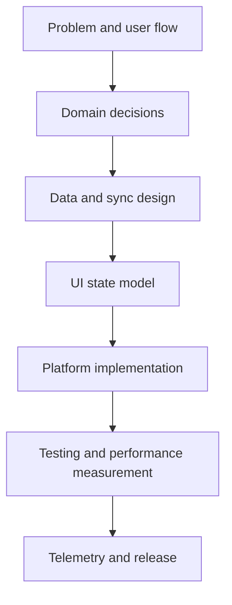

# Getting Started with Mobile System Design

This guide explains how to study the mobile system design documentation and what each phase should help you decide. The goal is not to memorize a technology list; the goal is to improve the quality of decisions you make when designing a real mobile application.

## Quick Start

Start a mobile system design with these questions:

- What critical job must the user complete without interruption?
- How should the app behave offline or on a weak network?
- Which data belongs locally, and which data must always come from the server?
- What is the performance target: startup time, smooth scrolling, battery, memory?
- Which security boundaries are mandatory: tokens, biometrics, secure storage, certificate pinning?
- Which telemetry is required to understand production failures?

Choosing a framework before answering these questions often creates the wrong priorities. System behavior comes first, then architecture, then platform detail.

## Learning Path

### 1. Establish the core architecture

Start with [Architectural Patterns](/en/mobile/architecture/patterns), [State Management Strategies](/en/mobile/architecture/state-management), and [Clean Architecture](/en/mobile/architecture/clean-architecture). Together, these clarify the boundaries between UI state, domain logic, and data access.

You should be able to decide:

- Will the app use feature-first or layer-first organization?
- Will ViewModel, Bloc, Presenter, or reducer own state transitions?
- Will domain models be separated from API models?
- Is a use case layer truly needed, or is a repository enough?

### 2. Design data and offline behavior

Then move to [Local Database Options](/en/mobile/storage/local-databases), [Offline-First Design](/en/mobile/storage/offline-first), [Data Synchronization Strategies](/en/mobile/storage/sync-strategies), and [Conflict Resolution](/en/mobile/storage/conflict-resolution).

The output of this stage is a data policy:

- Where is the single source of truth?
- When does sync run?
- Does the user or the system resolve conflicts?
- When is cached data considered stale?
- What does the app do when migration fails?

### 3. Treat networking, performance, and security together

Do not treat networking as a simple API service. [Network Resilience](/en/mobile/networking/resilience), [Pagination](/en/mobile/networking/pagination), [Data Compression](/en/mobile/networking/compression), [Mobile Network Security](/en/mobile/networking/security), and [API Security](/en/mobile/security/api-security) should be designed together.

At this stage, retry, timeout, pagination, token refresh, rate limits, request signing, and cache behavior are considered in the same flow.

### 4. Add production observability

Finally, use [Crash Reporting](/en/mobile/observability/crash-reporting), [Performance Analytics](/en/mobile/observability/performance-analytics), [User Behavior Tracking](/en/mobile/observability/user-tracking), [Remote Configuration](/en/mobile/observability/remote-config), and [A/B Testing](/en/mobile/observability/ab-testing).

Behavior that is not measured in production remains an assumption. At minimum, track startup time, screen render time, API error rate, crash-free sessions, battery impact, and critical funnel metrics.

## Platform-Specific Quick Starts

### Android

Practical Android starting point:

- Use Kotlin and Jetpack Compose with feature-first packages.
- Make UI state a single source through ViewModel + StateFlow.
- Use Room as the offline-first local source.
- Define timeout, retry, and interceptor behavior in Retrofit/OkHttp.
- Schedule background sync with WorkManager.
- Measure performance with Baseline Profile, Macrobenchmark, and Android Studio Profiler.

### iOS

Practical iOS starting point:

- Keep state models visible at the SwiftUI boundary.
- Manage screen state with ObservableObject or the newer Observation model.
- Define concurrency boundaries with URLSession, async/await, and actors.
- Choose Core Data, SwiftData, or SQLite based on data lifetime.
- Design BackgroundTasks and push notification behavior within OS limits.
- Measure launch time, memory graph, and energy impact with Instruments.

### Flutter

Practical Flutter starting point:

- Use feature-first folders with `presentation`, `domain`, and `data` boundaries.
- Choose Riverpod, Bloc, or ValueNotifier based on team familiarity and test needs.
- Move CPU-heavy work that needs isolates away from the UI thread.
- Choose Drift, Isar, Hive, or SQLite based on query requirements.
- Measure frame chart, memory, and rebuild behavior with DevTools.
- Keep platform channel boundaries narrow; do not bind the domain to platform code.

### React Native

Practical React Native starting point:

- Use TypeScript strict mode and feature-first modules.
- Choose a server-state approach with explicit cache policy; do not put every remote value in global state.
- Identify native module needs early.
- Monitor performance with Hermes, Flipper, React DevTools, and native profilers.
- Test virtualization, image caching, and bridge cost early for large lists.

## Development Workflow

Recommended workflow:

- Write the user flow and failure states.
- Draw domain entity, use case, and repository boundaries.
- Define remote, local, and cache behavior.
- Design UI state with loading, empty, partial, success, and error states.
- Implement platform code with minimal framework coupling.
- Separate unit, integration, and smoke test levels.
- Connect performance, crash, and analytics measurements before release.

## Performance Benchmarks

Every mobile app needs different targets, but these are useful starting thresholds:

| Area | Starting target | Measurement tool |
| --- | --- | --- |
| Cold start | Under 2 seconds | Android Macrobenchmark, Xcode Instruments |
| Scroll | 60 FPS target | Frame chart, Core Animation |
| API timeout | 5-10 seconds | Network logs, telemetry |
| Crash-free sessions | 99.5%+ | Crash reporting |
| Offline action | Queued and retryable | Local DB + sync logs |
| Memory | Bounded by device class | Memory profiler |

These values are not universal rules; they are initial alarm lines. For critical products, calibrate targets with real user devices and network conditions.

## First Design Document Template

A short design document for a new mobile feature should include:

- User problem and success criteria
- Main screens and state states
- Domain entity and use case list
- Remote API, local storage, and cache behavior
- Offline, retry, and conflict resolution decision
- Security and privacy impact
- Performance and battery risk
- Telemetry and release checkpoints
