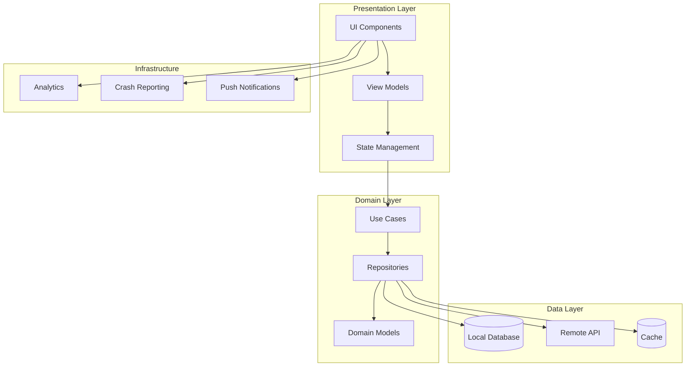
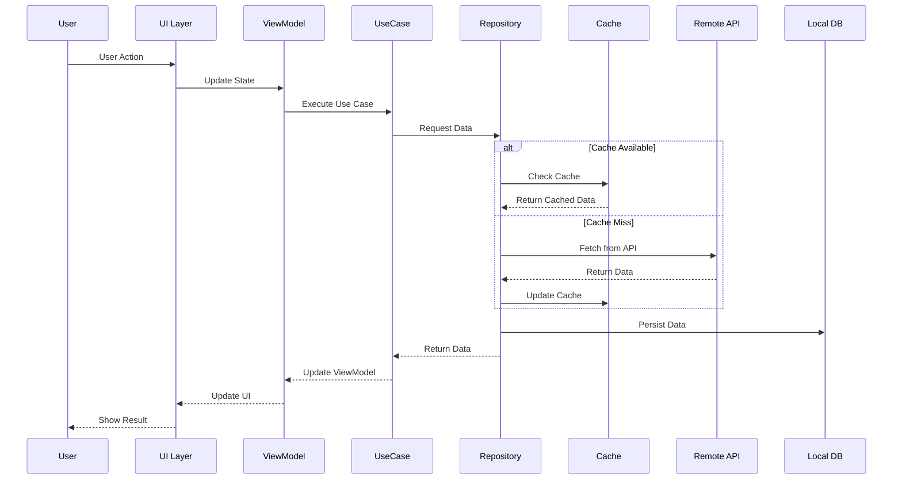

# Mobile System Design

## Mobile Application Architecture

## Data Flow Diagram

Modern mobile application development is a much broader system design discipline than simply writing code. Today's mobile applications serving millions of users require complex architectural decisions, performance optimizations, and comprehensive security strategies. This documentation provides an in-depth examination of all aspects of enterprise-level mobile system design.

## Comprehensive Chapter List

### Chapter 1: Application Architectures & State Management
Detailed analysis of architectural patterns, state management solutions, and component-based designs in modern mobile applications.
- [Architectural Patterns (MVP, MVVM, Clean Architecture)](/en/mobile/architecture/patterns)
- [State Management Strategies](/en/mobile/architecture/state-management)
- [Component-Based Design](/en/mobile/architecture/component-based)
- [Dependency Injection and IoC](/en/mobile/architecture/dependency-injection)
- [Modular Architecture Structures](/en/mobile/architecture/modular-architecture)

### Chapter 2: Data Storage & Synchronization
Local data storage solutions, data synchronization, and implementation of offline-first strategies.
- [Local Database Options](/en/mobile/storage/local-databases)
- [Data Synchronization Strategies](/en/mobile/storage/sync-strategies)
- [Conflict Resolution Mechanisms](/en/mobile/storage/conflict-resolution)
- [Offline-First Design](/en/mobile/storage/offline-first)
- [Data Migration and Versioning](/en/mobile/storage/data-migration)

### Chapter 3: Caching & Memory Management
Caching strategies and memory optimization techniques that enhance application performance.
- [Multi-Level Caching Strategies](/en/mobile/caching/multi-level)
- [Image and Asset Caching](/en/mobile/caching/asset-caching)
- [Memory Management & Leak Prevention](/en/mobile/caching/memory-management)
- [Disk Cache Optimization](/en/mobile/caching/disk-cache)
- [Cache Invalidation Patterns](/en/mobile/caching/invalidation)

### Chapter 4: Network Layers & Data Transfer
Comprehensive guide to network layers, API integration, and data transfer optimizations.
- [Request Batching & Debouncing](/en/mobile/networking/batching-debouncing)
- [Pagination & Infinite Scroll](/en/mobile/networking/pagination)
- [Data Compression Techniques](/en/mobile/networking/compression)
- [Network Resilience & Retry Patterns](/en/mobile/networking/resilience)
- [Mobile Network Security](/en/mobile/networking/security)
- [Network Monitoring & Analytics](/en/mobile/networking/monitoring)
- [Testing & QA Strategies](/en/mobile/networking/testing-qa)
- [Advanced Networking Patterns](/en/mobile/networking/advanced-patterns)
- [Mobile-Specific Considerations](/en/mobile/networking/mobile-considerations)
- [Future Trends & Emerging Technologies](/en/mobile/networking/future-trends)

### Chapter 5: UI/UX Performance Optimization
Techniques and best practices for maximizing user interface performance.
- [Rendering Optimization](/en/mobile/ui-performance/rendering)
- [Layout Performance](/en/mobile/ui-performance/layout)
- [List and Scroll Performance](/en/mobile/ui-performance/list-performance)
- [60 FPS Guarantee](/en/mobile/ui-performance/fps-optimization)
- [Memory Efficient UI](/en/mobile/ui-performance/memory-efficient)

### Chapter 6: Animation & Graphics Processing
Modern declarative UI frameworks, GPU accelerated graphics, and frame rate optimizations.
- [Declarative Animations](/en/mobile/graphics/declarative-animations)
- [Frame Rate Management](/en/mobile/graphics/frame-rate-management)
- [Hardware Acceleration](/en/mobile/graphics/hardware-acceleration)
- [Canvas & Metal/Native UI](/en/mobile/graphics/canvas-metal-native)

### Chapter 7: Security & Access Control
Comprehensive mobile security strategies and authentication/authorization systems.
- [Authentication Patterns](/en/mobile/security/authentication)
- [Secure Storage Implementations](/en/mobile/security/secure-storage)
- [API Security & Token Management](/en/mobile/security/api-security)
- [Biometric Authentication](/en/mobile/security/biometric-auth)
- [Certificate Pinning](/en/mobile/security/certificate-pinning)

### Chapter 8: Background Processing
Background processing, push notification systems, and real-time communication.
- [Background Task Management](/en/mobile/background/task-management)
- [Push Notification Architecture](/en/mobile/background/push-notifications)
- [Real-time Communication](/en/mobile/background/real-time)
- [Location Services](/en/mobile/background/location-services)
- [Battery Optimization](/en/mobile/background/battery-optimization)

### Chapter 9: Telemetry & Observability
Setting up application performance monitoring, error tracking, and analytics systems.
- [Crash Reporting Systems](/en/mobile/observability/crash-reporting)
- [Performance Analytics](/en/mobile/observability/performance-analytics)
- [User Behavior Tracking](/en/mobile/observability/user-tracking)
- [Remote Configuration](/en/mobile/observability/remote-config)
- [A/B Testing Infrastructure](/en/mobile/observability/ab-testing)

### Chapter 10: Version Management & Updates
App Store deployment, versioning strategies, and continuous delivery pipelines.
- [Release Management](/en/mobile/versioning/release-management)
- [Feature Flags](/en/mobile/versioning/feature-flags)
- [Hot Updates & Code Push](/en/mobile/versioning/hot-updates)
- [Backward Compatibility](/en/mobile/versioning/backward-compatibility)
- [Deployment Strategies](/en/mobile/versioning/deployment-strategies)

## Platform Ecosystem

### Native Development
- **iOS**: Swift, Objective-C, SwiftUI, UIKit, Core Data, Metal
- **Android**: Kotlin, Java, Jetpack Compose, Android SDK, Room, Vulkan

### Cross-Platform Solutions
- **React Native**: Native performance with JavaScript/TypeScript foundation
- **Flutter**: Single codebase approach with Dart language and custom rendering engine
- **Xamarin**: Native development with .NET ecosystem and shared business logic

### Hybrid Approaches
- **Ionic**: Mobile development with web technologies and Capacitor
- **Cordova/PhoneGap**: HTML5-based applications with native plugin access

### Framework Selection
For guidance on choosing the right framework for your project, see our [Cross-Platform Development Guide](/en/mobile/cross-platform-development#framework-selection-guide) which includes:
- Decision matrices based on project requirements
- Performance comparisons and benchmarks
- Team expertise considerations
- Long-term maintenance factors

## Additional Resources

### Chapter 11: Cross-Platform Development
Comprehensive guide to modern cross-platform mobile development strategies and framework comparisons.
- [Cross-Platform Development Guide](/en/mobile/cross-platform-development)
- [Framework Comparison & Selection](/en/mobile/cross-platform-development#framework-selection-guide)
- [React Native Implementation](/en/mobile/cross-platform-development#react-native-implementation)
- [Flutter Implementation](/en/mobile/cross-platform-development#flutter-implementation)
- [Xamarin Implementation](/en/mobile/cross-platform-development#xamarin-implementation)

### Chapter 12: Performance Testing & Benchmarking
Advanced performance testing strategies, monitoring tools, and benchmarking techniques.
- [Performance Testing Guide](/en/mobile/performance-testing)
- [Platform-Specific Testing Tools](/en/mobile/performance-testing#platform-specific-testing-tools)
- [Automated Performance Testing](/en/mobile/performance-testing#automated-performance-testing-pipeline)
- [Production Monitoring](/en/mobile/performance-testing#production-performance-monitoring)
- [Load Testing for Mobile](/en/mobile/performance-testing#load-testing-for-mobile-apps)

### Quick Start Guide
Get started with mobile system design using our comprehensive getting started guide.
- [Getting Started Guide](/en/mobile/getting-started)
- [Learning Paths](/en/mobile/getting-started#learning-path)
- [Platform-Specific Quick Starts](/en/mobile/getting-started#platform-specific-quick-starts)
- [Development Workflow](/en/mobile/getting-started#development-workflow)
- [Performance Benchmarks](/en/mobile/getting-started#performance-benchmarks)

