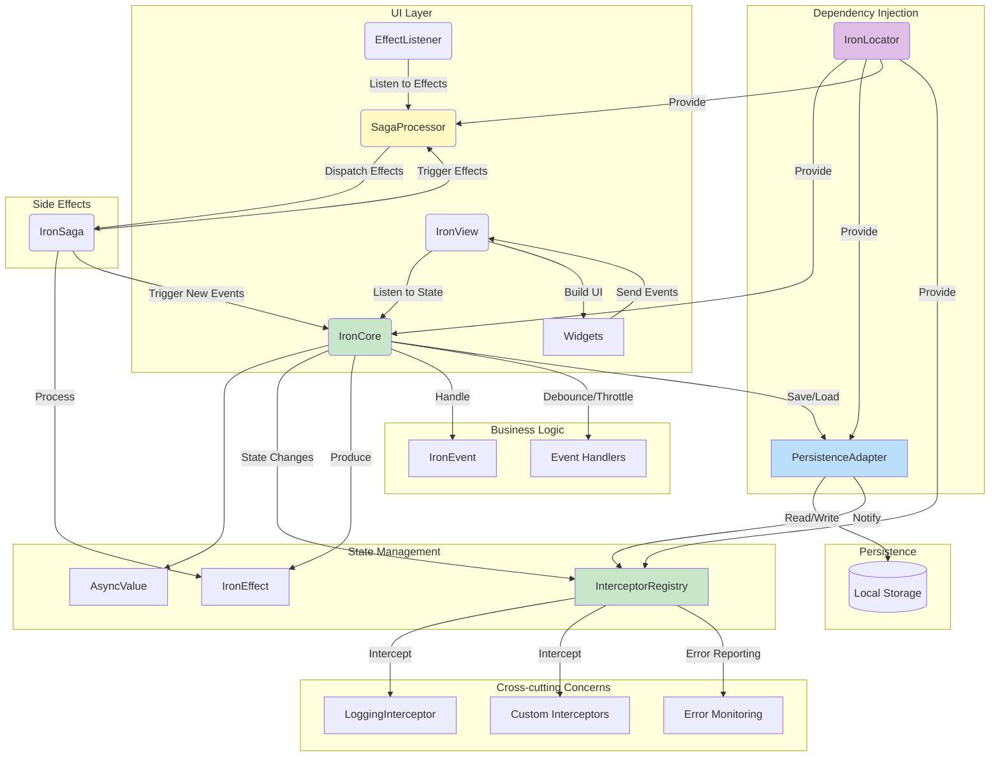

# Iron Architecture - Flutter State Management

Iron is a robust, zero-dependency Flutter architecture package that provides a solid foundation for building scalable, maintainable, and observable Flutter applications. This document explores Iron's architecture patterns, components, and how it fits into modern Flutter application development.

## Overview

Iron is designed with the philosophy of providing a flexible yet disciplined framework where developers maintain full control while benefiting from proven architectural patterns. The package emphasizes:

- **Zero external dependencies** for maximum control
- **Built-in observability** through interceptors
- **Performance optimization** with debouncing, throttling, and isolate-based computing
- **State persistence** capabilities
- **Clean separation of concerns** through well-defined components

## Core Architecture Components

### 1. IronCore - The Business Logic Layer

The `IronCore` serves as the heart of the architecture, encapsulating business logic and state management.

```dart
class CounterCore extends IronCore<CounterEvent, CounterState> {
  CounterCore() : super(const CounterState(0)) {
    on<IncrementEvent>((event) {
      updateState(AsyncData(CounterState(state.value.count + 1)));
    });
  }
}
```

**Key Features:**
- Generic type safety with event and state types
- Built-in async state handling with `AsyncValue`
- Event-driven architecture
- Automatic state notifications to UI

### 2. Event System

Events represent user intentions or system triggers that modify application state.

```dart
abstract class CounterEvent extends IronEvent {}
class IncrementEvent extends CounterEvent {}
class DecrementEvent extends CounterEvent {}
```

**Benefits:**
- Clear intent expression
- Type-safe event handling
- Testable business logic
- Audit trail for debugging

### 3. State Management

States represent the current condition of your application data.

```dart
class CounterState {
  final int count;
  const CounterState(this.count);
}
```

**AsyncValue Wrapper:**
Iron wraps states in `AsyncValue` to handle loading, success, and error states uniformly:

- `AsyncLoading` - Operation in progress
- `AsyncData` - Successful state with data
- `AsyncError` - Error state with exception details

### 4. Effects System

Effects represent side effects or notifications that don't directly modify state but inform other parts of the system.

```dart
abstract class CounterEffect extends IronEffect {}
class CounterReachedMaxEffect extends CounterEffect {
  final int maxValue;
  CounterReachedMaxEffect(this.maxValue);
}
```

## Advanced Features

### 1. Interceptor System - Observability

Iron provides a powerful interceptor system for monitoring all application activities:

```dart
// Register logging interceptor for debugging
if (kDebugMode) {
  IronLocator.instance.find<InterceptorRegistry>()
    .register(LoggingInterceptor());
}
```

**Interceptor Capabilities:**
- Event tracking
- State change monitoring
- Effect observation
- Error reporting
- Performance metrics

### 2. Debouncing and Throttling

Iron includes built-in mechanisms for controlling event frequency:

```dart
class SearchCore extends IronCore<SearchEvent, SearchState> {
  SearchCore() : super(SearchInitial()) {
    // Debounce search queries to reduce API calls
    onDebounced<SearchQueryChanged>(
      _onSearch, 
      const Duration(milliseconds: 300)
    );
    
    // Throttle button clicks to prevent spam
    onThrottled<ButtonClickEvent>(
      _handleClick,
      const Duration(milliseconds: 1000)
    );
  }
}
```

### 3. Isolate-Based Computing

For CPU-intensive operations, Iron provides `computeAndUpdateState` to offload work to separate isolates:

```dart
Future<void> processLargeDataset(List<dynamic> data) async {
  await computeAndUpdateState<List<dynamic>>(_processInIsolate, data);
}

// Must be top-level or static function
static ProcessedState _processInIsolate(List<dynamic> data) {
  // Heavy computation here
  final processed = heavyProcessing(data);
  return ProcessedState(processed);
}
```

### 4. State Persistence

`PersistentIronCore` automatically saves and restores state:

```dart
class PersistentCounterCore extends PersistentIronCore<CounterEvent, CounterState> {
  PersistentCounterCore() : super(
    initialState: const CounterState(0),
    storageKey: 'counter_state',
  );
}
```

## UI Integration

### IronView Widget

The `IronView` widget connects your UI to the Iron core:

```dart
class CounterPage extends StatelessWidget {
  final CounterCore counterCore;
  
  @override
  Widget build(BuildContext context) {
    return IronView<CounterCore, CounterState>(
      core: counterCore,
      builder: (context, state) {
        return state.when(
          loading: () => CircularProgressIndicator(),
          data: (data) => Text('Count: ${data.count}'),
          error: (error, stack) => Text('Error: $error'),
        );
      },
    );
  }
}
```

### EffectListener

Handle side effects in your UI with `EffectListener`:

```dart
EffectListener<CounterCore, CounterEffect>(
  core: counterCore,
  listener: (context, effect) {
    if (effect is CounterReachedMaxEffect) {
      ScaffoldMessenger.of(context).showSnackBar(
        SnackBar(content: Text('Maximum reached: ${effect.maxValue}')),
      );
    }
  },
  child: CounterView(),
)
```

## Dependency Injection - IronLocator

Iron includes a simple but powerful dependency injection system:

```dart
// Registration
IronLocator.instance.registerSingleton(UserRepository());
IronLocator.instance.registerLazySingleton(() => AuthCore());

// Usage
final userRepo = IronLocator.instance.find<UserRepository>();
```

## Saga Pattern Support

Iron supports the Saga pattern for managing complex workflows:

```dart
class UserRegistrationSaga extends IronSaga {
  @override
  void configure() {
    on<UserRegisteredEffect>(_handleUserRegistration);
    on<EmailVerificationRequiredEffect>(_sendVerificationEmail);
  }
  
  Future<void> _handleUserRegistration(UserRegisteredEffect effect) async {
    // Complex workflow logic
    await _createUserProfile(effect.user);
    await _sendWelcomeEmail(effect.user);
    // Trigger next effect
    process(WelcomeEmailSentEffect(effect.user.id));
  }
}
```

## Architecture Benefits

### 1. Testability
- **Unit Testing**: Business logic in cores is easily testable
- **Widget Testing**: UI components can be tested in isolation
- **Integration Testing**: Full workflows can be tested end-to-end

### 2. Scalability
- **Modular Design**: Each core handles specific domain logic
- **Loose Coupling**: Components communicate through well-defined interfaces
- **Performance**: Built-in optimizations for heavy operations

### 3. Maintainability
- **Clear Separation**: Business logic, UI, and side effects are separated
- **Type Safety**: Compile-time guarantees through strong typing
- **Debugging**: Comprehensive logging and interceptor system

### 4. Developer Experience
- **Zero Dependencies**: No external package conflicts
- **Hot Reload**: Full support for Flutter's hot reload
- **DevTools**: Comprehensive debugging capabilities

## Best Practices

### 1. Core Organization
```dart
// Group related functionality in single cores
class UserCore extends IronCore<UserEvent, UserState> {
  // Handle all user-related operations
}

// Keep cores focused and small
class AuthenticationCore extends IronCore<AuthEvent, AuthState> {
  // Only authentication logic
}
```

### 2. Event Design
```dart
// Use descriptive event names
class UserProfileUpdateRequested extends UserEvent {
  final UserProfile profile;
  UserProfileUpdateRequested(this.profile);
}

// Include necessary data in events
class SearchQuerySubmitted extends SearchEvent {
  final String query;
  final SearchFilters filters;
  SearchQuerySubmitted(this.query, this.filters);
}
```

### 3. State Structure
```dart
// Make states immutable
class UserState {
  final User? user;
  final List<Notification> notifications;
  
  const UserState({
    this.user,
    this.notifications = const [],
  });
  
  // Provide copyWith for updates
  UserState copyWith({
    User? user,
    List<Notification>? notifications,
  }) {
    return UserState(
      user: user ?? this.user,
      notifications: notifications ?? this.notifications,
    );
  }
}
```

### 4. Error Handling
```dart
class UserCore extends IronCore<UserEvent, UserState> {
  Future<void> _loadUser(LoadUserEvent event) async {
    try {
      updateState(AsyncLoading());
      final user = await userRepository.getUser(event.userId);
      updateState(AsyncData(state.value.copyWith(user: user)));
    } catch (e, stackTrace) {
      updateState(AsyncError(e, stackTrace));
      // Optionally emit error effect
      process(UserLoadErrorEffect(e.toString()));
    }
  }
}
```

## Architecture Diagram



## Package Information

- **Package Name**: iron
- **Version**: 0.0.1
- **Homepage**: [GitHub Repository](https://github.com/endmr11/iron)
- **License**: MIT
- **Pub.dev**: [iron package](https://pub.dev/packages/iron)

## Topics
- Architecture
- Reactive Programming
- State Management
- Dependency Injection
- Persistence
- Flutter
- Zero Dependencies

## Conclusion

Iron provides a comprehensive, battle-tested architecture for Flutter applications that scales from simple apps to complex enterprise solutions. Its emphasis on observability, performance, and developer experience makes it an excellent choice for teams looking for a robust state management solution without external dependencies.

The architecture promotes clean code practices, maintainable codebases, and excellent developer productivity while providing the flexibility to adapt to specific project requirements.
