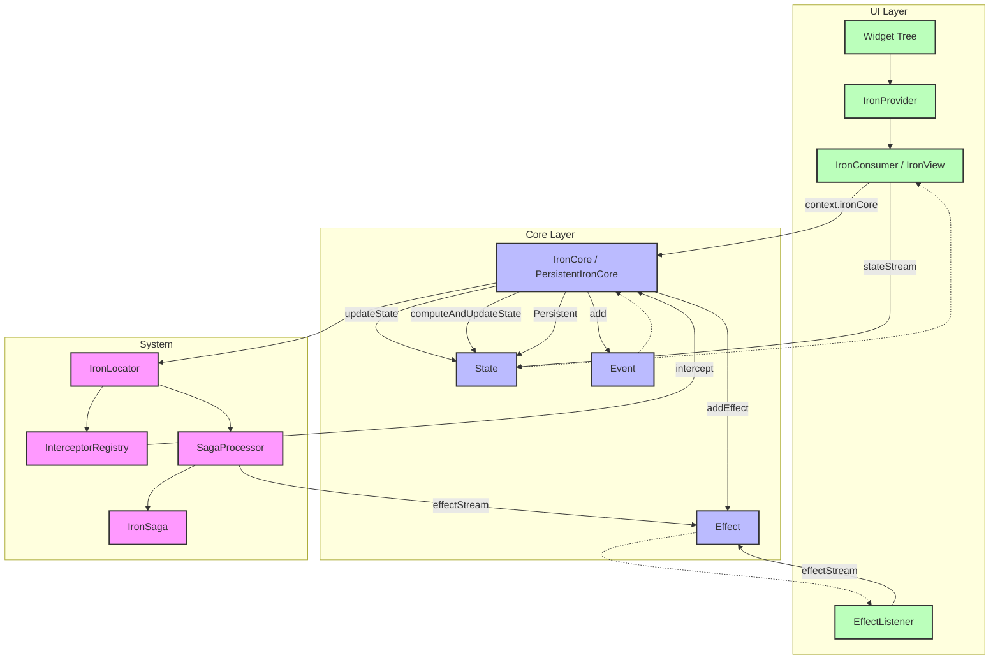

<div align="center">

# 🛡️ Iron 🛡️

**An architecture for your Flutter apps that's not just solid as iron, but also smart and observable!**

[](https://pub.dev/packages/iron)
[](https://opensource.org/licenses/MIT)

</div>

---

**Iron Core** gives you a flexible yet disciplined playground where you make the rules. Forge your code like a blacksmith, shape it, and create an unbreakable, scalable, and now **fully observable** work of art! 💪✨

## 🔥 Philosophy and Advanced Features 🔥

Here are the principles that make it special:

* **🔭 The All-Seeing Eye: Interceptor System!**
   Monitor everything happening in your app (events, state changes, effects, errors) in real-time. Turn your console into a command center with `LoggingInterceptor`. Debugging has never been this easy!

* **⏳ Master of Time: Debounce & Throttle!**
   Is the user spamming a button? Firing a request on every keystroke in a search bar? `onDebounced` and `onThrottled` let you conduct the flow of events like a maestro, eliminating redundant operations.

* **💪 The Power of the Forge: Isolate-based Computation!**
   Got heavy calculations that freeze your app? Offload them to a separate isolate with `computeAndUpdateState`. Your UI will keep flowing at 60 FPS while the iron is being forged in the background!

* **⛓️ The Chain of Independence!**
   Zero external package dependencies. You have full control of your project. If there's a place called "dependency hell," we're not even on the map.

* **💾 Unforgettable Persistence!**
   With `PersistentIronCore`, save your state to the device with a single line of code and have your app resume where it left off, even after it's closed.

* **👑 Be the Ruler of Your Own Kingdom!**
   This architecture gives you a solid foundation and the freedom to build your own palace upon it.

---

## 🧰 Installation

Add this magic line to your `pubspec.yaml` file:

```yaml
dependencies:
  iron: any_version # Check pub.dev for the latest version
```
And run `flutter pub get` in your terminal. You are now ready to forge!

---

## 🚀 Getting Started: Let's Forge Our First Iron!

Let's test our strength with a simple counter app.

```dart
// 1. Define State and Events
class CounterState { final int count; const CounterState(this.count); }
abstract class CounterEvent extends IronEvent {}
class IncrementEvent extends CounterEvent {}

// 2. Create the Core
class CounterCore extends IronCore<CounterEvent, CounterState> {
  CounterCore() : super(const CounterState(0)) {
    on<IncrementEvent>((event) {
      updateState(AsyncData(CounterState(state.value.count + 1)));
    });
  }
}

// 3. Connect the UI
class CounterPage extends StatelessWidget {
  final counterCore = CounterCore(); // In a real app, provide this with DI!

  @override
  Widget build(BuildContext context) {
    return Scaffold(
      body: IronView<CounterCore, CounterState>(
        core: counterCore,
        builder: (context, state) => Center(child: Text('Count: \\${state.count}')),
      ),
      floatingActionButton: FloatingActionButton(
        onPressed: () => counterCore.add(IncrementEvent()),
        child: Icon(Icons.add),
      ),
    );
  }
}
```
That's it! 🎉 Basic setup is complete. Now, are you ready to see the real power?

---

## 🛠️ Advanced Examples

Check out the `example/` directory for more advanced use cases, including:

*   **Complex Counter:** Demonstrates more intricate state manipulations and event handling.
*   **Saga Example:** Shows how to use `IronSaga` for managing side effects and complex asynchronous flows.
*   **Persistence Example:** Illustrates how to use `PersistentIronCore` to save and restore application state.
*   **Interceptor Usage:** Provides a practical example of implementing and registering custom interceptors.

---

## ⚔️ Advanced Forging Techniques ⚔️

#### 1. The Watchtower: Activating the LoggingInterceptor

To log every moment of your application's life, add these magic touches to your `main.dart` file:

```dart
void main() {
  // 1. Register necessary systems
  IronLocator.instance.registerSingleton(InterceptorRegistry(), global: true);
  IronLocator.instance.registerSingleton(SagaProcessor(), global: true);

  // 2. Set up the watchtower (Interceptor)!
  // We added a kDebugMode check so it only runs in debug mode.
  if (kDebugMode) {
    IronLocator.instance.find<InterceptorRegistry>()
      .register(LoggingInterceptor());
  }
  
  // 3. Register your Cores and run the app
  IronLocator.instance.registerLazySingleton(() => CounterCore());
  runApp(const MyApp());
}
```
Now you will see magical logs like this in your console:
```
[Interceptor][EVENT] Core: CounterCore, Event: IncrementEvent
[Interceptor][STATE] Core: CounterCore
  Previous: AsyncData<CounterState>
    Data: CounterState(count: 0)
  Next: AsyncData<CounterState>
    Data: CounterState(count: 1)
```

#### 2. Bending Time: A Search Bar with Debouncing

Instead of searching on every keystroke, search only after the user has stopped typing.

```dart
class SearchCore extends IronCore<SearchEvent, SearchState> {
  SearchCore() : super(SearchInitial()) {
    // This event fires only if the user doesn't type a new letter for 300ms.
    onDebounced<SearchQueryChanged>(_onSearch, const Duration(milliseconds: 300));
  }

  Future<void> _onSearch(SearchQueryChanged event) async {
    // Make the API request here!
    print("Searching for: \\${event.query}");
    // ...
  }
}
```

#### 3. Feel the Power: Offloading Heavy Work with `compute`

For tasks like parsing a complex JSON file or processing an image:

```dart
// Inside a Core...
Future<void> processHeavyJson(String jsonString) async {
  // This operation runs on a separate isolate, WITHOUT blocking the UI thread.
  await computeAndUpdateState<String>(_parseJsonIsolate, jsonString);
}

// This function must be a top-level function or a static method
static MyState _parseJsonIsolate(String jsonString) {
  // The heavy parsing operation happens here...
  final data = json.decode(jsonString);
  return MyState.from(data);
}
```

---

## 🏛️ Main Components of the Architecture

| Component | Role | Emoji |
| :--- | :--- | :---: |
| **`IronCore`** | The brain of your app and the fortress of your business logic. | 🧠 |
| **`PersistentIronCore`**| The version of `IronCore` with a memory that never forgets its state. | 💾 |
| **`IronEvent`** | "Do this!" commands sent from the UI to the Core. | ✉️ |
| **`IronEffect`** | "Something happened!" signals from the Core to the outside world. | 💥 |
| **`IronSaga`** | The wise wizard that listens to effects and manages complex workflows. | 🧙‍♂️ |
| **`InterceptorRegistry`** | The watchtower that observes the entire flow of the application. | 🔭 |
| **`IronView`** | The widget that magically updates the UI by listening to the state in the Core. | 🖼️ |
| **`EffectListener`** | The secret agent that catches `IronEffect`s. | 🎧 |
| **`IronLocator`** | The portal that teleports your dependencies where you need them. | 🚪 |

## Architecture Diagram (Alternative View)



---

## 🏗️ How to Use Iron: Step-by-Step Guide

Iron makes state management in Flutter powerful, testable, and fun. Here’s how you can use it in your own app, step by step:

### 1. Add Iron to Your Project

Add this to your `pubspec.yaml`:

```yaml
dependencies:
  iron: ^latest_version # Check pub.dev for the latest version
```
Then run:
```sh
flutter pub get
```

---

### 2. Define Your State and Events

Create your state and event classes:

```dart
class CounterState {
  final int count;
  const CounterState(this.count);
}

abstract class CounterEvent extends IronEvent {}
class IncrementEvent extends CounterEvent {}
```

---

### 3. Create Your Core (Business Logic)

Extend `IronCore` and register your event handlers:

```dart
class CounterCore extends IronCore<CounterEvent, CounterState> {
  CounterCore() : super(const CounterState(0)) {
    on<IncrementEvent>((event) {
      updateState(AsyncData(CounterState(state.value.count + 1)));
    });
  }
}
```

---

### 4. Set Up Iron in Your `main.dart`

Register the global systems and provide your core to the widget tree:

```dart
void main() {
  IronLocator.instance.registerSingleton(InterceptorRegistry(), global: true);
  IronLocator.instance.registerSingleton(SagaProcessor(), global: true);
  IronLocator.instance.find<InterceptorRegistry>().register(LoggingInterceptor(openDebug: true));

  runApp(
    IronProvider<CounterCore, CounterState>(
      core: CounterCore(),
      child: const MyApp(),
    ),
  );
}
```

---

### 5. Use Your Core in Widgets

Access your core and state anywhere in the widget tree using context extensions and IronConsumer:

```dart
class CounterPage extends StatelessWidget {
  const CounterPage({super.key});

  @override
  Widget build(BuildContext context) {
    final counterCore = context.ironCore<CounterCore, CounterState>();
    return IronConsumer<CounterCore, CounterState, IronEffect>(
      builder: (context, asyncState) {
        return Scaffold(
          appBar: AppBar(title: const Text('Counter')),
          body: Center(
            child: Text('Count: \\${asyncState.value.count}', style: const TextStyle(fontSize: 32)),
          ),
          floatingActionButton: FloatingActionButton(
            onPressed: () => counterCore.add(IncrementEvent()),
            child: const Icon(Icons.add),
          ),
        );
      },
    );
  }
}
```

---

### 6. Listen to Effects (Optional)

If your core emits effects, handle them with the `effectListener` parameter:

```dart
IronConsumer<CounterCore, CounterState, MyEffect>(
  effectListener: (context, effect) {
    // Show a snackbar, dialog, etc.
  },
  builder: (context, asyncState) {
    // ...
  },
)
```

---

### 7. Advanced: Persistence, Sagas, and Interceptors

- **Persistence:** Use `PersistentIronCore` to save/load state automatically.
- **Sagas:** Use `IronSaga` for advanced side-effect orchestration.
- **Interceptors:** Log, debug, or modify events/state/effects globally.

See the `example/` directory for real-world usage!

---

## 🧑‍💻 Quick Recap

1. Define your state and events.
2. Create your core and register event handlers.
3. Register Iron systems in `main.dart`.
4. Provide your core with `IronProvider`.
5. Use `IronConsumer` and context extensions in your widgets.
6. (Optional) Listen to effects for side-effects.

You’re ready to build robust, testable, and scalable Flutter apps with Iron!
