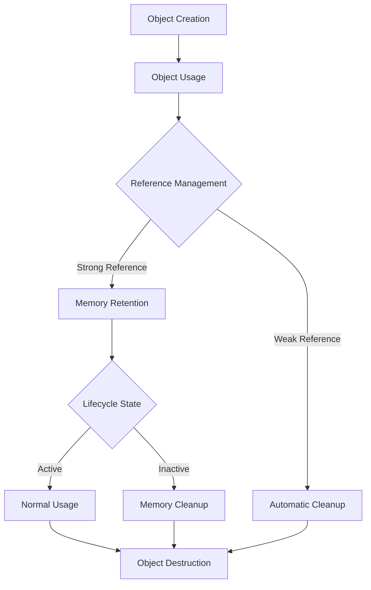
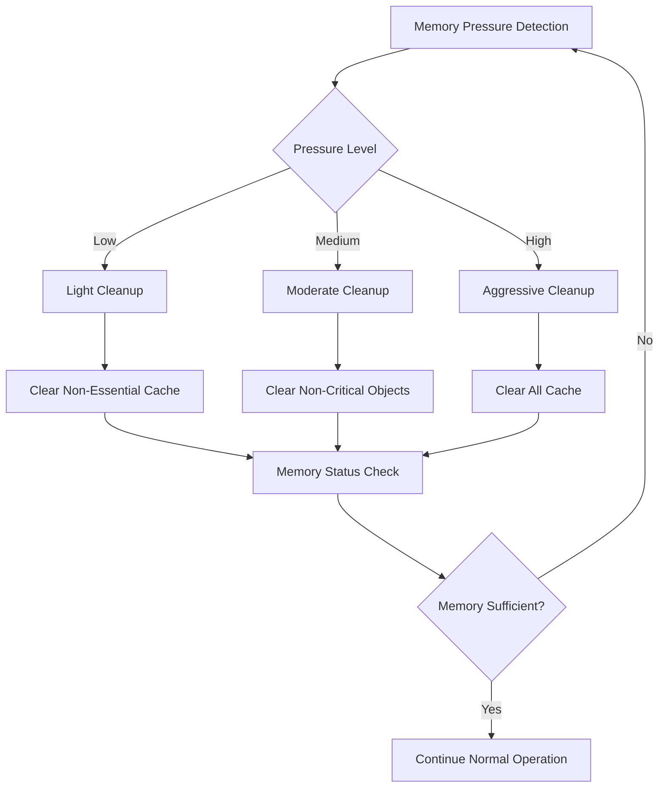
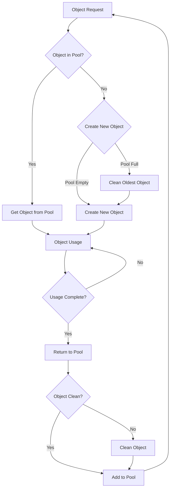

# Object Lifecycle Management

## Memory Management Fundamentals
- **Object Lifecycle**: Creation, usage, retention, and destruction patterns
- **Memory Pressure**: System resource constraints and application responses
- **Lifecycle Awareness**: Platform-specific lifecycle integration



## Singleton vs Scoped Objects

### Singleton Pattern in Mobile
- **Global State Management**:
  - Application-wide configuration
  - Service instances (API clients, database connections)
  - Cache managers and utility classes
- **Memory Considerations**:
  - Long-lived objects in memory
  - Potential memory leaks with strong references
  - Global accessibility vs memory efficiency

### Scoped Object Management
- **Lifecycle-Bound Objects**:
  - Activity/Fragment scoped (Android)
  - ViewController scoped (iOS)
  - Widget scoped (Flutter)
- **Automatic Cleanup**:
  - Garbage collection assistance
  - Reference counting optimization
  - Weak reference usage

```kotlin
// Android Scoped Object Manager
class ScopedObjectManager {
    private val activityScoped = WeakHashMap<Activity, MutableMap<String, Any>>()
    private val fragmentScoped = WeakHashMap<Fragment, MutableMap<String, Any>>()
    
    fun <T> getOrCreate(
        scope: LifecycleOwner,
        key: String,
        factory: () -> T
    ): T {
        val scopeMap = when (scope) {
            is Activity -> activityScoped.getOrPut(scope) { mutableMapOf() }
            is Fragment -> fragmentScoped.getOrPut(scope) { mutableMapOf() }
            else -> throw IllegalArgumentException("Unsupported scope type")
        }
        
        @Suppress("UNCHECKED_CAST")
        return scopeMap.getOrPut(key) { factory() } as T
    }
    
    fun clearScope(scope: LifecycleOwner) {
        when (scope) {
            is Activity -> activityScoped.remove(scope)?.values?.forEach { obj ->
                if (obj is Closeable) obj.close()
                if (obj is Disposable) obj.dispose()
            }
            is Fragment -> fragmentScoped.remove(scope)?.values?.forEach { obj ->
                if (obj is Closeable) obj.close()
                if (obj is Disposable) obj.dispose()
            }
        }
    }
}

// Usage with Activity
class MainActivity : AppCompatActivity() {
    private val objectManager = ScopedObjectManager()
    
    private val expensiveService by lazy {
        objectManager.getOrCreate(this, "expensiveService") {
            ExpensiveService()
        }
    }
    
    override fun onDestroy() {
        super.onDestroy()
        objectManager.clearScope(this)
    }
}
```

```swift
// iOS Scoped Object Manager
class ScopedObjectManager {
    private var viewControllerScoped: [WeakReference<UIViewController>: [String: Any]] = [:]
    private let queue = DispatchQueue(label: "ScopedObjectManager", attributes: .concurrent)
    
    func getOrCreate<T>(
        scope: UIViewController,
        key: String,
        factory: () -> T
    ) -> T {
        return queue.sync {
            let weakRef = WeakReference(scope)
            var scopeMap = viewControllerScoped[weakRef] ?? [:]
            
            if let existing = scopeMap[key] as? T {
                return existing
            }
            
            let newObject = factory()
            scopeMap[key] = newObject
            viewControllerScoped[weakRef] = scopeMap
            
            return newObject
        }
    }
    
    func clearScope(_ scope: UIViewController) {
        queue.async(flags: .barrier) {
            let weakRef = WeakReference(scope)
            if let scopeMap = self.viewControllerScoped.removeValue(forKey: weakRef) {
                for (_, object) in scopeMap {
                    if let disposable = object as? Disposable {
                        disposable.dispose()
                    }
                }
            }
            
            // Clean up nil references
            self.viewControllerScoped = self.viewControllerScoped.compactMapValues { map in
                map.isEmpty ? nil : map
            }
        }
    }
}

private class WeakReference<T: AnyObject>: Hashable {
    weak var object: T?
    private let objectHashValue: Int
    
    init(_ object: T) {
        self.object = object
        self.objectHashValue = ObjectIdentifier(object).hashValue
    }
    
    static func == (lhs: WeakReference<T>, rhs: WeakReference<T>) -> Bool {
        return lhs.objectHashValue == rhs.objectHashValue
    }
    
    func hash(into hasher: inout Hasher) {
        hasher.combine(objectHashValue)
    }
}
```

## View Lifecycle Integration

### Platform-Specific Lifecycle Hooks
- **Android**:
  - Activity/Fragment lifecycle methods
  - ViewModel scope with lifecycle awareness
  - Jetpack Compose lifecycle effects
- **iOS**:
  - UIViewController lifecycle methods
  - SwiftUI view lifecycle
  - Combine cancellables management
- **Flutter**:
  - StatefulWidget lifecycle
  - WidgetsBindingObserver for app lifecycle
  - AutomaticKeepAliveClientMixin for persistence

### Lifecycle-Aware Caching
- **Automatic Cache Cleanup**:
  - onDestroy/viewDidDisappear cleanup
  - Background/foreground state handling
  - Memory warning responses
- **State Restoration**:
  - Instance state preservation
  - Cache warming on lifecycle resume
  - Progressive data loading

```dart
// Flutter Lifecycle-Aware Cache Manager
class LifecycleAwareCacheManager with WidgetsBindingObserver {
  static final LifecycleAwareCacheManager _instance = 
      LifecycleAwareCacheManager._internal();
  
  factory LifecycleAwareCacheManager() => _instance;
  
  LifecycleAwareCacheManager._internal() {
    WidgetsBinding.instance.addObserver(this);
  }
  
  final Map<String, CacheEntry> _cache = {};
  final Map<String, String> _persistentKeys = {};
  AppLifecycleState? _lastLifecycleState;
  
  void put(String key, dynamic value, {bool persistent = false}) {
    _cache[key] = CacheEntry(
      value: value,
      timestamp: DateTime.now(),
      accessCount: 1,
    );
    
    if (persistent) {
      _persistentKeys[key] = key;
    }
  }
  
  T? get<T>(String key) {
    final entry = _cache[key];
    if (entry != null) {
      entry.accessCount++;
      entry.lastAccess = DateTime.now();
      return entry.value as T?;
    }
    return null;
  }
  
  @override
  void didChangeAppLifecycleState(AppLifecycleState state) {
    _lastLifecycleState = state;
    
    switch (state) {
      case AppLifecycleState.paused:
        _onAppPaused();
        break;
      case AppLifecycleState.resumed:
        _onAppResumed();
        break;
      case AppLifecycleState.detached:
        _onAppDetached();
        break;
      case AppLifecycleState.inactive:
        break;
      case AppLifecycleState.hidden:
        break;
    }
  }
  
  void _onAppPaused() {
    // Persist important cache entries
    _persistCriticalData();
    
    // Clear non-essential cache entries
    _cache.removeWhere((key, entry) {
      return !_persistentKeys.containsKey(key) && 
             entry.accessCount < 3;
    });
  }
  
  void _onAppResumed() {
    // Restore persisted data
    _restorePersistedData();
    
    // Pre-warm frequently accessed data
    _preWarmCache();
  }
  
  void _onAppDetached() {
    _persistCriticalData();
    _cache.clear();
  }
  
  void _persistCriticalData() {
    // Implementation for persisting critical cache data
    // Using SharedPreferences or other persistent storage
  }
  
  void _restorePersistedData() {
    // Implementation for restoring persisted cache data
  }
  
  void _preWarmCache() {
    // Implementation for pre-warming frequently accessed data
  }
}

class CacheEntry {
  final dynamic value;
  final DateTime timestamp;
  int accessCount;
  DateTime lastAccess;
  
  CacheEntry({
    required this.value,
    required this.timestamp,
    required this.accessCount,
  }) : lastAccess = timestamp;
}
```

## Memory Pressure Handling

### System Memory Monitoring
- **Memory Warning Detection**:
  - iOS: `didReceiveMemoryWarning`
  - Android: `onTrimMemory` callbacks
  - Flutter: System memory notifications
- **Proactive Memory Management**:
  - Memory usage thresholds
  - Garbage collection hints
  - Cache size reduction strategies



### Intelligent Cache Eviction
- **Priority-Based Eviction**:
  - Critical vs non-critical data
  - User context awareness
  - Feature usage patterns
- **Adaptive Strategies**:
  - Memory pressure levels
  - Device capabilities
  - Network connectivity

```kotlin
// Android Memory Pressure Handler
class MemoryPressureManager : Application.ActivityLifecycleCallbacks {
    private val cacheManagers = mutableListOf<WeakReference<MemoryAwareCache>>()
    private var currentMemoryLevel = ComponentCallbacks2.TRIM_MEMORY_COMPLETE
    
    fun registerCacheManager(cacheManager: MemoryAwareCache) {
        cacheManagers.add(WeakReference(cacheManager))
    }
    
    fun handleMemoryPressure(level: Int) {
        currentMemoryLevel = level
        
        when (level) {
            ComponentCallbacks2.TRIM_MEMORY_RUNNING_CRITICAL -> {
                // Aggressive cleanup
                notifyCacheManagers(MemoryPressureLevel.CRITICAL)
            }
            ComponentCallbacks2.TRIM_MEMORY_RUNNING_LOW -> {
                // Moderate cleanup
                notifyCacheManagers(MemoryPressureLevel.LOW)
            }
            ComponentCallbacks2.TRIM_MEMORY_RUNNING_MODERATE -> {
                // Light cleanup
                notifyCacheManagers(MemoryPressureLevel.MODERATE)
            }
        }
        
        // Clean up dead references
        cacheManagers.removeAll { it.get() == null }
    }
    
    private fun notifyCacheManagers(level: MemoryPressureLevel) {
        cacheManagers.forEach { ref ->
            ref.get()?.onMemoryPressure(level)
        }
    }
}

enum class MemoryPressureLevel {
    LOW, MODERATE, CRITICAL
}

interface MemoryAwareCache {
    fun onMemoryPressure(level: MemoryPressureLevel)
}
```

## Object Pools

### Pool Pattern Implementation
- **Object Reuse**:
  - Expensive object creation avoidance
  - Memory allocation reduction
  - Garbage collection pressure relief
- **Pool Management**:
  - Size limits and growth strategies
  - Object validation and reset
  - Thread safety considerations



### Platform-Specific Pooling
- **Android**:
  - Bitmap pools for image processing
  - Thread pools for background tasks
  - Database connection pools
- **iOS**:
  - NSOperationQueue management
  - Core Data context pools
  - Image processing pools
- **Flutter**:
  - Isolate pools for computation
  - Widget recycling in lists
  - Custom object pools

```swift
// iOS Generic Object Pool
class ObjectPool<T: AnyObject & Resettable> {
    private let createObject: () -> T
    private let resetObject: (T) -> Void
    private let maxPoolSize: Int
    private var pool: [T] = []
    private let semaphore: DispatchSemaphore
    private let queue = DispatchQueue(label: "ObjectPool", attributes: .concurrent)
    
    init(maxSize: Int = 10, 
         createObject: @escaping () -> T,
         resetObject: @escaping (T) -> Void = { obj in obj.reset() }) {
        self.maxPoolSize = maxSize
        self.createObject = createObject
        self.resetObject = resetObject
        self.semaphore = DispatchSemaphore(value: maxSize)
    }
    
    func borrowObject() -> T {
        semaphore.wait()
        
        return queue.sync(flags: .barrier) {
            if let object = pool.popLast() {
                return object
            } else {
                return createObject()
            }
        }
    }
    
    func returnObject(_ object: T) {
        queue.async(flags: .barrier) {
            self.resetObject(object)
            
            if self.pool.count < self.maxPoolSize {
                self.pool.append(object)
            }
            
            self.semaphore.signal()
        }
    }
    
    func withBorrowedObject<R>(_ action: (T) throws -> R) rethrows -> R {
        let object = borrowObject()
        defer { returnObject(object) }
        return try action(object)
    }
}

protocol Resettable {
    func reset()
}

// Usage example with image processing
class ImageProcessor: Resettable {
    private var workingImage: UIImage?
    private var filters: [CIFilter] = []
    
    func reset() {
        workingImage = nil
        filters.removeAll()
    }
    
    func processImage(_ image: UIImage) -> UIImage? {
        workingImage = image
        // Processing logic
        return workingImage
    }
}

// Image processor pool usage
class ImageService {
    private let processorPool = ObjectPool<ImageProcessor>(
        maxSize: 5,
        createObject: { ImageProcessor() }
    )
    
    func processImage(_ image: UIImage) -> UIImage? {
        return processorPool.withBorrowedObject { processor in
            processor.processImage(image)
        }
    }
}
```

## Memory Leak Detection

### Common Leak Patterns
- **Retain Cycles**:
  - Strong reference cycles
  - Delegate patterns without weak references
  - Closure capture issues
- **Event Listener Leaks**:
  - Unregistered observers
  - Event bus subscriptions
  - Timer references

### Detection Tools and Techniques
- **Platform Tools**:
  - Android: LeakCanary, Memory Profiler
  - iOS: Instruments, Memory Graph Debugger
  - Flutter: Observatory, DevTools memory tab
- **Runtime Detection**:
  - Reference counting validation
  - Object lifecycle tracking
  - Memory usage monitoring

```dart
// Flutter Memory Leak Detector
class MemoryLeakDetector {
  static final MemoryLeakDetector _instance = MemoryLeakDetector._internal();
  factory MemoryLeakDetector() => _instance;
  MemoryLeakDetector._internal();
  
  final Map<String, ObjectTracker> _trackedObjects = {};
  final Map<Type, int> _typeCounters = {};
  Timer? _checkTimer;
  
  void startTracking() {
    _checkTimer = Timer.periodic(Duration(seconds: 30), (_) {
      _checkForLeaks();
    });
  }
  
  void stopTracking() {
    _checkTimer?.cancel();
    _checkTimer = null;
  }
  
  void trackObject(Object object, String identifier) {
    final type = object.runtimeType;
    _typeCounters[type] = (_typeCounters[type] ?? 0) + 1;
    
    _trackedObjects[identifier] = ObjectTracker(
      object: WeakReference(object),
      type: type,
      creationTime: DateTime.now(),
      identifier: identifier,
    );
  }
  
  void untrackObject(String identifier) {
    final tracker = _trackedObjects.remove(identifier);
    if (tracker != null) {
      _typeCounters[tracker.type] = (_typeCounters[tracker.type] ?? 1) - 1;
    }
  }
  
  void _checkForLeaks() {
    final now = DateTime.now();
    final potentialLeaks = <ObjectTracker>[];
    
    _trackedObjects.removeWhere((key, tracker) {
      if (tracker.object.target == null) {
        // Object was garbage collected - good
        _typeCounters[tracker.type] = (_typeCounters[tracker.type] ?? 1) - 1;
        return true;
      }
      
      // Check if object has been alive too long
      final aliveTime = now.difference(tracker.creationTime);
      if (aliveTime.inMinutes > 10) { // Configurable threshold
        potentialLeaks.add(tracker);
      }
      
      return false;
    });
    
    if (potentialLeaks.isNotEmpty) {
      _reportPotentialLeaks(potentialLeaks);
    }
    
    _reportTypeStatistics();
  }
  
  void _reportPotentialLeaks(List<ObjectTracker> leaks) {
    print('Potential memory leaks detected:');
    for (final leak in leaks) {
      print('  ${leak.type} (${leak.identifier}) - alive for ${DateTime.now().difference(leak.creationTime)}');
    }
  }
  
  void _reportTypeStatistics() {
    print('Object type statistics:');
    _typeCounters.forEach((type, count) {
      if (count > 0) {
        print('  $type: $count instances');
      }
    });
  }
}

class ObjectTracker {
  final WeakReference<Object> object;
  final Type type;
  final DateTime creationTime;
  final String identifier;
  
  ObjectTracker({
    required Object object,
    required this.type,
    required this.creationTime,
    required this.identifier,
  }) : object = WeakReference(object);
}

class WeakReference<T extends Object> {
  WeakReference(T target) : _target = WeakRef(target);
  
  final WeakRef<T> _target;
  
  T? get target => _target.target;
}

// Usage in widgets
mixin MemoryTrackingMixin<T extends StatefulWidget> on State<T> {
  late String _trackingId;
  
  @override
  void initState() {
    super.initState();
    _trackingId = '${T.toString()}_${DateTime.now().millisecondsSinceEpoch}';
    MemoryLeakDetector().trackObject(this, _trackingId);
  }
  
  @override
  void dispose() {
    MemoryLeakDetector().untrackObject(_trackingId);
    super.dispose();
  }
}
```

## Advanced Lifecycle Patterns

### Resource Management
- **RAII (Resource Acquisition Is Initialization)**:
  - Constructor resource acquisition
  - Destructor resource cleanup
  - Exception safety guarantees
- **Disposable Pattern**:
  - Explicit resource cleanup
  - IDisposable implementations
  - Using statements and try-with-resources

### Dependency Injection Integration
- **Scoped Dependencies**:
  - Lifecycle-bound service instances
  - Automatic dependency cleanup
  - Container scope management
- **Factory Patterns**:
  - Lazy initialization
  - Context-aware object creation
  - Parameterized factory methods

### Performance Optimization
- **Object Reuse Strategies**:
  - View holder patterns
  - Flyweight implementations
  - Prototype patterns
- **Memory-Conscious Design**:
  - Value objects vs reference objects
  - Immutable data structures
  - Copy-on-write optimizations

This comprehensive approach to object lifecycle management ensures efficient memory usage, prevents leaks, and maintains optimal performance across different mobile platforms while providing robust tooling for detection and prevention of common memory management issues.
