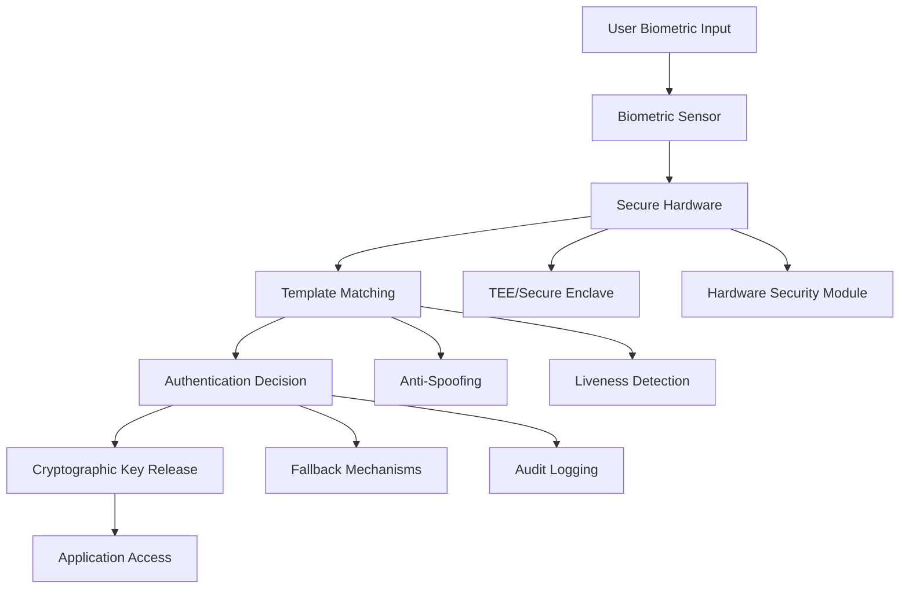

# Biometric Authentication

Biometric authentication leverages unique biological characteristics to verify user identity. Modern mobile devices support various biometric modalities including fingerprint, facial recognition, iris scanning, and voice recognition. This section covers comprehensive implementation strategies for secure biometric authentication systems.

## Biometric Authentication Architecture

### Security Layers


## Platform Implementation

### iOS Face ID & Touch ID

```swift
import LocalAuthentication
import CryptoKit

class BiometricAuthenticationManager {
    
    enum BiometricType {
        case none
        case touchID
        case faceID
        case opticID
        case unknown
    }
    
    enum BiometricError: Error {
        case notAvailable
        case notEnrolled
        case lockout
        case failed
        case cancelled
        case fallback
        case systemCancel
        case appCancel
        case invalidContext
        case biometryNotAvailable
        case biometryNotEnrolled
        case biometryLockout
    }
    
    // MARK: - Biometric Capability Detection
    
    func getBiometricType() -> BiometricType {
        let context = LAContext()
        var error: NSError?
        
        guard context.canEvaluatePolicy(.deviceOwnerAuthenticationWithBiometrics, error: &error) else {
            return .none
        }
        
        if #available(iOS 17.0, *) {
            switch context.biometryType {
            case .touchID:
                return .touchID
            case .faceID:
                return .faceID
            case .opticID:
                return .opticID
            case .none:
                return .none
            @unknown default:
                return .unknown
            }
        } else {
            switch context.biometryType {
            case .touchID:
                return .touchID
            case .faceID:
                return .faceID
            case .none:
                return .none
            @unknown default:
                return .unknown
            }
        }
    }
    
    func isBiometricAvailable() -> Bool {
        let context = LAContext()
        var error: NSError?
        return context.canEvaluatePolicy(.deviceOwnerAuthenticationWithBiometrics, error: &error)
    }
    
    func isBiometricEnrolled() -> Bool {
        let context = LAContext()
        var error: NSError?
        let canEvaluate = context.canEvaluatePolicy(.deviceOwnerAuthenticationWithBiometrics, error: &error)
        
        if let error = error {
            return error.code != LAError.biometryNotEnrolled.rawValue
        }
        
        return canEvaluate
    }
    
    // MARK: - Basic Biometric Authentication
    
    func authenticateWithBiometrics(
        reason: String,
        fallbackTitle: String? = nil
    ) async throws -> Bool {
        let context = LAContext()
        
        // Configure context
        if let fallbackTitle = fallbackTitle {
            context.localizedFallbackTitle = fallbackTitle
        }
        
        // Check availability
        var error: NSError?
        guard context.canEvaluatePolicy(.deviceOwnerAuthenticationWithBiometrics, error: &error) else {
            throw mapLAError(error)
        }
        
        do {
            let result = try await context.evaluatePolicy(
                .deviceOwnerAuthenticationWithBiometrics,
                localizedReason: reason
            )
            return result
        } catch {
            throw mapLAError(error)
        }
    }
    
    func authenticateWithBiometricsOrPasscode(
        reason: String
    ) async throws -> Bool {
        let context = LAContext()
        
        do {
            let result = try await context.evaluatePolicy(
                .deviceOwnerAuthentication,
                localizedReason: reason
            )
            return result
        } catch {
            throw mapLAError(error)
        }
    }
    
    // MARK: - Cryptographic Biometric Authentication
    
    func authenticateWithCryptographicKey(
        keyTag: String,
        reason: String
    ) async throws -> SecKey {
        let context = LAContext()
        
        // Query for the key
        let query: [String: Any] = [
            kSecClass as String: kSecClassKey,
            kSecAttrApplicationTag as String: keyTag,
            kSecAttrKeyType as String: kSecAttrKeyTypeECSECPrimeRandom,
            kSecReturnRef as String: true,
            kSecUseAuthenticationContext as String: context
        ]
        
        var result: CFTypeRef?
        let status = SecItemCopyMatching(query as CFDictionary, &result)
        
        guard status == errSecSuccess else {
            throw BiometricError.failed
        }
        
        guard let secKey = result as! SecKey? else {
            throw BiometricError.failed
        }
        
        // Authenticate to unlock the key
        do {
            _ = try await context.evaluatePolicy(
                .deviceOwnerAuthenticationWithBiometrics,
                localizedReason: reason
            )
            return secKey
        } catch {
            throw mapLAError(error)
        }
    }
    
    func createBiometricProtectedKey(
        keyTag: String,
        requireBiometry: Bool = true
    ) throws -> SecKey {
        let flags: SecAccessControlCreateFlags = requireBiometry
            ? [.privateKeyUsage, .biometryAny]
            : [.privateKeyUsage, .devicePasscode]
        
        guard let access = SecAccessControlCreateWithFlags(
            kCFAllocatorDefault,
            kSecAttrAccessibleWhenUnlockedThisDeviceOnly,
            flags,
            nil
        ) else {
            throw BiometricError.failed
        }
        
        let attributes: [String: Any] = [
            kSecAttrKeyType as String: kSecAttrKeyTypeECSECPrimeRandom,
            kSecAttrKeySizeInBits as String: 256,
            kSecAttrTokenID as String: kSecAttrTokenIDSecureEnclave,
            kSecPrivateKeyAttrs as String: [
                kSecAttrIsPermanent as String: true,
                kSecAttrApplicationTag as String: keyTag,
                kSecAttrAccessControl as String: access
            ]
        ]
        
        var error: Unmanaged<CFError>?
        guard let privateKey = SecKeyCreateRandomKey(attributes as CFDictionary, &error) else {
            throw BiometricError.failed
        }
        
        return privateKey
    }
    
    // MARK: - Advanced Features
    
    func authenticateWithCustomUI(
        reason: String,
        onSuccess: @escaping () -> Void,
        onError: @escaping (BiometricError) -> Void,
        onFallback: @escaping () -> Void
    ) {
        let context = LAContext()
        context.localizedFallbackTitle = "Use Passcode"
        
        context.evaluatePolicy(
            .deviceOwnerAuthenticationWithBiometrics,
            localizedReason: reason
        ) { success, error in
            DispatchQueue.main.async {
                if success {
                    onSuccess()
                } else if let error = error as? LAError {
                    switch error.code {
                    case .userFallback:
                        onFallback()
                    default:
                        onError(self.mapLAError(error))
                    }
                } else {
                    onError(.failed)
                }
            }
        }
    }
    
    func invalidateBiometricContext() {
        // Force context invalidation to require fresh authentication
        let context = LAContext()
        context.invalidate()
    }
    
    // MARK: - Error Mapping
    
    private func mapLAError(_ error: Error?) -> BiometricError {
        guard let laError = error as? LAError else {
            return .failed
        }
        
        switch laError.code {
        case .authenticationFailed:
            return .failed
        case .userCancel:
            return .cancelled
        case .userFallback:
            return .fallback
        case .systemCancel:
            return .systemCancel
        case .appCancel:
            return .appCancel
        case .invalidContext:
            return .invalidContext
        case .biometryNotAvailable:
            return .biometryNotAvailable
        case .biometryNotEnrolled:
            return .biometryNotEnrolled
        case .biometryLockout:
            return .biometryLockout
        case .passcodeNotSet:
            return .notAvailable
        default:
            return .failed
        }
    }
}
```

### Android Biometric Authentication

```kotlin
import androidx.biometric.BiometricManager
import androidx.biometric.BiometricPrompt
import androidx.fragment.app.FragmentActivity
import androidx.core.content.ContextCompat
import javax.crypto.Cipher
import javax.crypto.KeyGenerator
import java.security.KeyStore
import android.security.keystore.KeyGenParameterSpec
import android.security.keystore.KeyProperties

class BiometricAuthenticationManager(private val activity: FragmentActivity) {
    
    enum class BiometricCapability {
        BIOMETRIC_SUCCESS,
        BIOMETRIC_ERROR_HW_UNAVAILABLE,
        BIOMETRIC_ERROR_NO_HARDWARE,
        BIOMETRIC_ERROR_NONE_ENROLLED,
        BIOMETRIC_ERROR_SECURITY_UPDATE_REQUIRED,
        BIOMETRIC_ERROR_UNSUPPORTED,
        BIOMETRIC_STATUS_UNKNOWN
    }
    
    enum class AuthenticatorType {
        BIOMETRIC_STRONG,
        BIOMETRIC_WEAK,
        DEVICE_CREDENTIAL,
        BIOMETRIC_STRONG_OR_DEVICE_CREDENTIAL,
        BIOMETRIC_WEAK_OR_DEVICE_CREDENTIAL
    }
    
    // MARK: - Capability Detection
    
    fun getBiometricCapability(authenticatorType: AuthenticatorType = AuthenticatorType.BIOMETRIC_STRONG): BiometricCapability {
        val biometricManager = BiometricManager.from(activity)
        
        val authenticators = when (authenticatorType) {
            AuthenticatorType.BIOMETRIC_STRONG -> BiometricManager.Authenticators.BIOMETRIC_STRONG
            AuthenticatorType.BIOMETRIC_WEAK -> BiometricManager.Authenticators.BIOMETRIC_WEAK
            AuthenticatorType.DEVICE_CREDENTIAL -> BiometricManager.Authenticators.DEVICE_CREDENTIAL
            AuthenticatorType.BIOMETRIC_STRONG_OR_DEVICE_CREDENTIAL -> 
                BiometricManager.Authenticators.BIOMETRIC_STRONG or BiometricManager.Authenticators.DEVICE_CREDENTIAL
            AuthenticatorType.BIOMETRIC_WEAK_OR_DEVICE_CREDENTIAL ->
                BiometricManager.Authenticators.BIOMETRIC_WEAK or BiometricManager.Authenticators.DEVICE_CREDENTIAL
        }
        
        return when (biometricManager.canAuthenticate(authenticators)) {
            BiometricManager.BIOMETRIC_SUCCESS -> BiometricCapability.BIOMETRIC_SUCCESS
            BiometricManager.BIOMETRIC_ERROR_HW_UNAVAILABLE -> BiometricCapability.BIOMETRIC_ERROR_HW_UNAVAILABLE
            BiometricManager.BIOMETRIC_ERROR_NO_HARDWARE -> BiometricCapability.BIOMETRIC_ERROR_NO_HARDWARE
            BiometricManager.BIOMETRIC_ERROR_NONE_ENROLLED -> BiometricCapability.BIOMETRIC_ERROR_NONE_ENROLLED
            BiometricManager.BIOMETRIC_ERROR_SECURITY_UPDATE_REQUIRED -> BiometricCapability.BIOMETRIC_ERROR_SECURITY_UPDATE_REQUIRED
            BiometricManager.BIOMETRIC_ERROR_UNSUPPORTED -> BiometricCapability.BIOMETRIC_ERROR_UNSUPPORTED
            else -> BiometricCapability.BIOMETRIC_STATUS_UNKNOWN
        }
    }
    
    fun isBiometricAvailable(): Boolean {
        return getBiometricCapability() == BiometricCapability.BIOMETRIC_SUCCESS
    }
    
    // MARK: - Basic Authentication
    
    fun authenticateWithBiometrics(
        title: String,
        subtitle: String,
        description: String? = null,
        negativeButtonText: String = "Cancel",
        onSuccess: () -> Unit,
        onError: (String) -> Unit,
        onFailed: () -> Unit
    ) {
        val executor = ContextCompat.getMainExecutor(activity)
        val biometricPrompt = BiometricPrompt(activity, executor,
            object : BiometricPrompt.AuthenticationCallback() {
                override fun onAuthenticationError(errorCode: Int, errString: CharSequence) {
                    super.onAuthenticationError(errorCode, errString)
                    onError(errString.toString())
                }
                
                override fun onAuthenticationSucceeded(result: BiometricPrompt.AuthenticationResult) {
                    super.onAuthenticationSucceeded(result)
                    onSuccess()
                }
                
                override fun onAuthenticationFailed() {
                    super.onAuthenticationFailed()
                    onFailed()
                }
            }
        )
        
        val promptInfoBuilder = BiometricPrompt.PromptInfo.Builder()
            .setTitle(title)
            .setSubtitle(subtitle)
            .setNegativeButtonText(negativeButtonText)
        
        if (!description.isNullOrEmpty()) {
            promptInfoBuilder.setDescription(description)
        }
        
        val promptInfo = promptInfoBuilder.build()
        biometricPrompt.authenticate(promptInfo)
    }
    
    fun authenticateWithBiometricsOrDeviceCredential(
        title: String,
        subtitle: String,
        description: String? = null,
        onSuccess: () -> Unit,
        onError: (String) -> Unit,
        onFailed: () -> Unit
    ) {
        val executor = ContextCompat.getMainExecutor(activity)
        val biometricPrompt = BiometricPrompt(activity, executor,
            object : BiometricPrompt.AuthenticationCallback() {
                override fun onAuthenticationError(errorCode: Int, errString: CharSequence) {
                    super.onAuthenticationError(errorCode, errString)
                    onError(errString.toString())
                }
                
                override fun onAuthenticationSucceeded(result: BiometricPrompt.AuthenticationResult) {
                    super.onAuthenticationSucceeded(result)
                    onSuccess()
                }
                
                override fun onAuthenticationFailed() {
                    super.onAuthenticationFailed()
                    onFailed()
                }
            }
        )
        
        val promptInfoBuilder = BiometricPrompt.PromptInfo.Builder()
            .setTitle(title)
            .setSubtitle(subtitle)
            .setAllowedAuthenticators(
                BiometricManager.Authenticators.BIOMETRIC_STRONG or 
                BiometricManager.Authenticators.DEVICE_CREDENTIAL
            )
        
        if (!description.isNullOrEmpty()) {
            promptInfoBuilder.setDescription(description)
        }
        
        val promptInfo = promptInfoBuilder.build()
        biometricPrompt.authenticate(promptInfo)
    }
    
    // MARK: - Cryptographic Operations
    
    fun createBiometricKey(keyAlias: String, requireUserAuthentication: Boolean = true): Boolean {
        return try {
            val keyGenerator = KeyGenerator.getInstance(KeyProperties.KEY_ALGORITHM_AES, "AndroidKeyStore")
            
            val keyGenParameterSpecBuilder = KeyGenParameterSpec.Builder(
                keyAlias,
                KeyProperties.PURPOSE_ENCRYPT or KeyProperties.PURPOSE_DECRYPT
            )
                .setBlockModes(KeyProperties.BLOCK_MODE_CBC)
                .setEncryptionPaddings(KeyProperties.ENCRYPTION_PADDING_PKCS7)
                .setUserAuthenticationRequired(requireUserAuthentication)
                .setInvalidatedByBiometricEnrollment(true)
            
            if (requireUserAuthentication) {
                keyGenParameterSpecBuilder.setUserAuthenticationValidityDurationSeconds(300) // 5 minutes
            }
            
            keyGenerator.init(keyGenParameterSpecBuilder.build())
            keyGenerator.generateKey()
            true
        } catch (e: Exception) {
            false
        }
    }
    
    fun getCipher(keyAlias: String, mode: Int): Cipher? {
        return try {
            val keyStore = KeyStore.getInstance("AndroidKeyStore")
            keyStore.load(null)
            
            val secretKey = keyStore.getKey(keyAlias, null)
            val cipher = Cipher.getInstance("AES/CBC/PKCS7Padding")
            cipher.init(mode, secretKey)
            cipher
        } catch (e: Exception) {
            null
        }
    }
    
    fun authenticateWithCryptography(
        cipher: Cipher,
        title: String,
        subtitle: String,
        description: String? = null,
        negativeButtonText: String = "Cancel",
        onSuccess: (BiometricPrompt.CryptoObject) -> Unit,
        onError: (String) -> Unit,
        onFailed: () -> Unit
    ) {
        val executor = ContextCompat.getMainExecutor(activity)
        val biometricPrompt = BiometricPrompt(activity, executor,
            object : BiometricPrompt.AuthenticationCallback() {
                override fun onAuthenticationError(errorCode: Int, errString: CharSequence) {
                    super.onAuthenticationError(errorCode, errString)
                    onError(errString.toString())
                }
                
                override fun onAuthenticationSucceeded(result: BiometricPrompt.AuthenticationResult) {
                    super.onAuthenticationSucceeded(result)
                    result.cryptoObject?.let { onSuccess(it) }
                }
                
                override fun onAuthenticationFailed() {
                    super.onAuthenticationFailed()
                    onFailed()
                }
            }
        )
        
        val promptInfoBuilder = BiometricPrompt.PromptInfo.Builder()
            .setTitle(title)
            .setSubtitle(subtitle)
            .setNegativeButtonText(negativeButtonText)
        
        if (!description.isNullOrEmpty()) {
            promptInfoBuilder.setDescription(description)
        }
        
        val promptInfo = promptInfoBuilder.build()
        val cryptoObject = BiometricPrompt.CryptoObject(cipher)
        
        biometricPrompt.authenticate(promptInfo, cryptoObject)
    }
    
    // MARK: - Advanced Features
    
    fun authenticateWithCustomTimeout(
        title: String,
        subtitle: String,
        timeoutSeconds: Int,
        onSuccess: () -> Unit,
        onError: (String) -> Unit,
        onTimeout: () -> Unit
    ) {
        val executor = ContextCompat.getMainExecutor(activity)
        var authenticationCompleted = false
        
        val biometricPrompt = BiometricPrompt(activity, executor,
            object : BiometricPrompt.AuthenticationCallback() {
                override fun onAuthenticationError(errorCode: Int, errString: CharSequence) {
                    super.onAuthenticationError(errorCode, errString)
                    if (!authenticationCompleted) {
                        authenticationCompleted = true
                        onError(errString.toString())
                    }
                }
                
                override fun onAuthenticationSucceeded(result: BiometricPrompt.AuthenticationResult) {
                    super.onAuthenticationSucceeded(result)
                    if (!authenticationCompleted) {
                        authenticationCompleted = true
                        onSuccess()
                    }
                }
                
                override fun onAuthenticationFailed() {
                    super.onAuthenticationFailed()
                    // Don't mark as completed for failed attempts
                }
            }
        )
        
        val promptInfo = BiometricPrompt.PromptInfo.Builder()
            .setTitle(title)
            .setSubtitle(subtitle)
            .setNegativeButtonText("Cancel")
            .build()
        
        biometricPrompt.authenticate(promptInfo)
        
        // Set timeout
        ContextCompat.getMainExecutor(activity).execute {
            android.os.Handler().postDelayed({
                if (!authenticationCompleted) {
                    authenticationCompleted = true
                    biometricPrompt.cancelAuthentication()
                    onTimeout()
                }
            }, timeoutSeconds * 1000L)
        }
    }
    
    fun removeBiometricKey(keyAlias: String): Boolean {
        return try {
            val keyStore = KeyStore.getInstance("AndroidKeyStore")
            keyStore.load(null)
            keyStore.deleteEntry(keyAlias)
            true
        } catch (e: Exception) {
            false
        }
    }
}
```

## Cross-Platform Implementation

### React Native Biometric Authentication

```typescript
import TouchID from 'react-native-touch-id';
import { Platform } from 'react-native';

interface BiometricConfig {
    title?: string;
    subtitle?: string;
    description?: string;
    fallbackLabel?: string;
    cancelLabel?: string;
    imageColor?: string;
    imageErrorColor?: string;
    sensorDescription?: string;
    sensorErrorDescription?: string;
    showErrorMessage?: boolean;
    unifiedErrors?: boolean;
}

class BiometricAuthManager {
    
    enum BiometricError {
        BiometryNotAvailable = 'BiometryNotAvailable',
        BiometryNotEnrolled = 'BiometryNotEnrolled',
        BiometryLockout = 'BiometryLockout',
        UserCancel = 'UserCancel',
        UserFallback = 'UserFallback',
        SystemCancel = 'SystemCancel',
        PasscodeNotSet = 'PasscodeNotSet',
        DeviceLockedPermanent = 'DeviceLockedPermanent',
        DeviceLocked = 'DeviceLocked',
        TooManyAttempts = 'TooManyAttempts',
        InvalidContext = 'InvalidContext',
        BiometryTemporaryNotAvailable = 'BiometryTemporaryNotAvailable'
    }
    
    // Check if biometric authentication is available
    static async isBiometricAvailable(): Promise<boolean> {
        try {
            const biometryType = await TouchID.isSupported();
            return biometryType !== false;
        } catch (error) {
            return false;
        }
    }
    
    // Get the type of biometric authentication available
    static async getBiometricType(): Promise<string | null> {
        try {
            const biometryType = await TouchID.isSupported();
            
            if (Platform.OS === 'ios') {
                return biometryType; // 'FaceID', 'TouchID', or false
            } else {
                return biometryType ? 'Fingerprint' : null;
            }
        } catch (error) {
            return null;
        }
    }
    
    // Basic biometric authentication
    static async authenticate(
        reason: string,
        config?: BiometricConfig
    ): Promise<boolean> {
        try {
            const defaultConfig: BiometricConfig = {
                title: 'Authentication Required',
                subtitle: 'Verify your identity',
                description: reason,
                fallbackLabel: 'Use Passcode',
                cancelLabel: 'Cancel',
                showErrorMessage: true,
                unifiedErrors: false,
                ...config
            };
            
            await TouchID.authenticate(reason, defaultConfig);
            return true;
        } catch (error) {
            throw this.mapError(error);
        }
    }
    
    // Authenticate with custom configuration
    static async authenticateWithConfig(
        reason: string,
        config: BiometricConfig
    ): Promise<boolean> {
        try {
            await TouchID.authenticate(reason, config);
            return true;
        } catch (error) {
            throw this.mapError(error);
        }
    }
    
    // Check if device has passcode/password set
    static async isDeviceSecure(): Promise<boolean> {
        try {
            // This checks if the device has any form of authentication set up
            const biometryType = await TouchID.isSupported({ unifiedErrors: true });
            return biometryType !== false;
        } catch (error) {
            return false;
        }
    }
    
    // Authenticate with fallback to device passcode
    static async authenticateWithFallback(
        reason: string,
        config?: BiometricConfig
    ): Promise<{ success: boolean; method: 'biometric' | 'passcode' }> {
        try {
            await this.authenticate(reason, config);
            return { success: true, method: 'biometric' };
        } catch (error) {
            if (error === BiometricError.UserFallback) {
                // User chose to use passcode
                return { success: true, method: 'passcode' };
            }
            throw error;
        }
    }
    
    // Enhanced authentication with retry logic
    static async authenticateWithRetry(
        reason: string,
        maxRetries: number = 3,
        config?: BiometricConfig
    ): Promise<boolean> {
        let retryCount = 0;
        
        while (retryCount < maxRetries) {
            try {
                return await this.authenticate(reason, config);
            } catch (error) {
                retryCount++;
                
                if (error === BiometricError.UserCancel || 
                    error === BiometricError.SystemCancel ||
                    retryCount >= maxRetries) {
                    throw error;
                }
                
                // Wait before retry
                await new Promise(resolve => setTimeout(resolve, 1000));
            }
        }
        
        throw new Error('Max retry attempts reached');
    }
    
    // Map native errors to our error enum
    private static mapError(error: any): BiometricError {
        const errorMessage = error.message || error.toString();
        
        switch (errorMessage) {
            case 'LAErrorBiometryNotAvailable':
            case 'BiometryNotAvailable':
                return BiometricError.BiometryNotAvailable;
                
            case 'LAErrorBiometryNotEnrolled':
            case 'BiometryNotEnrolled':
                return BiometricError.BiometryNotEnrolled;
                
            case 'LAErrorBiometryLockout':
            case 'BiometryLockout':
                return BiometricError.BiometryLockout;
                
            case 'LAErrorUserCancel':
            case 'UserCancel':
                return BiometricError.UserCancel;
                
            case 'LAErrorUserFallback':
            case 'UserFallback':
                return BiometricError.UserFallback;
                
            case 'LAErrorSystemCancel':
            case 'SystemCancel':
                return BiometricError.SystemCancel;
                
            case 'LAErrorPasscodeNotSet':
            case 'PasscodeNotSet':
                return BiometricError.PasscodeNotSet;
                
            case 'DeviceLockedPermanent':
                return BiometricError.DeviceLockedPermanent;
                
            case 'DeviceLocked':
                return BiometricError.DeviceLocked;
                
            case 'TooManyAttempts':
                return BiometricError.TooManyAttempts;
                
            case 'InvalidContext':
                return BiometricError.InvalidContext;
                
            case 'BiometryTemporaryNotAvailable':
                return BiometricError.BiometryTemporaryNotAvailable;
                
            default:
                return BiometricError.BiometryNotAvailable;
        }
    }
}

// Usage examples
export class BiometricAuthService {
    
    async setupBiometricAuth(): Promise<boolean> {
        const isAvailable = await BiometricAuthManager.isBiometricAvailable();
        
        if (!isAvailable) {
            throw new Error('Biometric authentication is not available on this device');
        }
        
        const biometricType = await BiometricAuthManager.getBiometricType();
        console.log(`Biometric type: ${biometricType}`);
        
        return true;
    }
    
    async authenticateUser(): Promise<boolean> {
        const config: BiometricConfig = {
            title: 'Secure Authentication',
            subtitle: 'Use your biometric to authenticate',
            description: 'Place your finger on the sensor or look at the camera',
            fallbackLabel: 'Use PIN',
            cancelLabel: 'Cancel',
            imageColor: '#1976D2',
            imageErrorColor: '#D32F2F'
        };
        
        try {
            return await BiometricAuthManager.authenticate(
                'Authenticate to access your account',
                config
            );
        } catch (error) {
            this.handleBiometricError(error);
            return false;
        }
    }
    
    async authenticateWithGracefulFallback(): Promise<boolean> {
        try {
            const result = await BiometricAuthManager.authenticateWithFallback(
                'Authenticate to proceed'
            );
            
            console.log(`Authentication successful using: ${result.method}`);
            return result.success;
        } catch (error) {
            this.handleBiometricError(error);
            return false;
        }
    }
    
    private handleBiometricError(error: BiometricAuthManager.BiometricError): void {
        switch (error) {
            case BiometricAuthManager.BiometricError.BiometryNotAvailable:
                console.log('Biometric authentication is not available');
                break;
            case BiometricAuthManager.BiometricError.BiometryNotEnrolled:
                console.log('No biometric credentials are enrolled');
                break;
            case BiometricAuthManager.BiometricError.BiometryLockout:
                console.log('Biometric authentication is locked out');
                break;
            case BiometricAuthManager.BiometricError.UserCancel:
                console.log('User cancelled biometric authentication');
                break;
            default:
                console.log(`Biometric authentication error: ${error}`);
        }
    }
}
```

### Flutter Biometric Authentication

```dart
import 'package:local_auth/local_auth.dart';
import 'package:local_auth_android/local_auth_android.dart';
import 'package:local_auth_ios/local_auth_ios.dart';

class BiometricAuthenticationService {
  final LocalAuthentication _localAuth = LocalAuthentication();
  
  // Check if biometric authentication is available
  Future<bool> isBiometricAvailable() async {
    try {
      final bool isAvailable = await _localAuth.isDeviceSupported();
      final bool canCheckBiometrics = await _localAuth.canCheckBiometrics;
      return isAvailable && canCheckBiometrics;
    } catch (e) {
      return false;
    }
  }
  
  // Get available biometric types
  Future<List<BiometricType>> getAvailableBiometrics() async {
    try {
      return await _localAuth.getAvailableBiometrics();
    } catch (e) {
      return [];
    }
  }
  
  // Basic biometric authentication
  Future<bool> authenticateWithBiometrics({
    required String localizedReason,
    String? signInTitle,
    String? cancelButton,
    String? goToSettingsButton,
    String? goToSettingsDescription,
    String? signInDescription,
  }) async {
    try {
      final bool didAuthenticate = await _localAuth.authenticate(
        localizedReason: localizedReason,
        authMessages: [
          AndroidAuthMessages(
            signInTitle: signInTitle ?? 'Biometric Authentication',
            cancelButton: cancelButton ?? 'Cancel',
            goToSettingsButton: goToSettingsButton ?? 'Settings',
            goToSettingsDescription: goToSettingsDescription ?? 
              'Please set up your biometric authentication in settings',
            biometricHint: 'Verify identity',
          ),
          IOSAuthMessages(
            cancelButton: cancelButton ?? 'Cancel',
            goToSettingsButton: goToSettingsButton ?? 'Settings',
            goToSettingsDescription: goToSettingsDescription ?? 
              'Please set up your biometric authentication in settings',
            lockOut: 'Please reenable your biometric authentication',
          ),
        ],
        options: const AuthenticationOptions(
          biometricOnly: true,
          stickyAuth: true,
        ),
      );
      
      return didAuthenticate;
    } catch (e) {
      throw _mapError(e);
    }
  }
  
  // Authenticate with biometric or device credentials
  Future<bool> authenticateWithBiometricOrCredentials({
    required String localizedReason,
    String? signInTitle,
  }) async {
    try {
      final bool didAuthenticate = await _localAuth.authenticate(
        localizedReason: localizedReason,
        authMessages: [
          AndroidAuthMessages(
            signInTitle: signInTitle ?? 'Authentication Required',
            cancelButton: 'Cancel',
          ),
          IOSAuthMessages(
            cancelButton: 'Cancel',
          ),
        ],
        options: const AuthenticationOptions(
          biometricOnly: false,
          stickyAuth: true,
        ),
      );
      
      return didAuthenticate;
    } catch (e) {
      throw _mapError(e);
    }
  }
  
  // Enhanced authentication with custom configuration
  Future<BiometricAuthResult> authenticateWithConfig({
    required String localizedReason,
    required BiometricAuthConfig config,
  }) async {
    try {
      // Check if biometric is available
      if (!await isBiometricAvailable()) {
        return BiometricAuthResult(
          success: false,
          error: BiometricAuthError.notAvailable,
          message: 'Biometric authentication is not available',
        );
      }
      
      // Check if any biometrics are enrolled
      final availableBiometrics = await getAvailableBiometrics();
      if (availableBiometrics.isEmpty) {
        return BiometricAuthResult(
          success: false,
          error: BiometricAuthError.notEnrolled,
          message: 'No biometric credentials are enrolled',
        );
      }
      
      final bool didAuthenticate = await _localAuth.authenticate(
        localizedReason: localizedReason,
        authMessages: [
          AndroidAuthMessages(
            signInTitle: config.title,
            cancelButton: config.cancelButton,
            goToSettingsButton: config.settingsButton,
            goToSettingsDescription: config.settingsDescription,
            biometricHint: config.biometricHint,
          ),
          IOSAuthMessages(
            cancelButton: config.cancelButton,
            goToSettingsButton: config.settingsButton,
            goToSettingsDescription: config.settingsDescription,
            lockOut: config.lockoutMessage,
          ),
        ],
        options: AuthenticationOptions(
          biometricOnly: config.biometricOnly,
          stickyAuth: config.stickyAuth,
        ),
      );
      
      return BiometricAuthResult(
        success: didAuthenticate,
        biometricType: availableBiometrics.first,
      );
      
    } catch (e) {
      final error = _mapError(e);
      return BiometricAuthResult(
        success: false,
        error: error,
        message: _getErrorMessage(error),
      );
    }
  }
  
  // Authenticate with retry mechanism
  Future<BiometricAuthResult> authenticateWithRetry({
    required String localizedReason,
    int maxRetries = 3,
    Duration retryDelay = const Duration(seconds: 2),
  }) async {
    int attempts = 0;
    
    while (attempts < maxRetries) {
      try {
        final result = await authenticateWithConfig(
          localizedReason: localizedReason,
          config: BiometricAuthConfig.defaultConfig(),
        );
        
        if (result.success) {
          return result;
        }
        
        // Don't retry for user cancellation or system issues
        if (result.error == BiometricAuthError.userCancel ||
            result.error == BiometricAuthError.notAvailable) {
          return result;
        }
        
        attempts++;
        if (attempts < maxRetries) {
          await Future.delayed(retryDelay);
        }
        
      } catch (e) {
        attempts++;
        if (attempts >= maxRetries) {
          return BiometricAuthResult(
            success: false,
            error: BiometricAuthError.tooManyAttempts,
            message: 'Too many failed attempts',
          );
        }
        await Future.delayed(retryDelay);
      }
    }
    
    return BiometricAuthResult(
      success: false,
      error: BiometricAuthError.tooManyAttempts,
      message: 'Authentication failed after $maxRetries attempts',
    );
  }
  
  // Stop authentication
  Future<bool> stopAuthentication() async {
    try {
      return await _localAuth.stopAuthentication();
    } catch (e) {
      return false;
    }
  }
  
  BiometricAuthError _mapError(dynamic error) {
    final errorMessage = error.toString().toLowerCase();
    
    if (errorMessage.contains('not available') || 
        errorMessage.contains('no hardware')) {
      return BiometricAuthError.notAvailable;
    } else if (errorMessage.contains('not enrolled') || 
               errorMessage.contains('no biometrics')) {
      return BiometricAuthError.notEnrolled;
    } else if (errorMessage.contains('locked') || 
               errorMessage.contains('lockout')) {
      return BiometricAuthError.lockedOut;
    } else if (errorMessage.contains('cancel')) {
      return BiometricAuthError.userCancel;
    } else if (errorMessage.contains('failed') || 
               errorMessage.contains('not recognized')) {
      return BiometricAuthError.authenticationFailed;
    } else {
      return BiometricAuthError.unknown;
    }
  }
  
  String _getErrorMessage(BiometricAuthError error) {
    switch (error) {
      case BiometricAuthError.notAvailable:
        return 'Biometric authentication is not available on this device';
      case BiometricAuthError.notEnrolled:
        return 'No biometric credentials are enrolled';
      case BiometricAuthError.lockedOut:
        return 'Biometric authentication is temporarily locked';
      case BiometricAuthError.userCancel:
        return 'Authentication was cancelled by the user';
      case BiometricAuthError.authenticationFailed:
        return 'Biometric authentication failed';
      case BiometricAuthError.tooManyAttempts:
        return 'Too many failed authentication attempts';
      case BiometricAuthError.unknown:
      default:
        return 'An unknown error occurred during authentication';
    }
  }
}

// Configuration class
class BiometricAuthConfig {
  final String title;
  final String? subtitle;
  final String cancelButton;
  final String settingsButton;
  final String settingsDescription;
  final String biometricHint;
  final String lockoutMessage;
  final bool biometricOnly;
  final bool stickyAuth;
  
  BiometricAuthConfig({
    required this.title,
    this.subtitle,
    required this.cancelButton,
    required this.settingsButton,
    required this.settingsDescription,
    required this.biometricHint,
    required this.lockoutMessage,
    required this.biometricOnly,
    required this.stickyAuth,
  });
  
  static BiometricAuthConfig defaultConfig() => BiometricAuthConfig(
    title: 'Biometric Authentication',
    cancelButton: 'Cancel',
    settingsButton: 'Settings',
    settingsDescription: 'Please set up biometric authentication in settings',
    biometricHint: 'Touch the fingerprint sensor',
    lockoutMessage: 'Biometric authentication is locked. Please try again later',
    biometricOnly: true,
    stickyAuth: true,
  );
}

// Result classes
class BiometricAuthResult {
  final bool success;
  final BiometricAuthError? error;
  final String? message;
  final BiometricType? biometricType;
  
  BiometricAuthResult({
    required this.success,
    this.error,
    this.message,
    this.biometricType,
  });
}

enum BiometricAuthError {
  notAvailable,
  notEnrolled,
  lockedOut,
  userCancel,
  authenticationFailed,
  tooManyAttempts,
  unknown,
}
```

## Security Considerations

### Anti-Spoofing Measures

```kotlin
// Android Anti-Spoofing Implementation
class BiometricAntiSpoofing {
    
    fun enableLivenessDetection(): Boolean {
        // Use only strong biometric authenticators
        val biometricManager = BiometricManager.from(context)
        return biometricManager.canAuthenticate(BiometricManager.Authenticators.BIOMETRIC_STRONG) == 
               BiometricManager.BIOMETRIC_SUCCESS
    }
    
    fun validateBiometricQuality(result: BiometricPrompt.AuthenticationResult): BiometricQuality {
        // This is a conceptual implementation
        // Real implementations would require platform-specific APIs
        
        val cryptoObject = result.cryptoObject
        if (cryptoObject != null) {
            // Cryptographic authentication provides higher assurance
            return BiometricQuality.HIGH
        }
        
        // Check authentication strength
        return when {
            isStrongBiometric() -> BiometricQuality.MEDIUM
            else -> BiometricQuality.LOW
        }
    }
    
    private fun isStrongBiometric(): Boolean {
        // Implementation would check if the biometric used meets
        // strong authentication requirements
        return true
    }
    
    enum class BiometricQuality {
        LOW,
        MEDIUM,
        HIGH
    }
}
```

### Biometric Template Protection

```swift
// iOS Biometric Template Security
class BiometricTemplateProtection {
    
    func createSecureKey(withBiometricProtection: Bool) throws -> SecKey {
        let flags: SecAccessControlCreateFlags = withBiometricProtection 
            ? [.privateKeyUsage, .biometryAny, .invalidateWhenBiometricsChange]
            : [.privateKeyUsage, .devicePasscode]
        
        guard let access = SecAccessControlCreateWithFlags(
            kCFAllocatorDefault,
            kSecAttrAccessibleWhenUnlockedThisDeviceOnly,
            flags,
            nil
        ) else {
            throw BiometricError.failed
        }
        
        let attributes: [String: Any] = [
            kSecAttrKeyType as String: kSecAttrKeyTypeECSECPrimeRandom,
            kSecAttrKeySizeInBits as String: 256,
            kSecAttrTokenID as String: kSecAttrTokenIDSecureEnclave,
            kSecPrivateKeyAttrs as String: [
                kSecAttrIsPermanent as String: true,
                kSecAttrApplicationTag as String: "biometric.key",
                kSecAttrAccessControl as String: access
            ]
        ]
        
        var error: Unmanaged<CFError>?
        guard let privateKey = SecKeyCreateRandomKey(attributes as CFDictionary, &error) else {
            throw BiometricError.failed
        }
        
        return privateKey
    }
    
    func invalidateKeysOnBiometricChange() {
        // Keys with .invalidateWhenBiometricsChange flag
        // are automatically invalidated when biometric enrollment changes
        // This prevents attacks using spoofed biometric data
    }
}
```

## Best Practices

### Biometric Authentication Checklist

- [ ] **Availability Checking**
  - Check biometric hardware availability
  - Verify biometric enrollment status
  - Provide appropriate fallback mechanisms
  - Handle device-specific limitations

- [ ] **Security Implementation**
  - Use platform-provided biometric APIs only
  - Implement cryptographic authentication when possible
  - Enable key invalidation on biometric changes
  - Use hardware-backed storage for sensitive keys

- [ ] **User Experience**
  - Provide clear authentication prompts
  - Implement graceful error handling
  - Offer alternative authentication methods
  - Respect user preferences and choices

- [ ] **Privacy & Compliance**
  - Never store or transmit biometric templates
  - Implement proper consent mechanisms
  - Follow platform privacy guidelines
  - Comply with regional biometric laws

- [ ] **Error Handling**
  - Handle all possible error scenarios
  - Provide meaningful error messages
  - Implement retry mechanisms with limits
  - Log security events appropriately

- [ ] **Testing & Validation**
  - Test on multiple device types
  - Validate anti-spoofing measures
  - Test fallback scenarios
  - Perform security penetration testing

### Implementation Guidelines

1. **Never bypass platform APIs**: Always use official platform biometric APIs
2. **Implement defense in depth**: Combine biometric authentication with other security measures
3. **Plan for failure**: Always provide fallback authentication methods
4. **Respect user choice**: Allow users to disable biometric authentication
5. **Stay updated**: Keep up with platform security updates and best practices

Biometric authentication represents a powerful balance between security and user convenience. When implemented correctly using platform-provided APIs and following security best practices, it provides strong protection while maintaining excellent user experience. The key is understanding platform capabilities, implementing proper fallbacks, and maintaining security throughout the authentication lifecycle.
