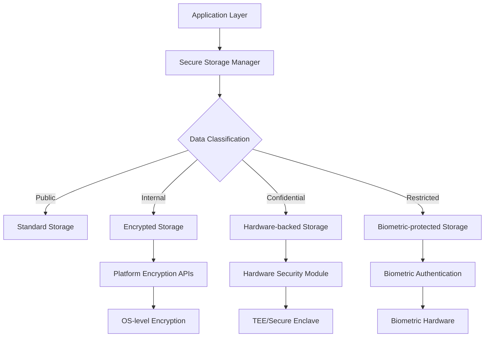

# Secure Storage

Secure storage is a fundamental security requirement for mobile applications handling sensitive data. This includes user credentials, API tokens, personal information, and financial data. Both Android and iOS provide platform-specific secure storage mechanisms that leverage hardware security features when available.

## Android Secure Storage

### EncryptedSharedPreferences

Android's `EncryptedSharedPreferences` provides automatic encryption/decryption of stored data using AES encryption with hardware-backed keys when available.

```kotlin
// Create MasterKey for encryption
val masterKey = MasterKey.Builder(context)
    .setKeyScheme(MasterKey.KeyScheme.AES256_GCM)
    .build()

// Create EncryptedSharedPreferences
val encryptedPrefs = EncryptedSharedPreferences.create(
    context,
    "secure_prefs",
    masterKey,
    EncryptedSharedPreferences.PrefKeyEncryptionScheme.AES256_SIV,
    EncryptedSharedPreferences.PrefValueEncryptionScheme.AES256_GCM
)

// Store sensitive data
encryptedPrefs.edit()
    .putString("auth_token", authToken)
    .putString("user_credentials", credentials)
    .apply()
```

### Android Keystore System

The Android Keystore system provides hardware-backed key storage for cryptographic operations.

```kotlin
// Generate keys in Android Keystore
val keyGenerator = KeyGenerator.getInstance(KeyProperties.KEY_ALGORITHM_AES, "AndroidKeyStore")
val keyGenParameterSpec = KeyGenParameterSpec.Builder(
    "secure_key",
    KeyProperties.PURPOSE_ENCRYPT or KeyProperties.PURPOSE_DECRYPT
)
    .setBlockModes(KeyProperties.BLOCK_MODE_GCM)
    .setEncryptionPaddings(KeyProperties.ENCRYPTION_PADDING_NONE)
    .setUserAuthenticationRequired(true)
    .setUserAuthenticationValidityDurationSeconds(300)
    .build()

keyGenerator.init(keyGenParameterSpec)
val secretKey = keyGenerator.generateKey()

// Use key for encryption
val cipher = Cipher.getInstance("AES/GCM/NoPadding")
cipher.init(Cipher.ENCRYPT_MODE, secretKey)
val encryptedData = cipher.doFinal(plainTextData.toByteArray())
```

### Key Management Features

#### Master Key Creation and Management
```kotlin
class SecureStorageManager {
    private val masterKey: MasterKey by lazy {
        MasterKey.Builder(context)
            .setKeyScheme(MasterKey.KeyScheme.AES256_GCM)
            .setRequestStrongBoxBacked(true) // Use StrongBox if available
            .build()
    }
    
    fun createEncryptedPreferences(fileName: String): SharedPreferences {
        return EncryptedSharedPreferences.create(
            context,
            fileName,
            masterKey,
            EncryptedSharedPreferences.PrefKeyEncryptionScheme.AES256_SIV,
            EncryptedSharedPreferences.PrefValueEncryptionScheme.AES256_GCM
        )
    }
}
```

#### Key Rotation Support
```kotlin
class KeyRotationManager {
    fun rotateKeys() {
        val oldPrefs = getEncryptedPreferences("old_key")
        val newPrefs = createNewEncryptedPreferences("new_key")
        
        // Migrate data to new encrypted storage
        val allData = oldPrefs.all
        newPrefs.edit().apply {
            allData.forEach { (key, value) ->
                when (value) {
                    is String -> putString(key, value)
                    is Boolean -> putBoolean(key, value)
                    is Int -> putInt(key, value)
                    // Handle other types
                }
            }
        }.apply()
        
        // Clear old storage
        oldPrefs.edit().clear().apply()
    }
}
```

## iOS Secure Storage

### Keychain Services

iOS Keychain provides secure storage for sensitive information with optional iCloud synchronization and biometric protection.

```swift
import Security
import LocalAuthentication

class KeychainManager {
    
    func store(data: Data, forKey key: String, requireBiometry: Bool = false) -> Bool {
        let query: [String: Any] = [
            kSecClass as String: kSecClassGenericPassword,
            kSecAttrAccount as String: key,
            kSecValueData as String: data,
            kSecAttrAccessible as String: kSecAttrAccessibleWhenUnlockedThisDeviceOnly
        ]
        
        var finalQuery = query
        
        if requireBiometry {
            let access = SecAccessControlCreateWithFlags(
                nil,
                kSecAttrAccessibleWhenUnlockedThisDeviceOnly,
                .biometryAny,
                nil
            )
            finalQuery[kSecAttrAccessControl as String] = access
        }
        
        // Delete existing item
        SecItemDelete(query as CFDictionary)
        
        // Add new item
        let status = SecItemAdd(finalQuery as CFDictionary, nil)
        return status == errSecSuccess
    }
    
    func retrieve(forKey key: String) -> Data? {
        let query: [String: Any] = [
            kSecClass as String: kSecClassGenericPassword,
            kSecAttrAccount as String: key,
            kSecReturnData as String: true,
            kSecMatchLimit as String: kSecMatchLimitOne
        ]
        
        var result: AnyObject?
        let status = SecItemCopyMatching(query as CFDictionary, &result)
        
        return status == errSecSuccess ? result as? Data : nil
    }
}
```

### Keychain Access Groups

Enable secure data sharing between apps from the same developer:

```swift
class SharedKeychainManager {
    private let accessGroup = "group.com.company.shared"
    
    func storeSharedData(data: Data, forKey key: String) -> Bool {
        let query: [String: Any] = [
            kSecClass as String: kSecClassGenericPassword,
            kSecAttrAccount as String: key,
            kSecValueData as String: data,
            kSecAttrAccessGroup as String: accessGroup,
            kSecAttrAccessible as String: kSecAttrAccessibleWhenUnlockedThisDeviceOnly
        ]
        
        SecItemDelete(query as CFDictionary)
        let status = SecItemAdd(query as CFDictionary, nil)
        return status == errSecSuccess
    }
}
```

### iCloud Keychain Synchronization

```swift
func storeWithiCloudSync(data: Data, forKey key: String) -> Bool {
    let query: [String: Any] = [
        kSecClass as String: kSecClassGenericPassword,
        kSecAttrAccount as String: key,
        kSecValueData as String: data,
        kSecAttrSynchronizable as String: true, // Enable iCloud sync
        kSecAttrAccessible as String: kSecAttrAccessibleWhenUnlocked
    ]
    
    SecItemDelete(query as CFDictionary)
    let status = SecItemAdd(query as CFDictionary, nil)
    return status == errSecSuccess
}
```

## Cross-Platform Secure Storage

### React Native Implementation

```typescript
import Keychain from 'react-native-keychain';
import EncryptedStorage from 'react-native-encrypted-storage';

class SecureStorageService {
    // Store credentials with biometric protection
    async storeCredentials(username: string, password: string): Promise<boolean> {
        try {
            await Keychain.setCredentials(username, password, {
                accessControl: Keychain.ACCESS_CONTROL.BIOMETRY_ANY,
                authenticatePrompt: 'Authenticate to access your credentials',
                service: 'MyAppService',
                storage: Keychain.STORAGE_TYPE.KC, // Keychain on iOS, Keystore on Android
            });
            return true;
        } catch (error) {
            console.error('Failed to store credentials:', error);
            return false;
        }
    }
    
    // Store general secure data
    async storeSecureData(key: string, value: string): Promise<void> {
        try {
            await EncryptedStorage.setItem(key, value);
        } catch (error) {
            console.error('Failed to store secure data:', error);
            throw error;
        }
    }
    
    async getSecureData(key: string): Promise<string | null> {
        try {
            return await EncryptedStorage.getItem(key);
        } catch (error) {
            console.error('Failed to retrieve secure data:', error);
            return null;
        }
    }
}
```

### Flutter Implementation

```dart
import 'package:flutter_secure_storage/flutter_secure_storage.dart';
import 'package:local_auth/local_auth.dart';

class SecureStorageService {
  static const _storage = FlutterSecureStorage(
    aOptions: AndroidOptions(
      encryptedSharedPreferences: true,
      keyCipherAlgorithm: KeyCipherAlgorithm.RSA_ECB_PKCS1Padding,
      storageCipherAlgorithm: StorageCipherAlgorithm.AES_GCM_NoPadding,
    ),
    iOptions: IOSOptions(
      accessibility: IOSAccessibility.first_unlock_this_device,
    ),
  );
  
  Future<void> storeSecureData(String key, String value, {bool requireBiometry = false}) async {
    Map<String, String> options = {};
    
    if (requireBiometry) {
      final localAuth = LocalAuthentication();
      final isAuthenticated = await localAuth.authenticate(
        localizedReason: 'Authenticate to store secure data',
        options: const AuthenticationOptions(
          biometricOnly: true,
          stickyAuth: true,
        ),
      );
      
      if (!isAuthenticated) {
        throw Exception('Biometric authentication failed');
      }
    }
    
    await _storage.write(key: key, value: value, aOptions: const AndroidOptions(
      requireAuthentication: true,
    ));
  }
  
  Future<String?> getSecureData(String key) async {
    try {
      return await _storage.read(key: key);
    } catch (e) {
      print('Error reading secure data: $e');
      return null;
    }
  }
}
```

## Best Practices for Secure Storage

### Data Classification
1. **Public Data**: No encryption required
2. **Internal Data**: Basic encryption
3. **Confidential Data**: Strong encryption + access controls
4. **Restricted Data**: Hardware-backed encryption + biometry

### Key Management Strategy
```kotlin
// Android key management example
class KeyManagementStrategy {
    companion object {
        const val KEY_ALIAS_AUTH_TOKEN = "auth_token_key"
        const val KEY_ALIAS_USER_DATA = "user_data_key"
        const val KEY_ALIAS_FINANCIAL = "financial_key"
    }
    
    fun getKeyForDataType(dataType: DataType): String {
        return when (dataType) {
            DataType.AUTH_TOKEN -> KEY_ALIAS_AUTH_TOKEN
            DataType.USER_DATA -> KEY_ALIAS_USER_DATA
            DataType.FINANCIAL -> KEY_ALIAS_FINANCIAL
        }
    }
    
    fun createKeyWithBiometricProtection(alias: String) {
        val keyGenParameterSpec = KeyGenParameterSpec.Builder(
            alias,
            KeyProperties.PURPOSE_ENCRYPT or KeyProperties.PURPOSE_DECRYPT
        )
            .setBlockModes(KeyProperties.BLOCK_MODE_GCM)
            .setEncryptionPaddings(KeyProperties.ENCRYPTION_PADDING_NONE)
            .setUserAuthenticationRequired(true)
            .setInvalidatedByBiometricEnrollment(true) // Key invalidated if biometry changes
            .build()
        
        val keyGenerator = KeyGenerator.getInstance(KeyProperties.KEY_ALGORITHM_AES, "AndroidKeyStore")
        keyGenerator.init(keyGenParameterSpec)
        keyGenerator.generateKey()
    }
}
```

### Secure Storage Architecture



### Error Handling and Fallbacks

```swift
class RobustSecureStorage {
    enum StorageError: Error {
        case biometryNotAvailable
        case biometryNotEnrolled
        case biometryLockout
        case keyNotFound
        case decryptionFailed
    }
    
    func secureStore(data: Data, key: String) async throws {
        do {
            // Try biometric-protected storage first
            try await storeBiometricProtected(data: data, key: key)
        } catch StorageError.biometryNotAvailable {
            // Fallback to passcode-protected storage
            try await storePasscodeProtected(data: data, key: key)
        } catch StorageError.biometryNotEnrolled {
            // Prompt user to enroll biometry or use passcode
            try await handleBiometryEnrollment(data: data, key: key)
        }
    }
    
    private func handleBiometryEnrollment(data: Data, key: String) async throws {
        // Implementation for handling biometry enrollment
    }
}
```

## Security Considerations

### Key Rotation
- Implement automatic key rotation for long-lived applications
- Provide migration paths for existing encrypted data
- Monitor key usage and lifecycle

### Backup and Recovery
- Design secure backup strategies for encrypted data
- Implement key escrow for enterprise environments
- Plan for device migration scenarios

### Compliance Requirements
- GDPR: Right to be forgotten implementation
- PCI DSS: Secure payment data storage
- HIPAA: Healthcare data protection
- SOX: Financial data integrity

Secure storage is the foundation of mobile application security. Proper implementation using platform-specific APIs, combined with sound key management practices, ensures that sensitive user data remains protected even if the device is compromised.
