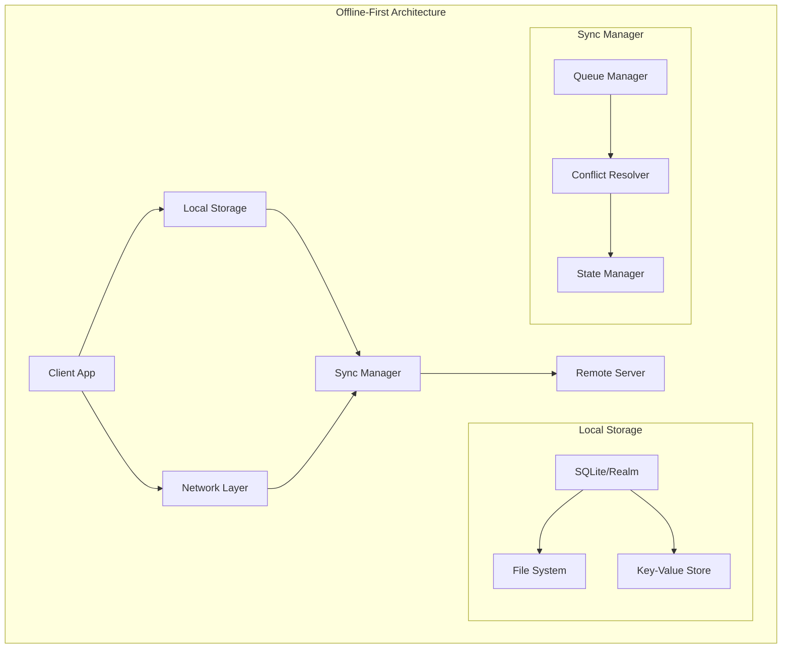
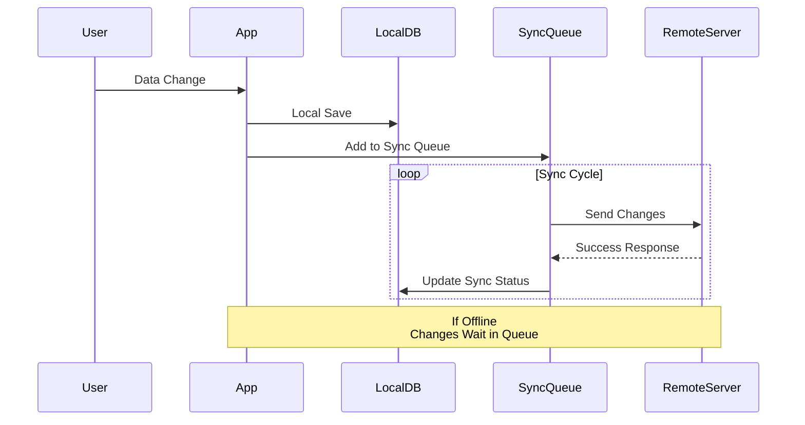
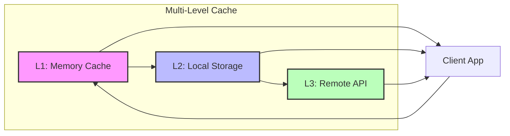

# Offline-First Design

## Introduction to Offline-First Architecture

Offline-first design is a development methodology that prioritizes functionality even when network connectivity is unreliable or absent. This approach ensures mobile applications remain responsive and useful regardless of connection status.

## Architecture Overview



## Data Synchronization Flow



## Multi-Level Cache System



## Core Principles

### 1. Local-First Data Storage
- **Primary Storage**: Local database serves as the single source of truth
- **Sync Secondary**: Network synchronization happens asynchronously
- **Data Ownership**: Users maintain control of their data locally

### 2. Progressive Enhancement
- **Base Functionality**: Core features work without network
- **Enhanced Features**: Additional capabilities unlock with connectivity
- **Graceful Degradation**: Smooth transition between online/offline states

### 3. Eventual Consistency
- **Conflict Resolution**: Systematic handling of data conflicts
- **Merge Strategies**: Intelligent data merging when reconnecting
- **Version Control**: Track data changes for conflict resolution

## Implementation Strategies

### Local-First Architecture
```javascript
// Example: Local-first data manager
class OfflineDataManager {
  constructor() {
    this.localDB = new LocalDatabase();
    this.syncQueue = new SyncQueue();
    this.conflictResolver = new ConflictResolver();
  }

  async saveData(data) {
    // Always save locally first
    const localResult = await this.localDB.save(data);
    
    // Queue for sync when online
    this.syncQueue.add({
      operation: 'CREATE',
      data: data,
      timestamp: Date.now()
    });
    
    return localResult;
  }

  async getData(id) {
    // Always read from local first
    return await this.localDB.get(id);
  }
}
```

### Offline State Management
```javascript
// Connection state monitoring
class ConnectionManager {
  constructor() {
    this.isOnline = navigator.onLine;
    this.listeners = [];
    
    window.addEventListener('online', () => {
      this.isOnline = true;
      this.notifyListeners('online');
    });
    
    window.addEventListener('offline', () => {
      this.isOnline = false;
      this.notifyListeners('offline');
    });
  }

  onStateChange(callback) {
    this.listeners.push(callback);
  }

  notifyListeners(state) {
    this.listeners.forEach(callback => callback(state));
  }
}
```

## Data Synchronization Patterns

### 1. Queue-Based Sync
- **Operation Queue**: Store all offline operations
- **Batch Processing**: Sync multiple operations together
- **Retry Logic**: Handle failed sync attempts

### 2. Delta Synchronization
- **Change Tracking**: Only sync modified data
- **Incremental Updates**: Reduce bandwidth usage
- **Timestamp-Based**: Use timestamps for change detection

### 3. Bidirectional Sync
- **Two-Way Sync**: Handle both upload and download
- **Conflict Detection**: Identify competing changes
- **Resolution Strategies**: Apply appropriate conflict resolution

## Offline User Experience

### Visual Indicators
```css
/* Offline state indicators */
.offline-indicator {
  background: #ff6b6b;
  color: white;
  padding: 8px;
  text-align: center;
  position: fixed;
  top: 0;
  width: 100%;
  z-index: 1000;
}

.sync-pending {
  background: #ffd93d;
  color: #333;
}

.sync-complete {
  background: #6bcf7f;
  color: white;
}
```

### Progress Feedback
- **Sync Status**: Show synchronization progress
- **Queue Count**: Display pending operations
- **Error Handling**: Clear error messages and recovery options

## Performance Optimization

### 1. Intelligent Caching
```javascript
class SmartCache {
  constructor(maxSize = 100) {
    this.cache = new Map();
    this.maxSize = maxSize;
    this.accessCount = new Map();
  }

  set(key, value, priority = 1) {
    if (this.cache.size >= this.maxSize) {
      this.evictLeastUsed();
    }
    
    this.cache.set(key, {
      value,
      priority,
      timestamp: Date.now()
    });
  }

  get(key) {
    const item = this.cache.get(key);
    if (item) {
      this.accessCount.set(key, (this.accessCount.get(key) || 0) + 1);
      return item.value;
    }
    return null;
  }

  evictLeastUsed() {
    let leastUsedKey = null;
    let minCount = Infinity;
    
    for (const [key, count] of this.accessCount) {
      if (count < minCount) {
        minCount = count;
        leastUsedKey = key;
      }
    }
    
    if (leastUsedKey) {
      this.cache.delete(leastUsedKey);
      this.accessCount.delete(leastUsedKey);
    }
  }
}
```

### 2. Lazy Loading
- **On-Demand Data**: Load data only when needed
- **Progressive Loading**: Load critical data first
- **Background Prefetch**: Preload likely-needed data

### 3. Compression Strategies
- **Data Compression**: Compress large datasets
- **Image Optimization**: Reduce image sizes for offline storage
- **JSON Optimization**: Remove unnecessary data fields

## Security Considerations

### Data Encryption
```javascript
// Local data encryption
class SecureStorage {
  constructor(encryptionKey) {
    this.key = encryptionKey;
    this.crypto = new SubtleCrypto();
  }

  async encryptData(data) {
    const encoder = new TextEncoder();
    const dataBuffer = encoder.encode(JSON.stringify(data));
    
    const encrypted = await this.crypto.encrypt(
      { name: 'AES-GCM', iv: new Uint8Array(12) },
      this.key,
      dataBuffer
    );
    
    return encrypted;
  }

  async decryptData(encryptedData) {
    const decrypted = await this.crypto.decrypt(
      { name: 'AES-GCM', iv: new Uint8Array(12) },
      this.key,
      encryptedData
    );
    
    const decoder = new TextDecoder();
    return JSON.parse(decoder.decode(decrypted));
  }
}
```

### Authentication Handling
- **Token Storage**: Secure local token storage
- **Refresh Logic**: Handle token refresh offline
- **Fallback Auth**: Alternative authentication methods

## Testing Strategies

### 1. Offline Simulation
```javascript
// Network condition simulation
class NetworkSimulator {
  constructor() {
    this.conditions = {
      offline: { latency: 0, bandwidth: 0, available: false },
      slow: { latency: 2000, bandwidth: 56, available: true },
      fast: { latency: 50, bandwidth: 1000, available: true }
    };
  }

  setCondition(type) {
    const condition = this.conditions[type];
    
    // Override fetch to simulate network conditions
    const originalFetch = window.fetch;
    window.fetch = async (...args) => {
      if (!condition.available) {
        throw new Error('Network unavailable');
      }
      
      await this.delay(condition.latency);
      return originalFetch(...args);
    };
  }

  delay(ms) {
    return new Promise(resolve => setTimeout(resolve, ms));
  }
}
```

### 2. Automated Testing
- **Unit Tests**: Test offline functionality
- **Integration Tests**: Test sync mechanisms
- **E2E Tests**: Test complete offline workflows

## Best Practices

### 1. Design Guidelines
- **Offline-First Mindset**: Design for offline from the start
- **Progressive Enhancement**: Build base functionality first
- **Clear Communication**: Keep users informed of sync status

### 2. Performance Guidelines
- **Efficient Storage**: Use appropriate data structures
- **Smart Sync**: Sync only necessary data
- **Battery Optimization**: Minimize background processes

### 3. User Experience Guidelines
- **Seamless Transitions**: Smooth online/offline transitions
- **Clear Feedback**: Show sync status and conflicts
- **Recovery Options**: Provide clear error recovery paths

## Platform-Specific Considerations

### iOS Implementation
```swift
// iOS offline detection
import Network

class NetworkMonitor {
    private let monitor = NWPathMonitor()
    private let queue = DispatchQueue(label: "NetworkMonitor")
    
    var isConnected: Bool = false
    var connectionType: ConnectionType = .unknown
    
    func startMonitoring() {
        monitor.pathUpdateHandler = { [weak self] path in
            self?.isConnected = path.status == .satisfied
            
            if path.usesInterfaceType(.wifi) {
                self?.connectionType = .wifi
            } else if path.usesInterfaceType(.cellular) {
                self?.connectionType = .cellular
            } else {
                self?.connectionType = .unknown
            }
        }
        
        monitor.start(queue: queue)
    }
}
```

### Android Implementation
```kotlin
// Android offline capabilities
class OfflineManager(private val context: Context) {
    private val connectivityManager = context.getSystemService(Context.CONNECTIVITY_SERVICE) 
        as ConnectivityManager
    
    fun isNetworkAvailable(): Boolean {
        val network = connectivityManager.activeNetwork ?: return false
        val capabilities = connectivityManager.getNetworkCapabilities(network) ?: return false
        
        return capabilities.hasTransport(NetworkCapabilities.TRANSPORT_WIFI) ||
               capabilities.hasTransport(NetworkCapabilities.TRANSPORT_CELLULAR) ||
               capabilities.hasTransport(NetworkCapabilities.TRANSPORT_ETHERNET)
    }
    
    fun registerNetworkCallback(callback: ConnectivityManager.NetworkCallback) {
        val request = NetworkRequest.Builder()
            .addCapability(NetworkCapabilities.NET_CAPABILITY_INTERNET)
            .build()
        
        connectivityManager.registerNetworkCallback(request, callback)
    }
}
```

## Conclusion

Offline-first design is essential for creating robust mobile applications that provide consistent user experiences regardless of network conditions. By implementing proper local storage, intelligent synchronization, and clear user feedback, developers can build applications that users can rely on in any situation.

The key to successful offline-first implementation is planning for offline scenarios from the beginning of development, rather than treating them as edge cases to handle later.
