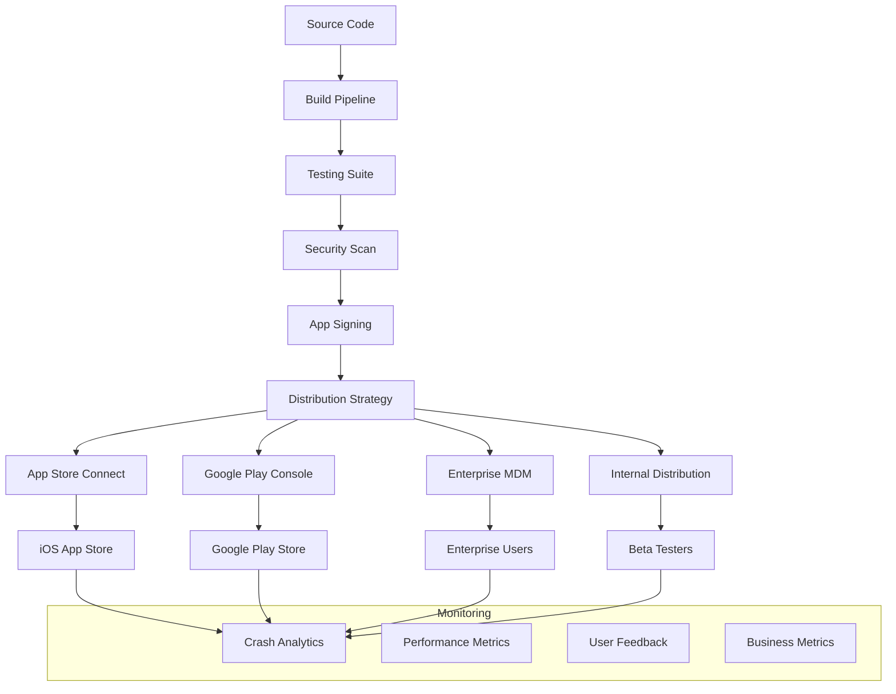

# Mobile Application Deployment Strategies

Deployment strategies for mobile applications encompass the entire process of delivering applications to end users through app stores, enterprise distribution, and alternative distribution channels while ensuring reliability, performance, and user satisfaction.

## Table of Contents
1. [Deployment Architecture](#deployment-architecture)
2. [App Store Deployment](#app-store-deployment)
3. [Enterprise Deployment](#enterprise-deployment)
4. [Phased Rollout Strategies](#phased-rollout-strategies)
5. [Blue-Green Deployment](#blue-green-deployment)
6. [Monitoring & Analytics](#monitoring--analytics)

## Deployment Architecture

### Deployment Pipeline Overview



### Deployment Environments

1. **Development**: Internal testing and development
2. **Staging**: Pre-production testing environment
3. **Beta**: Limited user testing
4. **Production**: Full public release
5. **Hotfix**: Emergency production updates

## App Store Deployment

### 1. iOS App Store Deployment

```yaml
# Fastlane configuration for iOS deployment
# fastlane/Fastfile

default_platform(:ios)

platform :ios do
  before_all do
    ensure_git_status_clean
    cocoapods
  end

  desc "Build and test the app"
  lane :test do
    run_tests(
      scheme: "MyApp",
      device: "iPhone 14",
      clean: true
    )
  end

  desc "Build for App Store submission"
  lane :build_appstore do
    increment_build_number(xcodeproj: "MyApp.xcodeproj")
    
    build_app(
      scheme: "MyApp",
      configuration: "Release",
      export_method: "app-store",
      output_directory: "./build/",
      clean: true
    )
  end

  desc "Upload to TestFlight"
  lane :beta do
    test
    build_appstore
    
    upload_to_testflight(
      beta_app_description: ENV["BETA_DESCRIPTION"],
      beta_app_feedback_email: ENV["FEEDBACK_EMAIL"],
      notify_external_testers: true,
      groups: ["Internal Testers", "Beta Users"]
    )
    
    slack(
      message: "iOS Beta build uploaded to TestFlight! 🚀",
      channel: "#mobile-releases"
    )
  end

  desc "Deploy to App Store"
  lane :release do
    test
    build_appstore
    
    # Upload to App Store Connect
    upload_to_app_store(
      submit_for_review: false,
      metadata_path: "./metadata/ios",
      screenshots_path: "./screenshots/ios",
      force: true
    )
    
    # Submit for review automatically (optional)
    deliver(
      submit_for_review: true,
      automatic_release: false,
      submission_information: {
        add_id_info_uses_idfa: false,
        add_id_info_serves_ads: false,
        add_id_info_tracks_install: true,
        add_id_info_tracks_action: false,
        add_id_info_limits_tracking: true
      }
    )
    
    slack(
      message: "iOS app submitted for review! 📱",
      channel: "#mobile-releases"
    )
  end

  desc "Emergency hotfix deployment"
  lane :hotfix do |options|
    version = options[:version]
    
    # Checkout hotfix branch
    sh "git checkout hotfix/#{version}"
    
    # Build and deploy immediately
    test
    build_appstore
    
    upload_to_app_store(
      submit_for_review: true,
      automatic_release: true,
      metadata_path: "./metadata/ios",
      force: true
    )
    
    slack(
      message: "🚨 Emergency hotfix #{version} deployed to iOS App Store",
      channel: "#mobile-alerts"
    )
  end

  error do |lane, exception|
    slack(
      message: "iOS deployment failed: #{exception.message}",
      channel: "#mobile-alerts",
      success: false
    )
  end
end
```

### 2. Android Play Store Deployment

```yaml
# Fastlane configuration for Android deployment
# fastlane/Fastfile

default_platform(:android)

platform :android do
  desc "Build and test the app"
  lane :test do
    gradle(task: "test")
    gradle(task: "connectedAndroidTest")
  end

  desc "Build release APK and AAB"
  lane :build_release do
    # Increment version code
    increment_version_code(
      gradle_file_path: "app/build.gradle"
    )
    
    # Build release
    gradle(
      task: "bundle",
      build_type: "Release",
      flags: "--stacktrace"
    )
    
    # Sign the bundle
    sign_apk(
      apk_path: "app/build/outputs/bundle/release/app-release.aab",
      signed_apk_path: "app/build/outputs/bundle/release/app-release-signed.aab"
    )
  end

  desc "Deploy to internal testing"
  lane :internal do
    test
    build_release
    
    upload_to_play_store(
      track: "internal",
      aab: "app/build/outputs/bundle/release/app-release-signed.aab",
      skip_upload_metadata: true,
      skip_upload_images: true,
      skip_upload_screenshots: true
    )
    
    slack(
      message: "Android internal build uploaded! 🤖",
      channel: "#mobile-releases"
    )
  end

  desc "Deploy to beta testing"
  lane :beta do
    test
    build_release
    
    upload_to_play_store(
      track: "beta",
      aab: "app/build/outputs/bundle/release/app-release-signed.aab",
      metadata_path: "./metadata/android",
      skip_upload_images: true
    )
    
    slack(
      message: "Android beta build uploaded to Play Store! 🚀",
      channel: "#mobile-releases"
    )
  end

  desc "Deploy to production"
  lane :release do
    test
    build_release
    
    # Upload to production track
    upload_to_play_store(
      track: "production",
      aab: "app/build/outputs/bundle/release/app-release-signed.aab",
      metadata_path: "./metadata/android",
      screenshots_path: "./screenshots/android",
      release_status: "draft" # Don't auto-publish
    )
    
    slack(
      message: "Android app uploaded to Play Store production track! 📱",
      channel: "#mobile-releases"
    )
  end

  desc "Gradual rollout to production"
  lane :gradual_release do |options|
    percentage = options[:percentage] || 5
    
    upload_to_play_store(
      track: "production",
      aab: "app/build/outputs/bundle/release/app-release-signed.aab",
      rollout: percentage.to_s
    )
    
    slack(
      message: "Android gradual rollout started at #{percentage}%! 📊",
      channel: "#mobile-releases"
    )
  end

  desc "Emergency hotfix"
  lane :hotfix do |options|
    version = options[:version]
    
    sh "git checkout hotfix/#{version}"
    
    test
    build_release
    
    upload_to_play_store(
      track: "production",
      aab: "app/build/outputs/bundle/release/app-release-signed.aab",
      rollout: "100"
    )
    
    slack(
      message: "🚨 Emergency hotfix #{version} deployed to Android Play Store",
      channel: "#mobile-alerts"
    )
  end

  error do |lane, exception|
    slack(
      message: "Android deployment failed: #{exception.message}",
      channel: "#mobile-alerts",
      success: false
    )
  end
end
```

### 3. GitHub Actions CI/CD Pipeline

```yaml
# .github/workflows/mobile-deployment.yml
name: Mobile App Deployment

on:
  push:
    branches: [main, develop, 'hotfix/*']
    tags: ['v*']
  pull_request:
    branches: [main, develop]

env:
  FLUTTER_VERSION: '3.16.0'
  NODE_VERSION: '18'

jobs:
  test:
    runs-on: ubuntu-latest
    steps:
      - uses: actions/checkout@v4
      
      - name: Setup Node.js
        uses: actions/setup-node@v4
        with:
          node-version: ${{ env.NODE_VERSION }}
          cache: 'npm'
      
      - name: Install dependencies
        run: npm ci
      
      - name: Run tests
        run: npm test
      
      - name: Run linting
        run: npm run lint
      
      - name: Security audit
        run: npm audit --audit-level high

  build-ios:
    needs: test
    runs-on: macos-latest
    if: github.ref == 'refs/heads/main' || startsWith(github.ref, 'refs/tags/v')
    
    steps:
      - uses: actions/checkout@v4
      
      - name: Setup Ruby
        uses: ruby/setup-ruby@v1
        with:
          ruby-version: '3.0'
          bundler-cache: true
      
      - name: Setup Xcode
        uses: maxim-lobanov/setup-xcode@v1
        with:
          xcode-version: '15.0'
      
      - name: Install CocoaPods
        run: |
          cd ios
          pod install
      
      - name: Install certificates
        env:
          BUILD_CERTIFICATE_BASE64: ${{ secrets.BUILD_CERTIFICATE_BASE64 }}
          P12_PASSWORD: ${{ secrets.P12_PASSWORD }}
          KEYCHAIN_PASSWORD: ${{ secrets.KEYCHAIN_PASSWORD }}
        run: |
          # Create keychain
          security create-keychain -p "$KEYCHAIN_PASSWORD" build.keychain
          security default-keychain -s build.keychain
          security unlock-keychain -p "$KEYCHAIN_PASSWORD" build.keychain
          
          # Import certificate
          echo -n "$BUILD_CERTIFICATE_BASE64" | base64 --decode --output certificate.p12
          security import certificate.p12 -k build.keychain -P "$P12_PASSWORD" -T /usr/bin/codesign
          security set-key-partition-list -S apple-tool:,apple:,codesign: -s -k "$KEYCHAIN_PASSWORD" build.keychain
      
      - name: Install provisioning profile
        env:
          PROVISIONING_CERTIFICATE_BASE64: ${{ secrets.PROVISIONING_CERTIFICATE_BASE64 }}
        run: |
          mkdir -p ~/Library/MobileDevice/Provisioning\ Profiles
          echo -n "$PROVISIONING_CERTIFICATE_BASE64" | base64 --decode --output ~/Library/MobileDevice/Provisioning\ Profiles/build_pp.mobileprovision
      
      - name: Build and deploy iOS
        env:
          FASTLANE_USER: ${{ secrets.FASTLANE_USER }}
          FASTLANE_PASSWORD: ${{ secrets.FASTLANE_PASSWORD }}
          FASTLANE_APPLE_APPLICATION_SPECIFIC_PASSWORD: ${{ secrets.FASTLANE_APPLE_APPLICATION_SPECIFIC_PASSWORD }}
          MATCH_PASSWORD: ${{ secrets.MATCH_PASSWORD }}
        run: |
          cd ios
          if [[ "${{ github.ref }}" == "refs/heads/main" ]]; then
            bundle exec fastlane beta
          elif [[ "${{ github.ref }}" == refs/tags/v* ]]; then
            bundle exec fastlane release
          elif [[ "${{ github.ref }}" == refs/heads/hotfix/* ]]; then
            VERSION=$(echo "${{ github.ref }}" | sed 's/refs\/heads\/hotfix\///')
            bundle exec fastlane hotfix version:$VERSION
          fi

  build-android:
    needs: test
    runs-on: ubuntu-latest
    if: github.ref == 'refs/heads/main' || startsWith(github.ref, 'refs/tags/v')
    
    steps:
      - uses: actions/checkout@v4
      
      - name: Setup Java
        uses: actions/setup-java@v4
        with:
          distribution: 'temurin'
          java-version: '17'
      
      - name: Setup Ruby
        uses: ruby/setup-ruby@v1
        with:
          ruby-version: '3.0'
          bundler-cache: true
      
      - name: Setup Android SDK
        uses: android-actions/setup-android@v3
      
      - name: Decode keystore
        env:
          ENCODED_STRING: ${{ secrets.ANDROID_KEYSTORE_BASE64 }}
        run: |
          echo $ENCODED_STRING | base64 -di > android/app/keystore.jks
      
      - name: Build and deploy Android
        env:
          ANDROID_KEYSTORE_PASSWORD: ${{ secrets.ANDROID_KEYSTORE_PASSWORD }}
          ANDROID_KEY_ALIAS: ${{ secrets.ANDROID_KEY_ALIAS }}
          ANDROID_KEY_PASSWORD: ${{ secrets.ANDROID_KEY_PASSWORD }}
          GOOGLE_PLAY_JSON_KEY: ${{ secrets.GOOGLE_PLAY_JSON_KEY }}
        run: |
          cd android
          echo "$GOOGLE_PLAY_JSON_KEY" > google-play-key.json
          
          if [[ "${{ github.ref }}" == "refs/heads/main" ]]; then
            bundle exec fastlane beta
          elif [[ "${{ github.ref }}" == refs/tags/v* ]]; then
            bundle exec fastlane release
          elif [[ "${{ github.ref }}" == refs/heads/hotfix/* ]]; then
            VERSION=$(echo "${{ github.ref }}" | sed 's/refs\/heads\/hotfix\///')
            bundle exec fastlane hotfix version:$VERSION
          fi

  deploy-web:
    needs: test
    runs-on: ubuntu-latest
    if: github.ref == 'refs/heads/main'
    
    steps:
      - uses: actions/checkout@v4
      
      - name: Setup Node.js
        uses: actions/setup-node@v4
        with:
          node-version: ${{ env.NODE_VERSION }}
          cache: 'npm'
      
      - name: Install dependencies
        run: npm ci
      
      - name: Build web app
        run: npm run build:web
      
      - name: Deploy to S3
        env:
          AWS_ACCESS_KEY_ID: ${{ secrets.AWS_ACCESS_KEY_ID }}
          AWS_SECRET_ACCESS_KEY: ${{ secrets.AWS_SECRET_ACCESS_KEY }}
        run: |
          aws s3 sync build/ s3://${{ secrets.S3_BUCKET }} --delete
          aws cloudfront create-invalidation --distribution-id ${{ secrets.CLOUDFRONT_DISTRIBUTION_ID }} --paths "/*"

  notify:
    needs: [build-ios, build-android]
    runs-on: ubuntu-latest
    if: always()
    
    steps:
      - name: Notify Slack
        uses: 8398a7/action-slack@v3
        with:
          status: ${{ job.status }}
          channel: '#mobile-releases'
          webhook_url: ${{ secrets.SLACK_WEBHOOK }}
        env:
          SLACK_WEBHOOK_URL: ${{ secrets.SLACK_WEBHOOK }}
```

## Enterprise Deployment

### 1. Mobile Device Management (MDM) Integration

```typescript
// Enterprise deployment service
import express from 'express';
import multer from 'multer';
import AWS from 'aws-sdk';
import jwt from 'jsonwebtoken';

interface EnterpriseApp {
  id: string;
  name: string;
  version: string;
  platform: 'ios' | 'android';
  bundleId: string;
  downloadUrl: string;
  installUrl?: string;
  manifestUrl?: string;
  createdAt: Date;
  organizationId: string;
}

class EnterpriseDeploymentService {
  private s3: AWS.S3;
  private dynamoDB: AWS.DynamoDB.DocumentClient;
  
  constructor() {
    this.s3 = new AWS.S3();
    this.dynamoDB = new AWS.DynamoDB.DocumentClient();
  }
  
  async uploadApp(
    file: Express.Multer.File,
    metadata: Partial<EnterpriseApp>
  ): Promise<EnterpriseApp> {
    // Upload to S3
    const key = `enterprise-apps/${metadata.organizationId}/${metadata.platform}/${metadata.name}-${metadata.version}.${this.getFileExtension(file)}`;
    
    const uploadResult = await this.s3.upload({
      Bucket: process.env.ENTERPRISE_APPS_BUCKET!,
      Key: key,
      Body: file.buffer,
      ContentType: file.mimetype,
      Metadata: {
        appName: metadata.name!,
        version: metadata.version!,
        platform: metadata.platform!
      }
    }).promise();
    
    // Generate signed download URL
    const downloadUrl = await this.s3.getSignedUrl('getObject', {
      Bucket: process.env.ENTERPRISE_APPS_BUCKET!,
      Key: key,
      Expires: 86400 // 24 hours
    });
    
    const app: EnterpriseApp = {
      id: this.generateId(),
      name: metadata.name!,
      version: metadata.version!,
      platform: metadata.platform!,
      bundleId: metadata.bundleId!,
      downloadUrl,
      createdAt: new Date(),
      organizationId: metadata.organizationId!
    };
    
    // Create platform-specific installation URLs
    if (metadata.platform === 'ios') {
      app.manifestUrl = await this.createiOSManifest(app);
      app.installUrl = `itms-services://?action=download-manifest&url=${encodeURIComponent(app.manifestUrl)}`;
    } else {
      app.installUrl = downloadUrl;
    }
    
    // Store in database
    await this.dynamoDB.put({
      TableName: 'EnterpriseApps',
      Item: app
    }).promise();
    
    return app;
  }
  
  private async createiOSManifest(app: EnterpriseApp): Promise<string> {
    const manifest = {
      items: [
        {
          assets: [
            {
              kind: 'software-package',
              url: app.downloadUrl
            }
          ],
          metadata: {
            'bundle-identifier': app.bundleId,
            'bundle-version': app.version,
            kind: 'software',
            title: app.name
          }
        }
      ]
    };
    
    const manifestKey = `manifests/${app.organizationId}/${app.id}.plist`;
    
    await this.s3.upload({
      Bucket: process.env.ENTERPRISE_APPS_BUCKET!,
      Key: manifestKey,
      Body: this.generatePlist(manifest),
      ContentType: 'application/xml'
    }).promise();
    
    return `https://${process.env.ENTERPRISE_APPS_BUCKET}.s3.amazonaws.com/${manifestKey}`;
  }
  
  async getAppsForOrganization(organizationId: string): Promise<EnterpriseApp[]> {
    const result = await this.dynamoDB.query({
      TableName: 'EnterpriseApps',
      IndexName: 'OrganizationIndex',
      KeyConditionExpression: 'organizationId = :orgId',
      ExpressionAttributeValues: {
        ':orgId': organizationId
      },
      ScanIndexForward: false
    }).promise();
    
    return result.Items as EnterpriseApp[];
  }
  
  async generateInstallationToken(
    appId: string,
    userId: string,
    expiresIn: string = '7d'
  ): Promise<string> {
    return jwt.sign(
      { appId, userId },
      process.env.JWT_SECRET!,
      { expiresIn }
    );
  }
  
  private generatePlist(manifest: any): string {
    return `<?xml version="1.0" encoding="UTF-8"?>
<!DOCTYPE plist PUBLIC "-//Apple//DTD PLIST 1.0//EN" "http://www.apple.com/DTDs/PropertyList-1.0.dtd">
<plist version="1.0">
${this.convertToPlist(manifest)}
</plist>`;
  }
  
  private convertToPlist(obj: any): string {
    // Convert JavaScript object to Apple plist format
    // Implementation details...
    return JSON.stringify(obj); // Simplified
  }
  
  private getFileExtension(file: Express.Multer.File): string {
    return file.originalname.split('.').pop() || '';
  }
  
  private generateId(): string {
    return Math.random().toString(36).substr(2, 9);
  }
}

// Express routes for enterprise deployment
const app = express();
const deploymentService = new EnterpriseDeploymentService();
const upload = multer({ storage: multer.memoryStorage() });

// Upload enterprise app
app.post('/api/enterprise/apps', upload.single('app'), async (req, res) => {
  try {
    const app = await deploymentService.uploadApp(req.file!, req.body);
    res.json(app);
  } catch (error) {
    res.status(500).json({ error: error.message });
  }
});

// Get apps for organization
app.get('/api/enterprise/apps/:organizationId', async (req, res) => {
  try {
    const apps = await deploymentService.getAppsForOrganization(req.params.organizationId);
    res.json(apps);
  } catch (error) {
    res.status(500).json({ error: error.message });
  }
});

// Generate installation token
app.post('/api/enterprise/apps/:appId/install-token', async (req, res) => {
  try {
    const { userId } = req.body;
    const token = await deploymentService.generateInstallationToken(req.params.appId, userId);
    res.json({ token });
  } catch (error) {
    res.status(500).json({ error: error.message });
  }
});
```

### 2. Over-the-Air (OTA) Updates for Enterprise

```typescript
// Enterprise OTA update system
class EnterpriseOTAService {
  private updateChannel: string = 'enterprise';
  
  async checkForUpdates(
    appId: string,
    currentVersion: string,
    organizationId: string
  ): Promise<UpdateInfo | null> {
    const latestApp = await this.getLatestVersion(appId, organizationId);
    
    if (!latestApp || this.compareVersions(latestApp.version, currentVersion) <= 0) {
      return null;
    }
    
    return {
      version: latestApp.version,
      downloadUrl: latestApp.downloadUrl,
      installUrl: latestApp.installUrl,
      releaseNotes: await this.getReleaseNotes(latestApp.id),
      isMandatory: await this.isMandatoryUpdate(appId, currentVersion, latestApp.version),
      size: await this.getAppSize(latestApp.downloadUrl)
    };
  }
  
  async deployUpdate(
    appId: string,
    version: string,
    organizationId: string,
    deploymentConfig: DeploymentConfig
  ): Promise<void> {
    // Create deployment record
    const deployment = {
      id: this.generateId(),
      appId,
      version,
      organizationId,
      strategy: deploymentConfig.strategy,
      targetGroups: deploymentConfig.targetGroups,
      rolloutPercentage: deploymentConfig.rolloutPercentage || 100,
      createdAt: new Date(),
      status: 'active'
    };
    
    await this.dynamoDB.put({
      TableName: 'EnterpriseDeployments',
      Item: deployment
    }).promise();
    
    // Notify target users
    await this.notifyUsers(deployment);
    
    // Schedule rollout phases if gradual
    if (deploymentConfig.strategy === 'gradual') {
      await this.scheduleGradualRollout(deployment);
    }
  }
  
  private async notifyUsers(deployment: any): Promise<void> {
    // Get users in target groups
    const users = await this.getUsersInGroups(deployment.targetGroups);
    
    // Send push notifications
    const pushService = new PushNotificationService();
    await pushService.sendToUsers(users, {
      title: 'App Update Available',
      body: 'A new version of the app is available for download.',
      data: {
        type: 'app_update',
        appId: deployment.appId,
        version: deployment.version
      }
    });
    
    // Send email notifications
    const emailService = new EmailService();
    await emailService.sendUpdateNotification(users, deployment);
  }
  
  private async scheduleGradualRollout(deployment: any): Promise<void> {
    const phases = [
      { percentage: 10, delay: 0 },
      { percentage: 25, delay: 24 * 60 * 60 * 1000 }, // 24 hours
      { percentage: 50, delay: 48 * 60 * 60 * 1000 }, // 48 hours
      { percentage: 100, delay: 72 * 60 * 60 * 1000 } // 72 hours
    ];
    
    for (const phase of phases) {
      setTimeout(async () => {
        await this.updateRolloutPercentage(deployment.id, phase.percentage);
      }, phase.delay);
    }
  }
}
```

## Phased Rollout Strategies

### 1. Canary Deployment

```typescript
// Canary deployment implementation
class CanaryDeploymentManager {
  private canaryPercentage: number = 5;
  private monitoringWindow: number = 24 * 60 * 60 * 1000; // 24 hours
  
  async startCanaryDeployment(
    appVersion: string,
    platform: 'ios' | 'android'
  ): Promise<CanaryDeployment> {
    const deployment: CanaryDeployment = {
      id: this.generateId(),
      version: appVersion,
      platform,
      status: 'active',
      canaryPercentage: this.canaryPercentage,
      startTime: new Date(),
      metrics: {
        crashRate: 0,
        errorRate: 0,
        performanceScore: 0,
        userFeedback: 0
      }
    };
    
    // Start deployment
    await this.deployToCanaryUsers(deployment);
    
    // Start monitoring
    this.startMonitoring(deployment);
    
    return deployment;
  }
  
  private async deployToCanaryUsers(deployment: CanaryDeployment): Promise<void> {
    // Get canary user list
    const canaryUsers = await this.getCanaryUsers(
      deployment.platform,
      deployment.canaryPercentage
    );
    
    // Deploy to selected users
    if (deployment.platform === 'ios') {
      await this.deployiOSCanary(deployment.version, canaryUsers);
    } else {
      await this.deployAndroidCanary(deployment.version, canaryUsers);
    }
  }
  
  private startMonitoring(deployment: CanaryDeployment): void {
    const monitoringInterval = setInterval(async () => {
      const metrics = await this.collectMetrics(deployment);
      deployment.metrics = metrics;
      
      const decision = this.evaluateCanaryHealth(metrics);
      
      switch (decision) {
        case 'promote':
          await this.promoteCanary(deployment);
          clearInterval(monitoringInterval);
          break;
        case 'rollback':
          await this.rollbackCanary(deployment);
          clearInterval(monitoringInterval);
          break;
        case 'continue':
          // Continue monitoring
          break;
      }
    }, 60 * 60 * 1000); // Check every hour
    
    // Auto-promote after monitoring window if healthy
    setTimeout(() => {
      if (deployment.status === 'active') {
        this.promoteCanary(deployment);
        clearInterval(monitoringInterval);
      }
    }, this.monitoringWindow);
  }
  
  private evaluateCanaryHealth(metrics: CanaryMetrics): 'promote' | 'rollback' | 'continue' {
    const thresholds = {
      maxCrashRate: 0.02, // 2%
      maxErrorRate: 0.05, // 5%
      minPerformanceScore: 80,
      minUserFeedback: 3.5
    };
    
    if (metrics.crashRate > thresholds.maxCrashRate ||
        metrics.errorRate > thresholds.maxErrorRate ||
        metrics.performanceScore < thresholds.minPerformanceScore ||
        metrics.userFeedback < thresholds.minUserFeedback) {
      return 'rollback';
    }
    
    // If metrics are stable for sufficient time, promote
    if (this.areMetricsStable(metrics)) {
      return 'promote';
    }
    
    return 'continue';
  }
  
  private async promoteCanary(deployment: CanaryDeployment): Promise<void> {
    deployment.status = 'promoted';
    
    // Deploy to all users
    if (deployment.platform === 'ios') {
      await this.promoteiOSVersion(deployment.version);
    } else {
      await this.promoteAndroidVersion(deployment.version);
    }
    
    // Notify team
    await this.notifyPromotion(deployment);
  }
  
  private async rollbackCanary(deployment: CanaryDeployment): Promise<void> {
    deployment.status = 'rolled_back';
    
    // Rollback canary users to previous version
    await this.rollbackCanaryUsers(deployment);
    
    // Alert team
    await this.alertRollback(deployment);
  }
}
```

### 2. A/B Testing Deployment

```typescript
// A/B testing deployment
class ABTestingDeployment {
  async createABTest(
    testConfig: ABTestConfig
  ): Promise<ABTest> {
    const test: ABTest = {
      id: this.generateId(),
      name: testConfig.name,
      description: testConfig.description,
      variants: testConfig.variants,
      trafficAllocation: testConfig.trafficAllocation,
      targetAudience: testConfig.targetAudience,
      metrics: testConfig.metrics,
      status: 'running',
      startDate: new Date(),
      endDate: testConfig.endDate
    };
    
    // Deploy variants
    await this.deployVariants(test);
    
    // Start metrics collection
    this.startMetricsCollection(test);
    
    return test;
  }
  
  private async deployVariants(test: ABTest): Promise<void> {
    for (const variant of test.variants) {
      // Deploy each variant to its allocated percentage of users
      await this.deployVariant(variant, test.trafficAllocation[variant.id]);
    }
  }
  
  private async deployVariant(variant: ABVariant, percentage: number): Promise<void> {
    // Use feature flags or hot updates to deploy variant
    const featureFlagService = new FeatureFlagService();
    
    await featureFlagService.createFlag({
      key: `ab_test_${variant.testId}_${variant.id}`,
      enabled: true,
      rolloutPercentage: percentage,
      conditions: variant.conditions,
      payload: variant.configuration
    });
  }
  
  private startMetricsCollection(test: ABTest): void {
    const metricsInterval = setInterval(async () => {
      const results = await this.collectABTestMetrics(test);
      
      // Check for statistical significance
      const significance = this.calculateStatisticalSignificance(results);
      
      if (significance.isSignificant) {
        await this.concludeTest(test, results);
        clearInterval(metricsInterval);
      }
    }, 60 * 60 * 1000); // Check every hour
  }
  
  private async concludeTest(test: ABTest, results: ABTestResults): Promise<void> {
    test.status = 'completed';
    test.results = results;
    
    // Determine winning variant
    const winningVariant = this.determineWinner(results);
    
    if (winningVariant) {
      // Deploy winning variant to all users
      await this.deployWinningVariant(winningVariant);
      
      // Clean up other variants
      await this.cleanupLosers(test, winningVariant.id);
    }
    
    // Generate report
    await this.generateABTestReport(test);
  }
}
```

## Blue-Green Deployment

### 1. Blue-Green Infrastructure

```typescript
// Blue-Green deployment for mobile backend services
class BlueGreenDeploymentManager {
  private activeEnvironment: 'blue' | 'green' = 'blue';
  
  async deployNewVersion(
    version: string,
    deploymentConfig: BlueGreenConfig
  ): Promise<BlueGreenDeployment> {
    const targetEnvironment = this.activeEnvironment === 'blue' ? 'green' : 'blue';
    
    const deployment: BlueGreenDeployment = {
      id: this.generateId(),
      version,
      targetEnvironment,
      status: 'deploying',
      startTime: new Date(),
      config: deploymentConfig
    };
    
    try {
      // Deploy to inactive environment
      await this.deployToEnvironment(targetEnvironment, version);
      
      // Run health checks
      await this.runHealthChecks(targetEnvironment);
      
      // Run smoke tests
      await this.runSmokeTests(targetEnvironment);
      
      // Switch traffic gradually if configured
      if (deploymentConfig.gradualSwitch) {
        await this.gradualTrafficSwitch(targetEnvironment);
      } else {
        await this.switchTraffic(targetEnvironment);
      }
      
      deployment.status = 'completed';
      this.activeEnvironment = targetEnvironment;
      
    } catch (error) {
      deployment.status = 'failed';
      deployment.error = error.message;
      
      // Cleanup failed deployment
      await this.cleanupFailedDeployment(targetEnvironment);
      
      throw error;
    }
    
    return deployment;
  }
  
  private async deployToEnvironment(
    environment: 'blue' | 'green',
    version: string
  ): Promise<void> {
    // Deploy backend services
    await this.deployBackendServices(environment, version);
    
    // Update database connections
    await this.updateDatabaseConnections(environment);
    
    // Deploy static assets
    await this.deployStaticAssets(environment, version);
    
    // Update API endpoints
    await this.updateAPIEndpoints(environment);
  }
  
  private async runHealthChecks(environment: 'blue' | 'green'): Promise<void> {
    const healthChecks = [
      this.checkAPIHealth(environment),
      this.checkDatabaseHealth(environment),
      this.checkCacheHealth(environment),
      this.checkExternalServicesHealth(environment)
    ];
    
    const results = await Promise.allSettled(healthChecks);
    
    const failures = results.filter(result => result.status === 'rejected');
    if (failures.length > 0) {
      throw new Error(`Health checks failed: ${failures.map(f => f.reason).join(', ')}`);
    }
  }
  
  private async gradualTrafficSwitch(targetEnvironment: 'blue' | 'green'): Promise<void> {
    const phases = [10, 25, 50, 75, 100];
    
    for (const percentage of phases) {
      // Route percentage of traffic to new environment
      await this.routeTraffic(targetEnvironment, percentage);
      
      // Monitor metrics for stability
      await this.waitAndMonitor(300000); // 5 minutes
      
      const metrics = await this.collectSwitchMetrics(targetEnvironment);
      if (!this.areMetricsHealthy(metrics)) {
        // Rollback traffic
        await this.routeTraffic(this.activeEnvironment, 100);
        throw new Error('Metrics degraded during traffic switch');
      }
    }
  }
  
  private async switchTraffic(targetEnvironment: 'blue' | 'green'): Promise<void> {
    // Update load balancer configuration
    await this.updateLoadBalancer(targetEnvironment);
    
    // Update CDN configuration
    await this.updateCDNConfiguration(targetEnvironment);
    
    // Update mobile app configuration
    await this.updateMobileAppConfiguration(targetEnvironment);
  }
  
  async rollback(): Promise<void> {
    const previousEnvironment = this.activeEnvironment === 'blue' ? 'green' : 'blue';
    
    // Switch traffic back
    await this.switchTraffic(previousEnvironment);
    
    this.activeEnvironment = previousEnvironment;
    
    // Notify team of rollback
    await this.notifyRollback();
  }
}
```

## Monitoring & Analytics

### 1. Deployment Monitoring

```typescript
// Comprehensive deployment monitoring
class DeploymentMonitoringService {
  private metricsCollectors: Map<string, MetricsCollector> = new Map();
  
  constructor() {
    this.setupMetricsCollectors();
  }
  
  private setupMetricsCollectors(): void {
    this.metricsCollectors.set('crashlytics', new CrashlyticsCollector());
    this.metricsCollectors.set('analytics', new AnalyticsCollector());
    this.metricsCollectors.set('performance', new PerformanceCollector());
    this.metricsCollectors.set('business', new BusinessMetricsCollector());
  }
  
  async startMonitoring(deployment: Deployment): Promise<void> {
    const monitoringJob = {
      deploymentId: deployment.id,
      startTime: new Date(),
      metrics: {},
      alerts: []
    };
    
    // Start collecting metrics
    const metricsInterval = setInterval(async () => {
      const metrics = await this.collectAllMetrics(deployment);
      monitoringJob.metrics = { ...monitoringJob.metrics, ...metrics };
      
      // Check for anomalies
      const anomalies = this.detectAnomalies(metrics, deployment.baseline);
      
      if (anomalies.length > 0) {
        await this.handleAnomalies(deployment, anomalies);
      }
      
      // Update dashboard
      await this.updateDashboard(deployment.id, metrics);
      
    }, 60000); // Every minute
    
    // Store monitoring job
    this.activeMonitoringJobs.set(deployment.id, {
      job: monitoringJob,
      interval: metricsInterval
    });
  }
  
  private async collectAllMetrics(deployment: Deployment): Promise<DeploymentMetrics> {
    const metrics: DeploymentMetrics = {};
    
    for (const [name, collector] of this.metricsCollectors) {
      try {
        metrics[name] = await collector.collect(deployment);
      } catch (error) {
        console.error(`Failed to collect ${name} metrics:`, error);
      }
    }
    
    return metrics;
  }
  
  private detectAnomalies(
    current: DeploymentMetrics,
    baseline: DeploymentMetrics
  ): Anomaly[] {
    const anomalies: Anomaly[] = [];
    
    // Crash rate anomaly
    if (current.crashlytics?.crashRate > baseline.crashlytics?.crashRate * 1.5) {
      anomalies.push({
        type: 'crash_rate_spike',
        severity: 'high',
        current: current.crashlytics.crashRate,
        baseline: baseline.crashlytics.crashRate,
        message: 'Crash rate increased by more than 50%'
      });
    }
    
    // Error rate anomaly
    if (current.analytics?.errorRate > baseline.analytics?.errorRate * 2) {
      anomalies.push({
        type: 'error_rate_spike',
        severity: 'medium',
        current: current.analytics.errorRate,
        baseline: baseline.analytics.errorRate,
        message: 'Error rate doubled compared to baseline'
      });
    }
    
    // Performance anomaly
    if (current.performance?.responseTime > baseline.performance?.responseTime * 1.3) {
      anomalies.push({
        type: 'performance_degradation',
        severity: 'medium',
        current: current.performance.responseTime,
        baseline: baseline.performance.responseTime,
        message: 'Response time increased by more than 30%'
      });
    }
    
    // Business metrics anomaly
    if (current.business?.conversionRate < baseline.business?.conversionRate * 0.9) {
      anomalies.push({
        type: 'conversion_drop',
        severity: 'high',
        current: current.business.conversionRate,
        baseline: baseline.business.conversionRate,
        message: 'Conversion rate dropped by more than 10%'
      });
    }
    
    return anomalies;
  }
  
  private async handleAnomalies(deployment: Deployment, anomalies: Anomaly[]): Promise<void> {
    // Alert the team
    await this.sendAlerts(deployment, anomalies);
    
    // Check if automatic rollback should be triggered
    const criticalAnomalies = anomalies.filter(a => a.severity === 'high');
    
    if (criticalAnomalies.length > 0 && deployment.config.autoRollback) {
      await this.triggerAutoRollback(deployment, criticalAnomalies);
    }
  }
  
  private async sendAlerts(deployment: Deployment, anomalies: Anomaly[]): Promise<void> {
    const alertMessage = this.formatAlertMessage(deployment, anomalies);
    
    // Send to Slack
    await this.slackService.sendAlert('#mobile-alerts', alertMessage);
    
    // Send to PagerDuty for high-severity issues
    const highSeverityAnomalies = anomalies.filter(a => a.severity === 'high');
    if (highSeverityAnomalies.length > 0) {
      await this.pagerDutyService.createIncident(deployment, highSeverityAnomalies);
    }
    
    // Send email to deployment team
    await this.emailService.sendAlert(deployment.team, alertMessage);
  }
  
  async generateDeploymentReport(deploymentId: string): Promise<DeploymentReport> {
    const monitoring = this.activeMonitoringJobs.get(deploymentId);
    if (!monitoring) {
      throw new Error('Monitoring data not found');
    }
    
    const report: DeploymentReport = {
      deploymentId,
      duration: Date.now() - monitoring.job.startTime.getTime(),
      summary: this.generateSummary(monitoring.job.metrics),
      metrics: monitoring.job.metrics,
      alerts: monitoring.job.alerts,
      recommendations: this.generateRecommendations(monitoring.job)
    };
    
    return report;
  }
}

// Real-time dashboard component
const DeploymentDashboard: React.FC<{ deploymentId: string }> = ({ deploymentId }) => {
  const [metrics, setMetrics] = useState<DeploymentMetrics>({});
  const [alerts, setAlerts] = useState<Anomaly[]>([]);
  
  useEffect(() => {
    const socket = io('/deployment-monitoring');
    
    socket.emit('subscribe', deploymentId);
    
    socket.on('metrics-update', (data: DeploymentMetrics) => {
      setMetrics(data);
    });
    
    socket.on('anomaly-detected', (anomaly: Anomaly) => {
      setAlerts(prev => [...prev, anomaly]);
    });
    
    return () => socket.disconnect();
  }, [deploymentId]);
  
  return (
    <div className="deployment-dashboard">
      <h1>Deployment Monitoring: {deploymentId}</h1>
      
      <div className="metrics-grid">
        <MetricCard 
          title="Crash Rate" 
          value={metrics.crashlytics?.crashRate} 
          format="percentage"
          threshold={0.02}
        />
        <MetricCard 
          title="Error Rate" 
          value={metrics.analytics?.errorRate} 
          format="percentage"
          threshold={0.05}
        />
        <MetricCard 
          title="Response Time" 
          value={metrics.performance?.responseTime} 
          format="milliseconds"
          threshold={2000}
        />
        <MetricCard 
          title="Conversion Rate" 
          value={metrics.business?.conversionRate} 
          format="percentage"
          threshold={0.1}
        />
      </div>
      
      <AlertsList alerts={alerts} />
      
      <MetricsChart metrics={metrics} />
    </div>
  );
};
```

Mobile application deployment strategies require careful planning, robust automation, and comprehensive monitoring to ensure successful releases. By implementing these patterns and practices, teams can achieve reliable, scalable, and user-friendly deployment processes across all platforms and distribution channels.
