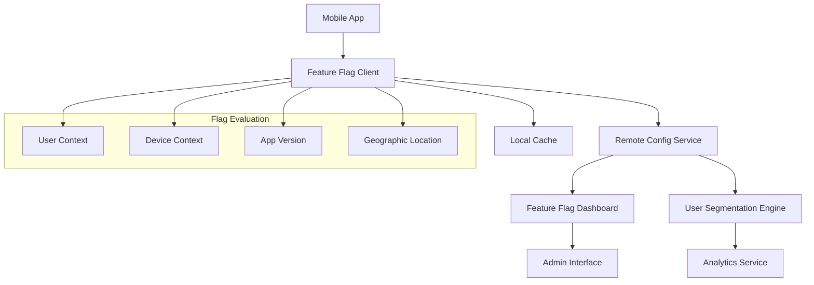

# Feature Flags in Mobile Applications

Feature flags (also known as feature toggles) enable teams to deploy code changes without immediately exposing them to users. This approach allows for gradual rollouts, A/B testing, and quick feature rollbacks without requiring app store deployments.

## Table of Contents
1. [Feature Flag Architecture](#feature-flag-architecture)
2. [Implementation Strategies](#implementation-strategies)
3. [Platform-Specific Implementations](#platform-specific-implementations)
4. [Backend Services](#backend-services)
5. [Advanced Features](#advanced-features)
6. [Best Practices](#best-practices)

## Feature Flag Architecture

### System Components



### Flag Types

1. **Kill Switches**: Emergency disable features
2. **Release Flags**: Gradual feature rollouts
3. **Permission Flags**: Role-based feature access
4. **Experiment Flags**: A/B testing variations
5. **Operational Flags**: Performance toggles

## Implementation Strategies

### 1. Configuration-Based Flags

```typescript
// Feature flag configuration
interface FeatureFlag {
  key: string;
  enabled: boolean;
  rolloutPercentage: number;
  targetAudience: string[];
  conditions: FlagCondition[];
  metadata: Record<string, any>;
}

interface FlagCondition {
  type: 'user_id' | 'app_version' | 'device_type' | 'location';
  operator: 'equals' | 'contains' | 'greater_than' | 'in_list';
  value: any;
}
```

### 2. Runtime Evaluation Engine

```typescript
class FeatureFlagEngine {
  private flags: Map<string, FeatureFlag> = new Map();
  private userContext: UserContext;
  
  constructor(userContext: UserContext) {
    this.userContext = userContext;
  }
  
  isEnabled(flagKey: string): boolean {
    const flag = this.flags.get(flagKey);
    if (!flag) return false;
    
    return this.evaluateFlag(flag);
  }
  
  private evaluateFlag(flag: FeatureFlag): boolean {
    // Base enabled check
    if (!flag.enabled) return false;
    
    // Rollout percentage check
    if (!this.isInRollout(flag.rolloutPercentage)) return false;
    
    // Condition evaluation
    return this.evaluateConditions(flag.conditions);
  }
  
  private isInRollout(percentage: number): boolean {
    const userId = this.userContext.userId;
    const hash = this.hashUserId(userId);
    return (hash % 100) < percentage;
  }
  
  private evaluateConditions(conditions: FlagCondition[]): boolean {
    return conditions.every(condition => {
      switch (condition.type) {
        case 'user_id':
          return this.evaluateUserCondition(condition);
        case 'app_version':
          return this.evaluateVersionCondition(condition);
        case 'device_type':
          return this.evaluateDeviceCondition(condition);
        case 'location':
          return this.evaluateLocationCondition(condition);
        default:
          return false;
      }
    });
  }
}
```

## Platform-Specific Implementations

### Android Implementation (Kotlin)

```kotlin
// Feature Flag Manager
class FeatureFlagManager private constructor(
    private val context: Context,
    private val remoteConfigService: RemoteConfigService
) {
    companion object {
        @Volatile
        private var INSTANCE: FeatureFlagManager? = null
        
        fun getInstance(context: Context, remoteConfigService: RemoteConfigService): FeatureFlagManager {
            return INSTANCE ?: synchronized(this) {
                INSTANCE ?: FeatureFlagManager(context, remoteConfigService).also { INSTANCE = it }
            }
        }
    }
    
    private val localCache = FeatureFlagCache(context)
    private val evaluationEngine = FlagEvaluationEngine()
    
    suspend fun isFeatureEnabled(flagKey: String): Boolean {
        return try {
            val flag = getFlag(flagKey)
            evaluationEngine.evaluate(flag, getUserContext())
        } catch (e: Exception) {
            Log.e("FeatureFlags", "Error evaluating flag $flagKey", e)
            getDefaultValue(flagKey)
        }
    }
    
    suspend fun getFeatureVariant(flagKey: String): String {
        val flag = getFlag(flagKey)
        return evaluationEngine.getVariant(flag, getUserContext())
    }
    
    private suspend fun getFlag(flagKey: String): FeatureFlag {
        // Try local cache first
        localCache.getFlag(flagKey)?.let { return it }
        
        // Fetch from remote
        val flag = remoteConfigService.getFlag(flagKey)
        localCache.saveFlag(flag)
        return flag
    }
    
    private fun getUserContext(): UserContext {
        return UserContext(
            userId = getCurrentUserId(),
            deviceId = getDeviceId(),
            appVersion = getAppVersion(),
            deviceType = getDeviceType(),
            location = getCurrentLocation()
        )
    }
}

// Usage in Activity/Fragment
class MainActivity : AppCompatActivity() {
    private lateinit var featureFlagManager: FeatureFlagManager
    
    override fun onCreate(savedInstanceState: Bundle?) {
        super.onCreate(savedInstanceState)
        
        featureFlagManager = FeatureFlagManager.getInstance(this, remoteConfigService)
        
        lifecycleScope.launch {
            if (featureFlagManager.isFeatureEnabled("new_ui_design")) {
                enableNewUIDesign()
            }
            
            when (featureFlagManager.getFeatureVariant("checkout_flow")) {
                "variant_a" -> showCheckoutVariantA()
                "variant_b" -> showCheckoutVariantB()
                else -> showDefaultCheckout()
            }
        }
    }
}
```

### iOS Implementation (Swift)

```swift
// Feature Flag Manager
class FeatureFlagManager {
    static let shared = FeatureFlagManager()
    
    private let remoteConfigService: RemoteConfigService
    private let localCache: FeatureFlagCache
    private let evaluationEngine: FlagEvaluationEngine
    
    private init() {
        self.remoteConfigService = RemoteConfigService()
        self.localCache = FeatureFlagCache()
        self.evaluationEngine = FlagEvaluationEngine()
    }
    
    func isFeatureEnabled(_ flagKey: String) async -> Bool {
        do {
            let flag = try await getFlag(flagKey)
            let userContext = getUserContext()
            return evaluationEngine.evaluate(flag, context: userContext)
        } catch {
            print("Error evaluating flag \(flagKey): \(error)")
            return getDefaultValue(flagKey)
        }
    }
    
    func getFeatureVariant(_ flagKey: String) async -> String {
        do {
            let flag = try await getFlag(flagKey)
            let userContext = getUserContext()
            return evaluationEngine.getVariant(flag, context: userContext)
        } catch {
            return "default"
        }
    }
    
    private func getFlag(_ flagKey: String) async throws -> FeatureFlag {
        // Try local cache first
        if let cachedFlag = localCache.getFlag(flagKey) {
            return cachedFlag
        }
        
        // Fetch from remote
        let flag = try await remoteConfigService.getFlag(flagKey)
        localCache.saveFlag(flag)
        return flag
    }
    
    private func getUserContext() -> UserContext {
        return UserContext(
            userId: getCurrentUserId(),
            deviceId: getDeviceId(),
            appVersion: getAppVersion(),
            deviceType: getDeviceType(),
            location: getCurrentLocation()
        )
    }
}

// Usage in View Controller
class ViewController: UIViewController {
    override func viewDidLoad() {
        super.viewDidLoad()
        
        Task {
            if await FeatureFlagManager.shared.isFeatureEnabled("new_ui_design") {
                enableNewUIDesign()
            }
            
            let checkoutVariant = await FeatureFlagManager.shared.getFeatureVariant("checkout_flow")
            switch checkoutVariant {
            case "variant_a":
                showCheckoutVariantA()
            case "variant_b":
                showCheckoutVariantB()
            default:
                showDefaultCheckout()
            }
        }
    }
}
```

### React Native Implementation

```typescript
// Feature Flag Hook
import { useState, useEffect, useContext } from 'react';
import { FeatureFlagManager } from './FeatureFlagManager';

export const useFeatureFlag = (flagKey: string): boolean => {
  const [isEnabled, setIsEnabled] = useState<boolean>(false);
  const [isLoading, setIsLoading] = useState<boolean>(true);
  
  useEffect(() => {
    const checkFlag = async () => {
      try {
        const enabled = await FeatureFlagManager.isFeatureEnabled(flagKey);
        setIsEnabled(enabled);
      } catch (error) {
        console.error(`Error checking feature flag ${flagKey}:`, error);
        setIsEnabled(false);
      } finally {
        setIsLoading(false);
      }
    };
    
    checkFlag();
  }, [flagKey]);
  
  return isEnabled;
};

export const useFeatureVariant = (flagKey: string): string => {
  const [variant, setVariant] = useState<string>('default');
  
  useEffect(() => {
    const getVariant = async () => {
      try {
        const flagVariant = await FeatureFlagManager.getFeatureVariant(flagKey);
        setVariant(flagVariant);
      } catch (error) {
        console.error(`Error getting feature variant ${flagKey}:`, error);
        setVariant('default');
      }
    };
    
    getVariant();
  }, [flagKey]);
  
  return variant;
};

// Feature Flag Component
export const FeatureFlag: React.FC<{
  flagKey: string;
  children: React.ReactNode;
  fallback?: React.ReactNode;
}> = ({ flagKey, children, fallback = null }) => {
  const isEnabled = useFeatureFlag(flagKey);
  
  return isEnabled ? <>{children}</> : <>{fallback}</>;
};

// Usage in Components
const CheckoutScreen: React.FC = () => {
  const checkoutVariant = useFeatureVariant('checkout_flow');
  
  return (
    <View>
      <FeatureFlag flagKey="new_ui_design" fallback={<OldHeader />}>
        <NewHeader />
      </FeatureFlag>
      
      {checkoutVariant === 'variant_a' && <CheckoutVariantA />}
      {checkoutVariant === 'variant_b' && <CheckoutVariantB />}
      {checkoutVariant === 'default' && <DefaultCheckout />}
    </View>
  );
};
```

### Flutter Implementation (Dart)

```dart
// Feature Flag Service
class FeatureFlagService {
  static final FeatureFlagService _instance = FeatureFlagService._internal();
  factory FeatureFlagService() => _instance;
  FeatureFlagService._internal();
  
  final RemoteConfigService _remoteConfigService = RemoteConfigService();
  final FeatureFlagCache _localCache = FeatureFlagCache();
  final FlagEvaluationEngine _evaluationEngine = FlagEvaluationEngine();
  
  Future<bool> isFeatureEnabled(String flagKey) async {
    try {
      final flag = await _getFlag(flagKey);
      final userContext = await _getUserContext();
      return _evaluationEngine.evaluate(flag, userContext);
    } catch (e) {
      print('Error evaluating flag $flagKey: $e');
      return _getDefaultValue(flagKey);
    }
  }
  
  Future<String> getFeatureVariant(String flagKey) async {
    try {
      final flag = await _getFlag(flagKey);
      final userContext = await _getUserContext();
      return _evaluationEngine.getVariant(flag, userContext);
    } catch (e) {
      return 'default';
    }
  }
  
  Future<FeatureFlag> _getFlag(String flagKey) async {
    // Try local cache first
    final cachedFlag = await _localCache.getFlag(flagKey);
    if (cachedFlag != null) return cachedFlag;
    
    // Fetch from remote
    final flag = await _remoteConfigService.getFlag(flagKey);
    await _localCache.saveFlag(flag);
    return flag;
  }
  
  Future<UserContext> _getUserContext() async {
    return UserContext(
      userId: await _getCurrentUserId(),
      deviceId: await _getDeviceId(),
      appVersion: await _getAppVersion(),
      deviceType: await _getDeviceType(),
      location: await _getCurrentLocation(),
    );
  }
}

// Feature Flag Widget
class FeatureFlagWidget extends StatefulWidget {
  final String flagKey;
  final Widget child;
  final Widget? fallback;
  
  const FeatureFlagWidget({
    Key? key,
    required this.flagKey,
    required this.child,
    this.fallback,
  }) : super(key: key);
  
  @override
  _FeatureFlagWidgetState createState() => _FeatureFlagWidgetState();
}

class _FeatureFlagWidgetState extends State<FeatureFlagWidget> {
  final FeatureFlagService _featureFlagService = FeatureFlagService();
  bool _isEnabled = false;
  bool _isLoading = true;
  
  @override
  void initState() {
    super.initState();
    _checkFeatureFlag();
  }
  
  Future<void> _checkFeatureFlag() async {
    final isEnabled = await _featureFlagService.isFeatureEnabled(widget.flagKey);
    setState(() {
      _isEnabled = isEnabled;
      _isLoading = false;
    });
  }
  
  @override
  Widget build(BuildContext context) {
    if (_isLoading) {
      return const CircularProgressIndicator();
    }
    
    return _isEnabled ? widget.child : (widget.fallback ?? const SizedBox.shrink());
  }
}

// Usage in Widgets
class CheckoutScreen extends StatelessWidget {
  @override
  Widget build(BuildContext context) {
    return Scaffold(
      appBar: AppBar(
        title: FeatureFlagWidget(
          flagKey: 'new_ui_design',
          child: const NewAppBarTitle(),
          fallback: const OldAppBarTitle(),
        ),
      ),
      body: FutureBuilder<String>(
        future: FeatureFlagService().getFeatureVariant('checkout_flow'),
        builder: (context, snapshot) {
          final variant = snapshot.data ?? 'default';
          
          switch (variant) {
            case 'variant_a':
              return const CheckoutVariantA();
            case 'variant_b':
              return const CheckoutVariantB();
            default:
              return const DefaultCheckout();
          }
        },
      ),
    );
  }
}
```

## Backend Services

### Feature Flag Service (Node.js)

```typescript
// Feature Flag Service
import express from 'express';
import mongoose from 'mongoose';
import Redis from 'ioredis';

interface FeatureFlag {
  key: string;
  name: string;
  description: string;
  enabled: boolean;
  rolloutPercentage: number;
  conditions: FlagCondition[];
  variants: FlagVariant[];
  environment: string;
  createdAt: Date;
  updatedAt: Date;
}

interface FlagCondition {
  type: 'user_id' | 'app_version' | 'device_type' | 'location' | 'custom';
  operator: 'equals' | 'contains' | 'greater_than' | 'less_than' | 'in_list';
  value: any;
}

interface FlagVariant {
  key: string;
  name: string;
  weight: number;
  payload: Record<string, any>;
}

const FeatureFlagModel = mongoose.model('FeatureFlag', new mongoose.Schema({
  key: { type: String, required: true, unique: true },
  name: { type: String, required: true },
  description: String,
  enabled: { type: Boolean, default: false },
  rolloutPercentage: { type: Number, default: 0, min: 0, max: 100 },
  conditions: [{
    type: { type: String, required: true },
    operator: { type: String, required: true },
    value: mongoose.Schema.Types.Mixed
  }],
  variants: [{
    key: { type: String, required: true },
    name: { type: String, required: true },
    weight: { type: Number, required: true },
    payload: mongoose.Schema.Types.Mixed
  }],
  environment: { type: String, required: true },
  createdAt: { type: Date, default: Date.now },
  updatedAt: { type: Date, default: Date.now }
}));

class FeatureFlagService {
  private redis: Redis;
  
  constructor() {
    this.redis = new Redis(process.env.REDIS_URL || 'redis://localhost:6379');
  }
  
  async getFlag(flagKey: string, environment: string = 'production'): Promise<FeatureFlag | null> {
    // Try cache first
    const cached = await this.redis.get(`flag:${environment}:${flagKey}`);
    if (cached) {
      return JSON.parse(cached);
    }
    
    // Fetch from database
    const flag = await FeatureFlagModel.findOne({ key: flagKey, environment });
    if (flag) {
      // Cache for 5 minutes
      await this.redis.setex(`flag:${environment}:${flagKey}`, 300, JSON.stringify(flag));
    }
    
    return flag;
  }
  
  async evaluateFlag(flagKey: string, userContext: UserContext, environment: string = 'production'): Promise<{
    enabled: boolean;
    variant?: string;
    payload?: Record<string, any>;
  }> {
    const flag = await this.getFlag(flagKey, environment);
    if (!flag) {
      return { enabled: false };
    }
    
    // Base enabled check
    if (!flag.enabled) {
      return { enabled: false };
    }
    
    // Rollout percentage check
    if (!this.isInRollout(userContext.userId, flag.rolloutPercentage)) {
      return { enabled: false };
    }
    
    // Condition evaluation
    if (!this.evaluateConditions(flag.conditions, userContext)) {
      return { enabled: false };
    }
    
    // Variant selection
    const variant = this.selectVariant(flag.variants, userContext.userId);
    
    return {
      enabled: true,
      variant: variant?.key,
      payload: variant?.payload
    };
  }
  
  async getAllFlags(environment: string = 'production'): Promise<FeatureFlag[]> {
    return await FeatureFlagModel.find({ environment });
  }
  
  async createFlag(flag: Partial<FeatureFlag>): Promise<FeatureFlag> {
    const newFlag = new FeatureFlagModel(flag);
    await newFlag.save();
    
    // Invalidate cache
    await this.redis.del(`flag:${flag.environment}:${flag.key}`);
    
    return newFlag;
  }
  
  async updateFlag(flagKey: string, updates: Partial<FeatureFlag>, environment: string = 'production'): Promise<FeatureFlag | null> {
    const flag = await FeatureFlagModel.findOneAndUpdate(
      { key: flagKey, environment },
      { ...updates, updatedAt: new Date() },
      { new: true }
    );
    
    if (flag) {
      // Invalidate cache
      await this.redis.del(`flag:${environment}:${flagKey}`);
      
      // Publish update event
      await this.redis.publish('flag-updates', JSON.stringify({
        flagKey,
        environment,
        action: 'updated',
        timestamp: new Date().toISOString()
      }));
    }
    
    return flag;
  }
  
  private isInRollout(userId: string, percentage: number): boolean {
    if (percentage === 100) return true;
    if (percentage === 0) return false;
    
    const hash = this.hashString(userId);
    return (hash % 100) < percentage;
  }
  
  private evaluateConditions(conditions: FlagCondition[], userContext: UserContext): boolean {
    return conditions.every(condition => {
      const contextValue = this.getContextValue(condition.type, userContext);
      return this.evaluateCondition(condition, contextValue);
    });
  }
  
  private selectVariant(variants: FlagVariant[], userId: string): FlagVariant | null {
    if (variants.length === 0) return null;
    
    const hash = this.hashString(userId);
    const totalWeight = variants.reduce((sum, variant) => sum + variant.weight, 0);
    const target = hash % totalWeight;
    
    let currentWeight = 0;
    for (const variant of variants) {
      currentWeight += variant.weight;
      if (target < currentWeight) {
        return variant;
      }
    }
    
    return variants[0];
  }
  
  private hashString(str: string): number {
    let hash = 0;
    for (let i = 0; i < str.length; i++) {
      const char = str.charCodeAt(i);
      hash = ((hash << 5) - hash) + char;
      hash = hash & hash; // Convert to 32-bit integer
    }
    return Math.abs(hash);
  }
}

// API Routes
const app = express();
const featureFlagService = new FeatureFlagService();

app.get('/api/flags/:flagKey/evaluate', async (req, res) => {
  try {
    const { flagKey } = req.params;
    const { environment = 'production' } = req.query;
    const userContext = req.body;
    
    const result = await featureFlagService.evaluateFlag(flagKey, userContext, environment as string);
    res.json(result);
  } catch (error) {
    res.status(500).json({ error: 'Internal server error' });
  }
});

app.get('/api/flags', async (req, res) => {
  try {
    const { environment = 'production' } = req.query;
    const flags = await featureFlagService.getAllFlags(environment as string);
    res.json(flags);
  } catch (error) {
    res.status(500).json({ error: 'Internal server error' });
  }
});

app.post('/api/flags', async (req, res) => {
  try {
    const flag = await featureFlagService.createFlag(req.body);
    res.status(201).json(flag);
  } catch (error) {
    res.status(500).json({ error: 'Internal server error' });
  }
});
```

### Feature Flag Dashboard (React)

```tsx
import React, { useState, useEffect } from 'react';
import { Switch, Slider, Button, Modal, Form, Input, Select, Table, Space, Tag, Card, Statistic } from 'antd';

interface FeatureFlag {
  key: string;
  name: string;
  description: string;
  enabled: boolean;
  rolloutPercentage: number;
  conditions: FlagCondition[];
  variants: FlagVariant[];
  environment: string;
  stats?: {
    totalEvaluations: number;
    enabledEvaluations: number;
    variantDistribution: { [key: string]: number };
  };
}

const FeatureFlagDashboard: React.FC = () => {
  const [flags, setFlags] = useState<FeatureFlag[]>([]);
  const [loading, setLoading] = useState(true);
  const [environment, setEnvironment] = useState('production');
  const [editingFlag, setEditingFlag] = useState<FeatureFlag | null>(null);
  const [isModalVisible, setIsModalVisible] = useState(false);

  useEffect(() => {
    fetchFlags();
  }, [environment]);

  const fetchFlags = async () => {
    try {
      setLoading(true);
      const response = await fetch(`/api/flags?environment=${environment}`);
      const data = await response.json();
      setFlags(data);
    } catch (error) {
      console.error('Error fetching flags:', error);
    } finally {
      setLoading(false);
    }
  };

  const toggleFlag = async (flagKey: string, enabled: boolean) => {
    try {
      await fetch(`/api/flags/${flagKey}`, {
        method: 'PUT',
        headers: { 'Content-Type': 'application/json' },
        body: JSON.stringify({ enabled, environment })
      });
      fetchFlags();
    } catch (error) {
      console.error('Error toggling flag:', error);
    }
  };

  const updateRollout = async (flagKey: string, rolloutPercentage: number) => {
    try {
      await fetch(`/api/flags/${flagKey}`, {
        method: 'PUT',
        headers: { 'Content-Type': 'application/json' },
        body: JSON.stringify({ rolloutPercentage, environment })
      });
      fetchFlags();
    } catch (error) {
      console.error('Error updating rollout:', error);
    }
  };

  const columns = [
    {
      title: 'Flag',
      dataIndex: 'name',
      key: 'name',
      render: (text: string, record: FeatureFlag) => (
        <div>
          <div style={{ fontWeight: 'bold' }}>{text}</div>
          <div style={{ fontSize: '12px', color: '#666' }}>{record.key}</div>
          <div style={{ fontSize: '12px', color: '#999' }}>{record.description}</div>
        </div>
      ),
    },
    {
      title: 'Status',
      dataIndex: 'enabled',
      key: 'enabled',
      render: (enabled: boolean, record: FeatureFlag) => (
        <Switch
          checked={enabled}
          onChange={(checked) => toggleFlag(record.key, checked)}
        />
      ),
    },
    {
      title: 'Rollout',
      dataIndex: 'rolloutPercentage',
      key: 'rolloutPercentage',
      render: (percentage: number, record: FeatureFlag) => (
        <div style={{ width: '150px' }}>
          <Slider
            value={percentage}
            onChange={(value) => updateRollout(record.key, value)}
            disabled={!record.enabled}
            tooltip={{ formatter: (value) => `${value}%` }}
          />
          <div style={{ textAlign: 'center', fontSize: '12px' }}>{percentage}%</div>
        </div>
      ),
    },
    {
      title: 'Conditions',
      dataIndex: 'conditions',
      key: 'conditions',
      render: (conditions: FlagCondition[]) => (
        <div>
          {conditions.map((condition, index) => (
            <Tag key={index} color="blue">
              {condition.type} {condition.operator} {JSON.stringify(condition.value)}
            </Tag>
          ))}
        </div>
      ),
    },
    {
      title: 'Variants',
      dataIndex: 'variants',
      key: 'variants',
      render: (variants: FlagVariant[]) => (
        <div>
          {variants.map((variant, index) => (
            <Tag key={index} color="green">
              {variant.name} ({variant.weight}%)
            </Tag>
          ))}
        </div>
      ),
    },
    {
      title: 'Stats',
      key: 'stats',
      render: (record: FeatureFlag) => (
        <div>
          {record.stats && (
            <Space direction="vertical" size="small">
              <Statistic
                title="Evaluations"
                value={record.stats.totalEvaluations}
                suffix={`(${((record.stats.enabledEvaluations / record.stats.totalEvaluations) * 100).toFixed(1)}% enabled)`}
              />
            </Space>
          )}
        </div>
      ),
    },
    {
      title: 'Actions',
      key: 'actions',
      render: (record: FeatureFlag) => (
        <Space>
          <Button
            type="primary"
            size="small"
            onClick={() => {
              setEditingFlag(record);
              setIsModalVisible(true);
            }}
          >
            Edit
          </Button>
          <Button
            type="link"
            size="small"
            onClick={() => viewAnalytics(record.key)}
          >
            Analytics
          </Button>
        </Space>
      ),
    },
  ];

  const viewAnalytics = (flagKey: string) => {
    // Navigate to analytics page
    window.open(`/analytics/flags/${flagKey}`, '_blank');
  };

  return (
    <div style={{ padding: '24px' }}>
      <div style={{ marginBottom: '24px', display: 'flex', justifyContent: 'space-between', alignItems: 'center' }}>
        <h1>Feature Flags Dashboard</h1>
        <Space>
          <Select
            value={environment}
            onChange={setEnvironment}
            style={{ width: 120 }}
          >
            <Select.Option value="development">Development</Select.Option>
            <Select.Option value="staging">Staging</Select.Option>
            <Select.Option value="production">Production</Select.Option>
          </Select>
          <Button
            type="primary"
            onClick={() => {
              setEditingFlag(null);
              setIsModalVisible(true);
            }}
          >
            Create Flag
          </Button>
        </Space>
      </div>

      <Table
        columns={columns}
        dataSource={flags}
        loading={loading}
        rowKey="key"
        pagination={{ pageSize: 20 }}
      />

      <FlagEditModal
        flag={editingFlag}
        visible={isModalVisible}
        onCancel={() => setIsModalVisible(false)}
        onSuccess={() => {
          setIsModalVisible(false);
          fetchFlags();
        }}
        environment={environment}
      />
    </div>
  );
};

const FlagEditModal: React.FC<{
  flag: FeatureFlag | null;
  visible: boolean;
  onCancel: () => void;
  onSuccess: () => void;
  environment: string;
}> = ({ flag, visible, onCancel, onSuccess, environment }) => {
  const [form] = Form.useForm();

  useEffect(() => {
    if (flag) {
      form.setFieldsValue(flag);
    } else {
      form.resetFields();
    }
  }, [flag, form]);

  const handleSubmit = async (values: any) => {
    try {
      const url = flag ? `/api/flags/${flag.key}` : '/api/flags';
      const method = flag ? 'PUT' : 'POST';
      
      await fetch(url, {
        method,
        headers: { 'Content-Type': 'application/json' },
        body: JSON.stringify({ ...values, environment })
      });
      
      onSuccess();
    } catch (error) {
      console.error('Error saving flag:', error);
    }
  };

  return (
    <Modal
      title={flag ? 'Edit Feature Flag' : 'Create Feature Flag'}
      visible={visible}
      onCancel={onCancel}
      onOk={() => form.submit()}
      width={800}
    >
      <Form form={form} onFinish={handleSubmit} layout="vertical">
        <Form.Item name="key" label="Key" rules={[{ required: true }]}>
          <Input disabled={!!flag} />
        </Form.Item>
        
        <Form.Item name="name" label="Name" rules={[{ required: true }]}>
          <Input />
        </Form.Item>
        
        <Form.Item name="description" label="Description">
          <Input.TextArea rows={3} />
        </Form.Item>
        
        <Form.Item name="enabled" label="Enabled" valuePropName="checked">
          <Switch />
        </Form.Item>
        
        <Form.Item name="rolloutPercentage" label="Rollout Percentage">
          <Slider marks={{ 0: '0%', 50: '50%', 100: '100%' }} />
        </Form.Item>
      </Form>
    </Modal>
  );
};

export default FeatureFlagDashboard;
```

## Advanced Features

### 1. Real-time Flag Updates

```typescript
// WebSocket-based real-time updates
class RealtimeFeatureFlagClient {
  private ws: WebSocket;
  private listeners: Map<string, (enabled: boolean) => void> = new Map();
  
  constructor(wsUrl: string) {
    this.ws = new WebSocket(wsUrl);
    this.setupEventHandlers();
  }
  
  private setupEventHandlers() {
    this.ws.onmessage = (event) => {
      const data = JSON.parse(event.data);
      
      if (data.type === 'flag_update') {
        const { flagKey, enabled } = data;
        const listener = this.listeners.get(flagKey);
        if (listener) {
          listener(enabled);
        }
      }
    };
  }
  
  subscribe(flagKey: string, callback: (enabled: boolean) => void) {
    this.listeners.set(flagKey, callback);
    
    // Send subscription message
    this.ws.send(JSON.stringify({
      type: 'subscribe',
      flagKey
    }));
  }
  
  unsubscribe(flagKey: string) {
    this.listeners.delete(flagKey);
    
    this.ws.send(JSON.stringify({
      type: 'unsubscribe',
      flagKey
    }));
  }
}
```

### 2. Flag Analytics and Metrics

```typescript
// Analytics tracking
class FeatureFlagAnalytics {
  private analyticsService: AnalyticsService;
  
  constructor(analyticsService: AnalyticsService) {
    this.analyticsService = analyticsService;
  }
  
  trackFlagEvaluation(
    flagKey: string,
    enabled: boolean,
    variant?: string,
    userContext?: UserContext
  ) {
    this.analyticsService.track('feature_flag_evaluated', {
      flag_key: flagKey,
      enabled,
      variant,
      user_id: userContext?.userId,
      device_type: userContext?.deviceType,
      app_version: userContext?.appVersion,
      timestamp: new Date().toISOString()
    });
  }
  
  async getFlagStats(flagKey: string, timeRange: string): Promise<FlagStats> {
    return await this.analyticsService.query(`
      SELECT 
        COUNT(*) as total_evaluations,
        COUNT(CASE WHEN enabled = true THEN 1 END) as enabled_evaluations,
        variant,
        COUNT(*) as variant_count
      FROM feature_flag_events 
      WHERE flag_key = ? AND timestamp >= ?
      GROUP BY variant
    `, [flagKey, timeRange]);
  }
}
```

### 3. Gradual Rollout Automation

```typescript
// Automated gradual rollout
class GradualRolloutManager {
  private featureFlagService: FeatureFlagService;
  private metricsService: MetricsService;
  
  async startGradualRollout(flagKey: string, config: RolloutConfig) {
    const rolloutPlan = this.createRolloutPlan(config);
    
    for (const phase of rolloutPlan.phases) {
      await this.executePhase(flagKey, phase);
      
      // Monitor metrics
      const success = await this.monitorPhase(flagKey, phase);
      if (!success) {
        await this.rollback(flagKey);
        throw new Error(`Rollout failed at ${phase.percentage}%`);
      }
      
      // Wait before next phase
      await this.delay(phase.duration);
    }
  }
  
  private async executePhase(flagKey: string, phase: RolloutPhase) {
    await this.featureFlagService.updateFlag(flagKey, {
      rolloutPercentage: phase.percentage
    });
  }
  
  private async monitorPhase(flagKey: string, phase: RolloutPhase): Promise<boolean> {
    const metrics = await this.metricsService.getMetrics(flagKey, phase.duration);
    
    // Check success criteria
    return (
      metrics.errorRate < phase.maxErrorRate &&
      metrics.performanceRegression < phase.maxPerformanceRegression
    );
  }
}
```

## Best Practices

### 1. Flag Lifecycle Management

- **Short-lived flags**: Remove flags after feature is fully rolled out
- **Flag naming**: Use consistent naming conventions
- **Documentation**: Document flag purpose and cleanup timeline
- **Monitoring**: Track flag usage and performance impact

### 2. Safety Measures

```typescript
// Flag safety wrapper
class SafeFeatureFlag {
  private static readonly TIMEOUT_MS = 100;
  
  static async isEnabled(flagKey: string, defaultValue: boolean = false): Promise<boolean> {
    try {
      const result = await Promise.race([
        FeatureFlagManager.isFeatureEnabled(flagKey),
        new Promise<boolean>((_, reject) => 
          setTimeout(() => reject(new Error('Timeout')), this.TIMEOUT_MS)
        )
      ]);
      
      return result;
    } catch (error) {
      console.warn(`Feature flag ${flagKey} evaluation failed, using default:`, error);
      return defaultValue;
    }
  }
}
```

### 3. Testing Strategies

```typescript
// Feature flag testing utilities
class FeatureFlagTestUtils {
  static mockFlag(flagKey: string, enabled: boolean, variant?: string) {
    jest.spyOn(FeatureFlagManager, 'isFeatureEnabled')
      .mockResolvedValue(enabled);
    
    if (variant) {
      jest.spyOn(FeatureFlagManager, 'getFeatureVariant')
        .mockResolvedValue(variant);
    }
  }
  
  static clearMocks() {
    jest.clearAllMocks();
  }
}

// Usage in tests
describe('CheckoutFlow', () => {
  beforeEach(() => {
    FeatureFlagTestUtils.clearMocks();
  });
  
  it('should show new checkout when flag is enabled', async () => {
    FeatureFlagTestUtils.mockFlag('new_checkout', true);
    
    const { getByTestId } = render(<CheckoutScreen />);
    
    await waitFor(() => {
      expect(getByTestId('new-checkout')).toBeInTheDocument();
    });
  });
});
```

### 4. Performance Optimization

- **Local caching**: Cache flag evaluations to reduce network calls
- **Batch evaluation**: Evaluate multiple flags in single request
- **CDN distribution**: Use CDN for flag configuration distribution
- **Lazy loading**: Load flags only when needed

### 5. Security Considerations

- **Sensitive flags**: Don't expose sensitive business logic in client-side flags
- **Authentication**: Secure flag management APIs
- **Audit logging**: Log all flag changes and evaluations
- **Environment isolation**: Separate flags by environment

Feature flags provide powerful capabilities for mobile applications, enabling safer deployments, A/B testing, and gradual feature rollouts. The key to success is implementing robust evaluation logic, comprehensive monitoring, and following best practices for flag lifecycle management.
