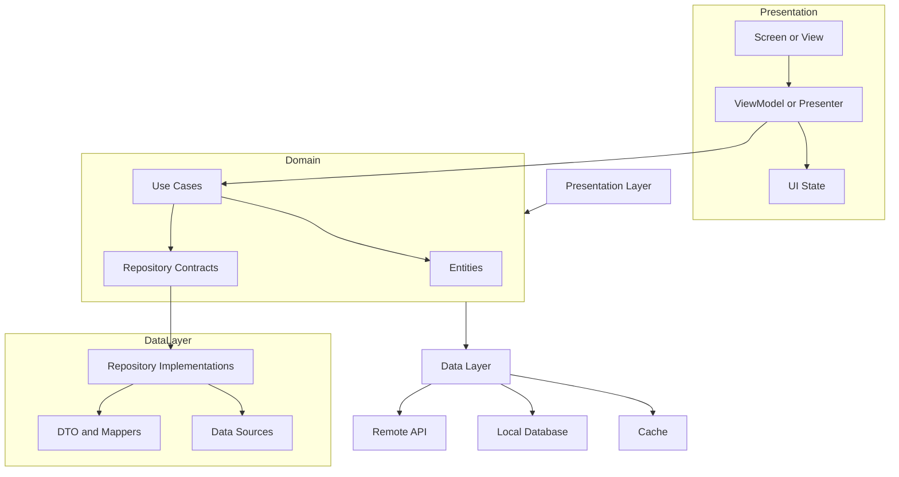
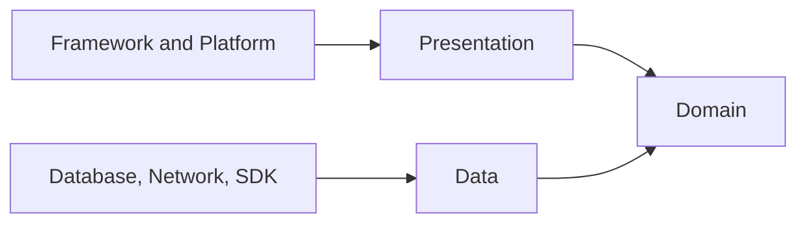
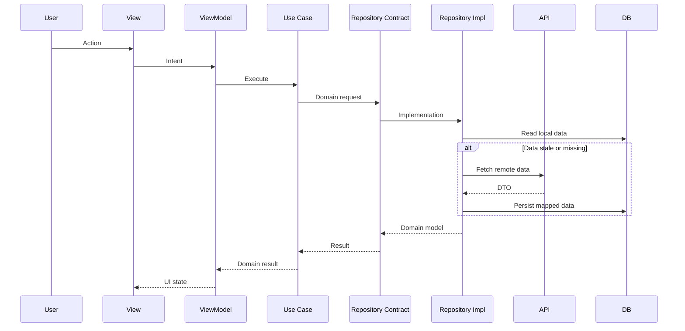

# Clean Architecture

Clean Architecture, mobil uygulamada UI, iş kuralları ve veri erişimini net sınırlarla ayıran mimari yaklaşımdır. Amaç her ekranı katmanlara bölmek değil, değişim maliyeti yüksek olan iş kurallarını framework, ağ, veritabanı ve UI detaylarından korumaktır.

Bu yaklaşım özellikle uzun ömürlü, offline-first çalışan, farklı platformlara taşınabilecek veya birden fazla ekibin aynı anda geliştirdiği uygulamalarda değer üretir. Küçük prototiplerde ise fazla dosya ve soyutlama maliyeti yaratabilir.

## Katmanlar



### Presentation Layer

Presentation layer kullanıcının gördüğü durumdan sorumludur. Ekranlar veri çekmez, cache stratejisi bilmez ve API modellerini doğrudan taşımaz. ViewModel, Presenter veya Bloc gibi bileşenler UI state üretir ve kullanıcı aksiyonlarını use case seviyesine çevirir.

Bu katmanda tutulması gerekenler:

- Ekran state modeli
- Loading, empty, success ve error durumları
- Kullanıcı aksiyonlarının domain komutlarına çevrilmesi
- Form doğrulama gibi yalnızca ekrana ait kurallar

### Domain Layer

Domain layer uygulamanın iş kararlarını taşır. Entity, value object, use case ve repository contract burada durur. Bu katman Android, iOS, Flutter, React Native, HTTP, SQLite veya Firebase bilmemelidir.

Domain katmanında iyi bir use case tek bir iş niyetini temsil eder: `GetAccountSummary`, `SyncPendingOrders`, `CalculateDeliveryPrice` gibi. Bir use case hem okunabilir olmalı hem de unit test ile UI açmadan doğrulanabilmelidir.

### Data Layer

Data layer, domain contract'larının gerçek uygulamasıdır. API çağrısı, local database, cache, mapper, retry, pagination ve sync detayları burada yaşar. Domain entity ile DTO aynı nesne olmamalıdır; API değiştiğinde domain modelinin kırılmaması gerekir.

Bu katmanda dikkat edilecek kararlar:

- Remote ve local veri kaynaklarının önceliği
- Cache invalidation ve stale data politikası
- DTO to domain mapper sınırı
- Ağ hatası, timeout ve offline fallback davranışı
- Migration ve backward compatibility stratejisi

## Bağımlılık Kuralı

Clean Architecture'ın temel kuralı bağımlılıkların içe doğru akmasıdır. UI domain'i bilir, domain data implementation'ını bilmez. Repository interface domain'de, implementation data katmanında durur.



Bu kural test edilebilirlik sağlar. Domain katmanı fake repository ile test edilir, data katmanı contract testleriyle doğrulanır, UI katmanı ise state üzerinden kontrol edilir.

## Platform Uygulamaları

### Android

Android'de tipik yapı `ui`, `domain`, `data` paketleri veya modülleriyle kurulur. Jetpack ViewModel presentation sınırı, use case sınıfları domain sınırı, Retrofit/Room repository implementation ise data sınırı olur.

Minimal örnek:

```kotlin
class GetUserProfile(
    private val repository: UserRepository
) {
    suspend operator fun invoke(userId: UserId): UserProfile {
        return repository.getProfile(userId)
    }
}
```

### iOS

iOS tarafında SwiftUI veya UIKit ekranları presentation katmanında kalır. Use case'ler Swift struct veya final class olarak domain'de, URLSession/CoreData implementasyonları data katmanında yer alır.

```swift
struct GetUserProfile {
    let repository: UserRepository

    func callAsFunction(userId: UserID) async throws -> UserProfile {
        try await repository.profile(userId: userId)
    }
}
```

### Flutter

Flutter'da `presentation`, `domain`, `data` klasörleri feature bazında tutulduğunda ölçeklenmesi daha kolay olur. Widget ağacı sadece state okur; repository ve data source bağımlılıkları DI container veya provider katmanından gelir.

```dart
class GetUserProfile {
  GetUserProfile(this.repository);

  final UserRepository repository;

  Future<UserProfile> call(UserId userId) {
    return repository.getProfile(userId);
  }
}
```

## Veri Akışı



## Ne Zaman Kullanılmalı

Clean Architecture şu durumlarda güçlüdür:

- İş kuralları UI'dan daha uzun ömürlüyse
- Offline-first, sync veya cache kararları karmaşıksa
- Birden fazla veri kaynağı varsa
- Test edilebilirlik kritikse
- Ekipler feature bazında paralel çalışıyorsa
- Android, iOS ve backend ekipleri aynı domain dilini kullanmak istiyorsa

Şu durumlarda daha basit kalmak daha doğrudur:

- Uygulama tek ekranlı veya prototipse
- Domain mantığı neredeyse yoksa
- Ekip mimari maliyeti taşıyamayacak kadar küçükse
- Soyutlama yalnızca "ileride lazım olur" diye ekleniyorsa

## Yaygın Hatalar

- Her repository için gereksiz interface oluşturmak
- DTO ve domain modelini aynı sınıf yapmak
- Use case'leri yalnızca repository çağrısını saran boş wrapper'a çevirmek
- UI state içinde API response taşımak
- Domain katmanına platform SDK import etmek
- Mapper kodunu test etmeden büyük model dönüşümleri yapmak

## Kontrol Listesi

- [ ] Domain katmanı platform import'u içermiyor.
- [ ] API DTO'ları UI'a kadar taşınmıyor.
- [ ] Use case isimleri teknik işlem değil iş niyeti anlatıyor.
- [ ] Repository contract domain'de, implementation data katmanında.
- [ ] Offline, cache ve hata davranışı data katmanında açık.
- [ ] ViewModel sadece UI state üretir ve use case çağırır.
- [ ] En az kritik use case'ler fake repository ile test edilebilir.
