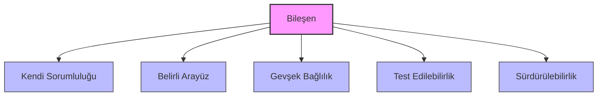
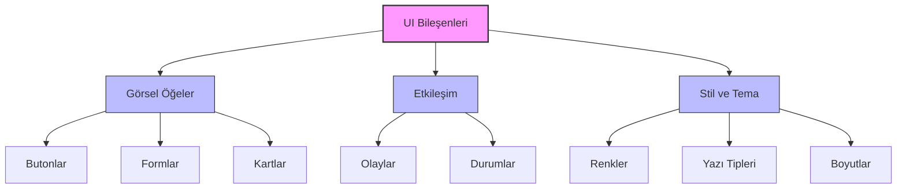
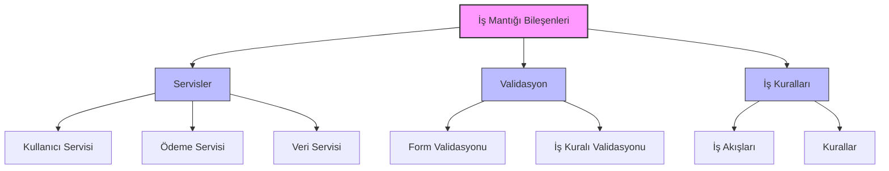
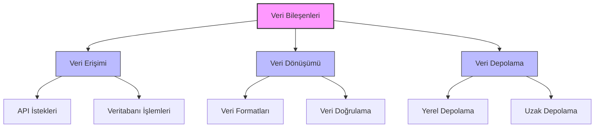

# Bileşen Tabanlı Mimari (Component-Based Architecture)

## Giriş

Bileşen tabanlı mimari, mobil uygulamaları yeniden kullanılabilir, test edilebilir ve sürdürülebilir bileşenler halinde organize eden bir tasarım yaklaşımıdır. Bu yaklaşım, kompleks uygulamaları daha küçük, yönetilebilir parçalara bölerek geliştirme sürecini kolaylaştırır.

## Temel Kavramlar

### Bileşen Nedir?

Bileşen, belirli bir işlevselliği kapsayan, bağımsız ve yeniden kullanılabilir kod birikidir. Her bileşen:

- **Kendi sorumluluğuna sahiptir**
- **Belirli bir arayüz sunar**
- **Diğer bileşenlerle gevşek bağlıdır**
- **Test edilebilir ve sürdürülebilirdir**



### Bileşen Türleri

#### 1. UI Bileşenleri
```swift
// iOS - SwiftUI Bileşen Örneği
struct CustomButton: View {
    let title: String
    let action: () -> Void
    
    var body: some View {
        Button(action: action) {
            Text(title)
                .font(.headline)
                .foregroundColor(.white)
                .padding()
                .background(Color.blue)
                .cornerRadius(8)
        }
    }
}

// Kullanım
CustomButton(title: "Kaydet") {
    saveData()
}
```



#### 2. İş Mantığı Bileşenleri
```kotlin
// Android - İş Mantığı Bileşeni
class UserService {
    private val userRepository: UserRepository
    private val validationService: ValidationService
    
    constructor(
        userRepository: UserRepository,
        validationService: ValidationService
    ) {
        this.userRepository = userRepository
        this.validationService = validationService
    }
    
    suspend fun createUser(userData: UserData): Result<User> {
        return try {
            validationService.validateUser(userData)
            val user = userRepository.save(userData)
            Result.success(user)
        } catch (e: ValidationException) {
            Result.failure(e)
        }
    }
}
```



#### 3. Veri Bileşenleri
```typescript
// React Native - Veri Bileşeni
interface DataService<T> {
  get(id: string): Promise<T>;
  save(item: T): Promise<T>;
  delete(id: string): Promise<void>;
  list(): Promise<T[]>;
}

class UserDataService implements DataService<User> {
  private storage: AsyncStorage;
  
  constructor(storage: AsyncStorage) {
    this.storage = storage;
  }
  
  async get(id: string): Promise<User> {
    const userData = await this.storage.getItem(`user_${id}`);
    return userData ? JSON.parse(userData) : null;
  }
  
  async save(user: User): Promise<User> {
    await this.storage.setItem(`user_${user.id}`, JSON.stringify(user));
    return user;
  }
  
  async delete(id: string): Promise<void> {
    await this.storage.removeItem(`user_${id}`);
  }
  
  async list(): Promise<User[]> {
    const keys = await this.storage.getAllKeys();
    const userKeys = keys.filter(key => key.startsWith('user_'));
    const users = await Promise.all(
      userKeys.map(key => this.storage.getItem(key))
    );
    return users.map(userData => JSON.parse(userData));
  }
}
```



## Bileşen Tasarım Prensipleri

### 1. Tek Sorumluluk Prensibi (Single Responsibility)
Her bileşen yalnızca bir işlevden sorumlu olmalıdır.

```swift
// Yanlış - Çok fazla sorumluluk
class UserProfileViewController {
    func loadUserData() { /* ... */ }
    func validateUserInput() { /* ... */ }
    func saveUserData() { /* ... */ }
    func sendNotification() { /* ... */ }
    func logAnalytics() { /* ... */ }
}

// Doğru - Tek sorumluluk
class UserProfileViewController {
    private let userService: UserService
    private let validationService: ValidationService
    private let notificationService: NotificationService
    private let analyticsService: AnalyticsService
    
    func updateProfile(_ profile: UserProfile) {
        guard validationService.validate(profile) else { return }
        
        userService.save(profile) { [weak self] result in
            switch result {
            case .success:
                self?.notificationService.showSuccess()
                self?.analyticsService.trackEvent("profile_updated")
            case .failure(let error):
                self?.handleError(error)
            }
        }
    }
}
```

### 2. Açık/Kapalı Prensibi (Open/Closed)
Bileşenler genişletmeye açık, değişikliğe kapalı olmalıdır.

```kotlin
// Temel validator interface
interface Validator<T> {
    fun validate(item: T): ValidationResult
}

// Genişletilebilir validator implementasyonu
class CompositeValidator<T> : Validator<T> {
    private val validators = mutableListOf<Validator<T>>()
    
    fun addValidator(validator: Validator<T>) {
        validators.add(validator)
    }
    
    override fun validate(item: T): ValidationResult {
        validators.forEach { validator ->
            val result = validator.validate(item)
            if (!result.isValid) {
                return result
            }
        }
        return ValidationResult.success()
    }
}

// Kullanım
val userValidator = CompositeValidator<User>()
userValidator.addValidator(EmailValidator())
userValidator.addValidator(PasswordValidator())
userValidator.addValidator(AgeValidator())
```

### 3. Bağımlılık Ters Çevirme (Dependency Inversion)
Yüksek seviye modüller düşük seviye modüllere bağımlı olmamalıdır.

```typescript
// Interface tanımı
interface StorageService {
  save(key: string, value: any): Promise<void>;
  load(key: string): Promise<any>;
  remove(key: string): Promise<void>;
}

// Concrete implementasyonlar
class LocalStorageService implements StorageService {
  async save(key: string, value: any): Promise<void> {
    await AsyncStorage.setItem(key, JSON.stringify(value));
  }
  
  async load(key: string): Promise<any> {
    const value = await AsyncStorage.getItem(key);
    return value ? JSON.parse(value) : null;
  }
  
  async remove(key: string): Promise<void> {
    await AsyncStorage.removeItem(key);
  }
}

class CloudStorageService implements StorageService {
  async save(key: string, value: any): Promise<void> {
    // Cloud storage implementation
  }
  
  async load(key: string): Promise<any> {
    // Cloud storage implementation
  }
  
  async remove(key: string): Promise<void> {
    // Cloud storage implementation
  }
}

// High-level module
class UserManager {
  constructor(private storageService: StorageService) {}
  
  async saveUser(user: User): Promise<void> {
    await this.storageService.save(`user_${user.id}`, user);
  }
}
```

## Platform Özel Implementasyonlar

### iOS - SwiftUI Bileşen Sistemi

```swift
// Base Component Protocol
protocol ViewComponent {
    associatedtype Content: View
    var body: Content { get }
}

// Reusable Card Component
struct CardView<Content: View>: View, ViewComponent {
    let content: Content
    let padding: CGFloat
    let cornerRadius: CGFloat
    
    init(
        padding: CGFloat = 16,
        cornerRadius: CGFloat = 12,
        @ViewBuilder content: () -> Content
    ) {
        self.content = content()
        self.padding = padding
        self.cornerRadius = cornerRadius
    }
    
    var body: some View {
        content
            .padding(padding)
            .background(Color.white)
            .cornerRadius(cornerRadius)
            .shadow(radius: 2)
    }
}

// Form Input Component
struct FormInput: View, ViewComponent {
    @Binding var text: String
    let title: String
    let placeholder: String
    let validator: (String) -> Bool
    
    @State private var isValid = true
    
    var body: some View {
        VStack(alignment: .leading, spacing: 8) {
            Text(title)
                .font(.headline)
            
            TextField(placeholder, text: $text)
                .textFieldStyle(RoundedBorderTextFieldStyle())
                .onChange(of: text) { newValue in
                    isValid = validator(newValue)
                }
            
            if !isValid {
                Text("Geçersiz giriş")
                    .foregroundColor(.red)
                    .font(.caption)
            }
        }
    }
}

// Kullanım
struct UserForm: View {
    @State private var name = ""
    @State private var email = ""
    
    var body: some View {
        CardView {
            VStack(spacing: 16) {
                FormInput(
                    text: $name,
                    title: "İsim",
                    placeholder: "İsminizi girin",
                    validator: { !$0.isEmpty }
                )
                
                FormInput(
                    text: $email,
                    title: "E-posta",
                    placeholder: "E-posta adresinizi girin",
                    validator: { $0.contains("@") }
                )
            }
        }
    }
}
```

### Android - Jetpack Compose Bileşen Sistemi

```kotlin
// Base Composable Components
@Composable
fun AppCard(
    modifier: Modifier = Modifier,
    elevation: Dp = 4.dp,
    content: @Composable ColumnScope.() -> Unit
) {
    Card(
        modifier = modifier.fillMaxWidth(),
        elevation = elevation,
        shape = RoundedCornerShape(12.dp)
    ) {
        Column(
            modifier = Modifier.padding(16.dp),
            content = content
        )
    }
}

@Composable
fun AppTextField(
    value: String,
    onValueChange: (String) -> Unit,
    label: String,
    placeholder: String = "",
    isError: Boolean = false,
    errorMessage: String = "",
    validator: (String) -> Boolean = { true }
) {
    var hasError by remember { mutableStateOf(false) }
    
    Column {
        OutlinedTextField(
            value = value,
            onValueChange = { newValue ->
                onValueChange(newValue)
                hasError = !validator(newValue)
            },
            label = { Text(label) },
            placeholder = { Text(placeholder) },
            isError = hasError || isError,
            modifier = Modifier.fillMaxWidth()
        )
        
        if (hasError || isError) {
            Text(
                text = errorMessage.ifEmpty { "Geçersiz giriş" },
                color = MaterialTheme.colors.error,
                style = MaterialTheme.typography.caption,
                modifier = Modifier.padding(start = 16.dp, top = 4.dp)
            )
        }
    }
}

// Complex Component using base components
@Composable
fun UserProfileForm(
    userProfile: UserProfile,
    onUserProfileChange: (UserProfile) -> Unit,
    onSave: () -> Unit
) {
    AppCard {
        Text(
            text = "Kullanıcı Profili",
            style = MaterialTheme.typography.h6,
            modifier = Modifier.padding(bottom = 16.dp)
        )
        
        AppTextField(
            value = userProfile.name,
            onValueChange = { 
                onUserProfileChange(userProfile.copy(name = it)) 
            },
            label = "İsim",
            placeholder = "İsminizi girin",
            validator = { it.isNotBlank() }
        )
        
        Spacer(modifier = Modifier.height(12.dp))
        
        AppTextField(
            value = userProfile.email,
            onValueChange = { 
                onUserProfileChange(userProfile.copy(email = it)) 
            },
            label = "E-posta",
            placeholder = "E-posta adresinizi girin",
            validator = { android.util.Patterns.EMAIL_ADDRESS.matcher(it).matches() }
        )
        
        Spacer(modifier = Modifier.height(16.dp))
        
        Button(
            onClick = onSave,
            modifier = Modifier.fillMaxWidth()
        ) {
            Text("Kaydet")
        }
    }
}
```

### React Native - Fonksiyonel Bileşen Sistemi

```typescript
// Base Components
interface CardProps {
  children: React.ReactNode;
  style?: ViewStyle;
  elevation?: number;
}

const Card: React.FC<CardProps> = ({ 
  children, 
  style, 
  elevation = 2 
}) => {
  return (
    <View style={[styles.card, { elevation }, style]}>
      {children}
    </View>
  );
};

interface InputFieldProps {
  label: string;
  value: string;
  onChangeText: (text: string) => void;
  placeholder?: string;
  validator?: (text: string) => boolean;
  errorMessage?: string;
}

const InputField: React.FC<InputFieldProps> = ({
  label,
  value,
  onChangeText,
  placeholder,
  validator,
  errorMessage
}) => {
  const [isValid, setIsValid] = useState(true);
  
  const handleTextChange = (text: string) => {
    onChangeText(text);
    if (validator) {
      setIsValid(validator(text));
    }
  };
  
  return (
    <View style={styles.inputContainer}>
      <Text style={styles.label}>{label}</Text>
      <TextInput
        style={[styles.input, !isValid && styles.inputError]}
        value={value}
        onChangeText={handleTextChange}
        placeholder={placeholder}
      />
      {!isValid && (
        <Text style={styles.errorText}>
          {errorMessage || 'Geçersiz giriş'}
        </Text>
      )}
    </View>
  );
};

// Complex Component
interface UserFormProps {
  user: User;
  onUserChange: (user: User) -> void;
  onSubmit: () => void;
}

const UserForm: React.FC<UserFormProps> = ({ 
  user, 
  onUserChange, 
  onSubmit 
}) => {
  return (
    <Card style={styles.formCard}>
      <Text style={styles.title}>Kullanıcı Bilgileri</Text>
      
      <InputField
        label="İsim"
        value={user.name}
        onChangeText={(name) => onUserChange({ ...user, name })}
        placeholder="İsminizi girin"
        validator={(text) => text.length > 0}
        errorMessage="İsim boş olamaz"
      />
      
      <InputField
        label="E-posta"
        value={user.email}
        onChangeText={(email) => onUserChange({ ...user, email })}
        placeholder="E-posta adresinizi girin"
        validator={(text) => /\S+@\S+\.\S+/.test(text)}
        errorMessage="Geçerli bir e-posta adresi girin"
      />
      
      <TouchableOpacity 
        style={styles.button} 
        onPress={onSubmit}
      >
        <Text style={styles.buttonText}>Kaydet</Text>
      </TouchableOpacity>
    </Card>
  );
};
```

## En İyi Uygulamalar

### 1. Bileşen Kompozisyonu
- Küçük, odaklanmış bileşenler oluşturun
- Kompozisyon kalıtımdan üstündür
- HOC (Higher-Order Components) kullanın

### 2. Props ve State Yönetimi
- Props'ları minimal tutun
- State'i mümkün olduğunca yerel tutun
- Immutable veri yapıları kullanın

### 3. Performans İyileştirmesi
- Gereksiz re-render'ları önleyin
- Lazy loading uygulayın
- Memoization kullanın

### 4. Test Edilebilirlik
- Bileşenleri izole edilebilir hale getirin
- Mock dependencies kullanın
- Unit ve integration testler yazın

### 5. Kod Yeniden Kullanımı
- Generic bileşenler oluşturun
- Configuration patterns kullanın
- Component libraries geliştirin

## Sonuç

Bileşen tabanlı mimari, mobil uygulama geliştirmede ölçeklenebilir, sürdürülebilir ve test edilebilir çözümler sunar. Doğru tasarım prensipleri ve uygulama pratikleri ile, karmaşık uygulamaları yönetilebilir bileşenler halinde organize etmek mümkündür.