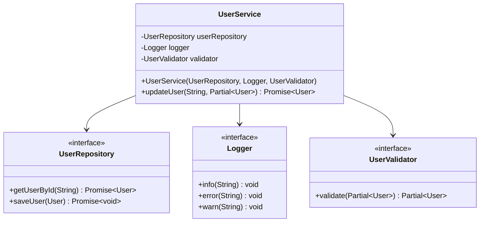
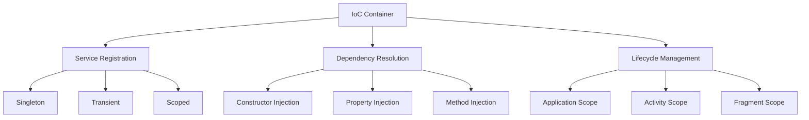
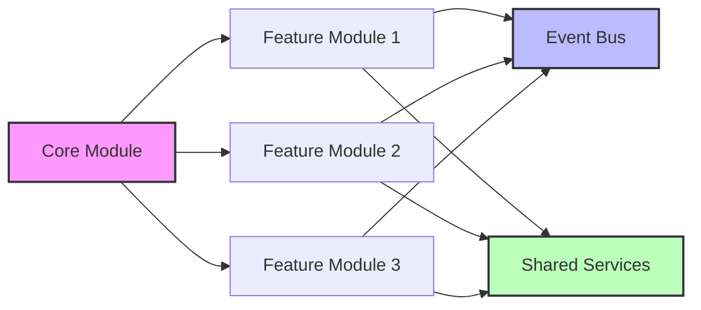

# Dependency Injection ve IoC Container'lar

Modern mobil uygulama mimarisinde Dependency Injection (DI), loose coupling ve high cohesion prensiplerini hayata geçiren fundamental bir tasarım pattern'idir. Bu yaklaşım, bileşenler arası bağımlılıkları dışarıdan enjekte ederek testable, maintainable ve scalable kod yapıları oluşturmamızı sağlar.

## Dependency Injection Pattern'inin Temeleri

Dependency Injection, SOLID prensiplerine dayanan ve özellikle Dependency Inversion Principle'ı destekleyen bir implementation tekniğidir. Geleneksel yaklaşımda bir sınıf, ihtiyaç duyduğu dependencies'leri doğrudan instantiate eder; DI pattern'inde ise bu dependencies dışarıdan sağlanır.

### Constructor Injection Stratejisi

Constructor injection, en yaygın kullanılan ve type-safety açısından en güvenli DI tekniğidir. Bu yaklaşımda, bir sınıfın tüm critical dependencies'leri constructor parametreleri olarak alınır ve immutable field'lara assign edilir.

```typescript
// Repository interface tanımı
interface UserRepository {
  getUserById(id: string): Promise<User>;
  saveUser(user: User): Promise<void>;
}

// Service sınıfı constructor injection ile
class UserService {
  constructor(
    private readonly userRepository: UserRepository,
    private readonly logger: Logger,
    private readonly validator: UserValidator
  ) {}

  async updateUser(userId: string, userData: Partial<User>): Promise<User> {
    this.logger.info(`Updating user ${userId}`);
    
    const existingUser = await this.userRepository.getUserById(userId);
    const validatedData = this.validator.validate(userData);
    
    const updatedUser = { ...existingUser, ...validatedData };
    await this.userRepository.saveUser(updatedUser);
    
    return updatedUser;
  }
}
```

Bu approach, compile-time'da missing dependencies'lerin detect edilmesini sağlar ve unit testing sırasında mock objects'lerin kolayca enjekte edilmesine imkan tanır.



### Property ve Method Injection Teknikleri

Property injection, optional dependencies veya framework-specific scenarios'larda tercih edilen bir tekniktir. Bu yaklaşım, constructor'dan sonra properties üzerinden dependencies'lerin set edilmesini sağlar.

```swift
// Swift'te property injection örneği
class NetworkManager {
    var logger: Logger?
    var cacheManager: CacheManager?
    
    func performRequest<T: Codable>(_ request: APIRequest) -> AnyPublisher<T, APIError> {
        logger?.log("Performing request: \(request.endpoint)")
        
        // Cache'den kontrol et
        if let cachedData = cacheManager?.getCachedData(for: request.cacheKey) {
            logger?.log("Returning cached data")
            return Just(cachedData)
                .setFailureType(to: APIError.self)
                .eraseToAnyPublisher()
        }
        
        // Network request implementation
        return performNetworkRequest(request)
    }
}
```

Method injection ise, runtime'da dynamic dependencies'lerin sağlanması gereken durumlarda kullanılır ve genellikle framework callback methods'unda implement edilir.

## IoC Container Architectures

Inversion of Control (IoC) container'lar, dependencies'lerin merkezi bir şekilde yönetilmesini ve automatic injection'ın gerçekleştirilmesini sağlayan sophisticated sistemlerdir. Enterprise-level mobil uygulamalarda, bu container'lar complex dependency graphs'ın yönetiminde kritik rol oynarlar.



### Service Registration Patterns

IoC container'lar, services'lerin lifecycle'ını ve instantiation strategy'lerini belirleyen registration patterns kullanırlar. Singleton pattern, factory pattern ve transient pattern olmak üzere üç temel registration türü mevcuttur.

```kotlin
// Kotlin'de Dagger/Hilt IoC container configuration
@Module
@InstallIn(SingletonComponent::class)
abstract class DataModule {
    
    @Binds
    @Singleton
    abstract fun bindUserRepository(
        userRepositoryImpl: UserRepositoryImpl
    ): UserRepository
    
    @Binds
    abstract fun bindUserValidator(
        userValidatorImpl: UserValidatorImpl
    ): UserValidator
    
    @Provides
    @Singleton
    fun provideNetworkClient(
        @ApplicationContext context: Context,
        logger: Logger
    ): NetworkClient {
        return NetworkClient.Builder()
            .context(context)
            .logger(logger)
            .build()
    }
}
```

Bu configuration, UserRepository'nin singleton olarak, UserValidator'ın ise transient olarak instantiate edilmesini sağlar. Singleton services memory footprint'ini optimize ederken, transient services state isolation garantisi verir.

### Scope Management Strategies

Modern IoC container'lar, sophisticated scope management mechanisms implement ederler. Activity scope, fragment scope, application scope gibi lifecycle-aware scope'lar, resources'ların doğru zamanda allocate ve deallocate edilmesini sağlar.

```swift
// SwiftUI'de dependency injection scope management
class DependencyContainer: ObservableObject {
    private var services: [String: Any] = [:]
    
    func register<T>(_ type: T.Type, scope: ServiceScope, factory: @escaping () -> T) {
        let key = String(describing: type)
        
        switch scope {
        case .singleton:
            services[key] = Singleton(factory: factory)
        case .transient:
            services[key] = TransientFactory(factory: factory)
        case .scoped(let scopeId):
            services[key] = ScopedService(scopeId: scopeId, factory: factory)
        }
    }
    
    func resolve<T>(_ type: T.Type) -> T {
        let key = String(describing: type)
        
        if let singleton = services[key] as? Singleton<T> {
            return singleton.instance
        } else if let factory = services[key] as? TransientFactory<T> {
            return factory.create()
        } else if let scoped = services[key] as? ScopedService<T> {
            return scoped.getInstance()
        }
        
        fatalError("Service \(key) not registered")
    }
}
```

## Multi-Module Dependency Architecture

Large-scale mobil uygulamalarda, modular architecture pattern'i ile birlikte kullanılan DI sistemleri, cross-module communication'ı facilitate eden sophisticated mechanisms gerektirir. Bu architecture'da her module kendi dependencies'lerini declare eder ve expose edeceklerini specify eder.



### Module Boundary Definition

Module boundaries'lerin clear definition'ı, dependency leakage'ını prevent eder ve strong encapsulation sağlar. Her module, public interface'i aracılığıyla diğer modules'lara hizmet verirken, internal implementation details'leri hide eder.

```typescript
// Feature module dependency definition
export interface FeatureModuleDependencies {
  userRepository: UserRepository;
  analyticsService: AnalyticsService;
  logger: Logger;
}

export interface FeatureModuleExports {
  userService: UserService;
  userViewModel: UserViewModel;
}

export class UserFeatureModule implements FeatureModule<FeatureModuleDependencies, FeatureModuleExports> {
  private dependencies: FeatureModuleDependencies;
  
  constructor(dependencies: FeatureModuleDependencies) {
    this.dependencies = dependencies;
  }
  
  configure(container: DependencyContainer): FeatureModuleExports {
    // Internal dependencies registration
    container.register(UserService, () => new UserService(
      this.dependencies.userRepository,
      this.dependencies.logger
    ));
    
    container.register(UserViewModel, () => new UserViewModel(
      container.resolve(UserService),
      this.dependencies.analyticsService
    ));
    
    return {
      userService: container.resolve(UserService),
      userViewModel: container.resolve(UserViewModel)
    };
  }
}
```

### Cross-Module Communication Patterns

Modules arası communication, well-defined interfaces ve event-driven architecture ile implement edilir. Bu approach, modules'ların independent olarak develop, test ve deploy edilmesini sağlarken, system-wide consistency maintain eder.

Event-driven communication, modules'ların direct dependencies olmadan interact etmelerini sağlar. Event bus pattern'i, central mediator olarak çalışır ve type-safe event routing implement eder.

```kotlin
// Event-driven inter-module communication
@Singleton
class EventBus @Inject constructor() {
    private val events = PublishSubject.create<DomainEvent>()
    
    fun publish(event: DomainEvent) {
        events.onNext(event)
    }
    
    inline fun <reified T : DomainEvent> subscribe(): Observable<T> {
        return events
            .ofType(T::class.java)
            .observeOn(AndroidSchedulers.mainThread())
    }
}

// User module'den event publishing
class UserService @Inject constructor(
    private val eventBus: EventBus,
    private val userRepository: UserRepository
) {
    suspend fun updateUserProfile(userId: String, profile: UserProfile) {
        userRepository.updateProfile(userId, profile)
        
        // Other modules'lara notification
        eventBus.publish(UserProfileUpdatedEvent(userId, profile))
    }
}

// Analytics module'de event subscription
class AnalyticsService @Inject constructor(
    private val eventBus: EventBus,
    private val analyticsClient: AnalyticsClient
) {
    init {
        eventBus.subscribe<UserProfileUpdatedEvent>()
            .subscribe { event ->
                analyticsClient.track("user_profile_updated", mapOf(
                    "user_id" to event.userId,
                    "updated_fields" to event.profile.getChangedFields()
                ))
            }
    }
}
```

## Testing ve Mocking Strategies

Dependency injection'ın en significant avantajlarından biri, comprehensive testing strategies'inin implementation'ını facilitate etmesidir. Mock objects, test doubles ve stub implementations, isolated unit testing environment'ı create ederler.

### Mock Object Implementation

Professional testing environment'ında, sophisticated mock objects production code'un behavior'ını simulate ederken, test scenarios'ların control edilmesini sağlarlar. Bu approach, edge cases'lerin test edilmesini ve deterministic test results'ların alınmasını mümkün kılar.

```swift
// Swift'te mock implementation
protocol NetworkService {
    func fetchUser(id: String) async throws -> User
    func updateUser(_ user: User) async throws -> User
}

class MockNetworkService: NetworkService {
    var fetchUserResult: Result<User, Error>?
    var updateUserResult: Result<User, Error>?
    
    private(set) var fetchUserCallCount = 0
    private(set) var updateUserCallCount = 0
    private(set) var lastFetchedUserId: String?
    private(set) var lastUpdatedUser: User?
    
    func fetchUser(id: String) async throws -> User {
        fetchUserCallCount += 1
        lastFetchedUserId = id
        
        switch fetchUserResult {
        case .success(let user):
            return user
        case .failure(let error):
            throw error
        case .none:
            throw NetworkError.notConfigured
        }
    }
    
    func updateUser(_ user: User) async throws -> User {
        updateUserCallCount += 1
        lastUpdatedUser = user
        
        switch updateUserResult {
        case .success(let updatedUser):
            return updatedUser
        case .failure(let error):
            throw error
        case .none:
            throw NetworkError.notConfigured
        }
    }
}
```

### Test Container Configuration

Test environment'ında, production dependencies'lerin yerini test-specific implementations alır. Test container configuration, isolated ve predictable test execution environment oluşturur.

```typescript
// Test-specific dependency configuration
describe('UserService', () => {
  let userService: UserService;
  let mockRepository: jest.Mocked<UserRepository>;
  let mockLogger: jest.Mocked<Logger>;
  let mockValidator: jest.Mocked<UserValidator>;
  
  beforeEach(() => {
    // Mock implementations
    mockRepository = {
      getUserById: jest.fn(),
      saveUser: jest.fn(),
    };
    
    mockLogger = {
      info: jest.fn(),
      error: jest.fn(),
      warn: jest.fn(),
    };
    
    mockValidator = {
      validate: jest.fn(),
    };
    
    // Dependency injection with mocks
    userService = new UserService(
      mockRepository,
      mockLogger,
      mockValidator
    );
  });
  
  it('should update user successfully', async () => {
    // Arrange
    const userId = 'user-123';
    const userData = { name: 'Updated Name' };
    const existingUser = { id: userId, name: 'Original Name', email: 'user@example.com' };
    const expectedUser = { ...existingUser, ...userData };
    
    mockRepository.getUserById.mockResolvedValue(existingUser);
    mockValidator.validate.mockReturnValue(userData);
    mockRepository.saveUser.mockResolvedValue();
    
    // Act
    const result = await userService.updateUser(userId, userData);
    
    // Assert
    expect(result).toEqual(expectedUser);
    expect(mockRepository.getUserById).toHaveBeenCalledWith(userId);
    expect(mockValidator.validate).toHaveBeenCalledWith(userData);
    expect(mockRepository.saveUser).toHaveBeenCalledWith(expectedUser);
    expect(mockLogger.info).toHaveBeenCalledWith(`Updating user ${userId}`);
  });
});
```

Bu comprehensive testing approach, code coverage'ı maximize ederken, regression bugs'ların early detection'ını sağlar ve refactoring confidence'ı artırır.

## Dependency Injection Best Practices

Enterprise-level mobil uygulamalarda DI implementation'ı, several best practices'ı follow etmelidir. Bu practices, maintainable, performant ve reliable systems'ın development'ını facilitate eder.

Constructor parameters'ın sayısının control edilmesi, class'ların single responsibility'ye adherence'ını indicate eder. Excessive parameters, class'ın too many responsibilities'ye sahip olduğunu suggest eder ve refactoring ihtiyacına işaret eder.

Interface segregation principle'ının application'ı, clients'ların sadece ihtiyaç duydukları methods'lara depend etmelerini sağlar. Bu approach, loose coupling promote eder ve system flexibility'sini artırır.

Circular dependencies'lerin prevention'ı, system architecture'ının health'ini indicate eder. Circular dependencies, design flaws'ı suggest eder ve runtime issues'lara cause olabilir.

```java
// Java'da circular dependency prevention
@Component
public class UserService {
    private final UserRepository userRepository;
    private final NotificationService notificationService;
    
    public UserService(
        UserRepository userRepository,
        @Lazy NotificationService notificationService // Lazy injection breaks cycle
    ) {
        this.userRepository = userRepository;
        this.notificationService = notificationService;
    }
}

@Component  
public class NotificationService {
    private final UserService userService;
    
    public NotificationService(UserService userService) {
        this.userService = userService;
    }
}
```

Resource management ve memory leaks'ın prevention'ı, özellikle mobile environment'da critical importance'a sahiptir. Singleton services'ların careful implementation'ı ve proper cleanup mechanisms'ların establishment'ı, application stability'sini ensure eder.

Dependency injection pattern'inin correct implementation'ı, modern mobil uygulamalarda scalable, maintainable ve testable architecture'ın foundation'ını oluşturur. Bu systematic approach, development team productivity'sini artırırken, code quality metrics'lerini significantly improve eder.
