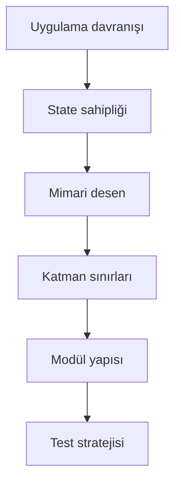

# Mobil Uygulama Mimarileri ve Durum Yönetimi

Mobil mimari, ekranların nasıl çizileceğinden daha fazlasıdır. Veri akışı, durum sahipliği, modül sınırları, test edilebilirlik ve platform bağımlılıklarının nerede duracağı aynı karar setinin parçalarıdır.

Bu bölüm, uygulama büyüdükçe kodun okunabilir, test edilebilir ve değiştirilebilir kalması için kullanılan ana mimari yaklaşımları toplar.

## Bölüm Haritası

- [Mimari Desenler](/mobile/architecture/patterns): MVP, MVVM, MVI, Redux ve BLoC gibi temel desenleri karşılaştırır.
- [Durum Yönetimi Stratejileri](/mobile/architecture/state-management): UI state, server state, local state ve global state ayrımını açıklar.
- [Clean Architecture](/mobile/architecture/clean-architecture): presentation, domain ve data katmanlarının sınırlarını tanımlar.
- [Bileşen Tabanlı Mimari](/mobile/architecture/component-based): yeniden kullanılabilir UI ve feature bileşenlerinin nasıl tasarlanacağını anlatır.
- [Dependency Injection ve IoC](/mobile/architecture/dependency-injection): bağımlılıkların nasıl kurulacağını ve testte nasıl değiştirileceğini açıklar.
- [Modüler Mimari Yapıları](/mobile/architecture/modular-architecture): feature-first, layer-first ve hibrit modül yaklaşımlarını inceler.

## Karar Sırası

İyi bir mimari kararı genellikle şu sırayla verilir:

- Kullanıcı akışı ve kritik hata durumlarını yaz.
- Ekran state'inin kimde yaşayacağını belirle.
- Domain mantığı ile UI mantığını ayırman gerekip gerekmediğine karar ver.
- Veri kaynaklarını ve repository sınırlarını netleştir.
- Modül yapısını ekip ve ürün büyüklüğüne göre seç.
- Mimariyi test ve release süreçleriyle doğrula.

## Hızlı Seçim Rehberi

| Durum | Başlangıç yaklaşımı | Dikkat edilmesi gereken |
| --- | --- | --- |
| Küçük prototip | Basit MVVM veya tek ViewModel | Erken soyutlama ekleme |
| Offline-first uygulama | Clean Architecture + repository sınırı | Sync ve conflict kararını erken ver |
| Büyük ekip | Feature-first modüler yapı | Sahiplik ve public API sınırlarını netleştir |
| Ağır UI state | MVI, BLoC veya reducer yaklaşımı | State geçişlerini izlenebilir tut |
| Çok platformlu domain | Domain-first modelleme | Platform SDK'larını domain'e sokma |

## Sağlam Mimari Kontrol Listesi

- [ ] UI state, domain model ve API DTO aynı nesne değil.
- [ ] Her ekranın loading, empty, success ve error durumu açık.
- [ ] Repository sınırı veri kaynağı detaylarını UI'dan saklıyor.
- [ ] Dependency injection testte fake implementation kullanmayı kolaylaştırıyor.
- [ ] Modül yapısı ekip çalışmasını kolaylaştırıyor, gereksiz paket kalabalığı yaratmıyor.
- [ ] Performans kritik ekranlarda rebuild, render ve memory davranışı ölçülüyor.
