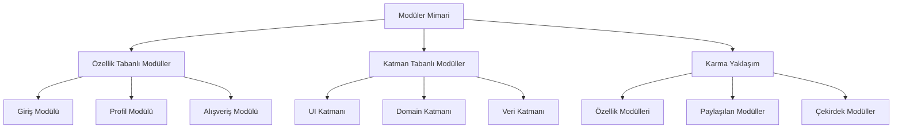
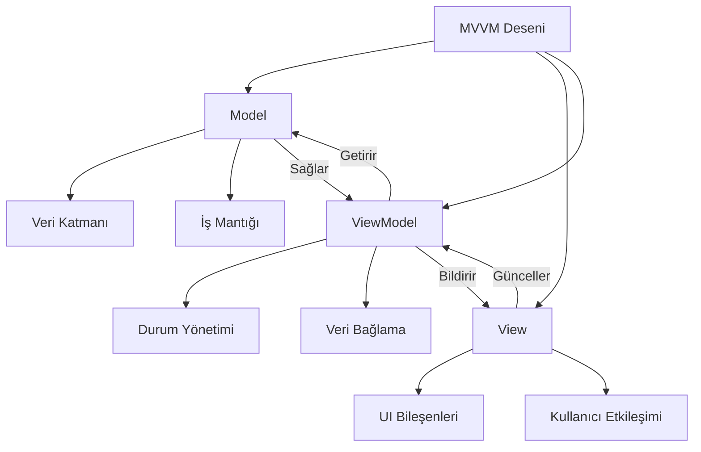
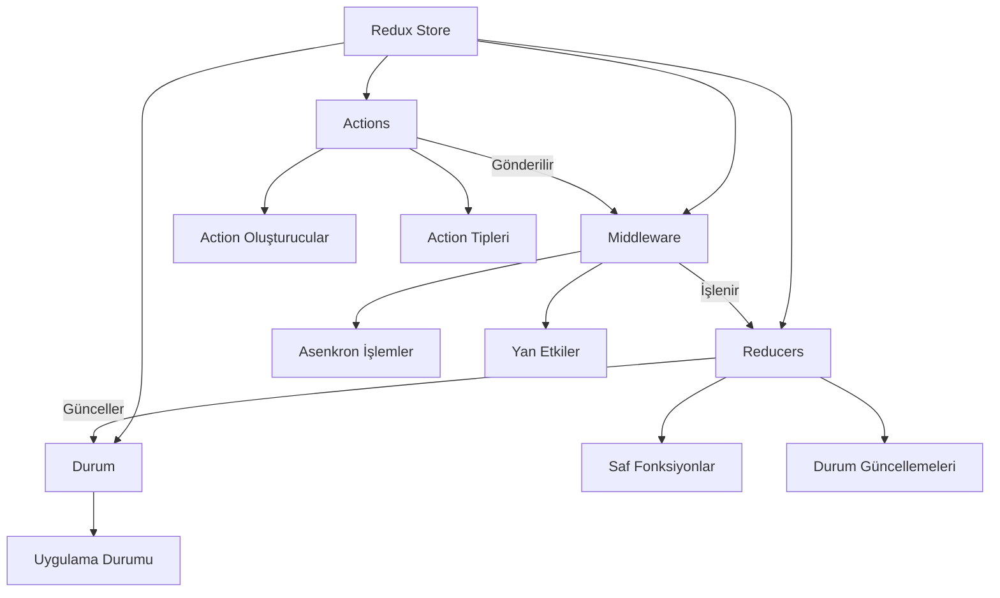
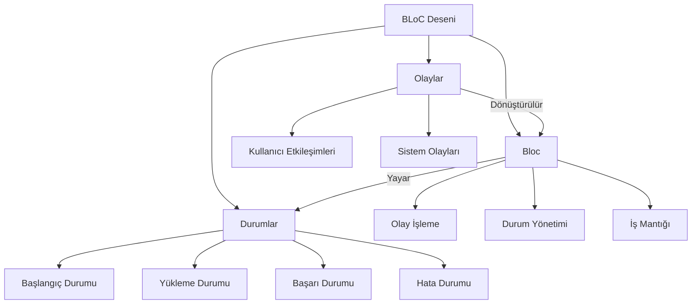
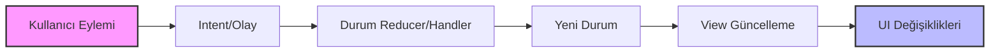

# Mimari Desenler (MVP, MVVM, Clean Architecture)

Modern mobil uygulama geliştirmede mimari desen seçimi, projenin uzun vadeli başarısını belirleyen en kritik kararlardan biridir. Bu bölümde, sektörde yaygın olarak kullanılan başlıca mimari yaklaşımları detaylı şekilde inceleyerek, her birinin güçlü ve zayıf yönlerini gerçek dünya senaryolarıyla açıklayacağız.

## Monolitik vs Modüler Uygulama Mimarisi

### Monolitik Uygulama Yaklaşımının Dinamikleri

Monolitik mimari, tüm uygulama bileşenlerinin (UI katmanı, iş mantığı ve veri erişim katmanı) tek bir bütünsel birim içinde organize edildiği geleneksel yaklaşımdır. Bu yaklaşım, özellikle küçük ve orta ölçekli projelerde hızlı geliştirme döngüsü sağlar ve minimum yapılandırma yükü gerektirir.

Flutter ekosisteminde monolitik yaklaşım, genellikle tek main.dart dosyasında tüm widget hiyerarşisinin ve iş mantığının tanımlanması şeklinde karşımıza çıkar. iOS geliştirmede ise, tek Hedef içinde tüm ViewController ve Model sınıflarının organize edilmesi bu deseni örnekler. Android'de benzer şekilde, tek Modül içinde tüm Activity, Fragment ve Repository sınıflarının bulunması monolitik yapıyı temsil eder.

Bu yaklaşımın en belirgin avantajı, hızlı prototipleme ve basit geliştirme süreci sağlamasıdır. Modüller arası bağımlılık yönetimi karmaşıklığı olmadığı için, geliştirme ekibi minimum kurulum gereksinimleri ile proje geliştirmeye başlayabilir. Ancak, proje kapsamı genişledikçe kod navigasyonu zorlaşır, ekip işbirliği sınırlanır ve test izolasyonu sorunlu hale gelir.

Derleme süresinin artması, bakım zorlukları ve özellik izolasyonu zorluklarıyla birlikte, Sürekli Entegrasyon süreçleri yavaşlar ve hot reload performansı düşer. Bu nedenle, kurumsal düzeydeki projelerde monolitik yaklaşım genellikle başlangıç geliştirme aşamasında tercih edilir, sonrasında modüler mimariye geçiş planlanır.

### Modüler Uygulama Mimarisinin Stratejik Önemi

Modüler mimari, uygulamanın farklı işlevsel bölümlerinin bağımsız modüller halinde organize edildiği sofistike yaklaşımdır. Bu stratejinin temel amacı, karmaşık uygulamaları yönetilebilir parçalara bölerek bakım yapılabilirliği, ölçeklenebilirliği ve ekip verimliliğini en üst düzeye çıkarmaktır.

Flutter ekosisteminde modüler yaklaşım, paket yapısı ile özellik tabanlı organizasyon şeklinde uygulanır. flutter_modular veya get_it bağımlılık enjeksiyon çerçeveleri kullanılarak, lib/features/{özellik_adı} dizin yapısı benimsenir. Bu yaklaşım, her özelliğin kendi UI bileşenleri, iş mantığı ve veri erişim katmanına sahip olmasını sağlar.

iOS geliştirmede Swift Package Manager ile modül ayrımı sağlanır. CocoaPods ile yerel/uzak pod bağımlılıkları yönetilirken, Xcode Workspace içinde birden fazla proje organize edilir. Bu yapı, platform özel optimizasyonları kolaylaştırır ve kod yeniden kullanılabilirliğini artırır.

Android ekosisteminde Gradle çoklu modül kurulumu, Android Jetpack Navigation Component ve Dynamic Feature Modules ile isteğe bağlı yükleme uygulanır. Bu yaklaşım, uygulama paket boyutu optimizasyonunu sağlarken, kullanıcı deneyimini geliştirir.

Çapraz platform geliştirmede React Native Metro bundler ile bileşen izolasyonu, Xamarin Class Libraries ve Shared Projects, Ionic Angular/React modül sistemleri ve Kotlin Multiplatform paylaşılan iş mantığı modülleri kullanılır. Flutter'da temiz mimari prensipleriyle özellik öncelikli mimari benimsenerek kapsamlı modüler yapı elde edilir.

### Modüler Mimari Uygulama Stratejileri

Özellik tabanlı modüller yaklaşımında her iş yeteneği (giriş, profil, alışveriş) ayrı modül olarak organize edilir. Katman tabanlı modüller yaklaşımında UI, Domain ve Veri katmanları ayrı modüller halinde yapılandırılır. Karma yaklaşım ise özellik ve katman kombinasyonunu benimseyerek optimal esneklik sağlar.

Paylaşılan modüller (ortak yardımcı programlar, tasarım sistemi, ağ iletişimi), domain modülleri (iş mantığı ve kullanım senaryoları), veri modülleri (repository uygulamaları ve veri kaynakları), sunum modülleri (UI bileşenleri ve durum yönetimi), çekirdek modüller (platform özel uygulamalar) ve test modülleri (birim ve entegrasyon test paketleri) kapsamlı modüler mimarinin temel yapı taşlarını oluşturur.

Bu stratejik organizasyon, geliştirme ekibinin paralel çalışma yeteneğini geliştirirken, kod sahipliği netliği sağlar ve sürekli dağıtım pipeline'larını optimize eder.

## MVVM Deseni ve Modern Durum Yönetimi

### MVVM (Model-View-ViewModel) Mimarisi Derinlemesine İnceleme

Model-View-ViewModel deseni, Microsoft tarafından WPF ve Silverlight için geliştirilmiş olmasına rağmen, mobil geliştirme ekosisteminde yaygın kabul görmüştür. Bu desenin kavramsal yapısı, Model (veri ve iş mantığı katmanı), View (UI bileşenleri ve kullanıcı etkileşimi yönetimi) ve ViewModel (View ile Model arasında köprü görevi gören UI durum yönetimi katmanı) olmak üzere üç ana bileşenden oluşur.

Android ekosisteminde Jetpack ViewModel ile LiveData/StateFlow kombinasyonu, Data Binding ile çift yönlü bağlama yeteneği ve Jetpack Compose ile remember ve collectAsState fonksiyonları kullanılarak kapsamlı MVVM uygulaması elde edilir. Bu yaklaşım, Android yaşam döngüsüne uyumlu durum yönetimi sağlarken, yapılandırma değişiklikleri sırasında durum korunmasını garanti eder.

iOS geliştirmede SwiftUI'ın ObservableObject protokolü, @Published özellik sarmalayıcıları ve Combine framework ile reaktif programlama paradigmaları benimsenerek MVVM deseni uygulanır. Bu uygulama, bildirimsel UI güncellemeleri sağlarken, otomatik bellek yönetimi ve verimli render işlemi garanti eder.

Flutter ekosisteminde Provider deseni ile ChangeNotifier, Riverpod ile değişmez durum yönetimi ve BLoC deseninin ViewModel benzeri kullanımı kapsamlı MVVM desteği sağlar. Bu yaklaşımlar, widget yeniden oluşturma optimizasyonu sağlarken, geliştirme verimliliğini artırır.

MVVM deseninin temel avantajları View'dan iş mantığı ayrımı, geliştirilmiş birim test yeteneği, platform yaşam döngüsü uyumluluğu, reaktif programlama desteği, çift yönlü veri bağlama fırsatları, basitleştirilmiş görünüm durumu yönetimi, endişelerin ayrılması prensibine uyum ve artırılmış kod yeniden kullanılabilirliğidir.

### MVI (Model-View-Intent) ve Öngörülebilir Durum Yönetimi

Model-View-Intent deseni, tek yönlü veri akışı ile öngörülebilir durum yönetimi sağlayan sofistike yaklaşımdır. Bu desenin temel prensibi, uygulama durumunun tek gerçek kaynak olarak korunması ve durum değişikliklerinin kontrollü bir şekilde gerçekleştirilmesidir.

MVI deseninin temel bileşenleri Intent (kullanıcı eylemleri ve sistem olayları), Model (uygulama durumunun değişmez temsili) ve View (durumun UI temsili) olmak üzere organize edilir. Bu mimari, durum öngörülebilirliğini en üst düzeye çıkarırken, hata ayıklama yeteneğini önemli ölçüde geliştirir.

Android geliştirmede MvRx (Airbnb'nin MVI framework'ü), Flutter'da flutter_bloc ile MVI deseni uygulaması ve React Native'de Redux deseninin MVI benzeri uygulaması kapsamlı çapraz platform desteği sağlar.

Durum değişmezliği prensibi, her durum geçişinde yeni durum nesnesi oluşturulmasını zorunlu kılarak, yanlışlıkla durum değişikliklerini önler. Intent işleme mekanizması, kullanıcı eylemlerinin kuyruğa alınmasını ve sıralı işlenmesini garanti ederek, yarış koşullarını ortadan kaldırır.

Yan etki yönetimi, intent işlemenin kontrollü ortamda gerçekleştirilmesini sağlarken, durum geri yükleme yeteneği uygulama durumunun kolay serileştirilmesini sağlar. Hata ayıklama geliştirmeleri, durum geçişlerinin kapsamlı izlenmesini sağlarken, hata işleme mekanizmaları intent işleme sırasında sağlam hata yönetimini garanti eder.

Yükleme durumları için asenkron işlem yönetimi ve durum kalıcılığı için yerel depolama entegrasyonu, MVI deseninin üretime hazır uygulamasının temel bileşenlerini oluşturur.

### Redux Deseni ve Merkezi Durum Mimarisi

Redux deseni, merkezi durum yönetimi felsefesi ile tek store içinde tüm uygulama durumunun korunmasını savunur. Saf fonksiyonlar (reducers) ile durum geçişleri ve zaman yolculuğu hata ayıklama yetenekleri, Redux'un ayırt edici özelliklerini temsil eder.

Flutter'da flutter_redux paketi, React Native'de yerel Redux uygulaması, Android'de Redux tarzı mimari (AAC ViewModel + Repository deseni) ve iOS'de SwiftUI + Combine ile Redux benzeri desenler kapsamlı çapraz platform Redux benimsemesini sağlar.

Middleware ekosistemi, asenkron işlem yönetimi, kapsamlı günlük kaydı yetenekleri ve gelişmiş analitik entegrasyonu sağlarken, DevTools entegrasyonu durum incelemesi ve zaman yolculuğu hata ayıklama işlevselliği sağlar. Durum seçicileri önbelleğe alınmış durum sorgularını sağlarken, action oluşturucuları tip güvenli action üretimini garanti eder.

Reducer kompozisyonu karmaşık durum yönetimi için reducer bölme sağlarken, durum normalizasyonu optimize edilmiş durum yapısı sağlar. Redux persist ile durum hidrasyonu ve hata sınırları ile global hata yönetimi, üretime hazır Redux uygulamasının kritik yönlerini oluşturur.

### BLoC (Business Logic Component) Flutter'a Özel Mükemmellik

Business Logic Component deseni, Flutter ekosistemine özel geliştirilmiş akış tabanlı durum yönetimi yaklaşımıdır. Bu desenin temel kavramı, reaktif programlama paradigmaları ile verimli durum yönetimi sağlamaktır.

BLoC deseninin temel kavramları Olaylar (kullanıcı etkileşimleri ve sistem olayları), Durumlar (UI'ın farklı durumları) ve Bloc (Olayları Durumlara dönüştüren iş mantığı konteyneri) olmak üzere organize edilir.

flutter_bloc paket bağımlılığı ile kapsamlı uygulama desteği, BlocProvider widget'ı ile bağımlılık enjeksiyonu, BlocBuilder ile reaktif UI güncellemeleri ve BlocListener ile yan etki yönetimi BLoC ekosisteminin temel bileşenlerini oluşturur.

Test avantajları saf fonksiyonlar ile öngörülebilir davranış, sahte olaylar ile kapsamlı birim testi ve entegrasyon testi ile kullanıcı akışı doğrulaması içerir. Performans optimizasyonları akış aboneliği optimizasyonu, durum karşılaştırması ile gereksiz yeniden oluşturmaları önleme, bellek sızıntısı önleme ve kaynak temizleme mekanizmaları içerir.

Olay debouncing ve throttling, durum önbelleğe alma, tembel yükleme ve arka plan işleme yetenekleri, kurumsal düzeyde BLoC uygulamasının gelişmiş özelliklerini temsil eder.

## Tek Yönlü Veri Akışı ve Durum Değişmezliği

### Tek Yönlü Veri Akışı Mimarisi Prensipleri

Tek yönlü veri akışı prensibi, veri akışının tek yönlü organizasyonu ile uygulama durumunun öngörülebilir davranışının garanti edilmesi temel kavramıdır. Bu mimari prensip, karmaşık mobil uygulamalarda durum yönetimi karmaşıklığını önemli ölçüde azaltırken, hata ayıklama yeteneğini dramatik şekilde geliştirir.

Veri akış döngüsünün sistematik yapısı: Kullanıcı Eylemi → Intent/Olay oluşturma → Durum Reducer/Handler işleme → Yeni Durum oluşturma → View Güncelleme gerçekleştirme → Kullanıcı Arayüzü değişiklikleri temsili şeklinde organize edilir. Bu sistematik yaklaşım, durum değişikliklerinin kontrollü gerçekleştirilmesini sağlarken, uygulama davranışının öngörülebilir kalıpları takip etmesini garanti eder.

Tek yönlü akışın temel faydaları geliştirilmiş hata ayıklama yeteneği (durum değişiklikleri kapsamlı izleme), zaman yolculuğu hata ayıklama olasılıkları, yarış koşulu önleme, tüm uygulama genelinde tutarlı durum yönetimi, öngörülebilir durum güncellemeleri, geliştirilmiş hata işleme mekanizmaları, önemli ölçüde geliştirilmiş test edilebilirlik ve optimize edilmiş performans özelliklerini içerir.

### Platform Özel Tek Yönlü Akış Uygulamaları

Flutter ekosisteminde BLoC deseni Olaylar → BLoC → Durumlar → UI ilerlemesi, Provider deseni Eylemler → ChangeNotifier → Consumer yeniden oluşturma mekanizması, Riverpod StateNotifier ile değişmez durum geçişleri ve GetX Controller → View reaktif güncellemeleri kapsamlı tek yönlü akış desteği sağlar.

iOS geliştirmede SwiftUI + Combine kombinasyonu @Published özellikleri ile durum değişiklikleri yayılımı, Publishers zinciri ile sofistike veri dönüşümü ve @StateObject/@ObservedObject ile otomatik UI bağlama uygular. VIPER Mimarisi Presenter → View tek yönlü iletişim ve Interactor → Presenter veri akışını korur.

Android ekosisteminde Jetpack Compose durum yükseltme kalıpları, remember ve derivedStateOf ile hesaplanmış durum yönetimi ve collectAsState ile Flow/LiveData tüketimi sağlar. Geleneksel View Sistemi ViewModel → LiveData → Observer → UI güncelleme ilerlemesi ve Repository deseni ile veri kaynağı soyutlaması uygular.

### Durum Değişmezliği Uygulama Stratejileri

Durum değişmezliği kavramı, orijinal durum nesnelerinin değiştirilmesi yerine yeni nesneler oluşturulmasının zorunlu kılınması temel prensibidir. Bu yaklaşım, yanlışlıkla durum değişikliklerini önlerken, durum izleme yeteneğini önemli ölçüde geliştirir.

Uygulama teknikleri platform özel yaklaşımları benimser: Kotlin veri sınıfları ile copy() fonksiyonları, Swift struct tipleri ile değer semantiği, Dart copyWith() metodları ile değişmez güncellemeler, JavaScript Object.assign() ve spread operatörü, TypeScript Readonly tipleri ve immutable.js, Java Builder deseni ve değişmez koleksiyonlar, C# Record tipleri ve değişmez koleksiyonlar, Rust sahiplik sistemi ve move semantiği.

Bellek verimliliği düşünceleri yapısal paylaşım (sadece değişen parçalar için yeni bellek ayırma), referans eşitliği (nesne kimliği ile değişiklik algılama optimizasyonu), verimli çöp toplama (kullanılmayan durum nesnelerinin optimal temizlenmesi), bellek havuzu (nesne yeniden kullanım kalıpları), zayıf referanslar (döngüsel referans önleme), kapsamlı bellek profilleme, bellek sızıntısı algılama ve bellek optimizasyon stratejilerini içerir.

### Gelişmiş Anlık Görüntü Yönetim Sistemleri

Durum anlık görüntüleri her durum değişikliğinde uygulama durumunun kapsamlı anlık görüntüsünü korur. Fark algoritmaları önceki durum ile mevcut durum detaylı karşılaştırması gerçekleştirirken, UI uzlaştırma minimal UI güncellemeleri ile performans optimizasyonu sağlar.

Geliştirme araçları ekosistemi Redux DevTools ile kapsamlı durum incelemesi, Flutter Inspector ile detaylı widget ağacı anlık görüntüleri, Xcode Memory Graph ile durum nesne ilişkileri görselleştirmesi, Android Studio Memory Profiler, React Developer Tools, Vue DevTools, sofistike Performans İzleme Araçları ve kapsamlı Çökme Raporlama Sistemlerini içerir.

Bu gelişmiş araç ekosistemi, geliştirme ekiplerinin durum yönetimi sorunlarını verimli bir şekilde teşhis etmesini ve optimal çözümler uygulamasını sağlar.
