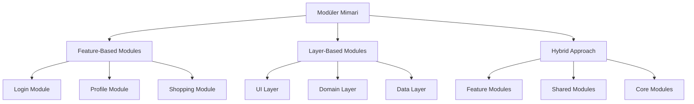
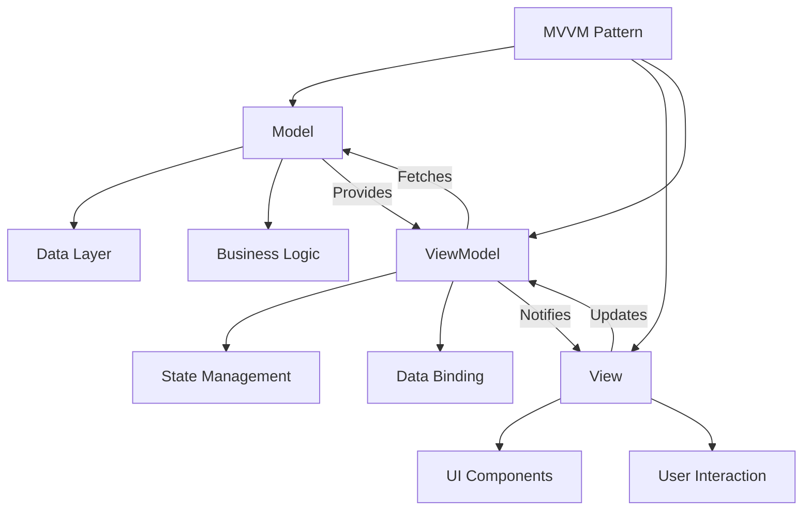
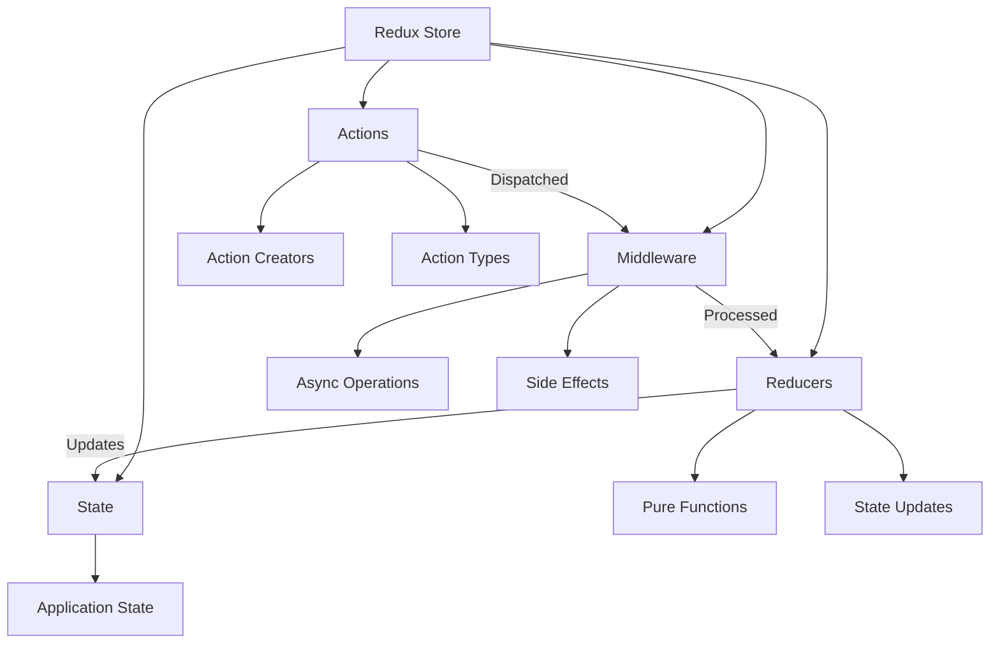
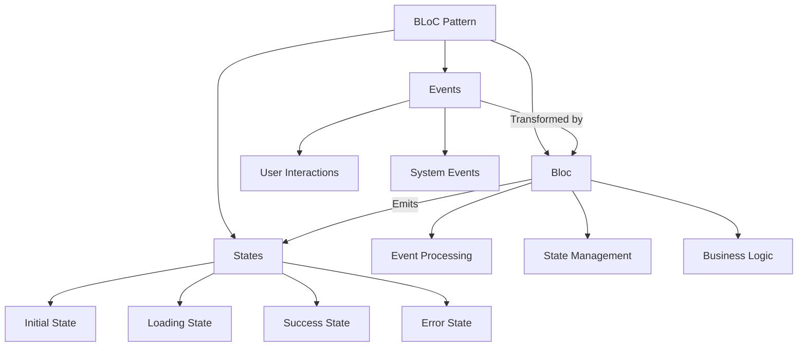
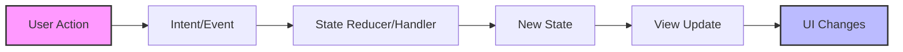

# Mimari Pattern'ler (MVP, MVVM, Clean Architecture)

Modern mobil uygulama geliştirmede mimari pattern seçimi, projenin uzun vadeli başarısını belirleyen en kritik kararlardan biridir. Bu bölümde, industry'de yaygın olarak kullanılan başlıca mimari yaklaşımları detaylı şekilde inceleyerek, her birinin güçlü ve zayıf yönlerini gerçek dünya senaryolarıyla açıklayacağız.

## Monolitik vs Modüler Uygulama Mimarisi

### Monolitik Uygulama Yaklaşımının Dinamikleri

Monolitik mimari, tüm uygulama bileşenlerinin (UI katmanı, business logic ve data access layer) tek bir cohesive unit içinde organize edildiği geleneksel yaklaşımdır. Bu approach, özellikle küçük ve orta ölçekli projelerde hızlı development cycle'ı sağlar ve minimal configuration overhead gerektirir.

Flutter ecosystem'inde monolitik yaklaşım, genellikle tek main.dart dosyasında tüm widget hierarchy'sinin ve business logic'in tanımlanması şeklinde karşımıza çıkar. iOS geliştirmede ise, tek Target içinde tüm ViewController ve Model class'larının organize edilmesi bu pattern'i örnekler. Android'de benzer şekilde, tek Module içinde tüm Activity, Fragment ve Repository class'larının bulunması monolitik structure'ı temsil eder.

Bu yaklaşımın en belirgin avantajı, hızlı prototyping ve straightforward development process sağlamasıdır. Cross-module dependency management complexity'si olmadığı için, development team minimal setup requirements ile proje geliştirmeye başlayabilir. Ancak, project scope genişledikçe code navigation zorlaşır, team collaboration sınırlanır ve testing isolation problematik hale gelir.

Build time'ın artması, maintainability challenges ve feature isolation zorluklarıyla birlikte, Continuous Integration süreçleri yavaşlar ve hot reload performance'ı düşer. Bu nedenle, enterprise-level projectlerde monolitik yaklaşım genellikle initial development phase'de tercih edilir, sonrasında modüler mimariye geçiş planlanır.

### Modüler Uygulama Mimarisinin Stratejik Önemi

Modüler mimari, application'ın farklı functional bölümlerinin independent modules halinde organize edildiği sophisticated approach'dür. Bu stratejinin temel amacı, complex application'ları manageable pieces'lara bölerek maintainability, scalability ve team productivity'yi maximize etmektir.

Flutter ecosystem'inde modüler yaklaşım, package structure ile feature-based organization şeklinde implement edilir. flutter_modular veya get_it dependency injection framework'leri kullanılarak, lib/features/{feature_name} directory structure'ı adopt edilir. Bu approach, her feature'ın kendi UI components, business logic ve data access layer'ına sahip olmasını sağlar.

iOS development'da Swift Package Manager ile module separation achieve edilir. CocoaPods ile local/remote pod dependencies manage edilirken, Xcode Workspace içinde multiple projects organize edilir. Bu structure, platform-specific optimizations'ı kolaylaştırır ve code reusability'yi artırır.

Android ecosystem'inde Gradle multi-module setup, Android Jetpack Navigation Component ve Dynamic Feature Modules ile on-demand loading implement edilir. Bu approach, app bundle size optimization'ı sağlarken, user experience'ı enhanced eder.

Cross-platform development'da React Native Metro bundler ile component isolation, Xamarin Class Libraries ve Shared Projects, Ionic Angular/React module systems ve Kotlin Multiplatform shared business logic modules kullanılır. Flutter'da feature-first architecture with clean architecture principles adopt edilerek comprehensive modular structure achieve edilir.

### Modüler Architecture Implementation Strategies

Feature-based modules approach'da her business capability (login, profile, shopping) ayrı module olarak organize edilir. Layer-based modules yaklaşımında UI, Domain ve Data katmanları separate modules halinde structure edilir. Hybrid approach ise feature ve layer combination'ını adopt ederek optimal flexibility sağlar.

Shared modules (common utilities, design system, networking), domain modules (business logic ve use cases), data modules (repository implementations ve data sources), presentation modules (UI components ve state management), core modules (platform-specific implementations) ve test modules (unit ve integration test suites) comprehensive modular architecture'ın temel building blocks'larını oluşturur.

Bu stratejik organization, development team'in parallel working capability'sini enhance ederken, code ownership clarity'si sağlar ve continuous deployment pipeline'larını optimize eder.

## MVVM Pattern ve Modern State Management

### MVVM (Model-View-ViewModel) Architecture Deep Dive

Model-View-ViewModel pattern, Microsoft tarafından WPF ve Silverlight için geliştirilmiş olmasına rağmen, mobile development ecosystem'inde widespread adoption görmüştür. Bu pattern'in conceptual yapısı, Model (data ve business logic layer), View (UI components ve user interaction handling) ve ViewModel (View ile Model arasında bridge görevi gören UI state management layer) olmak üzere üç ana component'den oluşur.

Android ecosystem'inde Jetpack ViewModel ile LiveData/StateFlow kombinasyonu, Data Binding ile two-way binding capability'si ve Jetpack Compose ile remember ve collectAsState functions kullanılarak comprehensive MVVM implementation achieve edilir. Bu approach, Android lifecycle'a uyumlu state management sağlarken, configuration changes sırasında state preservation guarantee eder.

iOS development'da SwiftUI'ın ObservableObject protocol'ü, @Published property wrappers ve Combine framework ile reactive programming paradigms adopt edilerek MVVM pattern implement edilir. Bu implementation, declarative UI updates sağlarken, automatic memory management ve efficient rendering guarantee eder.

Flutter ecosystem'inde Provider pattern ile ChangeNotifier, Riverpod ile immutable state management ve BLoC pattern'ın ViewModel benzeri utilization comprehensive MVVM support provide eder. Bu approaches, widget rebuild optimization sağlarken, development productivity'yi enhance eder.

MVVM pattern'in primary advantages'ı View'dan business logic separation, enhanced unit testing capability, platform lifecycle compatibility, reactive programming support, two-way data binding opportunities, simplified view state management, separation of concerns principle adherence ve increased code reusability'dir.

### MVI (Model-View-Intent) ve Predictable State Management

Model-View-Intent pattern, unidirectional data flow ile predictable state management achieve eden sophisticated approach'dür. Bu pattern'in fundamental principle'ı, application state'in single source of truth olarak maintain edilmesi ve state mutations'ların controlled manner'da execute edilmesidir.

MVI pattern'in core components'ı Intent (user actions ve system events), Model (application state'in immutable representation'ı) ve View (state'in UI representation'ı) olmak üzere organize edilir. Bu architecture, state predictability maximize ederken, debugging capability'sini significantly enhance eder.

Android development'da MvRx (Airbnb'nin MVI framework'ü), Flutter'da flutter_bloc ile MVI pattern implementation ve React Native'de Redux pattern'ın MVI benzeri application comprehensive cross-platform support sağlar.

State immutability principle'ı, her state transition'da new state object creation'ını enforce ederek, accidental state mutations'ı prevent eder. Intent handling mechanism, user actions'ın queue'lanması ve sequential processing'ini guarantee ederek, race conditions'ı eliminate eder.

Side effects management, intent processing'in controlled environment'da execution'ını ensure ederken, state restoration capability application state'in easy serialization'ını enable eder. Debugging enhancements, state transitions'ın comprehensive tracing'ini provide ederken, error handling mechanisms intent processing sırasında robust error management guarantee eder.

Loading states için asenkron operations management ve state persistence için local storage integration, MVI pattern'in production-ready implementation'ının essential components'larını constitute eder.

### Redux Pattern ve Centralized State Architecture

Redux pattern, centralized state management philosophy ile single store içinde entire application state'in maintenance'ını advocate eder. Pure functions (reducers) ile state transitions ve time-travel debugging capabilities, Redux'un distinctive features'larını represent eder.

Flutter'da flutter_redux package, React Native'de native Redux implementation, Android'de Redux-style architecture (AAC ViewModel + Repository pattern) ve iOS'de SwiftUI + Combine ile Redux-like patterns comprehensive cross-platform Redux adoption enable eder.

Middleware ecosystem, asynchronous operations handling, comprehensive logging capabilities ve advanced analytics integration provide ederken, DevTools integration state inspection ve time-travel debugging functionality sağlar. State selectors memoized state queries enable ederken, action creators type-safe action generation guarantee eder.

Reducer composition complex state management için reducer splitting enable ederken, state normalization optimized state structure provide eder. Redux persist ile state hydration ve error boundaries ile global error handling, production-ready Redux implementation'ın critical aspects'larını constitute eder.

### BLoC (Business Logic Component) Flutter-Specific Excellence

Business Logic Component pattern, Flutter ecosystem'ine özel geliştirilmiş stream-based state management approach'dür. Bu pattern'in fundamental concept'i, reactive programming paradigms ile efficient state management achieve etmektir.

BLoC pattern'in core concepts'ı Events (user interactions ve system events), States (UI'ın different states'leri) ve Bloc (Events'leri States'e transform eden business logic container) olmak üzere organize edilir.

flutter_bloc package dependency ile comprehensive implementation support, BlocProvider widget ile dependency injection, BlocBuilder ile reactive UI updates ve BlocListener ile side effects handling BLoC ecosystem'in essential components'larını constitute eder.

Testing advantages pure functions ile predictable behavior, mock events ile comprehensive unit testing ve integration testing ile user flow validation include eder. Performance optimizations stream subscription optimization, state comparison ile unnecessary rebuilds prevention, memory leak prevention ve resource cleanup mechanisms içerir.

Event debouncing ve throttling, state caching, lazy loading ve background processing capabilities, enterprise-level BLoC implementation'ın advanced features'larını represent eder.

## Unidirectional Data Flow ve State Immutability

### Unidirectional Data Flow Architecture Principles

Unidirectional data flow prensibi, veri akışının tek yönlü organization'ı ile application state'in predictable behavior'ının guarantee edilmesi fundamental concept'idir. Bu architectural principle, complex mobile applications'da state management complexity'sini significantly reduce ederken, debugging capability'sini dramatically enhance eder.

Data flow cycle'ın systematic structure: User Action → Intent/Event generation → State Reducer/Handler processing → New State creation → View Update execution → User Interface changes representation şeklinde organize edilir. Bu systematic approach, state mutations'ın controlled execution'ını ensure ederken, application behavior'ının predictable patterns follow etmesini guarantee eder.

Unidirectional flow'un primary benefits'ı enhanced debugging capability (state changes comprehensive tracing), time-travel debugging possibilities, race condition prevention, consistent state management across entire application, predictable state updates, improved error handling mechanisms, significantly enhanced testability ve optimized performance characteristics include eder.

### Platform-Specific Unidirectional Flow Implementations

Flutter ecosystem'inde BLoC pattern Events → BLoC → States → UI progression'ı, Provider pattern Actions → ChangeNotifier → Consumer rebuilds mechanism'ı, Riverpod StateNotifier ile immutable state transitions ve GetX Controller → View reactive updates comprehensive unidirectional flow support provide eder.

iOS development'da SwiftUI + Combine combination @Published properties ile state changes propagation, Publishers chain ile sophisticated data transformation ve @StateObject/@ObservedObject ile automatic UI binding implement eder. VIPER Architecture Presenter → View unidirectional communication ve Interactor → Presenter data flow maintain eder.

Android ecosystem'inde Jetpack Compose state hoisting patterns, remember ve derivedStateOf ile computed state management ve collectAsState ile Flow/LiveData consumption enable eder. Traditional View System ViewModel → LiveData → Observer → UI update progression ve Repository pattern ile data source abstraction implement eder.

### State Immutability Implementation Strategies

State immutability concept'i, original state objects'lerin modification yerine new objects creation'ının enforce edilmesi fundamental principle'idir. Bu approach, accidental state mutations'ı prevent ederken, state tracking capability'sini significantly enhance eder.

Implementation techniques platform-specific approaches adopt eder: Kotlin data classes ile copy() functions, Swift struct types ile value semantics, Dart copyWith() methods ile immutable updates, JavaScript Object.assign() ve spread operator, TypeScript Readonly types ve immutable.js, Java Builder pattern ve immutable collections, C# Record types ve immutable collections, Rust ownership system ve move semantics.

Memory efficiency considerations structural sharing (sadece değişen parts için new memory allocation), reference equality (object identity ile change detection optimization), efficient garbage collection (unused state objects'lerin optimal cleanup'ı), memory pooling (object reuse patterns), weak references (circular reference prevention), comprehensive memory profiling, memory leak detection ve memory optimization strategies include eder.

### Advanced Snapshot Management Systems

State snapshots her state change'de application state'in comprehensive anlık görüntüsünü maintain eder. Diff algorithms previous state ile current state detailed comparison execute ederken, UI reconciliation minimal UI updates ile performance optimization achieve eder.

Development tools ecosystem Redux DevTools ile comprehensive state inspection, Flutter Inspector ile detailed widget tree snapshots, Xcode Memory Graph ile state object relationships visualization, Android Studio Memory Profiler, React Developer Tools, Vue DevTools, sophisticated Performance Monitoring Tools ve comprehensive Crash Reporting Systems include eder.

Bu advanced tooling ecosystem, development teams'in state management issues'ları efficiently diagnose etmesini ve optimal solutions implement etmesini enable eder.
