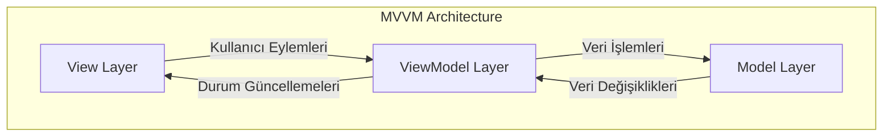
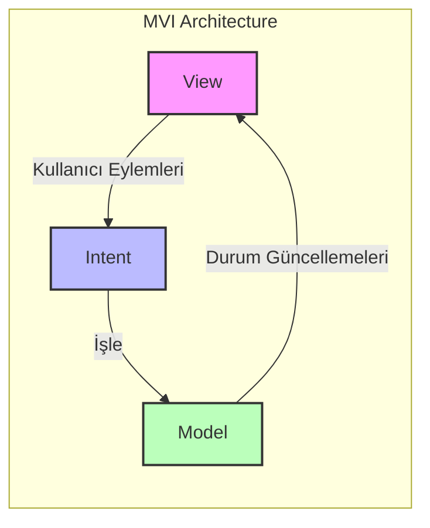
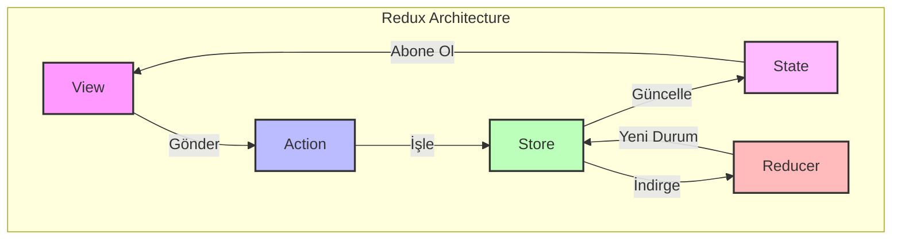

# Durum Yönetimi Stratejileri

Modern mobil uygulamalarda durum yönetimi, kullanıcı deneyiminin kalitesini ve uygulama performansını doğrudan etkileyen kritik bir faktördür. Bu bölümde, sektörde kanıtlanmış durum yönetimi yaklaşımlarını derinlemesine analiz ederek, her birinin belirli kullanım senaryolarında en uygun şekilde nasıl uygulanacağını inceleyeceğiz.

## MVVM (Model-View-ViewModel) Kapsamlı Analizi

### MVVM Örüntüsünün Mimari Temelleri

Model-View-ViewModel mimari örüntüsü, sorumlulukların ayrılması (separation of concerns) ilkesini mobil geliştirme bağlamında sofistike bir şekilde uygulayan bir yaklaşımdır. Bu örüntünün kavramsal çerçevesi, uygulama mantığını üç ayrı katmana düzenleyerek sürdürülebilirliği ve test edilebilirliği önemli ölçüde artırır.

Model katmanı, uygulamanın temel iş mantığını ve veri yapılarını kapsüller. Bu katman, harici veri kaynakları (REST API'ler, yerel veritabanları, önbellekleme sistemleri) ile etkileşimleri soyutlayarak tutarlı bir veri erişim arayüzü sağlar. Model bileşenleri, alana özgü iş kurallarını uygular ve veri doğrulama ile dönüştürme işlemlerini yürütür.

View katmanı, kullanıcı arayüzü bileşenlerini ve kullanıcı etkileşimi yönetimini üstlenir. Bu katman, platforma özgü UI çatılarından yararlanarak duyarlı ve sezgisel kullanıcı deneyimleri oluşturur. View bileşenleri, ViewModel'den gelen durum değişikliklerini gözlemleyerek otomatik UI güncellemeleri gerçekleştirir.

ViewModel katmanı, Model ile View arasında sofistike bir köprü işlevi sağlar. Bu katman, iş mantığını View'dan tamamen ayırırken, UI'a özgü durum yönetimi işlemlerini yürütür. ViewModel'ler, kullanıcı eylemlerini iş operasyonlarına dönüştürür ve eşzamansız işlemleri koordine eder.



### Platforma Özgü MVVM Uygulamaları

Android ekosisteminde Jetpack Mimari Bileşenleri kapsamlı MVVM desteği sağlar. Jetpack ViewModel sınıfları yapılandırma değişikliklerinden etkilenmezken, LiveData ve StateFlow ile reaktif veri bağlamayı mümkün kılar. Data Binding kütüphanesi iki yönlü bağlama yetenekleri sunarken, Jetpack Compose `remember` ve `collectAsState` fonksiyonları ile modern MVVM uygulamasını destekler.

```kotlin
class UserProfileViewModel : ViewModel() {
    private val _userState = MutableStateFlow(UserProfileState())
    val userState: StateFlow<UserProfileState> = _userState.asStateFlow()
    
    fun updateUserProfile(profile: UserProfile) {
        viewModelScope.launch {
            _userState.value = _userState.value.copy(
                isLoading = true,
                errorMessage = null
            )
            
            try {
                val updatedProfile = userRepository.updateProfile(profile)
                _userState.value = _userState.value.copy(
                    userProfile = updatedProfile,
                    isLoading = false,
                    isSuccess = true
                )
            } catch (exception: Exception) {
                _userState.value = _userState.value.copy(
                    isLoading = false,
                    errorMessage = exception.message
                )
            }
        }
    }
}
```

iOS geliştirmede SwiftUI çatısı, `ObservableObject` protokolü ile MVVM örüntüsünü yerel olarak destekler. `@Published` özellik sarmalayıcıları otomatik değişiklik bildirimleri sağlarken, Combine çatısı sofistike reaktif programlama yetenekleri sunar. `@StateObject` ve `@ObservedObject` özellik sarmalayıcıları otomatik UI güncellemelerini garanti eder.

```swift
class UserProfileViewModel: ObservableObject {
    @Published var userProfile: UserProfile?
    @Published var isLoading: Bool = false
    @Published var errorMessage: String?
    
    private let userRepository: UserRepository
    private var cancellables = Set<AnyCancellable>()
    
    func updateUserProfile(_ profile: UserProfile) {
        isLoading = true
        errorMessage = nil
        
        userRepository.updateProfile(profile)
            .receive(on: DispatchQueue.main)
            .sink(
                receiveCompletion: { [weak self] completion in
                    self?.isLoading = false
                    if case .failure(let error) = completion {
                        self?.errorMessage = error.localizedDescription
                    }
                },
                receiveValue: { [weak self] updatedProfile in
                    self?.userProfile = updatedProfile
                }
            )
            .store(in: &cancellables)
    }
}
```

Flutter ekosisteminde Provider örüntüsü ile `ChangeNotifier`, Riverpod ile değişmez durum yönetimi ve `flutter_bloc` paketinin ViewModel tarzı kullanımı kapsamlı MVVM uygulama seçenekleri sunar.

## MVI (Model-View-Intent) Gelişmiş Mimarisi

### Tek Yönlü Veri Akışı Ustalığı

Model-View-Intent örüntüsü, katı tek yönlü veri akışı aracılığıyla öngörülebilir durum yönetimi uygulayan gelişmiş bir mimari yaklaşımdır. Bu örüntünün temel felsefesi, uygulama durumunun tek bir doğruluk kaynağı (single source of truth) olarak sürdürülmesi ve durum mutasyonlarının tamamen kontrollü bir şekilde yürütülmesidir.

Intent bileşeni, kullanıcı etkileşimlerini ve sistem olaylarını temsil eden değişmez nesneleri tanımlar. Bu yaklaşım, kullanıcı eylemlerini açık sözleşmeler halinde modelleyerek uygulama davranışının kapsamlı izlenebilirliğini sağlar. Intent'ler, tip güvenli bir şekilde tanımlandığı için derleme zamanı doğrulaması sağlar.

Model bileşeni, uygulama durumunun tam temsilini değişmez veri yapılarıyla sürdürür. Her durum geçişi, önceki durumdan tamamen yeni bir durum nesnesi oluşturarak kazara mutasyonları önler. Bu yaklaşım, durum geçmişi takibini ve hata ayıklama yeteneklerini önemli ölçüde artırır.

View bileşeni, mevcut durumun UI temsilini oluştururken kullanıcı etkileşimlerini Intent nesnelerine dönüştürür. View'lar durumsuz (stateless) olduğu için test etme ve hata ayıklama önemli ölçüde basitleşir.



### Gelişmiş MVI Uygulama Örüntüleri

Durum değişmezliğinin (state immutability) zorlanması, yazarken kopyala (copy-on-write) mekanizmaları ile bellek verimliliğini optimize ederken, yapısal paylaşım algoritmaları ile performansı korur. Intent işleme ardışık düzenleri (pipelines), karmaşık iş mantığı operasyonlarını sıralı bir şekilde yürütürken, hata yönetimi ve kurtarma mekanizmalarını entegre eder.

Yan etkilerin (side effects) yönetimi, Intent işlemenin harici etkileşimleri (ağ istekleri, veritabanı işlemleri, analitik olayları) kontrollü bir şekilde yürütmesini sağlar. Bu yaklaşım, uygulama davranışının öngörülebilir ve test edilebilir olmasını garanti eder.

```dart
// Flutter MVI Implementation
abstract class UserIntent {}

class LoadUserIntent extends UserIntent {}
class UpdateUserIntent extends UserIntent {
  final UserProfile profile;
  UpdateUserIntent(this.profile);
}

@immutable
class UserState {
  final UserProfile? userProfile;
  final bool isLoading;
  final String? errorMessage;
  
  const UserState({
    this.userProfile,
    this.isLoading = false,
    this.errorMessage,
  });
  
  UserState copyWith({
    UserProfile? userProfile,
    bool? isLoading,
    String? errorMessage,
  }) {
    return UserState(
      userProfile: userProfile ?? this.userProfile,
      isLoading: isLoading ?? this.isLoading,
      errorMessage: errorMessage ?? this.errorMessage,
    );
  }
}

class UserBloc extends Bloc<UserIntent, UserState> {
  UserBloc() : super(const UserState()) {
    on<LoadUserIntent>(_onLoadUser);
    on<UpdateUserIntent>(_onUpdateUser);
  }
  
  Future<void> _onLoadUser(LoadUserIntent event, Emitter<UserState> emit) async {
    emit(state.copyWith(isLoading: true, errorMessage: null));
    
    try {
      final userProfile = await userRepository.getCurrentUser();
      emit(state.copyWith(userProfile: userProfile, isLoading: false));
    } catch (error) {
      emit(state.copyWith(isLoading: false, errorMessage: error.toString()));
    }
  }
}
```

## Redux Örüntüsü ve Merkezi Durum Mimarisi

### Redux Ekosistemine Kapsamlı Bakış

Redux örüntüsü, öngörülebilir bir durum kapsayıcısı (state container) kavramını uygulayan fonksiyonel bir programlama yaklaşımıdır. Bu örüntünün temel felsefesi, tüm uygulama durumunun tek bir değişmez Store içinde merkezi olarak yönetilmesi ve durum değişikliklerinin saf fonksiyonlar (reducer'lar) aracılığıyla öngörülebilir bir şekilde yürütülmesidir.

Store bileşeni, uygulamanın tam durum ağacını (state tree) korurken, durum aboneliklerini yönetir. Dispatch mekanizması, Action'ları Reducer'lara yönlendirirken, Middleware ardışık düzenlerini yürütür. Bu merkezi yaklaşım, durum yönetimi karmaşıklığını önemli ölçüde azaltırken, hata ayıklama yeteneklerini artırır.

Action'lar, durum değişikliği niyetlerini tanımlayan düz nesnelerdir. Action oluşturucular (action creators), tip güvenli Action üretimi sağlarken, yük (payload) doğrulamasını temin eder. Bu yaklaşım, uygulama operasyonlarının açık bir şekilde belgelenmesini sağlar.

Reducer'lar, mevcut durumu ve Action'ı girdi olarak alıp yeni bir durum nesnesi döndüren saf fonksiyonlardır. Reducer birleşimi (composition), karmaşık durum yönetimini yönetilebilir parçalara ayırırken, durum normalizasyonu en uygun veri yapılarını mümkün kılar.



### Gelişmiş Redux Uygulama Stratejileri

Middleware ekosistemi, eşzamansız operasyonları ele alırken, kesişen ilgileri (logging, analitik, hata yönetimi) entegre eder. Redux-thunk ve redux-saga gibi Middleware çözümleri, karmaşık eşzamansız akışları zarif bir şekilde yönetir.

```javascript
// Redux Middleware Implementation
const userMiddleware = store => next => action => {
  console.log('Dispatching action:', action);
  
  if (action.type === 'USER_UPDATE_ASYNC') {
    // Async operation handling
    userAPI.updateProfile(action.payload)
      .then(updatedProfile => {
        store.dispatch({
          type: 'USER_UPDATE_SUCCESS',
          payload: updatedProfile
        });
      })
      .catch(error => {
        store.dispatch({
          type: 'USER_UPDATE_FAILURE',
          payload: error.message
        });
      });
  }
  
  return next(action);
};

const userReducer = (state = initialState, action) => {
  switch (action.type) {
    case 'USER_UPDATE_REQUEST':
      return {
        ...state,
        isLoading: true,
        error: null
      };
    case 'USER_UPDATE_SUCCESS':
      return {
        ...state,
        userProfile: action.payload,
        isLoading: false,
        error: null
      };
    case 'USER_UPDATE_FAILURE':
      return {
        ...state,
        isLoading: false,
        error: action.payload
      };
    default:
      return state;
  }
};
```

DevTools entegrasyonu, durum denetimi ve zamanda yolculukla hata ayıklama (time-travel debugging) yetenekleri sağlarken, geliştirme üretkenliğini önemli ölçüde artırır. Durum seçiciler (state selectors), hafızaya alınmış (memoized) durum sorgularını mümkün kılarak gereksiz yeniden hesaplamaları önler.

## BLoC (İş Mantığı Bileşeni) Flutter Mükemmelliği

### Akış Tabanlı Reaktif Mimari

İş Mantığı Bileşeni (BLoC) örüntüsü, Flutter ekosistemine özel olarak optimize edilmiş akış tabanlı bir durum yönetimi yaklaşımıdır. Bu örüntünün temel kavramı, reaktif programlama paradigmalarından yararlanarak verimli ve öngörülebilir durum yönetimi elde etmektir.

BLoC mimarisi, Olaylar (Events - kullanıcı etkileşimleri ve sistem olayları), Durumlar (States - UI'ın farklı temsilleri) ve Bloc (Olayları Durumlara dönüştüren iş mantığı kapsüllemesi) olmak üzere üç ana bileşenden oluşur.

Olay güdümlü mimari, kullanıcı etkileşimlerini açık olay nesneleri halinde modelleyerek uygulama davranışının izlenebilirliğini sağlar. Durum temsilleri, UI'ın olası yapılandırmalarını değişmez nesnelerle tanımlayarak öngörülebilir UI güncellemelerini garanti eder.

```dart
// BLoC Implementation Example
abstract class AuthenticationEvent extends Equatable {
  const AuthenticationEvent();
}

class AuthenticationStarted extends AuthenticationEvent {
  @override
  List<Object> get props => [];
}

class AuthenticationLoggedIn extends AuthenticationEvent {
  final User user;
  
  const AuthenticationLoggedIn({required this.user});
  
  @override
  List<Object> get props => [user];
}

abstract class AuthenticationState extends Equatable {
  const AuthenticationState();
}

class AuthenticationInitial extends AuthenticationState {
  @override
  List<Object> get props => [];
}

class AuthenticationAuthenticated extends AuthenticationState {
  final User user;
  
  const AuthenticationAuthenticated({required this.user});
  
  @override
  List<Object> get props => [user];
}

class AuthenticationBloc extends Bloc<AuthenticationEvent, AuthenticationState> {
  final AuthenticationRepository authenticationRepository;
  late StreamSubscription<User> userSubscription;
  
  AuthenticationBloc({required this.authenticationRepository}) 
      : super(AuthenticationInitial()) {
    
    on<AuthenticationStarted>(_onAuthenticationStarted);
    on<AuthenticationLoggedIn>(_onAuthenticationLoggedIn);
    
    userSubscription = authenticationRepository.user.listen(
      (user) => add(AuthenticationLoggedIn(user: user)),
    );
  }
  
  Future<void> _onAuthenticationStarted(
    AuthenticationStarted event,
    Emitter<AuthenticationState> emit,
  ) async {
    final isAuthenticated = await authenticationRepository.isAuthenticated();
    
    if (isAuthenticated) {
      final user = await authenticationRepository.getCurrentUser();
      emit(AuthenticationAuthenticated(user: user));
    } else {
      emit(AuthenticationUnauthenticated());
    }
  }
}
```

### Gelişmiş BLoC Performans Optimizasyonları

Akış aboneliği optimizasyonu, gereksiz olay işlemeyi ortadan kaldırırken bellek verimliliğini korur. Durum karşılaştırma mekanizmaları, aynı durumların gereksiz UI güncellemelerini önleyerek oluşturma (rendering) performansını optimize eder.

Bellek yönetimi stratejileri, BLoC örneklerinin uygun şekilde yok edilmesini (disposal) sağlarken kaynak sızıntılarını önler. Olay sektirme (event debouncing) ve kısmа (throttling) mekanizmaları, hızlı kullanıcı etkileşimlerini verimli bir şekilde yöneterek uygulama duyarlılığını korur.

Arka plan işleme yetenekleri, uzun süren operasyonları ana UI iş parçacığından (thread) izole ederken kullanıcı deneyimini korur. Durum kalıcılığı mekanizmaları, uygulama durumunun kritik verilerini yerel depolamada tutarak uygulama yeniden başlatmalarına karşı dayanıklılık sağlar.

Test mimarisi, BLoC bileşenlerinin yalıtılmış test edilmesini sağlarken, sahte (mock) bağımlılıklarla kapsamlı test kapsamı elde eder. Entegrasyon testi yetenekleri, kullanıcı akış senaryolarının uçtan uca doğrulamasını sağlar.

Bu kapsamlı durum yönetimi stratejileri, kurumsal düzeydeki mobil uygulamalarda ölçeklenebilir, sürdürülebilir ve performanslı çözümler sunarak geliştirme ekiplerinin üretkenliğini en üst düzeye çıkarır.
