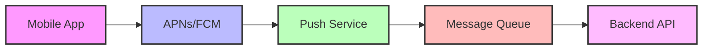
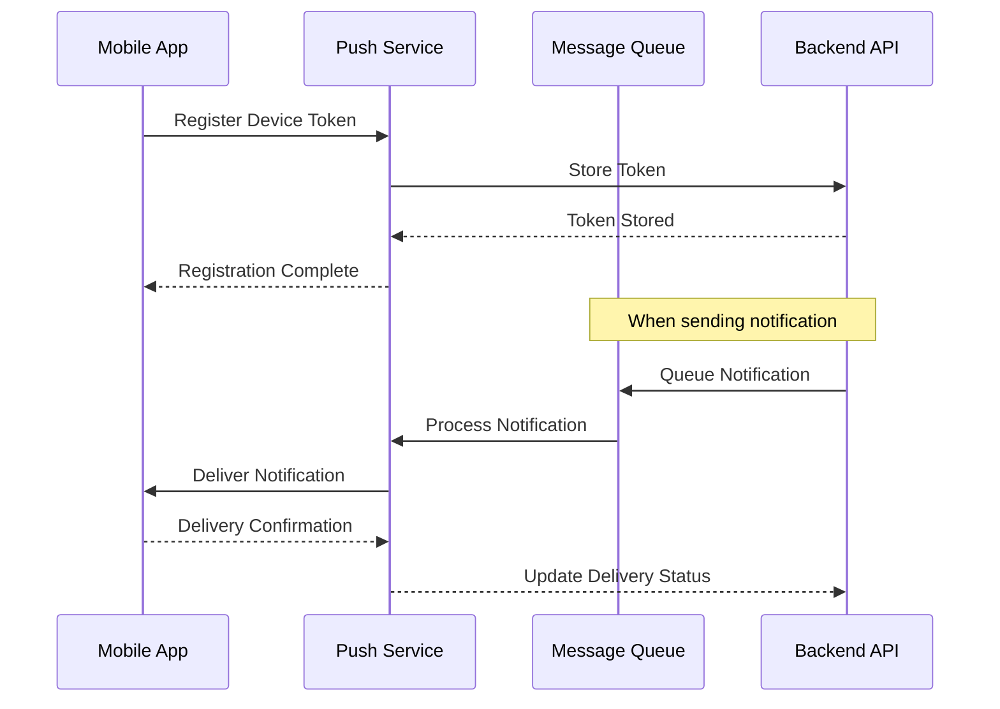

# Push Bildirimi Mimarisi

## Genel Bakış

Push bildirimleri, mobil uygulamalarda kullanıcı katılımını artıran kritik bir özelliktir. Bu dokümantasyon, ölçeklenebilir ve güvenilir push bildirim sistemlerinin tasarımını kapsar.

## Push Bildirim Mimarisi

### Sistem Bileşenleri
```
[Mobile App] → [APNs/FCM] → [Push Service] → [Message Queue] → [Backend API]
```





### Platform-Specific Implementation

#### iOS - Apple Push Notification Service (APNs)
```swift
import UserNotifications

class PushNotificationManager {
    static func registerForNotifications() {
        UNUserNotificationCenter.current().requestAuthorization(
            options: [.alert, .sound, .badge]
        ) { granted, error in
            guard granted else { return }
            
            DispatchQueue.main.async {
                UIApplication.shared.registerForRemoteNotifications()
            }
        }
    }
    
    static func handleDeviceToken(_ deviceToken: Data) {
        let token = deviceToken.map { String(format: "%02.2hhx", $0) }.joined()
        
        // Token'ı backend'e gönder
        APIService.registerDeviceToken(token) { result in
            switch result {
            case .success:
                print("Device token registered successfully")
            case .failure(let error):
                print("Failed to register device token: \(error)")
            }
        }
    }
}
```

#### Android - Firebase Cloud Messaging (FCM)
```kotlin
class PushNotificationService : FirebaseMessagingService() {
    
    override fun onNewToken(token: String) {
        super.onNewToken(token)
        
        // Token'ı backend'e gönder
        ApiService.registerDeviceToken(token) { result ->
            when (result) {
                is Result.Success -> {
                    Log.d(TAG, "Device token registered successfully")
                }
                is Result.Error -> {
                    Log.e(TAG, "Failed to register device token", result.exception)
                }
            }
        }
    }
    
    override fun onMessageReceived(remoteMessage: RemoteMessage) {
        super.onMessageReceived(remoteMessage)
        
        remoteMessage.notification?.let { notification ->
            showNotification(
                title = notification.title ?: "",
                body = notification.body ?: "",
                data = remoteMessage.data
            )
        }
    }
    
    private fun showNotification(title: String, body: String, data: Map<String, String>) {
        val notificationManager = getSystemService(Context.NOTIFICATION_SERVICE) as NotificationManager
        
        val notification = NotificationCompat.Builder(this, CHANNEL_ID)
            .setContentTitle(title)
            .setContentText(body)
            .setSmallIcon(R.drawable.ic_notification)
            .setAutoCancel(true)
            .build()
            
        notificationManager.notify(System.currentTimeMillis().toInt(), notification)
    }
}
```

## Backend Implementation

### Node.js Push Service
```javascript
const admin = require('firebase-admin');
const apn = require('apn');

class PushNotificationService {
    constructor() {
        // Firebase Admin SDK
        this.fcm = admin.messaging();
        
        // APNs Provider
        this.apnProvider = new apn.Provider({
            token: {
                key: process.env.APN_KEY_PATH,
                keyId: process.env.APN_KEY_ID,
                teamId: process.env.APN_TEAM_ID
            }
        });
    }
    
    async sendToDevice(deviceToken, platform, payload) {
        try {
            if (platform === 'ios') {
                await this.sendAPNs(deviceToken, payload);
            } else if (platform === 'android') {
                await this.sendFCM(deviceToken, payload);
            }
        } catch (error) {
            console.error('Push notification failed:', error);
            throw error;
        }
    }
    
    async sendFCM(token, payload) {
        const message = {
            token: token,
            notification: {
                title: payload.title,
                body: payload.body
            },
            data: payload.data || {}
        };
        
        const response = await this.fcm.send(message);
        return response;
    }
    
    async sendAPNs(token, payload) {
        const notification = new apn.Notification();
        notification.alert = {
            title: payload.title,
            body: payload.body
        };
        notification.badge = payload.badge || 1;
        notification.sound = 'default';
        notification.payload = payload.data || {};
        
        const result = await this.apnProvider.send(notification, token);
        return result;
    }
}
```

## Gelişmiş Özellikler

### 1. Targeting ve Segmentasyon
```javascript
class NotificationTargeting {
    async sendToUserSegment(segment, payload) {
        const users = await this.getUsersBySegment(segment);
        
        const batch = users.map(user => ({
            token: user.deviceToken,
            platform: user.platform,
            payload: this.personalizePayload(payload, user)
        }));
        
        await this.sendBatchNotifications(batch);
    }
    
    personalizePayload(basePayload, user) {
        return {
            ...basePayload,
            title: basePayload.title.replace('{name}', user.name),
            data: {
                ...basePayload.data,
                userId: user.id
            }
        };
    }
}
```

### 2. A/B Testing
```javascript
class NotificationABTest {
    async runABTest(testConfig) {
        const users = await this.getTestUsers(testConfig.targetSegment);
        
        for (const user of users) {
            const variant = this.assignVariant(user.id, testConfig.variants);
            
            await this.sendNotification(
                user.deviceToken,
                user.platform,
                variant.payload
            );
            
            await this.trackEvent('notification_sent', {
                userId: user.id,
                variant: variant.name,
                testId: testConfig.id
            });
        }
    }
}
```

## Performance ve Ölçeklendirme

### 1. Rate Limiting
```javascript
class RateLimiter {
    constructor() {
        this.limits = {
            ios: 100, // APNs rate limit
            android: 1000 // FCM rate limit
        };
    }
    
    async sendWithRateLimit(notifications) {
        const grouped = this.groupByPlatform(notifications);
        
        for (const [platform, batch] of Object.entries(grouped)) {
            await this.processBatch(batch, this.limits[platform]);
        }
    }
    
    async processBatch(notifications, batchSize) {
        for (let i = 0; i < notifications.length; i += batchSize) {
            const batch = notifications.slice(i, i + batchSize);
            await Promise.all(batch.map(n => this.sendNotification(n)));
            
            // Rate limiting için bekle
            if (i + batchSize < notifications.length) {
                await this.delay(1000);
            }
        }
    }
}
```

### 2. Dead Letter Queue
```javascript
class NotificationQueue {
    async processNotification(notification) {
        try {
            await this.sendNotification(notification);
        } catch (error) {
            if (this.isRetryableError(error)) {
                await this.retryQueue.add(notification, {
                    delay: this.calculateBackoff(notification.retryCount),
                    attempts: 3
                });
            } else {
                await this.deadLetterQueue.add(notification);
            }
        }
    }
    
    calculateBackoff(retryCount) {
        return Math.pow(2, retryCount) * 1000; // Exponential backoff
    }
}
```

## Monitoring ve Analytics

### 1. Metrics Collection
```javascript
class NotificationMetrics {
    async trackDelivery(notificationId, status) {
        await this.metrics.increment('notifications.delivered', {
            status: status,
            platform: platform
        });
    }
    
    async trackEngagement(notificationId, action) {
        await this.metrics.increment('notifications.engagement', {
            action: action, // opened, dismissed, clicked
            notificationId: notificationId
        });
    }
}
```

### 2. Dashboard Monitoring
- Delivery rate
- Open rate
- Click-through rate
- Platform-specific metrics
- Error rates ve failure reasons

Bu mimari ile ölçeklenebilir, güvenilir ve kullanıcı dostu push bildirim sistemi oluşturabilirsiniz.
