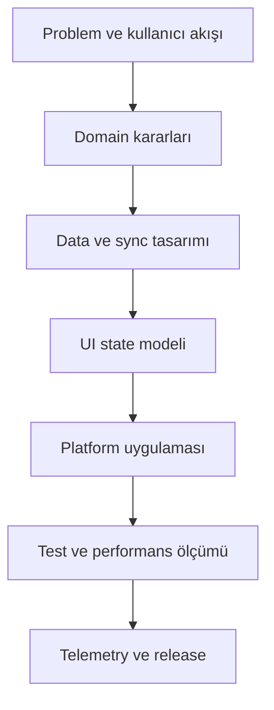

# Mobil Sistem Tasarımına Başlangıç

Bu rehber, mobil sistem tasarımı dokümantasyonunu hangi sırayla çalışacağını ve her bölümden ne beklemen gerektiğini anlatır. Amaç ezbere teknoloji listesi çıkarmak değil, gerçek bir mobil uygulama tasarlarken karar kalitesini artırmaktır.

## Hızlı Başlangıç

Bir mobil sistemi değerlendirirken ilk sorular şunlar olmalı:

- Kullanıcı hangi kritik işi kesintisiz yapabilmeli?
- Uygulama çevrimdışı veya zayıf ağda nasıl davranmalı?
- Hangi veri yerelde saklanmalı, hangisi her zaman sunucudan gelmeli?
- Performans hedefi nedir: açılış süresi, scroll akıcılığı, batarya, bellek?
- Hangi güvenlik sınırları zorunlu: token, biyometri, secure storage, certificate pinning?
- Hangi telemetri olmadan üretim hatası anlaşılmaz?

Bu sorulara cevap vermeden framework seçmek çoğu zaman yanlış öncelik oluşturur. Önce sistem davranışı, sonra mimari, sonra platform detayları gelmelidir.

## Learning Path

### 1. Temel mimariyi kur

Önce [Mimari Desenler](/mobile/architecture/patterns), [Durum Yönetimi Stratejileri](/mobile/architecture/state-management) ve [Clean Architecture](/mobile/architecture/clean-architecture) sayfalarını oku. Bu üçlü UI state, domain mantığı ve veri erişimi arasındaki sınırı netleştirir.

Çıktı olarak şu kararları verebilmelisin:

- Feature-first mi layer-first mi ilerleyeceksin?
- ViewModel, Bloc, Presenter veya reducer hangi sorumluluğu taşıyacak?
- Domain modeli API modelinden ayrılacak mı?
- Use case seviyesi gerçekten gerekli mi, yoksa repository yeterli mi?

### 2. Veri ve offline davranışı tasarla

Sonra [Local Database Seçenekleri](/mobile/storage/local-databases), [Offline-First Tasarım](/mobile/storage/offline-first), [Veri Senkronizasyon Stratejileri](/mobile/storage/sync-strategies) ve [Conflict Resolution](/mobile/storage/conflict-resolution) bölümlerine geç.

Bu aşamanın çıktısı bir veri politikasıdır:

- Single source of truth neresi?
- Sync ne zaman tetiklenir?
- Conflict olduğunda kullanıcı mı sistem mi karar verir?
- Cache ne zaman stale kabul edilir?
- Migration başarısız olursa uygulama ne yapar?

### 3. Ağ, performans ve güvenliği birlikte ele al

Ağ katmanını yalnızca API çağıran bir servis gibi düşünme. [Ağ Dayanıklılığı](/mobile/networking/resilience), [Sayfalama](/mobile/networking/pagination), [Veri Sıkıştırma](/mobile/networking/compression), [Mobil Ağ Güvenliği](/mobile/networking/security) ve [API Güvenliği](/mobile/security/api-security) birlikte tasarlanmalıdır.

Bu aşamada retry, timeout, pagination, token yenileme, rate limit, request signing ve cache davranışı aynı akış üzerinde düşünülür.

### 4. Üretim gözlemlenebilirliğini ekle

Son olarak [Crash Reporting](/mobile/observability/crash-reporting), [Performance Analytics](/mobile/observability/performance-analytics), [User Behavior Tracking](/mobile/observability/user-tracking), [Remote Configuration](/mobile/observability/remote-config) ve [A/B Testing](/mobile/observability/ab-testing) sayfalarını kullan.

Üretimde ölçülmeyen davranış tasarım varsayımı olarak kalır. En azından açılış süresi, ekran render süresi, API hata oranı, crash-free session, batarya etkisi ve kritik funnel metrikleri izlenmelidir.

## Platform-Specific Quick Starts

### Android

Android için pratik başlangıç:

- Kotlin ve Jetpack Compose ile feature-first paket yapısı kur.
- ViewModel + StateFlow ile UI state'i tek kaynak haline getir.
- Room'u offline-first yerel kaynak olarak kullan.
- Retrofit/OkHttp katmanında timeout, retry ve interceptor kararlarını netleştir.
- WorkManager ile arka plan sync işlerini planla.
- Baseline Profile, Macrobenchmark ve Android Studio Profiler ile performansı ölç.

### iOS

iOS için pratik başlangıç:

- SwiftUI ile state modelini görünür sınırda tut.
- ObservableObject veya yeni Observation modeliyle ekran state'ini yönet.
- URLSession, async/await ve actor kullanarak concurrency sınırlarını belirle.
- Core Data, SwiftData veya SQLite seçimini veri modelinin ömrüne göre yap.
- BackgroundTasks ve push notification davranışını işletim sistemi sınırlarıyla tasarla.
- Instruments ile launch time, memory graph ve energy impact ölç.

### Flutter

Flutter için pratik başlangıç:

- Feature-first klasörleme ile `presentation`, `domain`, `data` sınırlarını ayır.
- Riverpod, Bloc veya ValueNotifier seçiminde ekip alışkanlığı ve test ihtiyacını esas al.
- Isolate kullanımı gerektiren CPU işlerini UI thread'den ayır.
- Drift, Isar, Hive veya SQLite kararını query ihtiyacına göre ver.
- DevTools ile frame chart, memory ve rebuild davranışını ölç.
- Platform channel sınırlarını dar tut; domain'i platform koduna bağlama.

### React Native

React Native için pratik başlangıç:

- TypeScript strict mode ve feature-first modül yapısı kullan.
- Server state için cache politikası olan bir yaklaşım seç; global state'i her veriye uygulama.
- Native module ihtiyaçlarını erken belirle.
- Hermes, Flipper, React DevTools ve native profilers ile performansı izle.
- Büyük listelerde virtualization, image caching ve bridge maliyetlerini erken test et.

## Development Workflow

Önerilen çalışma sırası:

- Kullanıcı akışını ve başarısızlık durumlarını yaz.
- Domain entity, use case ve repository sınırlarını çiz.
- Remote, local ve cache davranışını netleştir.
- UI state modelini loading, empty, partial, success ve error durumlarıyla tasarla.
- Platform kodunu minimum framework bağımlılığıyla uygula.
- Unit, integration ve smoke test seviyelerini ayır.
- Release öncesi performans, crash ve analytics ölçümlerini bağla.

## Performance Benchmarks

Her mobil uygulama için hedefler farklıdır, ama başlangıç eşiği olarak şunlar izlenebilir:

| Alan | Başlangıç hedefi | Ölçüm aracı |
| --- | --- | --- |
| Cold start | 2 saniye altı | Android Macrobenchmark, Xcode Instruments |
| Scroll | 60 FPS hedefi | Frame chart, Core Animation |
| API timeout | 5-10 saniye arası | Network logs, telemetry |
| Crash-free sessions | %99.5+ | Crash reporting |
| Offline işlem | Kuyruğa alınmış ve tekrar denenebilir | Local DB + sync logs |
| Bellek | Cihaz sınıfına göre limitli | Memory profiler |

Bu değerler mutlak kural değil, ilk alarm çizgisidir. Ürün kritikse hedefleri gerçek kullanıcı cihazları ve ağ koşullarıyla kalibre etmek gerekir.

## İlk Tasarım Dokümanı Şablonu

Yeni bir mobil özellik için kısa tasarım dokümanı şu başlıkları içermelidir:

- Kullanıcı problemi ve başarı kriteri
- Ana ekranlar ve state durumları
- Domain entity ve use case listesi
- Remote API, local storage ve cache davranışı
- Offline, retry ve conflict resolution kararı
- Güvenlik ve gizlilik etkisi
- Performans ve batarya riski
- Telemetry ve release kontrol noktaları
