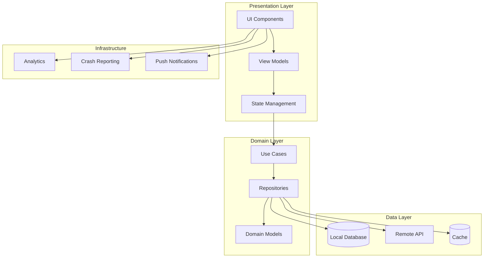
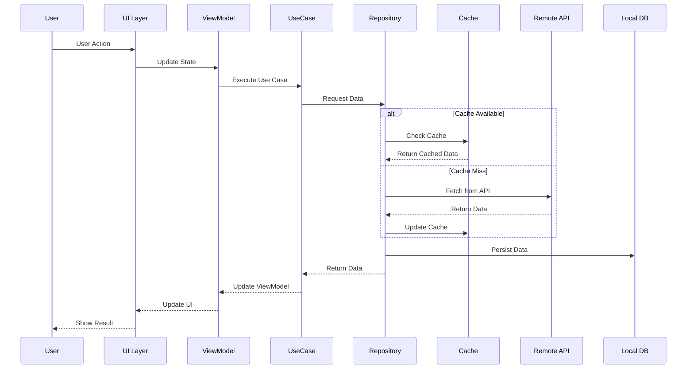

# Mobil Sistem Tasarımı

Modern mobil uygulama geliştirme, yalnızca kod yazmaktan çok daha geniş kapsamlı bir sistem tasarımı disiplinidir. Günümüzde milyonlarca kullanıcıya hizmet veren mobil uygulamalar, karmaşık mimari kararlar, performans optimizasyonları ve kapsamlı güvenlik stratejileri gerektirir. Bu dokümantasyon, kurumsal seviyede mobil sistem tasarımının tüm yönlerini derinlemesine inceler.

## Mobil Uygulama Mimarisi

## Veri Akış Diyagramı

## Bölüm Listesi

### 1. Uygulama Mimarileri & State Management
- [Mimari Pattern'ler](/mobile/architecture/patterns)
- [State Management Stratejileri](/mobile/architecture/state-management)
- [Component Tabanlı Tasarım](/mobile/architecture/component-based)
- [Dependency Injection ve IoC](/mobile/architecture/dependency-injection)
- [Modüler Mimari Yapıları](/mobile/architecture/modular-architecture)

### 2. Veri Saklama & Senkronizasyon
- [Local Database Seçenekleri](/mobile/storage/local-databases)
- [Veri Senkronizasyon Stratejileri](/mobile/storage/sync-strategies)
- [Conflict Resolution](/mobile/storage/conflict-resolution)
- [Offline-First Tasarım](/mobile/storage/offline-first)
- [Data Migration ve Versioning](/mobile/storage/data-migration)

### 3. Caching & Bellek Yönetimi
- [In-Memory Cache Yönetimi](/mobile/performance/memory-cache)
- [Disk Cache Stratejileri](/mobile/performance/disk-cache)
- [Cache Invalidation Teknikleri](/mobile/performance/cache-invalidation)
- [Object Lifecycle Management](/mobile/performance/object-lifecycle)

### 4. Ağ Katmanları & Veri Transferi
- [İstek Birleştirme & Debouncing](/mobile/networking/batching-debouncing)
- [Sayfalama & Sonsuz Kaydırma](/mobile/networking/pagination)
- [Veri Sıkıştırma Teknikleri](/mobile/networking/compression)
- [Ağ Dayanıklılığı & Yeniden Deneme](/mobile/networking/resilience)
- [Mobil Ağ Güvenliği](/mobile/networking/security)
- [Ağ İzleme & Analitik](/mobile/networking/monitoring)
- [Test & QA Stratejileri](/mobile/networking/testing-qa)
- [Gelişmiş Ağ Desenleri](/mobile/networking/advanced-patterns)
- [Mobil-Spesifik Hususlar](/mobile/networking/mobile-considerations)
- [Gelecek Trendleri & Yeni Teknolojiler](/mobile/networking/future-trends)

### 5. UI/UX Performans Optimizasyonu
- [Rendering Optimizasyonu](/mobile/ui-performance/rendering)
- [Layout Performance](/mobile/ui-performance/layout)
- [List ve Scroll Performance](/mobile/ui-performance/list-performance)
- [60 FPS Garantisi](/mobile/ui-performance/fps-optimization)
- [Memory Efficient UI](/mobile/ui-performance/memory-efficient)

### 6. Animasyon & Grafik İşleme
- [Declarative Animations](/mobile/graphics/declarative-animations)
- [Frame Rate Management](/mobile/graphics/frame-rate-management)
- [Hardware Acceleration](/mobile/graphics/hardware-acceleration)
- [Canvas & Metal/Native UI](/mobile/graphics/canvas-metal-native)

### 7. Güvenlik & Yetki Kontrolleri
- [Authentication Patterns](/mobile/security/authentication)
- [Secure Storage](/mobile/security/secure-storage)
- [API Security](/mobile/security/api-security)
- [Biometric Authentication](/mobile/security/biometric-auth)
- [Certificate Pinning](/mobile/security/certificate-pinning)

### 8. Arka Plan İşlemleri
- [Background Task Management](/mobile/background/task-management)
- [Push Notification Architecture](/mobile/background/push-notifications)
- [Real-time Communication](/mobile/background/real-time)
- [Location Services](/mobile/background/location-services)
- [Battery Optimization](/mobile/background/battery-optimization)

### 9. Telemetri & Gözlemlenebilirlik
- [Crash Reporting Systems](/mobile/observability/crash-reporting)
- [Performance Analytics](/mobile/observability/performance-analytics)
- [User Behavior Tracking](/mobile/observability/user-tracking)
- [Remote Configuration](/mobile/observability/remote-config)
- [A/B Testing Infrastructure](/mobile/observability/ab-testing)

### 10. Sürüm Yönetimi & Güncellemeler
- [Release Management](/mobile/versioning/release-management)
- [Feature Flags](/mobile/versioning/feature-flags)
- [Hot Updates & Code Push](/mobile/versioning/hot-updates)
- [Backward Compatibility](/mobile/versioning/backward-compatibility)
- [Deployment Strategies](/mobile/versioning/deployment-strategies)

### 11. Çapraz Platform Geliştirme
- [Çapraz Platform Geliştirme Rehberi](/mobile/cross-platform-development)
- [Framework Karşılaştırması](/mobile/cross-platform-development#framework-karşılaştırması)
- [React Native Uygulaması](/mobile/cross-platform-development#react-native-uygulaması)
- [Flutter Uygulaması](/mobile/cross-platform-development#flutter-uygulaması)
- [Xamarin Uygulaması](/mobile/cross-platform-development#xamarin-uygulaması)

### 12. Performans Testi ve Karşılaştırma
- [Performans Testi Rehberi](/mobile/performance-testing)
- [Platforma Özel Test Araçları](/mobile/performance-testing#platforma-özel-test-araçları)
- [Otomatik Performans Testleri](/mobile/performance-testing#otomatik-performans-testleri)
- [Canlı Performans İzleme](/mobile/performance-testing#canlı-performans-izleme)

### Başlangıç Rehberi
- [Hızlı Başlangıç](/mobile/getting-started)
- [Öğrenme Yolları](/mobile/getting-started#learning-path)
- [Platform-Specific Başlangıç](/mobile/getting-started#platform-specific-quick-starts)
- [Geliştirme İş Akışı](/mobile/getting-started#development-workflow)