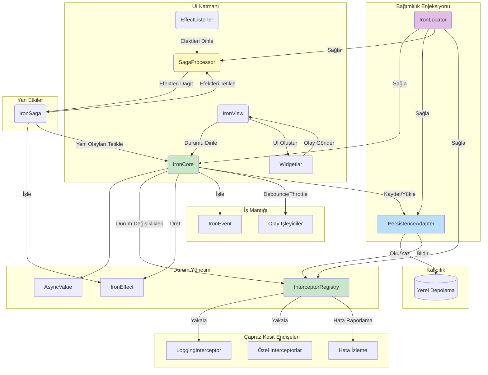

# Iron Mimarisi - Flutter Durum Yönetimi

Iron, ölçeklenebilir, sürdürülebilir ve gözlemlenebilir Flutter uygulamaları oluşturmak için sağlam bir temel sağlayan, sıfır bağımlılığa sahip güçlü bir Flutter mimari paketidir. Bu belge, Iron'ın mimari desenlerini, bileşenlerini ve modern Flutter uygulama geliştirmeye nasıl uyduğunu incelemektedir.

## Genel Bakış

Iron, kanıtlanmış mimari desenlerden faydalanırken geliştiricilerin tam kontrolü elinde tuttuğu esnek ancak disiplinli bir çerçeve sağlama felsefesiyle tasarlanmıştır. Paket şunları vurgular:

- Tam kontrol için **Sıfır harici bağımlılık**
- Interceptor'lar aracılığıyla **Yerleşik gözlemlenebilirlik**
- Debouncing, throttling ve isolate tabanlı hesaplama ile **Performans optimizasyonu**
- **Durum kalıcılığı** yetenekleri
- İyi tanımlanmış bileşenler aracılığıyla **Endişelerin temiz ayrımı**

## Çekirdek Mimari Bileşenleri

### 1. IronCore - İş Mantığı Katmanı

`IronCore`, iş mantığını ve durum yönetimini kapsayan mimarinin kalbi olarak hizmet eder.

```dart
class CounterCore extends IronCore<CounterEvent, CounterState> {
  CounterCore() : super(const CounterState(0)) {
    on<IncrementEvent>((event) {
      updateState(AsyncData(CounterState(state.value.count + 1)));
    });
  }
}
```

**Temel Özellikler:**
- Olay ve durum türleri ile jenerik tip güvenliği
- `AsyncValue` ile yerleşik asenkron durum işleme
- Olay güdümlü mimari
- UI'ya otomatik durum bildirimleri

### 2. Olay Sistemi

Olaylar, uygulama durumunu değiştiren kullanıcı niyetlerini veya sistem tetikleyicilerini temsil eder.

```dart
abstract class CounterEvent extends IronEvent {}
class IncrementEvent extends CounterEvent {}
class DecrementEvent extends CounterEvent {}
```

**Faydaları:**
- Açık niyet ifadesi
- Tip güvenli olay işleme
- Test edilebilir iş mantığı
- Hata ayıklama için denetim izi

### 3. Durum Yönetimi

Durumlar, uygulama verilerinizin mevcut koşulunu temsil eder.

```dart
class CounterState {
  final int count;
  const CounterState(this.count);
}
```

**AsyncValue Sarmalayıcı:**
Iron, yükleme, başarı ve hata durumlarını tek tip olarak işlemek için durumları `AsyncValue` içine sarmalar:

- `AsyncLoading` - İşlem devam ediyor
- `AsyncData` - Veri ile başarılı durum
- `AsyncError` - İstisna detayları ile hata durumu

### 4. Efekt Sistemi

Efektler, durumu doğrudan değiştirmeyen ancak sistemin diğer kısımlarını bilgilendiren yan etkileri veya bildirimleri temsil eder.

```dart
abstract class CounterEffect extends IronEffect {}
class CounterReachedMaxEffect extends CounterEffect {
  final int maxValue;
  CounterReachedMaxEffect(this.maxValue);
}
```

## Gelişmiş Özellikler

### 1. Interceptor Sistemi - Gözlemlenebilirlik

Iron, tüm uygulama etkinliklerini izlemek için güçlü bir interceptor sistemi sağlar:

```dart
// Hata ayıklama için logging interceptor'ı kaydetme
if (kDebugMode) {
  IronLocator.instance.find<InterceptorRegistry>()
    .register(LoggingInterceptor());
}
```

**Interceptor Yetenekleri:**
- Olay takibi
- Durum değişikliği izleme
- Efekt gözlemi
- Hata raporlama
- Performans metrikleri

### 2. Debouncing ve Throttling

Iron, olay sıklığını kontrol etmek için yerleşik mekanizmalar içerir:

```dart
class SearchCore extends IronCore<SearchEvent, SearchState> {
  SearchCore() : super(SearchInitial()) {
    // API çağrılarını azaltmak için arama sorgularını debounce etme
    onDebounced<SearchQueryChanged>(
      _onSearch, 
      const Duration(milliseconds: 300)
    );
    
    // Spam'ı önlemek için düğme tıklamalarını throttle etme
    onThrottled<ButtonClickEvent>(
      _handleClick,
      const Duration(milliseconds: 1000)
    );
  }
}
```

### 3. Isolate Tabanlı Hesaplama

CPU yoğun işlemler için Iron, işi ayrı isolate'lere aktarmak için `computeAndUpdateState` sağlar:

```dart
Future<void> processLargeDataset(List<dynamic> data) async {
  await computeAndUpdateState<List<dynamic>>(_processInIsolate, data);
}

// Üst düzey veya statik fonksiyon olmalıdır
static ProcessedState _processInIsolate(List<dynamic> data) {
  // Ağır hesaplama burada gerçekleşir
  final processed = heavyProcessing(data);
  return ProcessedState(processed);
}
```

### 4. Durum Kalıcılığı

`PersistentIronCore` durumu otomatik olarak kaydeder ve geri yükler:

```dart
class PersistentCounterCore extends PersistentIronCore<CounterEvent, CounterState> {
  PersistentCounterCore() : super(
    initialState: const CounterState(0),
    storageKey: 'counter_state',
  );
}
```

## UI Entegrasyonu

### IronView Widget'ı

`IronView` widget'ı, UI'nızı Iron core'a bağlar:

```dart
class CounterPage extends StatelessWidget {
  final CounterCore counterCore;
  
  @override
  Widget build(BuildContext context) {
    return IronView<CounterCore, CounterState>(
      core: counterCore,
      builder: (context, state) {
        return state.when(
          loading: () => CircularProgressIndicator(),
          data: (data) => Text('Count: ${data.count}'),
          error: (error, stack) => Text('Error: $error'),
        );
      },
    );
  }
}
```

### EffectListener

UI'nızdaki yan etkileri `EffectListener` ile işleyin:

```dart
EffectListener<CounterCore, CounterEffect>(
  core: counterCore,
  listener: (context, effect) {
    if (effect is CounterReachedMaxEffect) {
      ScaffoldMessenger.of(context).showSnackBar(
        SnackBar(content: Text('Maksimuma ulaşıldı: ${effect.maxValue}')),
      );
    }
  },
  child: CounterView(),
)
```

## Bağımlılık Enjeksiyonu - IronLocator

Iron, basit ama güçlü bir bağımlılık enjeksiyon sistemi içerir:

```dart
// Kayıt
IronLocator.instance.registerSingleton(UserRepository());
IronLocator.instance.registerLazySingleton(() => AuthCore());

// Kullanım
final userRepo = IronLocator.instance.find<UserRepository>();
```

## Saga Deseni Desteği

Iron, karmaşık iş akışlarını yönetmek için Saga desenini destekler:

```dart
class UserRegistrationSaga extends IronSaga {
  @override
  void configure() {
    on<UserRegisteredEffect>(_handleUserRegistration);
    on<EmailVerificationRequiredEffect>(_sendVerificationEmail);
  }
  
  Future<void> _handleUserRegistration(UserRegisteredEffect effect) async {
    // Karmaşık iş akışı mantığı
    await _createUserProfile(effect.user);
    await _sendWelcomeEmail(effect.user);
    // Sonraki efekti tetikleme
    process(WelcomeEmailSentEffect(effect.user.id));
  }
}
```

## Mimari Faydaları

### 1. Test Edilebilirlik
- **Birim Testleri**: Core'lardaki iş mantığı kolayca test edilebilir
- **Widget Testleri**: UI bileşenleri izole olarak test edilebilir
- **Entegrasyon Testleri**: Tam iş akışları uçtan uca test edilebilir

### 2. Ölçeklenebilirlik
- **Modüler Tasarım**: Her core belirli bir alan mantığını yönetir
- **Gevşek Bağlantı**: Bileşenler iyi tanımlanmış arayüzler aracılığıyla iletişim kurar
- **Performans**: Ağır işlemler için yerleşik optimizasyonlar

### 3. Sürdürülebilirlik
- **Temiz Ayrım**: İş mantığı, UI ve yan etkiler ayrılmıştır
- **Tip Güvenliği**: Güçlü tipleme aracılığıyla derleme zamanı garantileri
- **Hata Ayıklama**: Kapsamlı günlük kaydı ve interceptor sistemi

### 4. Geliştirici Deneyimi
- **Sıfır Bağımlılık**: Harici paket çakışması yok
- **Hot Reload**: Flutter'ın hot reload'u için tam destek
- **DevTools**: Kapsamlı hata ayıklama yetenekleri

## En İyi Uygulamalar

### 1. Core Organizasyonu
```dart
// İlgili işlevselliği tek core'larda gruplandırma
class UserCore extends IronCore<UserEvent, UserState> {
  // Tüm kullanıcı ile ilgili işlemleri yönetme
}

// Core'ları odaklanmış ve küçük tutma
class AuthenticationCore extends IronCore<AuthEvent, AuthState> {
  // Sadece kimlik doğrulama mantığı
}
```

### 2. Olay Tasarımı
```dart
// Açıklayıcı olay adları kullanma
class UserProfileUpdateRequested extends UserEvent {
  final UserProfile profile;
  UserProfileUpdateRequested(this.profile);
}

// Olaylara gerekli verileri dahil etme
class SearchQuerySubmitted extends SearchEvent {
  final String query;
  final SearchFilters filters;
  SearchQuerySubmitted(this.query, this.filters);
}
```

### 3. Durum Yapısı
```dart
// Durumları değişmez yapma
class UserState {
  final User? user;
  final List<Notification> notifications;
  
  const UserState({
    this.user,
    this.notifications = const [],
  });
  
  // Güncellemeler için copyWith sağlama
  UserState copyWith({
    User? user,
    List<Notification>? notifications,
  }) {
    return UserState(
      user: user ?? this.user,
      notifications: notifications ?? this.notifications,
    );
  }
}
```

### 4. Hata Yönetimi
```dart
class UserCore extends IronCore<UserEvent, UserState> {
  Future<void> _loadUser(LoadUserEvent event) async {
    try {
      updateState(AsyncLoading());
      final user = await userRepository.getUser(event.userId);
      updateState(AsyncData(state.value.copyWith(user: user)));
    } catch (e, stackTrace) {
      updateState(AsyncError(e, stackTrace));
      // İsteğe bağlı olarak hata efekti yayma
      process(UserLoadErrorEffect(e.toString()));
    }
  }
}
```

## Mimari Diyagramı



## Paket Bilgileri

- **Paket Adı**: iron
- **Sürüm**: 0.0.1
- **Ana Sayfa**: [GitHub Deposu](https://github.com/endmr11/iron)
- **Lisans**: MIT
- **Pub.dev**: [iron paketi](https://pub.dev/packages/iron)

## Konular
- Mimari
- Reaktif Programlama
- Durum Yönetimi
- Bağımlılık Enjeksiyonu
- Kalıcılık
- Flutter
- Sıfır Bağımlılık

## Sonuç

Iron, basit uygulamalardan karmaşık kurumsal çözümlere kadar ölçeklenen Flutter uygulamaları için kapsamlı, savaşta test edilmiş bir mimari sağlar. Gözlemlenebilirlik, performans ve geliştirici deneyimine verdiği önem, harici bağımlılıklar olmadan sağlam bir durum yönetimi çözümü arayan ekipler için mükemmel bir seçim olmasını sağlar.

Mimari, temiz kod uygulamalarını, sürdürülebilir kod tabanlarını ve mükemmel geliştirici üretkenliğini teşvik ederken, belirli proje gereksinimlerine uyum sağlama esnekliği sunar.
