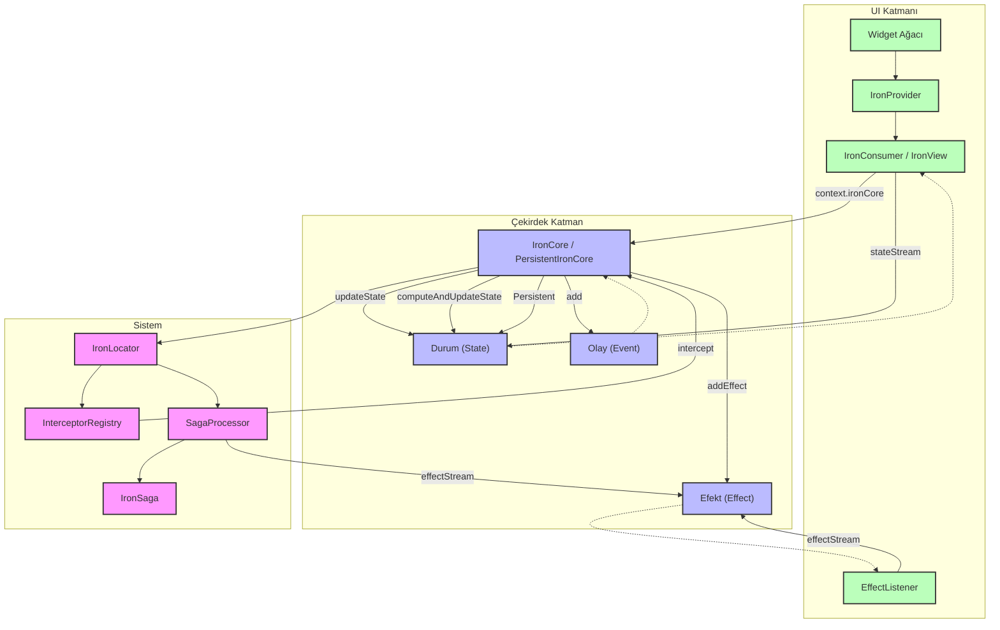

<div align="center">

# 🛡️ Iron 🛡️

**Flutter uygulamalarınız için sadece demir kadar sağlam değil, aynı zamanda akıllı ve gözlemlenebilir bir mimari!**

[](https://pub.dev/packages/iron)
[](https://opensource.org/licenses/MIT)

</div>

---

**Iron Core** size kuralları sizin koyduğunuz esnek ama disiplinli bir oyun alanı sunar. Kodunuzu bir demirci gibi şekillendirin, ölçeklenebilir ve artık tamamen gözlemlenebilir bir sanat eseri oluşturun! 💪✨

## 🔥 Felsefe ve Gelişmiş Özellikler 🔥

Iron'ı özel kılan ilkeler:

* **🔭 Her Şeyi Gören Göz: Interceptor Sistemi!**
   Uygulamanızda gerçekleşen her şeyi (olaylar, durum değişiklikleri, efektler, hatalar) gerçek zamanlı izleyin. Konsolunuzu bir komuta merkezine çevirin: `LoggingInterceptor` ile hata ayıklama hiç bu kadar kolay olmamıştı!

* **⏳ Zamanın Efendisi: Debounce & Throttle!**
   Kullanıcı bir butona mı spam atıyor? Arama çubuğunda her tuş vuruşunda istek mi atılıyor? `onDebounced` ve `onThrottled` ile olay akışını bir maestro gibi yönetin, gereksiz işlemleri ortadan kaldırın.

* **💪 Demirin Gücü: Isolate Tabanlı Hesaplama!**
   Ağır hesaplamalar uygulamanızı mı donduruyor? `computeAndUpdateState` ile bunları ayrı bir isolate'a aktarın, UI'nız 60 FPS akmaya devam etsin!

* **⛓️ Bağımsızlık Zinciri!**
   Sıfır harici paket bağımlılığı. Projenizin tam kontrolü sizde. "Bağımlılık cehennemi" diye bir yer varsa, biz haritada bile yokuz.

* **💾 Unutulmaz Kalıcılık!**
   `PersistentIronCore` ile tek satırda durumu cihaza kaydedin, uygulamanız kapansa bile kaldığı yerden devam etsin.

* **👑 Kendi Krallığınızın Hükümdarı Olun!**
   Sağlam bir temel ve üzerine kendi sarayınızı inşa etme özgürlüğü.

---

## 🧰 Kurulum

`pubspec.yaml` dosyanıza şu satırı ekleyin:

```yaml
dependencies:
  iron: any_version # En güncel sürüm için pub.dev'i kontrol edin
```
Terminalde `flutter pub get` komutunu çalıştırın. Artık demir dövmeye hazırsınız!

---

## 🚀 Hızlı Başlangıç: İlk Iron'unuzu Dövelim!

Gücümüzü basit bir sayaç uygulamasıyla test edelim.

```dart
// 1. Durum ve Olayları Tanımlayın
class CounterState { final int count; const CounterState(this.count); }
abstract class CounterEvent extends IronEvent {}
class IncrementEvent extends CounterEvent {}

// 2. Core'u Oluşturun
class CounterCore extends IronCore<CounterEvent, CounterState> {
  CounterCore() : super(const CounterState(0)) {
    on<IncrementEvent>((event) {
      updateState(AsyncData(CounterState(state.value.count + 1)));
    });
  }
}

// 3. UI'ya Bağlayın
class CounterPage extends StatelessWidget {
  final counterCore = CounterCore(); // Gerçek uygulamada DI ile sağlayın!

  @override
  Widget build(BuildContext context) {
    return Scaffold(
      body: IronView<CounterCore, CounterState>(
        core: counterCore,
        builder: (context, state) => Center(child: Text('Count: \\${state.count}')),
      ),
      floatingActionButton: FloatingActionButton(
        onPressed: () => counterCore.add(IncrementEvent()),
        child: Icon(Icons.add),
      ),
    );
  }
}
```
Hepsi bu kadar! 🎉 Temel kurulum tamam. Şimdi gerçek gücü görmeye hazır mısınız?

---

## 📚 API Referansı

Detaylı API dökümantasyonunu `dart doc` komutuyla oluşturabilirsiniz. Tüm public API'lerin kapsamlı DartDoc açıklamalarına sahip olduğundan emin olun.

Oluşan dökümantasyonu `doc/api` klasöründe bulabilirsiniz.

---

## 🛠️ Gelişmiş Örnekler

Daha gelişmiş kullanım senaryoları için `example/` klasörüne göz atın:

*   **Karmaşık Sayaç:** Daha karmaşık durum yönetimi ve olay işleme örneği.
*   **Saga Örneği:** Yan etkileri ve karmaşık asenkron akışları yönetmek için `IronSaga` kullanımı.
*   **Kalıcılık Örneği:** `PersistentIronCore` ile uygulama durumunu kaydetme ve geri yükleme.
*   **Interceptor Kullanımı:** Özel interceptor'ların uygulanması ve kaydedilmesi.

---

## ⚔️ Gelişmiş Demir Dövme Teknikleri ⚔️

#### 1. Gözetleme Kulesi: LoggingInterceptor'ı Aktifleştirme

Uygulamanızın her anını loglamak için `main.dart` dosyanıza şunları ekleyin:

```dart
void main() {
  // 1. Gerekli sistemleri kaydedin
  IronLocator.instance.registerSingleton(InterceptorRegistry(), global: true);
  IronLocator.instance.registerSingleton(SagaProcessor(), global: true);

  // 2. Gözetleme kulesini (Interceptor) kurun!
  // Sadece debug modda çalışması için kDebugMode kontrolü ekledik.
  if (kDebugMode) {
    IronLocator.instance.find<InterceptorRegistry>()
      .register(LoggingInterceptor());
  }
  
  // 3. Core'larınızı kaydedin ve uygulamayı başlatın
  IronLocator.instance.registerLazySingleton(() => CounterCore());
  runApp(const MyApp());
}
```
Konsolda sihirli loglar göreceksiniz:
```
[Interceptor][EVENT] Core: CounterCore, Event: IncrementEvent
[Interceptor][STATE] Core: CounterCore
  Previous: AsyncData<CounterState>
    Data: CounterState(count: 0)
  Next: AsyncData<CounterState>
    Data: CounterState(count: 1)
```

#### 2. Zamanı Bükmek: Debounce ile Arama Çubuğu

Her tuş vuruşunda arama yapmak yerine, kullanıcı yazmayı bıraktıktan sonra arama yapın.

```dart
class SearchCore extends IronCore<SearchEvent, SearchState> {
  SearchCore() : super(SearchInitial()) {
    // Kullanıcı 300ms boyunca yeni harf girmezse bu event tetiklenir.
    onDebounced<SearchQueryChanged>(_onSearch, const Duration(milliseconds: 300));
  }

  Future<void> _onSearch(SearchQueryChanged event) async {
    // API isteğini burada yapın!
    print("Aranıyor: \\${event.query}");
    // ...
  }
}
```

#### 3. Gücü Hisset: Ağır İşleri `compute` ile Offload Et

Büyük bir JSON dosyasını ayrıştırmak veya bir resmi işlemek gibi işlemler için:

```dart
// Core içinde...
Future<void> processHeavyJson(String jsonString) async {
  // Bu işlem ayrı bir isolate'ta çalışır, UI thread'i bloklanmaz.
  await computeAndUpdateState<String>(_parseJsonIsolate, jsonString);
}

// Bu fonksiyon üst düzey veya statik olmalı
static MyState _parseJsonIsolate(String jsonString) {
  // Ağır ayrıştırma işlemi burada...
  final data = json.decode(jsonString);
  return MyState.from(data);
}
```

---

## 🏛️ Mimarinin Ana Bileşenleri

| Bileşen | Rolü | Emoji |
| :--- | :--- | :---: |
| **`IronCore`** | Uygulamanızın beyni ve iş mantığının kalesi. | 🧠 |
| **`PersistentIronCore`**| Durumunu asla unutmayan IronCore versiyonu. | 💾 |
| **`IronEvent`** | UI'dan Core'a gönderilen "Bunu yap!" komutları. | ✉️ |
| **`IronEffect`** | Core'dan dış dünyaya "Bir şey oldu!" sinyalleri. | 💥 |
| **`IronSaga`** | Efektleri dinleyen ve karmaşık iş akışlarını yöneten bilge sihirbaz. | 🧙‍♂️ |
| **`InterceptorRegistry`** | Uygulamanın tüm akışını gözlemleyen gözetleme kulesi. | 🔭 |
| **`IronView`** | Core'daki durumu dinleyerek UI'yı otomatik güncelleyen widget. | 🖼️ |
| **`EffectListener`** | `IronEffect`'leri yakalayan gizli ajan. | 🎧 |
| **`IronLocator`** | Bağımlılıkları ihtiyacınız olan yere ışınlayan portal. | 🚪 |

---

## Mimari Diyagram (Alternatif Gösterim)



---

## 🏗️ Iron Nasıl Kullanılır: Adım Adım Rehber

Iron ile Flutter'da durum yönetimi güçlü, test edilebilir ve eğlenceli hale gelir. Kendi uygulamanızda adım adım nasıl kullanacağınız:

### 1. Iron'u Projenize Ekleyin

`pubspec.yaml` dosyanıza ekleyin:

```yaml
dependencies:
  iron: ^latest_version # En güncel sürüm için pub.dev'i kontrol edin
```
Sonra:
```sh
flutter pub get
```

---

### 2. Durum ve Olaylarınızı Tanımlayın

Durum ve olay sınıflarınızı oluşturun:

```dart
class CounterState {
  final int count;
  const CounterState(this.count);
}

abstract class CounterEvent extends IronEvent {}
class IncrementEvent extends CounterEvent {}
```

---

### 3. Core'unuzu Oluşturun (İş Mantığı)

`IronCore`'u genişletin ve olay işleyicilerinizi kaydedin:

```dart
class CounterCore extends IronCore<CounterEvent, CounterState> {
  CounterCore() : super(const CounterState(0)) {
    on<IncrementEvent>((event) {
      updateState(AsyncData(CounterState(state.value.count + 1)));
    });
  }
}
```

---

### 4. Iron'u `main.dart`'ta Kurun

Global sistemleri kaydedin ve core'unuzu widget ağacına sağlayın:

```dart
void main() {
  IronLocator.instance.registerSingleton(InterceptorRegistry(), global: true);
  IronLocator.instance.registerSingleton(SagaProcessor(), global: true);
  IronLocator.instance.find<InterceptorRegistry>().register(LoggingInterceptor(openDebug: true));

  runApp(
    IronProvider<CounterCore, CounterState>(
      core: CounterCore(),
      child: const MyApp(),
    ),
  );
}
```

---

### 5. Core'unuzu Widget'larda Kullanın

Context extension ve IronConsumer ile core ve duruma her yerde erişin:

```dart
class CounterPage extends StatelessWidget {
  const CounterPage({super.key});

  @override
  Widget build(BuildContext context) {
    final counterCore = context.ironCore<CounterCore, CounterState>();
    return IronConsumer<CounterCore, CounterState, IronEffect>(
      builder: (context, asyncState) {
        return Scaffold(
          appBar: AppBar(title: const Text('Sayaç')),
          body: Center(
            child: Text('Count: \\${asyncState.value.count}', style: const TextStyle(fontSize: 32)),
          ),
          floatingActionButton: FloatingActionButton(
            onPressed: () => counterCore.add(IncrementEvent()),
            child: const Icon(Icons.add),
          ),
        );
      },
    );
  }
}
```

---

### 6. Efektleri Dinleyin (Opsiyonel)

Core'unuz efekt yayıyorsa, `effectListener` parametresiyle yakalayın:

```dart
IronConsumer<CounterCore, CounterState, MyEffect>(
  effectListener: (context, effect) {
    // Snackbar, dialog vb. gösterin
  },
  builder: (context, asyncState) {
    // ...
  },
)
```

---

### 7. Gelişmiş: Kalıcılık, Saga ve Interceptor

- **Kalıcılık:** `PersistentIronCore` ile durumu otomatik kaydedin/yükleyin.
- **Saga:** Gelişmiş yan etki orkestrasyonu için `IronSaga` kullanın.
- **Interceptor:** Olay/durum/efektleri global olarak loglayın, debug edin veya değiştirin.

Gerçek kullanım için `example/` klasörüne bakın!

---

## 🧑‍💻 Hızlı Özet

1. Durum ve olaylarınızı tanımlayın.
2. Core'unuzu oluşturup olay işleyicilerini kaydedin.
3. Iron sistemlerini `main.dart`'ta kaydedin.
4. Core'unuzu `IronProvider` ile sağlayın.
5. Widget'larda `IronConsumer` ve context extension kullanın.
6. (Opsiyonel) Yan etkiler için efektleri dinleyin.

Artık Iron ile sağlam, test edilebilir ve ölçeklenebilir Flutter uygulamaları geliştirmeye hazırsınız!
