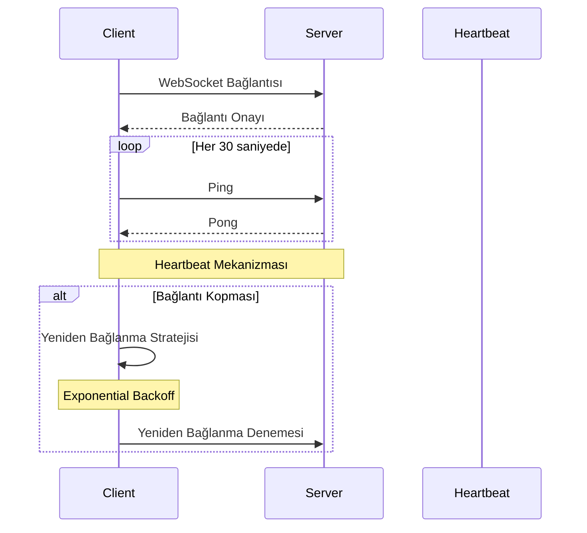
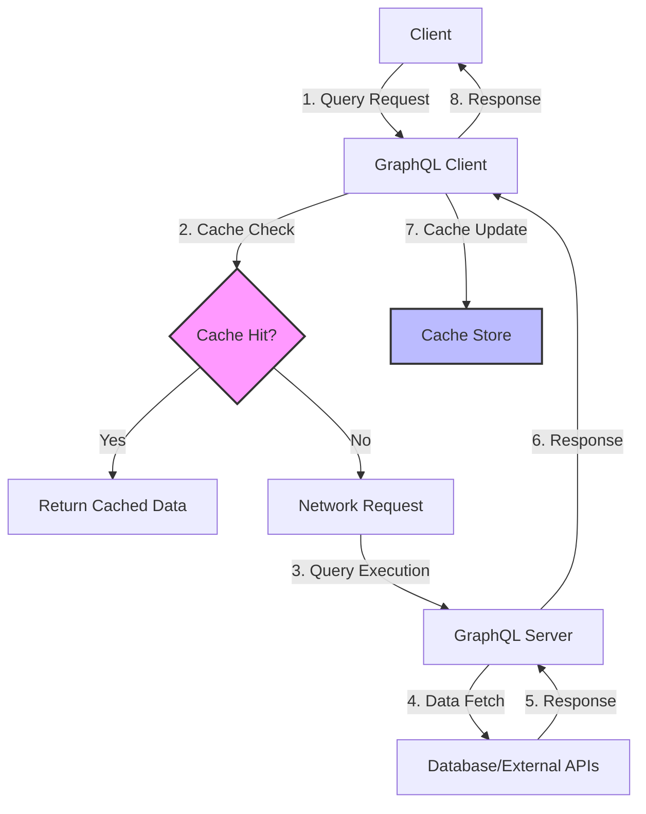
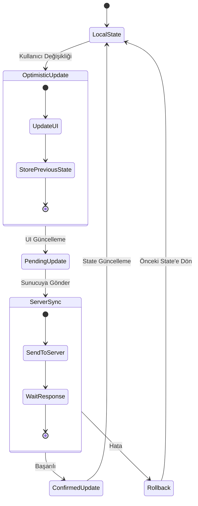

# Gelişmiş Ağ Desenleri

## WebSocket Uygulaması



### Bağlantı Yönetimi

WebSocket bağlantıları long-running connections oldukları için dikkatli bir connection management gerektirir:

#### Kalp Atışı Mekanizması
```javascript
class WebSocketManager {
  constructor(url) {
    this.url = url;
    this.heartbeatInterval = 30000; // 30 saniye
    this.heartbeatTimer = null;
  }

  connect() {
    this.ws = new WebSocket(this.url);
    
    this.ws.onopen = () => {
      console.log('WebSocket bağlantısı kuruldu');
      this.startHeartbeat();
    };

    this.ws.onmessage = (event) => {
      const message = JSON.parse(event.data);
      if (message.type === 'pong') {
        console.log('Heartbeat yanıtı alındı');
      } else {
        this.handleMessage(message);
      }
    };

    this.ws.onclose = () => {
      console.log('WebSocket bağlantısı kapandı');
      this.stopHeartbeat();
      this.reconnect();
    };
  }

  startHeartbeat() {
    this.heartbeatTimer = setInterval(() => {
      if (this.ws.readyState === WebSocket.OPEN) {
        this.ws.send(JSON.stringify({ type: 'ping' }));
      }
    }, this.heartbeatInterval);
  }

  stopHeartbeat() {
    if (this.heartbeatTimer) {
      clearInterval(this.heartbeatTimer);
      this.heartbeatTimer = null;
    }
  }
}
```

#### Reconnection Strategy
```javascript
class ReconnectingWebSocket {
  constructor(url, options = {}) {
    this.url = url;
    this.options = {
      maxReconnectAttempts: 5,
      reconnectInterval: 1000,
      maxReconnectInterval: 30000,
      reconnectDecay: 1.5,
      ...options
    };
    this.reconnectAttempts = 0;
  }

  reconnect() {
    if (this.reconnectAttempts < this.options.maxReconnectAttempts) {
      const timeout = this.options.reconnectInterval * 
        Math.pow(this.options.reconnectDecay, this.reconnectAttempts);
      
      setTimeout(() => {
        console.log(`Yeniden bağlanma denemesi: ${this.reconnectAttempts + 1}`);
        this.reconnectAttempts++;
        this.connect();
      }, Math.min(timeout, this.options.maxReconnectInterval));
    } else {
      console.error('Maksimum yeniden bağlanma denemesi aşıldı');
    }
  }
}
```

#### Connection Pooling
```javascript
class WebSocketPool {
  constructor(baseUrl, poolSize = 3) {
    this.baseUrl = baseUrl;
    this.poolSize = poolSize;
    this.connections = [];
    this.currentIndex = 0;
  }

  initialize() {
    for (let i = 0; i < this.poolSize; i++) {
      const ws = new ReconnectingWebSocket(`${this.baseUrl}/${i}`);
      this.connections.push(ws);
    }
  }

  getConnection() {
    const connection = this.connections[this.currentIndex];
    this.currentIndex = (this.currentIndex + 1) % this.poolSize;
    return connection;
  }

  broadcast(message) {
    this.connections.forEach(connection => {
      if (connection.readyState === WebSocket.OPEN) {
        connection.send(JSON.stringify(message));
      }
    });
  }
}
```

### Message Handling

#### Message Queuing
```javascript
class MessageQueue {
  constructor() {
    this.queue = [];
    this.processing = false;
  }

  enqueue(message) {
    this.queue.push({
      ...message,
      timestamp: Date.now(),
      retries: 0
    });
    
    if (!this.processing) {
      this.process();
    }
  }

  async process() {
    this.processing = true;
    
    while (this.queue.length > 0) {
      const message = this.queue.shift();
      
      try {
        await this.sendMessage(message);
      } catch (error) {
        console.error('Mesaj gönderimi başarısız:', error);
        
        if (message.retries < 3) {
          message.retries++;
          this.queue.unshift(message); // Tekrar kuyruğun başına ekle
        } else {
          console.error('Mesaj maksimum deneme sayısını aştı:', message);
        }
      }
    }
    
    this.processing = false;
  }

  async sendMessage(message) {
    return new Promise((resolve, reject) => {
      if (this.ws.readyState === WebSocket.OPEN) {
        this.ws.send(JSON.stringify(message));
        resolve();
      } else {
        reject(new Error('WebSocket bağlantısı kapalı'));
      }
    });
  }
}
```

#### Priority-Based Delivery
```javascript
class PriorityMessageQueue {
  constructor() {
    this.highPriorityQueue = [];
    this.normalPriorityQueue = [];
    this.lowPriorityQueue = [];
  }

  enqueue(message, priority = 'normal') {
    const queuedMessage = {
      ...message,
      timestamp: Date.now(),
      priority
    };

    switch (priority) {
      case 'high':
        this.highPriorityQueue.push(queuedMessage);
        break;
      case 'low':
        this.lowPriorityQueue.push(queuedMessage);
        break;
      default:
        this.normalPriorityQueue.push(queuedMessage);
    }

    this.processNext();
  }

  processNext() {
    let nextMessage;
    
    if (this.highPriorityQueue.length > 0) {
      nextMessage = this.highPriorityQueue.shift();
    } else if (this.normalPriorityQueue.length > 0) {
      nextMessage = this.normalPriorityQueue.shift();
    } else if (this.lowPriorityQueue.length > 0) {
      nextMessage = this.lowPriorityQueue.shift();
    }

    if (nextMessage) {
      this.sendMessage(nextMessage);
    }
  }
}
```

### Platform-Specific WebSocket Implementation

#### Android WebSocket
```kotlin
class AndroidWebSocketManager {
    private lateinit var webSocket: WebSocket
    private val client = OkHttpClient.Builder()
        .connectTimeout(30, TimeUnit.SECONDS)
        .readTimeout(30, TimeUnit.SECONDS)
        .writeTimeout(30, TimeUnit.SECONDS)
        .build()

    fun connect(url: String) {
        val request = Request.Builder()
            .url(url)
            .build()

        webSocket = client.newWebSocket(request, object : WebSocketListener() {
            override fun onOpen(webSocket: WebSocket, response: Response) {
                Log.d("WebSocket", "Bağlantı kuruldu")
                startHeartbeat()
            }

            override fun onMessage(webSocket: WebSocket, text: String) {
                handleMessage(text)
            }

            override fun onClosing(webSocket: WebSocket, code: Int, reason: String) {
                Log.d("WebSocket", "Bağlantı kapanıyor: $reason")
            }

            override fun onFailure(webSocket: WebSocket, t: Throwable, response: Response?) {
                Log.e("WebSocket", "Bağlantı hatası", t)
                scheduleReconnect()
            }
        })
    }

    private fun startHeartbeat() {
        val handler = Handler(Looper.getMainLooper())
        val heartbeatRunnable = object : Runnable {
            override fun run() {
                webSocket.send("""{"type":"ping"}""")
                handler.postDelayed(this, 30000)
            }
        }
        handler.post(heartbeatRunnable)
    }
}
```

#### iOS WebSocket
```swift
class iOSWebSocketManager: NSObject, URLSessionWebSocketDelegate {
    private var webSocketTask: URLSessionWebSocketTask?
    private var urlSession: URLSession?
    private var heartbeatTimer: Timer?
    
    func connect(to url: URL) {
        urlSession = URLSession(configuration: .default, delegate: self, delegateQueue: nil)
        webSocketTask = urlSession?.webSocketTask(with: url)
        webSocketTask?.resume()
        
        startHeartbeat()
        receiveMessage()
    }
    
    private func startHeartbeat() {
        heartbeatTimer = Timer.scheduledTimer(withTimeInterval: 30.0, repeats: true) { _ in
            self.sendPing()
        }
    }
    
    private func sendPing() {
        let message = URLSessionWebSocketTask.Message.string("""{"type":"ping"}""")
        webSocketTask?.send(message) { error in
            if let error = error {
                print("Ping gönderimi başarısız: \(error)")
            }
        }
    }
    
    private func receiveMessage() {
        webSocketTask?.receive { [weak self] result in
            switch result {
            case .success(let message):
                switch message {
                case .string(let text):
                    self?.handleMessage(text)
                case .data(let data):
                    self?.handleData(data)
                @unknown default:
                    break
                }
                self?.receiveMessage() // Sonraki mesajı dinle
            case .failure(let error):
                print("Mesaj alma hatası: \(error)")
                self?.scheduleReconnect()
            }
        }
    }
}
```

## GraphQL Optimizasyonu



### Query Optimization

#### Field Selection
```javascript
// Gereksiz field'ları almak yerine sadece ihtiyaç duyulanları al
const USER_PROFILE_QUERY = gql`
  query GetUserProfile($userId: ID!) {
    user(id: $userId) {
      id
      name
      email
      avatar {
        url
        alt
      }
      # Gereksiz field'ları çıkar
      # createdAt
      # updatedAt
      # permissions
    }
  }
`;
```

#### Fragment Usage
```javascript
// Ortak field'lar için fragment kullan
const USER_FRAGMENT = gql`
  fragment UserInfo on User {
    id
    name
    email
    avatar {
      url
      alt
    }
  }
`;

const USER_LIST_QUERY = gql`
  query GetUsers {
    users {
      ...UserInfo
      role
    }
  }
  ${USER_FRAGMENT}
`;

const USER_DETAIL_QUERY = gql`
  query GetUserDetail($id: ID!) {
    user(id: $id) {
      ...UserInfo
      bio
      preferences {
        theme
        language
      }
    }
  }
  ${USER_FRAGMENT}
`;
```

#### Query Batching
```javascript
class GraphQLBatcher {
  constructor(client, batchTimeout = 10) {
    this.client = client;
    this.batchTimeout = batchTimeout;
    this.batchQueue = [];
    this.batchTimer = null;
  }

  query(query, variables = {}) {
    return new Promise((resolve, reject) => {
      this.batchQueue.push({
        query,
        variables,
        resolve,
        reject
      });

      if (!this.batchTimer) {
        this.batchTimer = setTimeout(() => {
          this.executeBatch();
        }, this.batchTimeout);
      }
    });
  }

  async executeBatch() {
    const currentBatch = [...this.batchQueue];
    this.batchQueue = [];
    this.batchTimer = null;

    try {
      const batchQuery = this.createBatchQuery(currentBatch);
      const result = await this.client.query(batchQuery);
      
      this.resolveBatchResults(currentBatch, result);
    } catch (error) {
      currentBatch.forEach(item => item.reject(error));
    }
  }

  createBatchQuery(batch) {
    // Birden fazla query'yi tek bir query'de birleştir
    const queries = batch.map((item, index) => {
      return `query_${index}: ${item.query.loc.source.body}`;
    });

    return gql`
      query BatchQuery {
        ${queries.join('\n')}
      }
    `;
  }
}
```

### Caching Strategy

#### Client-Side Caching
```javascript
class GraphQLCache {
  constructor() {
    this.cache = new Map();
    this.ttl = new Map();
  }

  set(key, data, ttl = 300000) { // 5 dakika TTL
    this.cache.set(key, data);
    this.ttl.set(key, Date.now() + ttl);
  }

  get(key) {
    if (this.ttl.has(key) && Date.now() > this.ttl.get(key)) {
      this.cache.delete(key);
      this.ttl.delete(key);
      return null;
    }
    return this.cache.get(key);
  }

  invalidate(pattern) {
    const regex = new RegExp(pattern);
    for (const key of this.cache.keys()) {
      if (regex.test(key)) {
        this.cache.delete(key);
        this.ttl.delete(key);
      }
    }
  }
}
```

#### Server-Side Caching
```javascript
// GraphQL server-side caching with Redis
const redis = require('redis');
const client = redis.createClient();

const typeDefs = gql`
  type Query {
    user(id: ID!): User @cacheControl(maxAge: 300)
    posts(limit: Int): [Post] @cacheControl(maxAge: 60)
  }
`;

const resolvers = {
  Query: {
    user: async (parent, { id }, context) => {
      const cacheKey = `user:${id}`;
      const cached = await client.get(cacheKey);
      
      if (cached) {
        return JSON.parse(cached);
      }

      const user = await getUserById(id);
      await client.setex(cacheKey, 300, JSON.stringify(user));
      
      return user;
    }
  }
};
```

### Flutter GraphQL Implementation
```dart
class GraphQLService {
  late GraphQLClient _client;
  
  GraphQLService() {
    final HttpLink httpLink = HttpLink('https://api.example.com/graphql');
    final AuthLink authLink = AuthLink(getToken: () async => 'Bearer $token');
    final Link link = authLink.concat(httpLink);
    
    _client = GraphQLClient(
      cache: GraphQLCache(store: InMemoryStore()),
      link: link,
    );
  }

  Future<QueryResult> query(DocumentNode document, {Map<String, dynamic>? variables}) async {
    final QueryOptions options = QueryOptions(
      document: document,
      variables: variables ?? {},
      fetchPolicy: FetchPolicy.cacheAndNetwork,
    );
    
    return await _client.query(options);
  }

  Future<QueryResult> mutate(DocumentNode document, {Map<String, dynamic>? variables}) async {
    final MutationOptions options = MutationOptions(
      document: document,
      variables: variables ?? {},
    );
    
    return await _client.mutate(options);
  }
}
```

## Gerçek Zamanlı Veri Senkronizasyonu



### Conflict Resolution

#### Last-Write-Wins Strategy
```javascript
class LastWriteWinsResolver {
  resolveConflict(localData, remoteData) {
    // Timestamp'e göre son güncellemeyi kabul et
    if (localData.updatedAt > remoteData.updatedAt) {
      return localData;
    } else {
      return remoteData;
    }
  }

  mergeData(local, remote) {
    const resolved = { ...local };
    
    Object.keys(remote).forEach(key => {
      if (remote[key].updatedAt > (local[key]?.updatedAt || 0)) {
        resolved[key] = remote[key];
      }
    });

    return resolved;
  }
}
```

#### Merge Strategies
```javascript
class MergeStrategy {
  smartMerge(localData, remoteData) {
    const merged = { ...localData };
    
    // Conflict resolution rules
    const resolutionRules = {
      // String fields: Use remote if different
      title: (local, remote) => remote !== local ? remote : local,
      
      // Arrays: Merge unique items
      tags: (local, remote) => [...new Set([...local, ...remote])],
      
      // Objects: Deep merge
      settings: (local, remote) => this.deepMerge(local, remote),
      
      // Numbers: Use higher value
      score: (local, remote) => Math.max(local, remote)
    };

    Object.keys(remoteData).forEach(key => {
      if (resolutionRules[key]) {
        merged[key] = resolutionRules[key](localData[key], remoteData[key]);
      } else {
        merged[key] = remoteData[key];
      }
    });

    return merged;
  }

  deepMerge(obj1, obj2) {
    const result = { ...obj1 };
    
    Object.keys(obj2).forEach(key => {
      if (typeof obj2[key] === 'object' && !Array.isArray(obj2[key])) {
        result[key] = this.deepMerge(result[key] || {}, obj2[key]);
      } else {
        result[key] = obj2[key];
      }
    });

    return result;
  }
}
```

#### Version Vectors
```javascript
class VectorClock {
  constructor(nodeId) {
    this.nodeId = nodeId;
    this.vector = new Map();
    this.vector.set(nodeId, 0);
  }

  tick() {
    const currentValue = this.vector.get(this.nodeId) || 0;
    this.vector.set(this.nodeId, currentValue + 1);
    return this.getVector();
  }

  update(otherVector) {
    // Merge vector clocks
    Object.keys(otherVector).forEach(nodeId => {
      const currentValue = this.vector.get(nodeId) || 0;
      const otherValue = otherVector[nodeId];
      this.vector.set(nodeId, Math.max(currentValue, otherValue));
    });
    
    // Increment own counter
    this.tick();
  }

  compare(otherVector) {
    const thisKeys = [...this.vector.keys()];
    const otherKeys = Object.keys(otherVector);
    const allKeys = [...new Set([...thisKeys, ...otherKeys])];
    
    let thisGreater = false;
    let otherGreater = false;
    
    allKeys.forEach(key => {
      const thisValue = this.vector.get(key) || 0;
      const otherValue = otherVector[key] || 0;
      
      if (thisValue > otherValue) {
        thisGreater = true;
      } else if (otherValue > thisValue) {
        otherGreater = true;
      }
    });
    
    if (thisGreater && !otherGreater) return 1;  // This is newer
    if (otherGreater && !thisGreater) return -1; // Other is newer
    return 0; // Concurrent/conflicting
  }

  getVector() {
    return Object.fromEntries(this.vector);
  }
}
```

### State Management

#### Optimistic Updates
```javascript
class OptimisticUpdateManager {
  constructor() {
    this.pendingUpdates = new Map();
    this.rollbackStack = [];
  }

  async optimisticUpdate(id, updateFn, serverUpdateFn) {
    // Local state'i hemen güncelle
    const previousState = this.getCurrentState(id);
    const optimisticState = updateFn(previousState);
    
    // Rollback için önceki state'i sakla
    this.rollbackStack.push({ id, previousState });
    this.pendingUpdates.set(id, { optimisticState, timestamp: Date.now() });
    
    // UI'ı güncelle
    this.updateUI(id, optimisticState);
    
    try {
      // Server'a asenkron gönder
      const serverResult = await serverUpdateFn(optimisticState);
      
      // Başarılı olursa optimistic update'i confirm et
      this.confirmUpdate(id, serverResult);
    } catch (error) {
      // Hata durumunda rollback yap
      this.rollbackUpdate(id);
      throw error;
    }
  }

  confirmUpdate(id, serverResult) {
    this.pendingUpdates.delete(id);
    this.updateUI(id, serverResult);
    
    // Rollback stack'ten ilgili item'ı kaldır
    this.rollbackStack = this.rollbackStack.filter(item => item.id !== id);
  }

  rollbackUpdate(id) {
    const rollbackItem = this.rollbackStack.find(item => item.id === id);
    if (rollbackItem) {
      this.updateUI(id, rollbackItem.previousState);
      this.pendingUpdates.delete(id);
      this.rollbackStack = this.rollbackStack.filter(item => item.id !== id);
    }
  }

  isPending(id) {
    return this.pendingUpdates.has(id);
  }
}
```

#### State Reconciliation
```javascript
class StateReconciler {
  constructor() {
    this.localState = new Map();
    this.remoteState = new Map();
    this.conflictResolver = new MergeStrategy();
  }

  async reconcile(entityId) {
    const local = this.localState.get(entityId);
    const remote = this.remoteState.get(entityId);
    
    if (!local && !remote) {
      return null;
    }
    
    if (!local) {
      this.localState.set(entityId, remote);
      return remote;
    }
    
    if (!remote) {
      // Local changes need to be synced to server
      await this.syncToServer(entityId, local);
      return local;
    }
    
    // Both exist, need to resolve conflicts
    const resolved = this.conflictResolver.smartMerge(local, remote);
    
    // Update both local and remote states
    this.localState.set(entityId, resolved);
    await this.syncToServer(entityId, resolved);
    
    return resolved;
  }

  async syncToServer(entityId, data) {
    try {
      const response = await fetch(`/api/entities/${entityId}`, {
        method: 'PUT',
        headers: { 'Content-Type': 'application/json' },
        body: JSON.stringify(data)
      });
      
      if (response.ok) {
        const serverData = await response.json();
        this.remoteState.set(entityId, serverData);
      }
    } catch (error) {
      console.error('Server sync failed:', error);
      throw error;
    }
  }
}
```

Bu gelişmiş network patterns, modern mobile uygulamalarda real-time communication, efficient data transfer ve robust state management için kritik öneme sahiptir. WebSocket, GraphQL ve state synchronization teknikleri, kullanıcı deneyimini önemli ölçüde iyileştirir.
