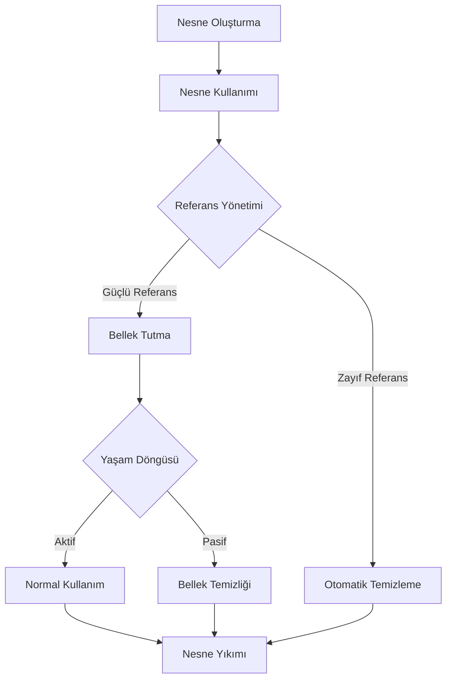
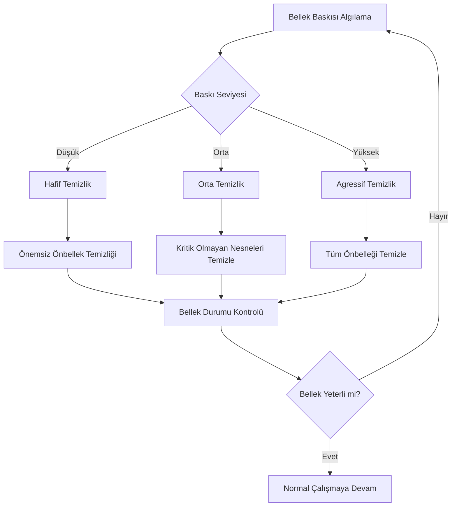
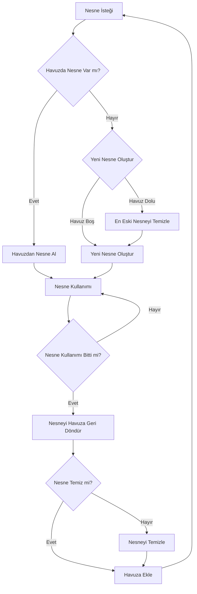

# Nesne Yaşam Döngüsü Yönetimi (Object Lifecycle Management)

Mobil uygulamalarda nesne yaşam döngüsü yönetimi, bellek sızıntılarını önlemek ve performansı optimize etmek için kritik öneme sahiptir.



## Singleton ve Scoped Nesneler

### Akıllı Singleton Yönetimi

```java
// Android - Yaşam Döngüsüne Duyarlı Akıllı Singleton
public class SmartSingleton {
    private static volatile SmartSingleton INSTANCE;
    private final Map<String, Object> cache = new ConcurrentHashMap<>();
    private final Set<LifecycleObserver> observers = new ConcurrentHashMap<>();
    private boolean isApplicationInBackground = false;
    
    public static SmartSingleton getInstance() {
        if (INSTANCE == null) {
            synchronized (SmartSingleton.class) {
                if (INSTANCE == null) {
                    INSTANCE = new SmartSingleton();
                }
            }
        }
        return INSTANCE;
    }
    
    private SmartSingleton() {
        // Uygulama yaşam döngüsü gözlemcisi
        ProcessLifecycleOwner.get().getLifecycle().addObserver(new DefaultLifecycleObserver() {
            @Override
            public void onStart(@NonNull LifecycleOwner owner) {
                isApplicationInBackground = false;
                onApplicationForeground();
            }
            
            @Override
            public void onStop(@NonNull LifecycleOwner owner) {
                isApplicationInBackground = true;
                onApplicationBackground();
            }
        });
    }
    
    public <T> void put(String key, T value, LifecycleOwner lifecycleOwner) {
        cache.put(key, value);
        
        // Yaşam döngüsü gözlemcisi ekle
        LifecycleObserver observer = new DefaultLifecycleObserver() {
            @Override
            public void onDestroy(@NonNull LifecycleOwner owner) {
                cache.remove(key);
                observers.remove(this);
                owner.getLifecycle().removeObserver(this);
            }
        };
        
        observers.add(observer);
        lifecycleOwner.getLifecycle().addObserver(observer);
    }
    
    public <T> T get(String key, Class<T> type) {
        Object value = cache.get(key);
        return type.isInstance(value) ? type.cast(value) : null;
    }
    
    private void onApplicationForeground() {
        // Uygulama ön plana geldiğinde
        notifyObservers("APP_FOREGROUND");
        
        // Kritik veriyi yeniden yükle
        refreshCriticalData();
    }
    
    private void onApplicationBackground() {
        // Uygulama arka plana geçtiğinde
        notifyObservers("APP_BACKGROUND");
        
        // Bellek temizliği
        performMemoryCleanup();
    }
    
    private void performMemoryCleanup() {
        // Kritik olmayan önbellek temizliği
        cache.entrySet().removeIf(entry -> 
            entry.getKey().startsWith("temp_") || 
            entry.getKey().startsWith("cache_"));
        
        // Zorla çöp toplama ipucu
        System.gc();
    }
    
    private void refreshCriticalData() {
        // Kritik verileri yenile
        for (String key : cache.keySet()) {
            if (key.startsWith("critical_")) {
                // Yenileme mantığı
                refreshData(key);
            }
        }
    }
    
    private void notifyObservers(String event) {
        for (LifecycleObserver observer : observers) {
            if (observer instanceof SmartSingletonObserver) {
                ((SmartSingletonObserver) observer).onEvent(event);
            }
        }
    }
}

interface SmartSingletonObserver extends LifecycleObserver {
    void onEvent(String event);
}
```

### iOS Scoped Nesne Yönetimi

```swift
// iOS - Zayıf Referans ile Scoped Nesne Yöneticisi
class ScopedObjectManager {
    private var scopedObjects: [String: WeakBox<AnyObject>] = [:]
    private var objectLifecycles: [String: ObjectLifecycle] = [:]
    private let queue = DispatchQueue(label: "scoped.objects.queue", attributes: .concurrent)
    
    static let shared = ScopedObjectManager()
    
    private init() {
        setupMemoryWarningObserver()
    }
    
    func register<T: AnyObject>(_ object: T, 
                               withScope scope: ObjectScope, 
                               identifier: String? = nil) -> String {
        let objectId = identifier ?? UUID().uuidString
        
        return queue.sync(flags: .barrier) {
            let lifecycle = ObjectLifecycle(scope: scope, creationTime: Date())
            
            scopedObjects[objectId] = WeakBox(object)
            objectLifecycles[objectId] = lifecycle
            
            // Scope tabanlı temizlik zamanlaması
            scheduleCleanup(for: objectId, scope: scope)
            
            return objectId
        }
    }
    
    func retrieve<T: AnyObject>(_ identifier: String, type: T.Type) -> T? {
        return queue.sync {
            guard let weakBox = scopedObjects[identifier],
                  let object = weakBox.value as? T else {
                // Nesne serbest bırakıldı, temizlik
                cleanup(identifier)
                return nil
            }
            
            // Erişim zamanını güncelle
            objectLifecycles[identifier]?.recordAccess()
            
            return object
        }
    }
    
    func cleanup(_ identifier: String) {
        queue.async(flags: .barrier) { [weak self] in
            self?.scopedObjects.removeValue(forKey: identifier)
            self?.objectLifecycles.removeValue(forKey: identifier)
        }
    }
    
    func cleanupExpiredObjects() {
        queue.async(flags: .barrier) { [weak self] in
            guard let self = self else { return }
            
            let now = Date()
            let expiredIds = self.objectLifecycles.compactMap { (id, lifecycle) -> String? in
                if lifecycle.isExpired(at: now) {
                    return id
                }
                return nil
            }
            
            for id in expiredIds {
                self.cleanup(id)
            }
        }
    }
    
    private func scheduleCleanup(for identifier: String, scope: ObjectScope) {
        switch scope {
        case .session:
            // Oturum boyunca tut
            break
            
        case .view(let duration):
            DispatchQueue.main.asyncAfter(deadline: .now() + duration) { [weak self] in
                self?.cleanup(identifier)
            }
            
        case .request(let ttl):
            DispatchQueue.main.asyncAfter(deadline: .now() + ttl) { [weak self] in
                self?.cleanup(identifier)
            }
            
        case .manual:
            // Manuel temizlik
            break
        }
    }
    
    private func setupMemoryWarningObserver() {
        NotificationCenter.default.addObserver(
            self,
            selector: #selector(handleMemoryWarning),
            name: UIApplication.didReceiveMemoryWarningNotification,
            object: nil
        )
    }
    
    @objc private func handleMemoryWarning() {
        queue.async(flags: .barrier) { [weak self] in
            guard let self = self else { return }
            
            // Bellek baskısına göre temizlik önceliği
            let sortedLifecycles = self.objectLifecycles.sorted { (first, second) in
                first.value.priority.rawValue > second.value.priority.rawValue
            }
            
            // Düşük öncelikli nesneleri kaldır
            for (id, lifecycle) in sortedLifecycles.suffix(sortedLifecycles.count / 2) {
                if lifecycle.scope.canBeCleanedOnMemoryPressure {
                    self.cleanup(id)
                }
            }
        }
    }
}

class WeakBox<T: AnyObject> {
    weak var value: T?
    
    init(_ value: T) {
        self.value = value
    }
}

enum ObjectScope {
    case session
    case view(duration: TimeInterval)
    case request(ttl: TimeInterval)
    case manual
    
    var canBeCleanedOnMemoryPressure: Bool {
        switch self {
        case .session:
            return false
        case .view, .request, .manual:
            return true
        }
    }
}

class ObjectLifecycle {
    let scope: ObjectScope
    let creationTime: Date
    private(set) var lastAccessTime: Date
    private(set) var accessCount: Int = 0
    
    init(scope: ObjectScope, creationTime: Date) {
        self.scope = scope
        self.creationTime = creationTime
        self.lastAccessTime = creationTime
    }
    
    func recordAccess() {
        lastAccessTime = Date()
        accessCount += 1
    }
    
    func isExpired(at time: Date) -> Bool {
        switch scope {
        case .session:
            return false
            
        case .view(let duration):
            return time.timeIntervalSince(creationTime) > duration
            
        case .request(let ttl):
            return time.timeIntervalSince(lastAccessTime) > ttl
            
        case .manual:
            return false
        }
    }
    
    var priority: Priority {
        switch scope {
        case .session:
            return .high
        case .view:
            return .medium
        case .request:
            return accessCount > 5 ? .medium : .low
        case .manual:
            return .high
        }
    }
}

enum Priority: Int {
    case low = 1
    case medium = 2
    case high = 3
}
```

## Görünüm Yaşam Döngüsü Entegrasyonu

### Android Fragment/Activity Yaşam Döngüsü

```java
// Android - Görünüm Yaşam Döngüsüne Duyarlı Nesne Yönetimi
public class ViewLifecycleObjectManager {
    private final Map<String, ViewScopedCache> viewCaches = new ConcurrentHashMap<>();
    
    public static class ViewScopedCache {
        private final Map<String, Object> objects = new ConcurrentHashMap<>();
        private final String viewId;
        private final ViewState state;
        
        public ViewScopedCache(String viewId) {
            this.viewId = viewId;
            this.state = new ViewState();
        }
        
        public <T> void put(String key, T object) {
            objects.put(key, object);
        }
        
        public <T> T get(String key, Class<T> type) {
            Object obj = objects.get(key);
            return type.isInstance(obj) ? type.cast(obj) : null;
        }
        
        public void clear() {
            // Kaynakları temizle
            for (Object obj : objects.values()) {
                if (obj instanceof Closeable) {
                    try {
                        ((Closeable) obj).close();
                    } catch (IOException e) {
                        Log.w("ViewCache", "Kaynağı kapatma başarısız", e);
                    }
                }
            }
            objects.clear();
        }
        
        public ViewState getState() {
            return state;
        }
    }
    
    public void registerFragment(Fragment fragment) {
        String fragmentId = fragment.getClass().getSimpleName() + "_" + fragment.hashCode();
        ViewScopedCache cache = new ViewScopedCache(fragmentId);
        viewCaches.put(fragmentId, cache);
        
        fragment.getLifecycle().addObserver(new DefaultLifecycleObserver() {
            @Override
            public void onCreate(@NonNull LifecycleOwner owner) {
                cache.getState().onCreate();
            }
            
            @Override
            public void onStart(@NonNull LifecycleOwner owner) {
                cache.getState().onStart();
            }
            
            @Override
            public void onResume(@NonNull LifecycleOwner owner) {
                cache.getState().onResume();
                // Önbellekli nesneleri geri yükle
                restoreViewState(cache);
            }
            
            @Override
            public void onPause(@NonNull LifecycleOwner owner) {
                cache.getState().onPause();
                // Kritik durumu kaydet
                saveViewState(cache);
            }
            
            @Override
            public void onStop(@NonNull LifecycleOwner owner) {
                cache.getState().onStop();
                // Önemsiz önbelleği temizle
                clearNonEssentialCache(cache);
            }
            
            @Override
            public void onDestroy(@NonNull LifecycleOwner owner) {
                cache.getState().onDestroy();
                cache.clear();
                viewCaches.remove(fragmentId);
                owner.getLifecycle().removeObserver(this);
            }
        });
    }
    
    public ViewScopedCache getCacheForView(String viewId) {
        return viewCaches.get(viewId);
    }
    
    private void restoreViewState(ViewScopedCache cache) {
        // Görünüm tekrar görünür olduğunda durumu geri yükle
        if (cache.getState().wasBackgrounded()) {
            // Arka plandan gelen görünüm'ler için önbellek ısıtma
            performCacheWarming(cache);
        }
    }
    
    private void saveViewState(ViewScopedCache cache) {
        // Kritik durumu kalıcı hale getir
        for (Map.Entry<String, Object> entry : cache.objects.entrySet()) {
            if (entry.getValue() instanceof Serializable && 
                entry.getKey().startsWith("critical_")) {
                saveToPersistedStorage(entry.getKey(), entry.getValue());
            }
        }
    }
    
    private void clearNonEssentialCache(ViewScopedCache cache) {
        // Önemsiz önbelleği temizle
        cache.objects.entrySet().removeIf(entry -> 
            !entry.getKey().startsWith("critical_") && 
            !entry.getKey().startsWith("essential_"));
    }
    
    private void performCacheWarming(ViewScopedCache cache) {
        // Asenkron önbellek ısıtma
        new AsyncTask<Void, Void, Void>() {
            @Override
            protected Void doInBackground(Void... voids) {
                // Beklenen verileri önceden yükle
                loadExpectedData(cache);
                return null;
            }
        }.execute();
    }
}

class ViewState {
    private boolean created = false;
    private boolean started = false;
    private boolean resumed = false;
    private boolean paused = false;
    private boolean stopped = false;
    private boolean destroyed = false;
    private long lastPauseTime = 0;
    
    public void onCreate() { created = true; }
    public void onStart() { started = true; }
    public void onResume() { 
        resumed = true; 
        paused = false;
    }
    public void onPause() { 
        paused = true; 
        resumed = false;
        lastPauseTime = System.currentTimeMillis();
    }
    public void onStop() { stopped = true; started = false; }
    public void onDestroy() { destroyed = true; }
    
    public boolean wasBackgrounded() {
        return lastPauseTime > 0 && 
               (System.currentTimeMillis() - lastPauseTime) > 5000; // 5 saniye
    }
    
    public boolean isActive() {
        return created && started && resumed && !destroyed;
    }
}
```

### iOS View Controller Yaşam Döngüsü

```swift
// iOS - UIViewController Yaşam Döngüsüne Duyarlı Nesne Yönetimi
class ViewControllerObjectManager {
    private var viewControllerCaches: [String: ViewControllerCache] = [:]
    private let queue = DispatchQueue(label: "viewcontroller.cache.queue", attributes: .concurrent)
    
    static let shared = ViewControllerObjectManager()
    
    func register<T: UIViewController>(_ viewController: T) -> String {
        let vcId = "\(type(of: viewController))_\(ObjectIdentifier(viewController).hashValue)"
        
        return queue.sync(flags: .barrier) {
            let cache = ViewControllerCache(viewController: viewController)
            viewControllerCaches[vcId] = cache
            
            setupLifecycleObservers(for: viewController, cacheId: vcId)
            
            return vcId
        }
    }
    
    func getCache(for viewControllerId: String) -> ViewControllerCache? {
        return queue.sync {
            return viewControllerCaches[viewControllerId]
        }
    }
    
    private func setupLifecycleObservers<T: UIViewController>(for viewController: T, cacheId: String) {
        // Method swizzling kullanarak yaşam döngüsü methodlarını gözlemle
        let originalViewDidLoad = viewController.viewDidLoad
        let originalViewWillAppear = viewController.viewWillAppear
        let originalViewDidAppear = viewController.viewDidAppear
        let originalViewWillDisappear = viewController.viewWillDisappear
        let originalViewDidDisappear = viewController.viewDidDisappear
        
        // ViewDidLoad override
        let viewDidLoadBlock: @convention(block) (T) -> Void = { [weak self] vc in
            originalViewDidLoad()
            self?.handleViewDidLoad(cacheId: cacheId)
        }
        
        // ViewWillAppear override
        let viewWillAppearBlock: @convention(block) (T, Bool) -> Void = { [weak self] vc, animated in
            originalViewWillAppear(animated)
            self?.handleViewWillAppear(cacheId: cacheId)
        }
        
        // ViewDidAppear override
        let viewDidAppearBlock: @convention(block) (T, Bool) -> Void = { [weak self] vc, animated in
            originalViewDidAppear(animated)
            self?.handleViewDidAppear(cacheId: cacheId)
        }
        
        // ViewWillDisappear override
        let viewWillDisappearBlock: @convention(block) (T, Bool) -> Void = { [weak self] vc, animated in
            originalViewWillDisappear(animated)
            self?.handleViewWillDisappear(cacheId: cacheId)
        }
        
        // ViewDidDisappear override
        let viewDidDisappearBlock: @convention(block) (T, Bool) -> Void = { [weak self] vc, animated in
            originalViewDidDisappear(animated)
            self?.handleViewDidDisappear(cacheId: cacheId)
        }
        
        // Method değiştirme mantığını burada uygula
        // (Method swizzling uygulaması burada yer alacak)
    }
    
    private func handleViewDidLoad(cacheId: String) {
        queue.async(flags: .barrier) { [weak self] in
            self?.viewControllerCaches[cacheId]?.setState(.loaded)
        }
    }
    
    private func handleViewWillAppear(cacheId: String) {
        queue.async(flags: .barrier) { [weak self] in
            guard let cache = self?.viewControllerCaches[cacheId] else { return }
            cache.setState(.willAppear)
            
            // Önbellek ısıtma için görünüm görünmeden önce
            self?.performPreloadTasks(for: cache)
        }
    }
    
    private func handleViewDidAppear(cacheId: String) {
        queue.async(flags: .barrier) { [weak self] in
            self?.viewControllerCaches[cacheId]?.setState(.didAppear)
        }
    }
    
    private func handleViewWillDisappear(cacheId: String) {
        queue.async(flags: .barrier) { [weak self] in
            guard let cache = self?.viewControllerCaches[cacheId] else { return }
            cache.setState(.willDisappear)
            
            // Kritik durumu kaydet
            self?.saveViewControllerState(cache)
        }
    }
    
    private func handleViewDidDisappear(cacheId: String) {
        queue.async(flags: .barrier) { [weak self] in
            guard let cache = self?.viewControllerCaches[cacheId] else { return }
            cache.setState(.didDisappear)
            
            // Bellek temizliği
            self?.performMemoryCleanup(for: cache)
        }
    }
    
    private func performPreloadTasks(for cache: ViewControllerCache) {
        // Görünüm görünmeden önce gerekli verileri önceden yükle
        cache.performPreloadTasks()
    }
    
    private func saveViewControllerState(_ cache: ViewControllerCache) {
        // Kritik durumu UserDefaults veya Core Data'ya kaydet
        cache.saveCriticalState()
    }
    
    private func performMemoryCleanup(for cache: ViewControllerCache) {
        // Önemsiz önbelleği temizle
        cache.clearNonEssentialCache()
    }
}

class ViewControllerCache {
    private weak var viewController: UIViewController?
    private var objects: [String: Any] = [:]
    private var state: ViewControllerState = .initialized
    private let creationTime = Date()
    
    init(viewController: UIViewController) {
        self.viewController = viewController
    }
    
    func set<T>(_ object: T, forKey key: String, essential: Bool = false) {
        let wrappedObject = CachedObject(value: object, isEssential: essential)
        objects[key] = wrappedObject
    }
    
    func get<T>(forKey key: String, type: T.Type) -> T? {
        guard let cachedObject = objects[key] as? CachedObject<T> else {
            return nil
        }
        return cachedObject.value
    }
    
    func setState(_ newState: ViewControllerState) {
        state = newState
    }
    
    func performPreloadTasks() {
        // View controller'a özgü önceden yükleme mantığı
        DispatchQueue.global(qos: .utility).async { [weak self] in
            // Asenkron önceden yükleme işlemleri
            self?.preloadExpectedData()
        }
    }
    
    func saveCriticalState() {
        let essentialObjects = objects.compactMapValues { obj -> Any? in
            if let cachedObj = obj as? CachedObjectProtocol, cachedObj.isEssential {
                return cachedObj.getValue()
            }
            return nil
        }
        
        if !essentialObjects.isEmpty {
            let vcIdentifier = viewController?.restorationIdentifier ?? "unknown"
            UserDefaults.standard.set(essentialObjects, forKey: "cached_state_\(vcIdentifier)")
        }
    }
    
    func clearNonEssentialCache() {
        objects = objects.compactMapValues { obj in
            if let cachedObj = obj as? CachedObjectProtocol, cachedObj.isEssential {
                return obj
            }
            return nil
        }
    }
    
    private func preloadExpectedData() {
        // View controller türüne göre beklenen verileri önceden yükle
        guard let vc = viewController else { return }
        
        switch vc {
        case is UITableViewController:
            preloadTableViewData()
        case is UICollectionViewController:
            preloadCollectionViewData()
        default:
            break
        }
    }
    
    private func preloadTableViewData() {
        // TableView için veri önceden yükleme
    }
    
    private func preloadCollectionViewData() {
        // CollectionView için veri önceden yükleme
    }
}

enum ViewControllerState {
    case initialized
    case loaded
    case willAppear
    case didAppear
    case willDisappear
    case didDisappear
    case deallocated
}

protocol CachedObjectProtocol {
    var isEssential: Bool { get }
    func getValue() -> Any
}

struct CachedObject<T>: CachedObjectProtocol {
    let value: T
    let isEssential: Bool
    let creationTime = Date()
    
    func getValue() -> Any {
        return value
    }
}
```

## Bellek Baskısı Yönetimi



### Flutter Bellek Yönetimi

```dart
// Flutter - Gelişmiş Bellek Yönetimi
class FlutterMemoryManager {
  static final FlutterMemoryManager _instance = FlutterMemoryManager._internal();
  factory FlutterMemoryManager() => _instance;
  FlutterMemoryManager._internal();
  
  final Map<String, ScopedObjectContainer> _scopedContainers = {};
  final List<MemoryPressureObserver> _observers = [];
  late final StreamSubscription<AppLifecycleState> _lifecycleSubscription;
  
  void initialize() {
    // Uygulama yaşam döngüsü izleme
    _lifecycleSubscription = WidgetsBinding.instance.lifecycleStateChanges.listen(
      (AppLifecycleState state) {
        _handleAppLifecycleChange(state);
      },
    );
    
    // Bellek baskısı izleme (platforma özgü)
    _setupMemoryPressureMonitoring();
  }
  
  String createScope(String scopeName, {Duration? ttl, int? maxObjects}) {
    final scopeId = '${scopeName}_${DateTime.now().millisecondsSinceEpoch}';
    
    _scopedContainers[scopeId] = ScopedObjectContainer(
      scopeId: scopeId,
      scopeName: scopeName,
      ttl: ttl,
      maxObjects: maxObjects ?? 100,
    );
    
    return scopeId;
  }
  
  void putObject<T>(String scopeId, String key, T object, {bool essential = false}) {
    final container = _scopedContainers[scopeId];
    if (container != null) {
      container.put(key, object, essential: essential);
    }
  }
  
  T? getObject<T>(String scopeId, String key) {
    final container = _scopedContainers[scopeId];
    return container?.get<T>(key);
  }
  
  void destroyScope(String scopeId) {
    final container = _scopedContainers.remove(scopeId);
    container?.dispose();
  }
  
  void addMemoryPressureObserver(MemoryPressureObserver observer) {
    _observers.add(observer);
  }
  
  void removeMemoryPressureObserver(MemoryPressureObserver observer) {
    _observers.remove(observer);
  }
  
  void _handleAppLifecycleChange(AppLifecycleState state) {
    switch (state) {
      case AppLifecycleState.paused:
        _handleAppPaused();
        break;
      case AppLifecycleState.resumed:
        _handleAppResumed();
        break;
      case AppLifecycleState.detached:
        _handleAppDetached();
        break;
      case AppLifecycleState.inactive:
        break;
      case AppLifecycleState.hidden:
        break;
    }
  }
  
  void _handleAppPaused() {
    // Uygulama arka plana geçtiğinde bellek temizliği
    _performMemoryCleanup(MemoryPressureLevel.moderate);
  }
  
  void _handleAppResumed() {
    // Uygulama ön plana geldiğinde önbellek ısıtma
    _performCacheWarming();
  }
  
  void _handleAppDetached() {
    // Uygulama sonlandığında tüm scope'ları temizle
    for (final container in _scopedContainers.values) {
      container.dispose();
    }
    _scopedContainers.clear();
  }
  
  void _setupMemoryPressureMonitoring() {
    // Platforma özgü bellek baskısı izleme
    if (Platform.isAndroid) {
      _setupAndroidMemoryMonitoring();
    } else if (Platform.isIOS) {
      _setupiOSMemoryMonitoring();
    }
  }
  
  void _setupAndroidMemoryMonitoring() {
    // Android ComponentCallbacks2 simülasyonu
    Timer.periodic(const Duration(seconds: 30), (timer) {
      _checkMemoryUsage();
    });
  }
  
  void _setupiOSMemoryMonitoring() {
    // iOS bellek uyarısı simülasyonu
    Timer.periodic(const Duration(seconds: 20), (timer) {
      _checkMemoryUsage();
    });
  }
  
  void _checkMemoryUsage() {
    // Basit bellek kullanımı tahmini
    final totalObjects = _scopedContainers.values
        .map((c) => c.objectCount)
        .fold(0, (sum, count) => sum + count);
    
    MemoryPressureLevel level;
    if (totalObjects > 1000) {
      level = MemoryPressureLevel.critical;
    } else if (totalObjects > 500) {
      level = MemoryPressureLevel.moderate;
    } else {
      level = MemoryPressureLevel.normal;
    }
    
    if (level != MemoryPressureLevel.normal) {
      _handleMemoryPressure(level);
    }
  }
  
  void _handleMemoryPressure(MemoryPressureLevel level) {
    // Gözlemcileri bilgilendir
    for (final observer in _observers) {
      observer.onMemoryPressure(level);
    }
    
    // Otomatik temizlik
    _performMemoryCleanup(level);
  }
  
  void _performMemoryCleanup(MemoryPressureLevel level) {
    switch (level) {
      case MemoryPressureLevel.moderate:
        _cleanupNonEssentialObjects();
        break;
      case MemoryPressureLevel.critical:
        _cleanupNonEssentialObjects();
        _cleanupOldScopes();
        break;
      case MemoryPressureLevel.normal:
        break;
    }
  }
  
  void _cleanupNonEssentialObjects() {
    for (final container in _scopedContainers.values) {
      container.clearNonEssential();
    }
  }
  
  void _cleanupOldScopes() {
    final now = DateTime.now();
    final scopesToRemove = <String>[];
    
    for (final entry in _scopedContainers.entries) {
      if (entry.value.shouldBeCleanedUp(now)) {
        scopesToRemove.add(entry.key);
      }
    }
    
    for (final scopeId in scopesToRemove) {
      destroyScope(scopeId);
    }
  }
  
  void _performCacheWarming() {
    // Kritik scope'lar için önbellek ısıtma
    for (final container in _scopedContainers.values) {
      if (container.scopeName.contains('critical')) {
        container.performCacheWarming();
      }
    }
  }
  
  void dispose() {
    _lifecycleSubscription.cancel();
    
    for (final container in _scopedContainers.values) {
      container.dispose();
    }
    _scopedContainers.clear();
    _observers.clear();
  }
}

class ScopedObjectContainer {
  final String scopeId;
  final String scopeName;
  final Duration? ttl;
  final int maxObjects;
  final DateTime creationTime = DateTime.now();
  
  final Map<String, ScopedObject> _objects = {};
  
  ScopedObjectContainer({
    required this.scopeId,
    required this.scopeName,
    this.ttl,
    required this.maxObjects,
  });
  
  void put<T>(String key, T object, {bool essential = false}) {
    // LRU dışlama
    if (_objects.length >= maxObjects) {
      _evictLRU();
    }
    
    _objects[key] = ScopedObject(
      value: object,
      isEssential: essential,
      creationTime: DateTime.now(),
    );
  }
  
  T? get<T>(String key) {
    final scopedObject = _objects[key];
    if (scopedObject == null) return null;
    
    // TTL kontrolü
    if (ttl != null && scopedObject.isExpired(ttl!)) {
      _objects.remove(key);
      return null;
    }
    
    // Erişim zamanını güncelle
    scopedObject.updateAccess();
    
    return scopedObject.value as T?;
  }
  
  void clearNonEssential() {
    _objects.removeWhere((key, obj) => !obj.isEssential);
  }
  
  bool shouldBeCleanedUp(DateTime now) {
    if (ttl == null) return false;
    return now.difference(creationTime) > ttl!;
  }
  
  void performCacheWarming() {
    // Scope'a özgü önbellek ısıtma mantığı
    print('Önbellek ısıtma yapılıyor scope: $scopeName');
  }
  
  int get objectCount => _objects.length;
  
  void _evictLRU() {
    if (_objects.isEmpty) return;
    
    // En az kullanılan önemsiz nesneyi bul
    String? lruKey;
    DateTime? oldestAccess;
    
    for (final entry in _objects.entries) {
      if (!entry.value.isEssential) {
        if (oldestAccess == null || entry.value.lastAccessTime.isBefore(oldestAccess)) {
          oldestAccess = entry.value.lastAccessTime;
          lruKey = entry.key;
        }
      }
    }
    
    if (lruKey != null) {
      _objects.remove(lruKey);
    }
  }
  
  void dispose() {
    for (final obj in _objects.values) {
      obj.dispose();
    }
    _objects.clear();
  }
}

class ScopedObject {
  final dynamic value;
  final bool isEssential;
  final DateTime creationTime;
  DateTime lastAccessTime;
  
  ScopedObject({
    required this.value,
    required this.isEssential,
    required this.creationTime,
  }) : lastAccessTime = creationTime;
  
  void updateAccess() {
    lastAccessTime = DateTime.now();
  }
  
  bool isExpired(Duration ttl) {
    return DateTime.now().difference(creationTime) > ttl;
  }
  
  void dispose() {
    if (value is Sink) {
      (value as Sink).close();
    } else if (value is StreamSubscription) {
      (value as StreamSubscription).cancel();
    }
    // Gerekirse diğer temizleme mantıkları eklenebilir
  }
}

enum MemoryPressureLevel {
  normal,
  moderate,
  critical,
}

abstract class MemoryPressureObserver {
  void onMemoryPressure(MemoryPressureLevel level);
}
```

## En İyi Uygulamalar ve Optimizasyon

### Nesne Havuzu Deseni



### Nesne Havuzu Uygulaması

```java
// Android - Nesne Havuzu Uygulaması
public class ObjectPool<T> {
    private final Queue<T> pool = new ConcurrentLinkedQueue<>();
    private final ObjectFactory<T> factory;
    private final int maxPoolSize;
    private final AtomicInteger currentSize = new AtomicInteger(0);
    
    public ObjectPool(ObjectFactory<T> factory, int maxPoolSize) {
        this.factory = factory;
        this.maxPoolSize = maxPoolSize;
    }
    
    public T acquire() {
        T object = pool.poll();
        if (object == null) {
            object = factory.create();
        } else {
            currentSize.decrementAndGet();
        }
        
        // Nesne durumunu sıfırla
        if (object instanceof Resettable) {
            ((Resettable) object).reset();
        }
        
        return object;
    }
    
    public void release(T object) {
        if (object == null) return;
        
        if (currentSize.get() < maxPoolSize) {
            // Havuzda geri döndürmeden önce nesneyi temizle
            if (object instanceof Cleanable) {
                ((Cleanable) object).clean();
            }
            
            pool.offer(object);
            currentSize.incrementAndGet();
        }
        // Eğer havuz doluysa, nesnenin çöp toplayıcı tarafından toplanmasına izin ver
    }
    
    public int size() {
        return currentSize.get();
    }
    
    public void clear() {
        T object;
        while ((object = pool.poll()) != null) {
            if (object instanceof Disposable) {
                ((Disposable) object).dispose();
            }
        }
        currentSize.set(0);
    }
}

interface ObjectFactory<T> {
    T create();
}

interface Resettable {
    void reset();
}

interface Cleanable {
    void clean();
}

interface Disposable {
    void dispose();
}

// Örnek kullanım
class BitmapPool extends ObjectPool<Bitmap> {
    public BitmapPool(int maxPoolSize) {
        super(new BitmapFactory(), maxPoolSize);
    }
    
    private static class BitmapFactory implements ObjectFactory<Bitmap> {
        @Override
        public Bitmap create() {
            return Bitmap.createBitmap(100, 100, Bitmap.Config.ARGB_8888);
        }
    }
}
```

### Bellek Sızıntısı Tespiti

```swift
// iOS - Bellek Sızıntısı Tespiti
class MemoryLeakDetector {
    private static var trackedObjects: [WeakObjectWrapper] = []
    private static let queue = DispatchQueue(label: "memory.leak.detector")
    
    static func track<T: AnyObject>(_ object: T, file: String = #file, line: Int = #line) {
        queue.async {
            let wrapper = WeakObjectWrapper(
                object: object,
                className: String(describing: type(of: object)),
                file: file,
                line: line,
                timestamp: Date()
            )
            trackedObjects.append(wrapper)
            
            // Serbest bırakılan nesneleri temizle
            cleanupDeallocatedObjects()
        }
    }
    
    static func checkForLeaks() -> [LeakReport] {
        return queue.sync {
            cleanupDeallocatedObjects()
            
            let now = Date()
            let potentialLeaks = trackedObjects.filter { wrapper in
                // 60 saniyeden daha eski nesneler potansiyel sızıntı olabilir
                now.timeIntervalSince(wrapper.timestamp) > 60
            }
            
            return potentialLeaks.map { wrapper in
                LeakReport(
                    className: wrapper.className,
                    file: wrapper.file,
                    line: wrapper.line,
                    age: now.timeIntervalSince(wrapper.timestamp)
                )
            }
        }
    }
    
    private static func cleanupDeallocatedObjects() {
        trackedObjects = trackedObjects.filter { $0.object != nil }
    }
}

private class WeakObjectWrapper {
    weak var object: AnyObject?
    let className: String
    let file: String
    let line: Int
    let timestamp: Date
    
    init(object: AnyObject, className: String, file: String, line: Int, timestamp: Date) {
        self.object = object
        self.className = className
        self.file = file
        self.line = line
        self.timestamp = timestamp
    }
}

struct LeakReport {
    let className: String
    let file: String
    let line: Int
    let age: TimeInterval
    
    var description: String {
        return "Potansiyel sızıntı: \(className) \(file):\(line), yaş: \(age)s"
    }
}

// Kullanım örneği
class MyViewController: UIViewController {
    override func viewDidLoad() {
        super.viewDidLoad()
        
        #if DEBUG
        MemoryLeakDetector.track(self)
        #endif
    }
}
```

## İzleme ve Analitik

### Performans Metriği Toplama

```dart
// Flutter - Yaşam Döngüsü Performans İzleme
class LifecyclePerformanceMonitor {
  static final Map<String, LifecycleMetrics> _metrics = {};
  static final List<PerformanceEvent> _events = [];
  
  static void recordObjectCreation(String objectType, {Map<String, dynamic>? metadata}) {
    final event = PerformanceEvent(
      type: PerformanceEventType.objectCreation,
      objectType: objectType,
      timestamp: DateTime.now(),
      metadata: metadata ?? {},
    );
    
    _events.add(event);
    _updateMetrics(objectType, event);
  }
  
  static void recordObjectDestruction(String objectType, Duration lifetime) {
    final event = PerformanceEvent(
      type: PerformanceEventType.objectDestruction,
      objectType: objectType,
      timestamp: DateTime.now(),
      metadata: {'lifetime_ms': lifetime.inMilliseconds},
    );
    
    _events.add(event);
    _updateMetrics(objectType, event);
  }
  
  static void recordMemoryPressure(MemoryPressureLevel level, int objectsCleared) {
    final event = PerformanceEvent(
      type: PerformanceEventType.memoryPressure,
      objectType: 'system',
      timestamp: DateTime.now(),
      metadata: {
        'pressure_level': level.toString(),
        'objects_cleared': objectsCleared,
      },
    );
    
    _events.add(event);
  }
  
  static LifecycleMetrics? getMetrics(String objectType) {
    return _metrics[objectType];
  }
  
  static Map<String, dynamic> generateReport() {
    final totalObjects = _metrics.values.fold(0, (sum, metrics) => sum + metrics.totalCreated);
    final averageLifetime = _calculateAverageLifetime();
    final memoryPressureEvents = _events.where((e) => e.type == PerformanceEventType.memoryPressure).length;
    
    return {
      'toplam_nesne_oluşturma': totalObjects,
      'ortalama_nesne_ömrü_ms': averageLifetime?.inMilliseconds ?? 0,
      'bellek_baskısı_olayları': memoryPressureEvents,
      'nesne_türü_dağılımı': _metrics.map((type, metrics) => MapEntry(type, {
        'oluşturulan': metrics.totalCreated,
        'yıkılan': metrics.totalDestroyed,
        'ortalama_ömrü_ms': metrics.averageLifetime?.inMilliseconds ?? 0,
        'maksimum_ömrü_ms': metrics.maxLifetime?.inMilliseconds ?? 0,
      })),
      'son_olaylar': _events.take(50).map((e) => e.toMap()).toList(),
    };
  }
  
  static void _updateMetrics(String objectType, PerformanceEvent event) {
    final metrics = _metrics.putIfAbsent(objectType, () => LifecycleMetrics(objectType));
    
    switch (event.type) {
      case PerformanceEventType.objectCreation:
        metrics.recordCreation();
        break;
      case PerformanceEventType.objectDestruction:
        final lifetimeMs = event.metadata['lifetime_ms'] as int?;
        if (lifetimeMs != null) {
          metrics.recordDestruction(Duration(milliseconds: lifetimeMs));
        }
        break;
      case PerformanceEventType.memoryPressure:
        break;
    }
    
    // Sadece son olayları sakla (son 1000)
    if (_events.length > 1000) {
      _events.removeRange(0, _events.length - 1000);
    }
  }
  
  static Duration? _calculateAverageLifetime() {
    final lifetimes = _metrics.values
        .where((m) => m.averageLifetime != null)
        .map((m) => m.averageLifetime!.inMilliseconds)
        .toList();
    
    if (lifetimes.isEmpty) return null;
    
    final average = lifetimes.fold(0, (sum, lifetime) => sum + lifetime) / lifetimes.length;
    return Duration(milliseconds: average.round());
  }
}

class LifecycleMetrics {
  final String objectType;
  int totalCreated = 0;
  int totalDestroyed = 0;
  Duration? averageLifetime;
  Duration? maxLifetime;
  final List<Duration> _lifetimes = [];
  
  LifecycleMetrics(this.objectType);
  
  void recordCreation() {
    totalCreated++;
  }
  
  void recordDestruction(Duration lifetime) {
    totalDestroyed++;
    _lifetimes.add(lifetime);
    
    // Ortalamayı güncelle
    final totalMs = _lifetimes.fold(0, (sum, duration) => sum + duration.inMilliseconds);
    averageLifetime = Duration(milliseconds: (totalMs / _lifetimes.length).round());
    
    // Maksimum ömrü güncelle
    if (maxLifetime == null || lifetime > maxLifetime!) {
      maxLifetime = lifetime;
    }
    
    // Sadece son ömürleri sakla
    if (_lifetimes.length > 100) {
      _lifetimes.removeAt(0);
    }
  }
}

class PerformanceEvent {
  final PerformanceEventType type;
  final String objectType;
  final DateTime timestamp;
  final Map<String, dynamic> metadata;
  
  PerformanceEvent({
    required this.type,
    required this.objectType,
    required this.timestamp,
    required this.metadata,
  });
  
  Map<String, dynamic> toMap() {
    return {
      'type': type.toString(),
      'object_type': objectType,
      'timestamp': timestamp.toIso8601String(),
      'metadata': metadata,
    };
  }
}

enum PerformanceEventType {
  objectCreation,
  objectDestruction,
  memoryPressure,
}
```

Bu kapsamlı nesne yaşam döngüsü yönetimi stratejileri, mobil uygulamalarda bellek sızıntılarını önler ve optimal performans sağlar. Her platform için özel optimizasyonlar ve izleme araçları kullanarak, uygulama yaşam döngüsü boyunca etkili kaynak yönetimi gerçekleştirir.
