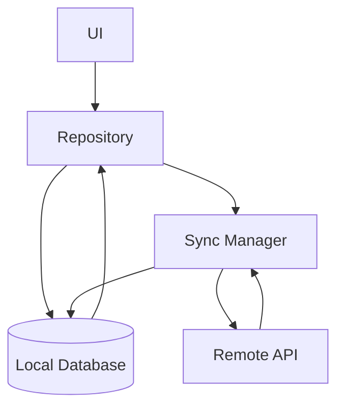
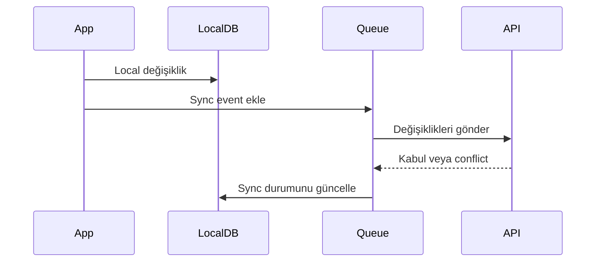

# Mobil Veri Saklama ve Senkronizasyon

Mobil veri saklama, yalnızca cihazda veri tutmak değildir. Uygulamanın offline davranışı, sync stratejisi, conflict resolution, migration ve güvenli depolama kararları birlikte tasarlanmalıdır. Bu bölüm, mobil uygulamada verinin nerede yaşayacağını, ne zaman senkronize edileceğini ve hata anında nasıl korunacağını ele alır.

## Bölüm Haritası

- [Local Database Seçenekleri](./local-databases.md): SQLite, Room, Core Data, Realm, key-value store ve cross-platform seçenekleri karşılaştırır.
- [Offline-First Tasarım](./offline-first.md): Ağ yokken uygulamanın local veriyle nasıl çalışacağını açıklar.
- [Veri Senkronizasyon Stratejileri](./sync-strategies.md): pull, push, bidirectional sync ve background sync kararlarını inceler.
- [Conflict Resolution](./conflict-resolution.md): Veri çakışmalarını algılama, çözme ve izleme stratejilerini anlatır.
- [Data Migration ve Versioning](./data-migration.md): Schema değişimi, migration güvenliği ve backward compatibility konularını kapsar.

## Temel Zorluklar

### Bağlantı Değişkenliği

Mobil cihazlar sık sık zayıf ağ, captive portal, hücresel geçiş veya tamamen offline durumlarla karşılaşır. Bu yüzden kritik veri akışları local-first düşünülmeli, sync sonradan gelen bir iyileştirme değil temel davranış olmalıdır.

### Kaynak Sınırları

Batarya, depolama alanı, RAM ve CPU mobil cihazlarda sınırlıdır. Büyük query'ler, agresif sync, gereksiz JSON saklama veya kontrolsüz image cache doğrudan kullanıcı deneyimini bozar.

### Platformlar Arası Tutarlılık

Android, iOS, Flutter ve React Native aynı ürün davranışını hedeflerken farklı storage API'leri kullanır. Ürün kuralı platformdan bağımsız tanımlanmalı, storage implementation platform özel kalmalıdır.

### Güvenlik ve Gizlilik

Token, kimlik bilgisi, sağlık/veri finansal veri veya kişisel veri local storage'a yazılmadan önce sınıflandırılmalıdır. Hassas veri encrypted storage, keychain, keystore veya platformun güvenli API'leriyle korunmalıdır.

## Mimari Desenler

### Local-First

Local-first yaklaşımda UI mümkün olduğunca local veriden beslenir. Remote API veriyi günceller, ama ekranın çalışması ağın anlık durumuna bağlı kalmaz.

### Event-Driven Sync

Event-driven sync, kullanıcı aksiyonlarını kaybetmeden ağ uygun olduğunda tekrar göndermeyi sağlar. Bu modelde queue idempotency, retry ve conflict bilgisi taşımalıdır.

## Teknoloji Seçimi

| İhtiyaç | Uygun seçenek | Dikkat noktası |
| --- | --- | --- |
| İlişkisel veri ve karmaşık query | SQLite, Room, Drift, Core Data | Migration ve index tasarımı |
| Offline-first object graph | Realm, Core Data, SwiftData | Sync davranışı ve vendor bağımlılığı |
| Basit preference | DataStore, UserDefaults, SharedPreferences | Hassas veri saklama |
| Yüksek performans key-value | MMKV, Hive | Veri modeli büyürse query zayıflar |
| Hassas veri | Keychain, Keystore, EncryptedSharedPreferences | Key rotation ve backup davranışı |

## Sync Kararları

Sync tasarlarken şu kararlar açık olmalıdır:

- Veri değişikliği önce local'e mi yoksa remote'a mı yazılır?
- Sync tetikleyicisi nedir: app start, foreground, background task, push, manuel yenileme?
- Retry politikası nasıl çalışır?
- Aynı kayıt iki cihazda değişirse ne olur?
- Server kaynaklı silme local'de nasıl temsil edilir?
- Kullanıcı sync beklerken hangi UI state'i görür?

## Migration ve Versiyonlama

Local schema değişiklikleri release sürecinin parçasıdır. Migration başarısız olduğunda veri kaybı yaşanmaması için her migration deterministik, ölçülebilir ve mümkünse küçük adımlı olmalıdır.

Kontrol listesi:

- [ ] Migration eski sürümden yeni sürüme otomatik çalışıyor.
- [ ] Büyük tablolarda migration süresi ölçüldü.
- [ ] Geri alınamayacak dönüşümler release notlarında işaretlendi.
- [ ] Kritik veri için backup veya yeniden indirme stratejisi var.
- [ ] Migration hatası telemetry ile izleniyor.

## Güvenlik Kontrol Listesi

- [ ] Hassas veri plain text local database içinde tutulmuyor.
- [ ] Token ve secret verileri secure storage içinde saklanıyor.
- [ ] Cache'e yazılan veri gizlilik seviyesine göre sınıflandırılıyor.
- [ ] Logout sırasında local veri temizleme politikası belli.
- [ ] Sync istekleri TLS ve authentication olmadan çalışmıyor.
- [ ] Audit veya telemetry kişisel veriyi gereksiz taşımıyor.

## Ölçülecek Metrikler

- Sync başarı oranı
- Ortalama sync süresi
- Conflict oranı
- Local database boyutu
- Query p95 süresi
- Migration başarı oranı
- Offline queue uzunluğu
- Storage kaynaklı crash veya exception sayısı
