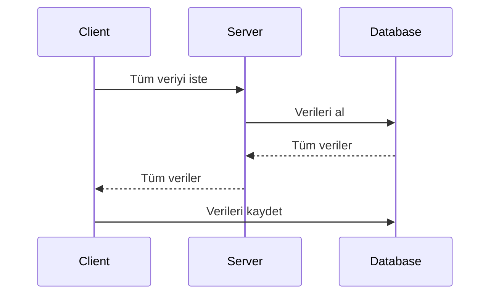
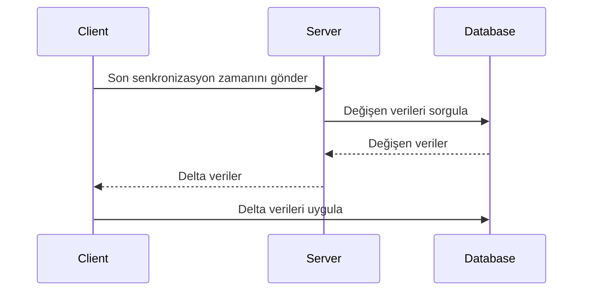
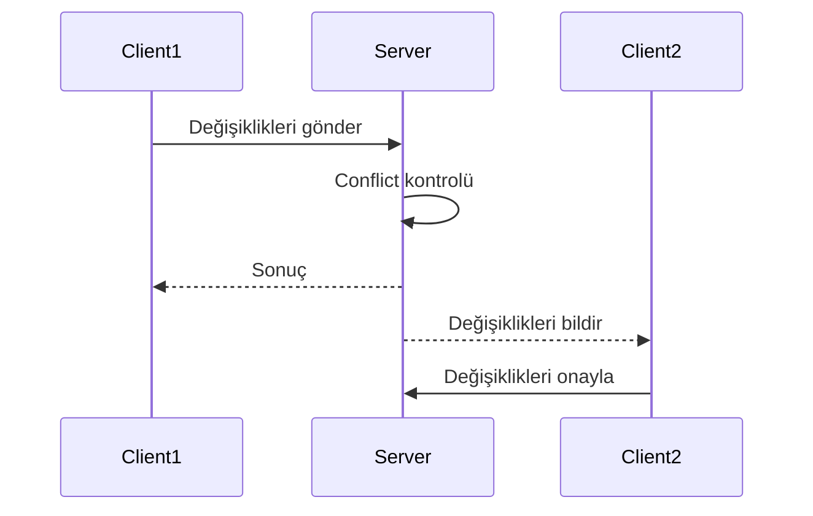
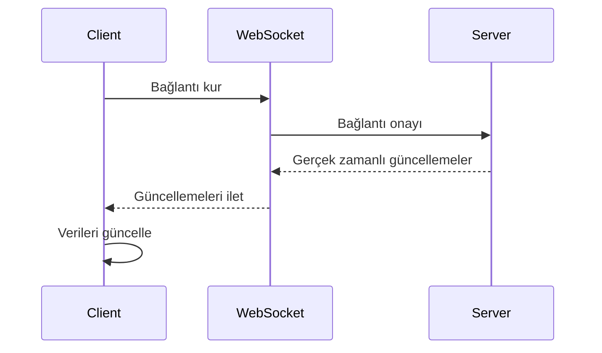

# Veri Senkronizasyon Stratejileri

Modern mobil uygulamalarda veri senkronizasyonu, kullanıcı deneyiminin kesintisizliği ve veri bütünlüğünün korunması açısından kritik önem taşır. Bu bölümde, çeşitli senkronizasyon yaklaşımları, protokolleri ve implementasyon stratejileri detaylı olarak ele alınmaktadır.

## Senkronizasyon Modelleri

### Full Synchronization
Tüm veritabanının periodic olarak senkronize edildiği yaklaşımdır.



**Avantajları:**
- Basit implementasyon
- Garantili data consistency
- Debugging ve monitoring kolaylığı

**Dezavantajları:**
- Büyük veri setlerinde yavaş
- Network bandwidth tüketimi
- Battery drain

### Incremental Synchronization
Sadece değişen verilerin senkronize edildiği yaklaşımdır.



**Delta Sync**
```kotlin
// Android Delta Sync örneği
data class SyncDelta(
    val lastSyncTimestamp: Long,
    val created: List<Entity>,
    val updated: List<Entity>,
    val deleted: List<String> // Entity IDs
)

class DeltaSyncManager {
    suspend fun performDeltaSync(): SyncResult {
        val lastSync = getLastSyncTimestamp()
        val delta = apiService.getDelta(lastSync)
        
        return withContext(Dispatchers.IO) {
            database.withTransaction {
                // Apply changes locally
                delta.created.forEach { dao.insert(it) }
                delta.updated.forEach { dao.update(it) }
                delta.deleted.forEach { dao.deleteById(it) }
                
                updateLastSyncTimestamp(System.currentTimeMillis())
            }
        }
    }
}
```

### Bi-directional Synchronization
İki yönlü veri senkronizasyonu için merkezi conflict resolution gereklidir.



**Timestamp-based Sync**
```swift
// iOS Timestamp-based Sync
struct SyncableEntity {
    let id: UUID
    var data: String
    var lastModified: Date
    var isDeleted: Bool = false
}

class BiDirectionalSync {
    func syncEntity(_ localEntity: SyncableEntity, 
                   _ remoteEntity: SyncableEntity) -> SyncableEntity {
        if localEntity.lastModified > remoteEntity.lastModified {
            return localEntity // Local wins
        } else {
            return remoteEntity // Remote wins
        }
    }
}
```

## Real-time Synchronization

### WebSocket-based Sync
Gerçek zamanlı veri güncellemeleri için WebSocket connection'ları kullanılır.



### Server-Sent Events (SSE)
Tek yönlü real-time güncellemeler için SSE kullanımı.

```dart
// Flutter SSE Implementation
class SSESync {
  StreamSubscription? _subscription;
  
  void startListening() {
    _subscription = SseClient.connect(
      Uri.parse('https://api.example.com/events')
    ).listen((event) {
      final data = jsonDecode(event.data);
      _handleServerEvent(data);
    });
  }
  
  void _handleServerEvent(Map<String, dynamic> data) async {
    switch (data['type']) {
      case 'data_update':
        await _localDatabase.updateEntity(data['payload']);
        break;
      case 'data_delete':
        await _localDatabase.deleteEntity(data['id']);
        break;
    }
  }
}
```

### Push Notification Triggered Sync
Push notification'lar ile tetiklenen senkronizasyon.

```swift
// iOS Background Push Sync
class PushTriggeredSync: UNUserNotificationCenterDelegate {
    func application(_ application: UIApplication, 
                    didReceiveRemoteNotification userInfo: [AnyHashable : Any],
                    fetchCompletionHandler completionHandler: @escaping (UIBackgroundFetchResult) -> Void) {
        
        if let syncType = userInfo["sync_type"] as? String {
            Task {
                let result = await performBackgroundSync(type: syncType)
                completionHandler(result ? .newData : .failed)
            }
        }
    }
}
```

## Conflict Resolution Strategies

### Vector Clocks
Distributed sistemlerde causal ordering için vector clock kullanımı.

```mermaid
graph TD
    A[Node A] -->|Vector Clock: [A:1, B:0]| B[Node B]
    B -->|Vector Clock: [A:1, B:1]| C[Node C]
    C -->|Vector Clock: [A:1, B:1, C:1]| A
    A -->|Conflict Resolution| D[Final State]
```

### Three-way Merge
Git-style three-way merge algoritması.

```python
# Three-way Merge Algorithm
def three_way_merge(base, local, remote):
    if local == remote:
        return local  # No conflict
    elif local == base:
        return remote  # Remote changed
    elif remote == base:
        return local   # Local changed
    else:
        return handle_conflict(base, local, remote)

def handle_conflict(base, local, remote):
    # Field-level merge strategy
    result = {}
    
    for field in set(base.keys()) | set(local.keys()) | set(remote.keys()):
        base_val = base.get(field)
        local_val = local.get(field)
        remote_val = remote.get(field)
        
        if local_val == remote_val:
            result[field] = local_val
        elif local_val == base_val:
            result[field] = remote_val
        elif remote_val == base_val:
            result[field] = local_val
        else:
            # Actual conflict - needs resolution strategy
            result[field] = resolve_conflict(field, local_val, remote_val)
    
    return result
```

## Platform-Specific Implementations

### iOS CloudKit Sync
Apple'ın CloudKit framework'ü ile automatic sync.

```swift
class CloudKitSync {
    private let container = CKContainer.default()
    private let database: CKDatabase
    
    init() {
        self.database = container.privateCloudDatabase
    }
    
    func setupRemoteNotifications() {
        let subscription = CKQuerySubscription(
            recordType: "UserData",
            predicate: NSPredicate(value: true),
            options: [.firesOnRecordCreation, .firesOnRecordUpdate, .firesOnRecordDeletion]
        )
        
        let notificationInfo = CKSubscription.NotificationInfo()
        notificationInfo.shouldSendContentAvailable = true
        subscription.notificationInfo = notificationInfo
        
        database.save(subscription) { _, error in
            if let error = error {
                print("Subscription error: \(error)")
            }
        }
    }
}
```

### Android Sync Adapter Pattern
Traditional Android sync framework kullanımı.

```kotlin
class DataSyncService : Service() {
    companion object {
        private val syncAdapterLock = Any()
        private var syncAdapter: DataSyncAdapter? = null
    }
    
    override fun onCreate() {
        synchronized(syncAdapterLock) {
            if (syncAdapter == null) {
                syncAdapter = DataSyncAdapter(applicationContext, true)
            }
        }
    }
    
    override fun onBind(intent: Intent): IBinder = syncAdapter!!.syncAdapterBinder
}

class DataSyncAdapter(
    context: Context,
    autoInitialize: Boolean
) : AbstractThreadedSyncAdapter(context, autoInitialize) {
    
    override fun onPerformSync(
        account: Account,
        extras: Bundle,
        authority: String,
        provider: ContentProviderClient,
        syncResult: SyncResult
    ) {
        try {
            performDataSync()
        } catch (e: Exception) {
            syncResult.stats.numIoExceptions++
        }
    }
}
```

### Flutter Sync Strategies
Cross-platform sync implementation.

```dart
class FlutterSyncManager {
  final ApiService _apiService;
  final LocalDatabase _localDb;
  final ConnectivityService _connectivity;
  
  Timer? _periodicSyncTimer;
  StreamSubscription? _connectivitySubscription;
  
  void startPeriodicSync() {
    _periodicSyncTimer = Timer.periodic(
      Duration(minutes: 15),
      (_) => _performSyncIfConnected(),
    );
    
    _listenToConnectivityChanges();
  }
  
  void _listenToConnectivityChanges() {
    _connectivitySubscription = _connectivity.onConnectivityChanged
      .where((result) => result != ConnectivityResult.none)
      .listen((_) => _performSyncIfConnected());
  }
  
  Future<void> _performSyncIfConnected() async {
    if (await _connectivity.hasConnection()) {
      await performBidirectionalSync();
    }
  }
  
  Future<SyncResult> performBidirectionalSync() async {
    try {
      // 1. Upload local changes
      final localChanges = await _localDb.getPendingChanges();
      await _uploadChanges(localChanges);
      
      // 2. Download remote changes
      final lastSync = await _localDb.getLastSyncTimestamp();
      final remoteChanges = await _apiService.getChangesSince(lastSync);
      await _applyRemoteChanges(remoteChanges);
      
      await _localDb.markSyncComplete();
      return SyncResult.success();
      
    } catch (e) {
      return SyncResult.failure(e.toString());
    }
  }
}
```

## Performance Optimization

### Batching Strategies
Network call'larını optimize etmek için batching.

```kotlin
class BatchingSyncManager {
    private val pendingOperations = mutableListOf<SyncOperation>()
    private val batchTimer = Timer()
    
    fun queueOperation(operation: SyncOperation) {
        synchronized(pendingOperations) {
            pendingOperations.add(operation)
            
            if (pendingOperations.size >= MAX_BATCH_SIZE) {
                flushBatch()
            } else {
                scheduleBatchFlush()
            }
        }
    }
    
    private fun scheduleBatchFlush() {
        batchTimer.schedule(object : TimerTask() {
            override fun run() {
                flushBatch()
            }
        }, BATCH_TIMEOUT_MS)
    }
    
    private fun flushBatch() {
        synchronized(pendingOperations) {
            if (pendingOperations.isNotEmpty()) {
                val batch = pendingOperations.toList()
                pendingOperations.clear()
                
                GlobalScope.launch {
                    executeBatch(batch)
                }
            }
        }
    }
}
```

### Smart Sync Scheduling
Battery ve network durumuna göre akıllı sync zamanlama.

```swift
class SmartSyncScheduler {
    private let batteryMonitor = BatteryMonitor()
    private let networkMonitor = NetworkMonitor()
    
    func scheduleSyncIfOptimal() {
        guard shouldSync() else { return }
        
        let syncInterval = calculateOptimalInterval()
        scheduleSync(after: syncInterval)
    }
    
    private func shouldSync() -> Bool {
        return batteryMonitor.batteryLevel > 0.2 &&
               networkMonitor.isOnWiFi &&
               !batteryMonitor.isLowPowerModeEnabled
    }
    
    private func calculateOptimalInterval() -> TimeInterval {
        if networkMonitor.isOnWiFi && batteryMonitor.batteryLevel > 0.8 {
            return 300 // 5 minutes
        } else if networkMonitor.isOnCellular {
            return 1800 // 30 minutes
        } else {
            return 900 // 15 minutes
        }
    }
}
```

## Monitoring ve Analytics

### Sync Performance Metrics
Senkronizasyon performansını izlemek için metrikler.

```typescript
interface SyncMetrics {
  syncDuration: number;
  recordsUploaded: number;
  recordsDownloaded: number;
  conflictsResolved: number;
  networkLatency: number;
  batteryUsage: number;
}

class SyncAnalytics {
  private metrics: SyncMetrics[] = [];
  
  recordSyncSession(metrics: SyncMetrics) {
    this.metrics.push({
      ...metrics,
      timestamp: Date.now()
    });
    
    this.analyzePerformance();
  }
  
  private analyzePerformance() {
    const recentMetrics = this.getRecentMetrics(24 * 60 * 60 * 1000); // Last 24h
    
    const avgDuration = recentMetrics.reduce((sum, m) => sum + m.syncDuration, 0) / recentMetrics.length;
    const conflictRate = recentMetrics.reduce((sum, m) => sum + m.conflictsResolved, 0) / 
                        recentMetrics.reduce((sum, m) => sum + m.recordsUploaded, 0);
    
    if (avgDuration > PERFORMANCE_THRESHOLD) {
      this.alertSlowSync(avgDuration);
    }
    
    if (conflictRate > CONFLICT_THRESHOLD) {
      this.alertHighConflictRate(conflictRate);
    }
  }
}
```

---

> Etkili veri senkronizasyonu, kullanıcı deneyimi, performans ve veri bütünlüğü arasında denge kurmayı gerektirir. Platform-specific özelliklerden yararlanırken, cross-platform consistency'yi korumak modern mobil uygulama geliştirmede kritik önem taşır.
