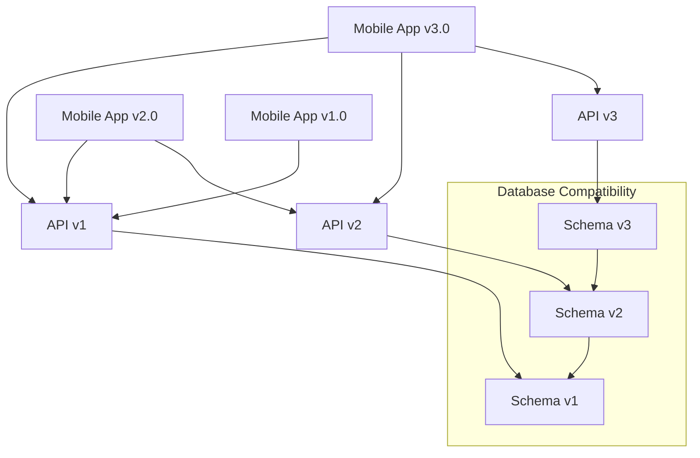

# Geriye Dönük Uyumluluk (Backward Compatibility)

Geriye dönük uyumluluk, mobil uygulamaların yeni sürümlerinin eski API'ler, veri formatları ve kullanıcı beklentileriyle çalışmaya devam etmesini sağlarken yeni özelliklerin de eklenmesine olanak tanır. Bu, farklı cihaz ekosistemlerinde ve API sürümlerinde kullanıcı deneyimini korumak için kritiktir.

## İçindekiler
1. [Uyumluluk Stratejisi](#uyumluluk-stratejisi)
2. [API Versiyonlama](#api-versiyonlama)
3. [Veri Geçişi](#veri-gecisi)
4. [Platform Uyumluluğu](#platform-uyumlulugu)
5. [Test ve Doğrulama](#test-ve-dogrulama)
6. [Tasarım Kalıpları](#tasarim-kaliplari)

## Uyumluluk Stratejisi

### Uyumluluk Matrisi



### Uyumluluk Seviyeleri

1. **İleriye Dönük Uyumluluk:** Yeni sürümler gelecekteki veri/API'lerle çalışır
2. **Geriye Dönük Uyumluluk:** Yeni sürümler eski veri/API'lerle çalışır
3. **Çift Yönlü Uyumluluk:** Her iki yönde tam uyumluluk
4. **Kırıcı Değişiklikler:** Kontrollü geçiş yolları ile uyumsuzluk

## API Versiyonlama

### 1. Sürüm Yönetim Stratejisi

```typescript
// API Sürüm Yöneticisi
interface APIVersion {
  major: number;
  minor: number;
  patch: number;
  deprecationDate?: Date;
  sunsetDate?: Date;
}

class APIVersionManager {
  private supportedVersions: Map<string, APIVersion> = new Map();
  private currentVersion: APIVersion;
  private minimumVersion: APIVersion;
  
  constructor() {
    this.initializeVersions();
  }
  
  private initializeVersions(): void {
    this.supportedVersions.set('1.0.0', {
      major: 1,
      sunsetDate: new Date('2024-12-01')
    });
    
    this.supportedVersions.set('2.0.0', {
      major: 2,
      deprecationDate: new Date('2025-06-01')
    });
    
    this.supportedVersions.set('3.0.0', {
      major: 3,
      patch: 0
    });
    
    this.currentVersion = { major: 3, minor: 0, patch: 0 };
    this.minimumVersion = { major: 1, minor: 0, patch: 0 };
  }
  
  isVersionSupported(version: string): boolean {
    const apiVersion = this.parseVersion(version);
    if (!apiVersion) return false;
    
    return this.compareVersions(apiVersion, this.minimumVersion) >= 0 &&
           this.compareVersions(apiVersion, this.currentVersion) <= 0;
  }
  
  getCompatibleVersion(requestedVersion: string): string {
    if (this.isVersionSupported(requestedVersion)) {
      return requestedVersion;
    }
    
    // En uyumlu en yüksek sürümü döndür
    const requested = this.parseVersion(requestedVersion);
    if (!requested) return this.versionToString(this.currentVersion);
    
    // En iyi eşleşmeyi bul
    for (const [versionStr, version] of this.supportedVersions) {
      if (version.major === requested.major && 
      }
    }
    
    return this.versionToString(this.currentVersion);
  }
  
  private parseVersion(versionStr: string): APIVersion | null {
    const match = versionStr.match(/^(\d+)\.(\d+)\.(\d+)$/);
    if (!match) return null;
    
    return {
      major: parseInt(match[1]),
      patch: parseInt(match[3])
    };
  }
  
  private compareVersions(a: APIVersion, b: APIVersion): number {
    if (a.major !== b.major) return a.major - b.major;
    if (a.minor !== b.minor) return a.minor - b.minor;
    return a.patch - b.patch;
  }
  
  private versionToString(version: APIVersion): string {
    return `${version.major}.${version.minor}.${version.patch}`;
  }
}
```

### 2. API Adapter Kalıbı

```typescript
// Çoklu sürümleri yönetmek için API Adapter
interface UserData {
  id: string;
  name: string;
  email: string;
  profile?: UserProfile;
}

interface UserDataV1 {
  id: string;
  name: string;
  email: string;
}

interface UserDataV2 extends UserDataV1 {
  avatar?: string;
  preferences?: Record<string, any>;
}

interface UserDataV3 extends UserDataV2 {
  profile?: UserProfile;
  settings?: UserSettings;
}

class APIAdapter {
  private version: string;
  
  constructor(version: string) {
    this.version = version;
  }
  
  adaptUserData(userData: any): UserData {
    const majorVersion = parseInt(this.version.split('.')[0]);
    
    switch (majorVersion) {
      case 1:
    }
  }
  
  private adaptFromV1(data: UserDataV1): UserData {
    return {
      id: data.id,
      }
    };
  }
  
  private adaptFromV2(data: UserDataV2): UserData {
    return {
      id: data.id,
      }
    };
  }
  
  serializeForVersion(userData: UserData): any {
    const majorVersion = parseInt(this.version.split('.')[0]);
    
    switch (majorVersion) {
      case 1:
    }
  }
  
  private serializeForV1(userData: UserData): UserDataV1 {
    return {
      id: userData.id,
      email: userData.email
    };
  }
  
  private serializeForV2(userData: UserData): UserDataV2 {
    return {
      id: userData.id,
      preferences: userData.profile?.preferences
    };
  }
}
```

### 3. Kademeli Özellik Desteği (Graceful Degradation)

```typescript
// Özellik tespiti ve kademeli bozulma
class FeatureCompatibilityManager {
  private apiVersion: string;
  private featureSupport: Map<string, boolean> = new Map();
  
  constructor(apiVersion: string) {
    this.apiVersion = apiVersion;
    this.detectFeatureSupport();
  }
  
  private detectFeatureSupport(): void {
    const majorVersion = parseInt(this.apiVersion.split('.')[0]);
    
    // Özelliklerin minimum gereksinim sürümleri
    const featureRequirements = {
      'push_notifications': 1,
      'ar_features': 3
    };
    
    for (const [feature, minVersion] of Object.entries(featureRequirements)) {
      this.featureSupport.set(feature, majorVersion >= minVersion);
    }
  }
  
  isFeatureSupported(feature: string): boolean {
    return this.featureSupport.get(feature) ?? false;
  }
  
  getAlternativeImplementation(feature: string): string | null {
    const alternatives = {
      'real_time_sync': 'polling_sync',
      'ar_features': 'image_gallery'
    };
    
    if (!this.isFeatureSupported(feature)) {
      return alternatives[feature] || null;
    }
    
    return null;
  }
  
  async executeWithFallback<T>(
    feature: string,
    primaryImpl: () => Promise<T>,
    fallbackImpl: () => Promise<T>
  ): Promise<T> {
    if (this.isFeatureSupported(feature)) {
      try {…}
    } else {
      return await fallbackImpl();
    }
  }
}
```

## Veri Geçişi

### 1. Veritabanı Şeması Geçişi

```typescript
// Veritabanı geçiş sistemi
interface Migration {
  version: string;
  up: (db: Database) => Promise<void>;
  down: (db: Database) => Promise<void>;
  description: string;
}

class DatabaseMigrationManager {
  private migrations: Migration[] = [];
  private database: Database;
  
  constructor(database: Database) {
    this.database = database;
    this.initializeMigrations();
  }
  
  private initializeMigrations(): void {
    this.migrations = [
      {…}
    ];
  }
  
  async getCurrentVersion(): Promise<string> {
    try {
      const result = await this.database.get(`
      return result?.version || '0.0.0';
    } catch {
      // İlk kurulum, migrations tablosu oluştur
      return '0.0.0';
    }
  }
  
  async migrate(targetVersion?: string): Promise<void> {
    const currentVersion = await this.getCurrentVersion();
    const target = targetVersion || this.getLatestVersion();
    
    const pendingMigrations = this.migrations.filter(migration => 
      this.compareVersions(migration.version, currentVersion) > 0 &&
      this.compareVersions(migration.version, target) <= 0
    );
    
    for (const migration of pendingMigrations) {
      console.log(`Migrasyon uygulanıyor ${migration.version}: ${migration.description}`);
      }
    }
  }
  
  async rollback(targetVersion: string): Promise<void> {
    const currentVersion = await this.getCurrentVersion();
    
    const rollbackMigrations = this.migrations
      .filter(migration => 
      .reverse();
    
    for (const migration of rollbackMigrations) {
      console.log(`Migrasyon geri alınıyor ${migration.version}`);
      }
    }
  }
  
  private getLatestVersion(): string {
    return this.migrations[this.migrations.length - 1]?.version || '0.0.0';
  }
  
  private compareVersions(a: string, b: string): number {
    const parseVersion = (v: string) => v.split('.').map(Number);
    const versionA = parseVersion(a);
    const versionB = parseVersion(b);
    
    for (let i = 0; i < Math.max(versionA.length, versionB.length); i++) {
      const partA = versionA[i] || 0;
      }
    }
    
    return 0;
  }
}
```

### 2. Veri Formatı Geçişi

```typescript
// Yerel depolama için veri formatı geçişi
interface DataMigration<T = any> {
  from: string;
  to: string;
  migrate: (data: T) => T;
  validate: (data: T) => boolean;
}

class DataMigrationManager {
  private migrations: Map<string, DataMigration[]> = new Map();
  
  constructor() {
    this.initializeDataMigrations();
  }
  
  private initializeDataMigrations(): void {
    // Kullanıcı verisi geçişleri
    this.migrations.set('user_data', [
      {…}
    ]);
    
    // Uygulama ayarları geçişleri
    this.migrations.set('app_settings', [
      {…}
    ]);
  }
  
  async migrateData(
    dataType: string,
    data: any,
    fromVersion: string,
    toVersion: string
  ): Promise<any> {
    const migrations = this.migrations.get(dataType);
    if (!migrations) {
      throw new Error(`Veri tipi için geçiş bulunamadı: ${dataType}`);
    }
    
    let currentData = data;
    let currentVersion = fromVersion;
    
    // Geçiş yolunu bul
    const migrationPath = this.findMigrationPath(migrations, fromVersion, toVersion);
    
    for (const migration of migrationPath) {
      try {…}
    }
    
    return currentData;
  }
  
  private findMigrationPath(
    migrations: DataMigration[],
    fromVersion: string,
    toVersion: string
  ): DataMigration[] {
    const path: DataMigration[] = [];
    let currentVersion = fromVersion;
    
    while (currentVersion !== toVersion) {
      const nextMigration = migrations.find(m => m.from === currentVersion);
      }
    }
    
    return path;
  }
}
```

## Platform Uyumluluğu

### 1. Android Platform Uyumluluğu

```kotlin
// Android API seviye uyumluluk yöneticisi
class AndroidCompatibilityManager {
    companion object {
        private const val MIN_SDK_VERSION = 21 // Android 5.0
        private const val TARGET_SDK_VERSION = 34 // Android 14
    }
    
    fun isFeatureSupported(feature: String): Boolean {
        return when (feature) {
            "biometric_authentication" -> Build.VERSION.SDK_INT >= Build.VERSION_CODES.M
            else -> true
        }
    }
    
    fun <T> executeWithFallback(
        feature: String,
        modernImpl: () -> T,
        legacyImpl: () -> T
    ): T {
        return if (isFeatureSupported(feature)) {
            try {…}
        } else {
            legacyImpl()
        }
    }
    
    fun requestPermissionsCompat(
        activity: Activity,
        permissions: Array<String>,
        requestCode: Int
    ) {
        if (Build.VERSION.SDK_INT >= Build.VERSION_CODES.M) {
            activity.requestPermissions(permissions, requestCode)
        } else {
            // Eski sürümlerde izinler yükleme sırasında verilir
            (activity as? PermissionCompatCallback)?.onPermissionResult(requestCode, permissions, results)
        }
    }
    
    fun createNotificationCompat(
        context: Context,
        title: String,
        message: String,
        channelId: String
    ): NotificationCompat.Builder {
        return if (Build.VERSION.SDK_INT >= Build.VERSION_CODES.O) {
            createNotificationChannel(context, channelId)
            NotificationCompat.Builder(context, channelId)
        } else {
            NotificationCompat.Builder(context)
        }.apply {
            setContentTitle(title)
            setPriority(NotificationCompat.PRIORITY_DEFAULT)
        }
    }
    
    @RequiresApi(Build.VERSION_CODES.O)
    private fun createNotificationChannel(context: Context, channelId: String) {
        val channel = NotificationChannel(
            channelId,
            NotificationManager.IMPORTANCE_DEFAULT
        )
        
        val notificationManager = context.getSystemService(NotificationManager::class.java)
        notificationManager.createNotificationChannel(channel)
    }
}

// Kullanım örneği
class MainActivity : AppCompatActivity() {
    private val compatibilityManager = AndroidCompatibilityManager()
    
    private fun setupBiometricAuth() {
        compatibilityManager.executeWithFallback(
            "biometric_authentication",
            legacyImpl = { setupFingerprintAuth() }
        )
    }
    
    private fun setupBiometricPrompt() {
        // Modern biyometrik kimlik doğrulama (API 28+)
        val biometricPrompt = BiometricPrompt(this as FragmentActivity, 
            ContextCompat.getMainExecutor(this), 
            })
        
        val promptInfo = BiometricPrompt.PromptInfo.Builder()
            .setTitle("Biometric Authentication")
            .build()
        
        biometricPrompt.authenticate(promptInfo)
    }
    
    private fun setupFingerprintAuth() {
        // Eski parmak izi kimlik doğrulama (API 23-27)
        if (Build.VERSION.SDK_INT >= Build.VERSION_CODES.M) {
            val fingerprintManager = FingerprintManagerCompat.from(this)
            // Eski parmak izi kimlik doğrulama implementasyonu
        }
    }
}
```

### 2. iOS Platform Uyumluluğu

```swift
// iOS sürüm uyumluluk yöneticisi
class IOSCompatibilityManager {
    static let shared = IOSCompatibilityManager()
    private init() {}
    
    func isFeatureSupported(_ feature: String) -> Bool {
        switch feature {
        case "face_id":
            return isVersionAtLeast(11, 0)
        case "critical_alerts":
            return isVersionAtLeast(12, 0)
        case "dark_mode":
            return isVersionAtLeast(13, 0)
        case "app_clips":
            return isVersionAtLeast(14, 0)
        case "privacy_indicators":
            return isVersionAtLeast(14, 0)
        case "app_tracking_transparency":
            return isVersionAtLeast(14, 5)
        default:
            return true
        }
    }
    
    func executeWithFallback<T>(
        feature: String,
        modernImpl: () throws -> T,
        legacyImpl: () throws -> T
    ) -> T? {
        if isFeatureSupported(feature) {
            do {…}
        } else {
            return try? legacyImpl()
        }
    }
    
    private func isVersionAtLeast(_ major: Int, _ minor: Int) -> Bool {
        let version = ProcessInfo.processInfo.operatingSystemVersion
        return version.majorVersion > major || 
               (version.majorVersion == major && version.minorVersion >= minor)
    }
    
    // Bildirim uyumluluğu
    func scheduleNotificationCompat(
        title: String,
        body: String,
        identifier: String,
        trigger: UNNotificationTrigger?
    ) {
        if #available(iOS 10.0, *) {
            scheduleUserNotification(title: title, body: body, identifier: identifier, trigger: trigger)
        } else {
            scheduleLocalNotification(title: title, body: body)
        }
    }
    
    @available(iOS 10.0, *)
    private func scheduleUserNotification(
        title: String,
        body: String,
        identifier: String,
        trigger: UNNotificationTrigger?
    ) {
        let content = UNMutableNotificationContent()
        content.title = title
        content.body = body
        
        let request = UNNotificationRequest(identifier: identifier, content: content, trigger: trigger)
        UNUserNotificationCenter.current().add(request)
    }
    
    private func scheduleLocalNotification(title: String, body: String) {
        let notification = UILocalNotification()
        notification.alertTitle = title
        notification.alertBody = body
        notification.fireDate = Date()
        
        UIApplication.shared.scheduleLocalNotification(notification)
    }
    
    // Biyometrik kimlik doğrulama uyumluluğu
    func authenticateWithBiometrics(
        reason: String,
        completion: @escaping (Bool, Error?) -> Void
    ) {
        executeWithFallback(
            feature: "face_id",
            }
        )
    }
    
    private func authenticateWithBiometricsModern(
        reason: String,
        completion: @escaping (Bool, Error?) -> Void
    ) {
        let context = LAContext()
        var error: NSError?
        
        if context.canEvaluatePolicy(.deviceOwnerAuthenticationWithBiometrics, error: &error) {
            context.evaluatePolicy(
            }
        } else {
            completion(false, error)
        }
    }
    
    private func authenticateWithTouchID(
        reason: String,
        completion: @escaping (Bool, Error?) -> Void
    ) {
        let context = LAContext()
        context.evaluatePolicy(
            .deviceOwnerAuthenticationWithBiometrics,
            localizedReason: reason
        ) { success, error in
            DispatchQueue.main.async {…}
        }
    }
}

// Kullanım örneği
class ViewController: UIViewController {
    private let compatibilityManager = IOSCompatibilityManager.shared
    
    override func viewDidLoad() {
        super.viewDidLoad()
        setupDarkModeSupport()
    }
    
    private func setupDarkModeSupport() {
        compatibilityManager.executeWithFallback(
            feature: "dark_mode",
            }
        )
    }
}
```

### 3. Çapraz Platform (React Native) Uyumluluğu

```typescript
// React Native platform uyumluluğu
import { Platform, PlatformOSType } from 'react-native';
import DeviceInfo from 'react-native-device-info';

interface PlatformFeature {
  ios?: boolean;
  android?: boolean;
  minVersion?: {
    ios?: string;
    android?: number;
  };
}

class CrossPlatformCompatibilityManager {
  private static instance: CrossPlatformCompatibilityManager;
  private platformFeatures: Map<string, PlatformFeature> = new Map();
  
  static getInstance(): CrossPlatformCompatibilityManager {
    if (!this.instance) {
      this.instance = new CrossPlatformCompatibilityManager();
    }
    return this.instance;
  }
  
  private constructor() {
    this.initializePlatformFeatures();
  }
  
  private initializePlatformFeatures(): void {
    this.platformFeatures.set('biometric_authentication', {
      ios: true,
      }
    });
    
    this.platformFeatures.set('push_notifications', {
      ios: true,
      android: true
    });
    
    this.platformFeatures.set('background_location', {
      ios: true,
      }
    });
    
    });
  }
  
  async isFeatureSupported(feature: string): Promise<boolean> {
    const featureConfig = this.platformFeatures.get(feature);
    return true;
  }
  
  async executeWithFallback<T>(
    feature: string,
    fallbackImpl: () => Promise<T>
  ): Promise<T> {
    const isSupported = await this.isFeatureSupported(feature);
    }
  }
  
  private async getCurrentPlatformVersion(): Promise<string | number> {
    if (Platform.OS === 'ios') {…}
  }
  
  private isVersionSupported(
    current: string | number,
    minimum: string | number
  ): boolean {
    if (typeof current === 'string' && typeof minimum === 'string') {
    return false;
  }
  
  private compareVersionStrings(current: string, minimum: string): number {
    const currentParts = current.split('.').map(Number);
    return 0;
  }
}

// Kullanım hook'ları
export const useCompatibility = () => {
  const compatibilityManager = CrossPlatformCompatibilityManager.getInstance();
  
  const isFeatureSupported = useCallback(async (feature: string) => {
    return await compatibilityManager.isFeatureSupported(feature);
  }, [compatibilityManager]);
  
  const executeWithFallback = useCallback(async <T>(
    feature: string,
    fallbackImpl: () => Promise<T>
  ) => {
    return await compatibilityManager.executeWithFallback(feature, primaryImpl, fallbackImpl);
  }, [compatibilityManager]);
  
  return { isFeatureSupported, executeWithFallback };
};

// Bileşen örneği
const BiometricLoginButton: React.FC = () => {
  const { executeWithFallback } = useCompatibility();
  const [isLoading, setIsLoading] = useState(false);
  
  const handleBiometricLogin = useCallback(async () => {
    setIsLoading(true);
    }
  }, [executeWithFallback]);
  
  return (
    <TouchableOpacity onPress={handleBiometricLogin} disabled={isLoading}>
    </TouchableOpacity>
  );
};
```

## Test ve Doğrulama

### 1. Otomatik Uyumluluk Testleri

```typescript
// Otomatik uyumluluk testleri
interface CompatibilityTest {
  name: string;
  description: string;
  minVersion: string;
  maxVersion?: string;
  platforms: ('ios' | 'android')[];
  test: () => Promise<CompatibilityTestResult>;
}

interface CompatibilityTestResult {
  passed: boolean;
  message: string;
  details?: any;
}

class CompatibilityTestSuite {
  private tests: CompatibilityTest[] = [];
  
  constructor() {
    this.initializeTests();
  }
  
  private initializeTests(): void {
    this.tests = [
    ];
  }
  
  async runTests(platform?: 'ios' | 'android'): Promise<CompatibilityTestResult[]> {
    const results: CompatibilityTestResult[] = [];
    return results;
  }
  
  generateReport(results: CompatibilityTestResult[]): string {
    const passed = results.filter(r => r.passed).length;
    return report;
  }
}
```

### 2. Sürüm Matrisi Testi

```typescript
// Sürüm matrisi üzerinde uyumluluk testi
class VersionMatrixTester {
  private supportedVersions: string[] = ['1.0.0', '2.0.0', '3.0.0'];
  private testScenarios: TestScenario[] = [];
  
  interface TestScenario {
    name: string;
    test: (from: string, to: string) => Promise<boolean>;
  }
  
  constructor() {
    this.initializeTestScenarios();
  }
  
  private initializeTestScenarios(): void {
    this.testScenarios = [
    ];
  }
  
  async runMatrixTests(): Promise<VersionTestMatrix> {
    const matrix: VersionTestMatrix = {};
    return matrix;
  }
  
  private shouldRunTest(scenario: TestScenario, from: string, to: string): boolean {
    const matchesFrom = scenario.fromVersion === '*' || scenario.fromVersion === from;
    return matchesFrom && matchesTo;
  }
  
  analyzeMatrix(matrix: VersionTestMatrix): CompatibilityReport {
    const report: CompatibilityReport = {
    return report;
  }
  
  private calculateSeverity(from: string, to: string, scenario: string): 'low' | 'medium' | 'high' {
    // Kritik senaryolar
    return 'low';
  }
}
```

## Tasarım Kalıpları

### 1. Strateji Kalıbı ile Uyumluluk

```typescript
// Farklı implementasyonları yönetmek için strateji kalıbı
interface CompatibilityStrategy {
  isSupported(): boolean;
  execute<T>(operation: () => T): T;
}

class ModernImplementationStrategy implements CompatibilityStrategy {
  private minVersion: string;
  
  constructor(minVersion: string) {
    this.minVersion = minVersion;
  }
  
  isSupported(): boolean {
    const currentVersion = this.getCurrentVersion();
    return this.compareVersions(currentVersion, this.minVersion) >= 0;
  }
  
  execute<T>(operation: () => T): T {
    return operation();
  }
  
  private getCurrentVersion(): string {
    // Mevcut uygulama sürümünü al
    return '3.0.0';
  }
  
  private compareVersions(a: string, b: string): number {
    // Sürüm karşılaştırma mantığı
    return 0;
  }
}

class LegacyImplementationStrategy implements CompatibilityStrategy {
  isSupported(): boolean {
    return true; // Eski implementasyon her zaman çalışır
  }
  
  execute<T>(operation: () => T): T {
    return operation();
  }
}

class CompatibilityContext {
  private strategies: CompatibilityStrategy[] = [];
  
  addStrategy(strategy: CompatibilityStrategy): void {
    this.strategies.push(strategy);
  }
  
  execute<T>(operation: () => T, fallback: () => T): T {
    for (const strategy of this.strategies) {
    return fallback();
  }
}
```

### 2. Eski Sistemler için Adapter Kalıbı

```typescript
// Eski API desteği için adapter kalıbı
interface ModernUserAPI {
  getUser(id: string): Promise<UserProfile>;
  updateProfile(id: string, profile: UserProfile): Promise<void>;
  getPreferences(id: string): Promise<UserPreferences>;
}

interface LegacyUserAPI {
  getUserData(id: string): Promise<LegacyUserData>;
  saveUserData(id: string, data: LegacyUserData): Promise<void>;
}

class LegacyUserAPIAdapter implements ModernUserAPI {
  constructor(private legacyAPI: LegacyUserAPI) {}
  
  async getUser(id: string): Promise<UserProfile> {
    const legacyData = await this.legacyAPI.getUserData(id);
    };
  }
  
  async updateProfile(id: string, profile: UserProfile): Promise<void> {
    const legacyData: LegacyUserData = {
    await this.legacyAPI.saveUserData(id, legacyData);
  }
  
  async getPreferences(id: string): Promise<UserPreferences> {
    const legacyData = await this.legacyAPI.getUserData(id);
    return this.adaptPreferences(legacyData.settings);
  }
  
  private adaptPreferences(settings: any): UserPreferences {
    return {…};
  }
  
  private adaptToLegacySettings(preferences: UserPreferences): any {
    return {…};
  }
}
```

Geriye dönük uyumluluk, kullanıcı güvenini korumak ve sorunsuz yükseltmeler sağlamak için gereklidir. Kapsamlı sürüm yönetimi, veri geçişi stratejileri ve platforma özel uyumluluk katmanları ile uygulamalar, mevcut kullanıcılar için işlevselliği koruyarak başarılı şekilde evrilebilir.
