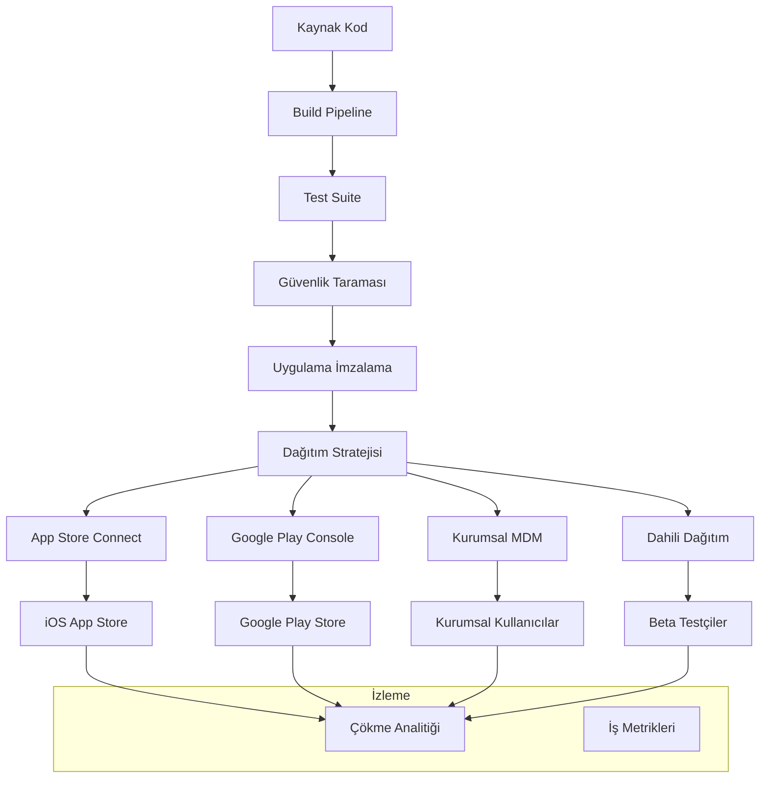

# Dağıtım Stratejileri (Deployment Strategies)

Mobil uygulamalarda dağıtım stratejileri, uygulamaların uygulama mağazaları, kurumsal dağıtım ve alternatif dağıtım kanalları üzerinden son kullanıcılara ulaştırılması sürecinin tamamını kapsar ve güvenilirlik, performans ve kullanıcı memnuniyetini sağlamayı hedefler.

## İçindekiler
1. [Dağıtım Mimarisi](#dağıtım-mimarisi)
2. [Uygulama Mağazası Dağıtımı](#uygulama-mağazası-dağıtımı)
3. [Kurumsal Dağıtım](#kurumsal-dağıtım)
4. [Kademeli Dağıtım Stratejileri](#kademeli-dağıtım-stratejileri)
5. [Blue-Green Dağıtım](#blue-green-dağıtım)
6. [İzleme ve Analitik](#izleme-ve-analitik)

## Dağıtım Mimarisi

### Dağıtım Pipeline Genel Bakış



### Dağıtım Ortamları

1. **Geliştirme:** Dahili test ve geliştirme
2. **Staging:** Üretim öncesi test ortamı
3. **Beta:** Sınırlı kullanıcı testi
4. **Prodüksiyon:** Tam halka açık sürüm
5. **Hotfix:** Acil üretim güncellemeleri

## Uygulama Mağazası Dağıtımı

### 1. iOS App Store Dağıtımı

```yaml
# iOS dağıtımı için Fastlane yapılandırması
# fastlane/Fastfile

default_platform(:ios)

platform :ios do
  before_all do
    ensure_git_status_clean
    cocoapods
  end

  desc "Uygulamayı derle ve test et"
  lane :test do
    run_tests(
    )
  end

  desc "App Store gönderimi için derle"
  lane :build_appstore do
    increment_build_number(xcodeproj: "MyApp.xcodeproj")
    )
  end

  desc "TestFlight'a yükle"
  lane :beta do
    test
    )
  end

  desc "App Store'a dağıt"
  lane :release do
    test
    )
  end

  desc "Acil hotfix dağıtımı"
  lane :hotfix do |options|
    version = options[:version]
    )
  end

  error do |lane, exception|
    slack(
    )
  end
end
```

### 2. Android Play Store Dağıtımı

```yaml
# Android dağıtımı için Fastlane yapılandırması
# fastlane/Fastfile

default_platform(:android)

platform :android do
  desc "Uygulamayı derle ve test et"
  lane :test do
    gradle(task: "test")
    gradle(task: "connectedAndroidTest")
  end

  desc "Release APK ve AAB derle"
  lane :build_release do
    # Versiyon kodunu artır
    )
  end

  desc "Dahili test dağıtımı"
  lane :internal do
    test
    )
  end

  desc "Beta test dağıtımı"
  lane :beta do
    test
    )
  end

  desc "Prodüksiyona dağıt"
  lane :release do
    test
    )
  end

  desc "Kademeli prodüksiyon dağıtımı"
  lane :gradual_release do |options|
    percentage = options[:percentage] || 5
    )
  end

  desc "Acil hotfix"
  lane :hotfix do |options|
    version = options[:version]
    )
  end

  error do |lane, exception|
    slack(
    )
  end
end
```

### 3. GitHub Actions CI/CD Pipeline

```yaml
# .github/workflows/mobile-deployment.yml
name: Mobil Uygulama Dağıtımı

on:
  push:
    branches: [main, develop, 'hotfix/*']
    tags: ['v*']
  pull_request:
    branches: [main, develop]

env:
  FLUTTER_VERSION: '3.16.0'
  NODE_VERSION: '18'

jobs:
  test:
    runs-on: ubuntu-latest

  build-ios:
    needs: test

  build-android:
    needs: test

  deploy-web:
    needs: test

  notify:
    needs: [build-ios, build-android]
```

## Kurumsal Dağıtım

### 1. Mobil Cihaz Yönetimi (MDM) Entegrasyonu

```typescript
// Kurumsal dağıtım servisi
import express from 'express';
import multer from 'multer';
import AWS from 'aws-sdk';
import jwt from 'jsonwebtoken';

interface EnterpriseApp {
  id: string;
  name: string;
  version: string;
  platform: 'ios' | 'android';
  bundleId: string;
  downloadUrl: string;
  installUrl?: string;
  manifestUrl?: string;
  createdAt: Date;
  organizationId: string;
}

class EnterpriseDeploymentService {
  private s3: AWS.S3;
  private dynamoDB: AWS.DynamoDB.DocumentClient;
  
  constructor() {
    this.s3 = new AWS.S3();
    this.dynamoDB = new AWS.DynamoDB.DocumentClient();
  }
  
  async uploadApp(
    file: Express.Multer.File,
    metadata: Partial<EnterpriseApp>
  ): Promise<EnterpriseApp> {
    // S3'e yükle
    return app;
  }
  
  private async createiOSManifest(app: EnterpriseApp): Promise<string> {
    const manifest = {
    return `https://${process.env.ENTERPRISE_APPS_BUCKET}.s3.amazonaws.com/${manifestKey}`;
  }
  
  async getAppsForOrganization(organizationId: string): Promise<EnterpriseApp[]> {
    const result = await this.dynamoDB.query({
    return result.Items as EnterpriseApp[];
  }
  
  async generateInstallationToken(
    appId: string,
    expiresIn: string = '7d'
  ): Promise<string> {
    return jwt.sign(
    );
  }
  
  private generatePlist(manifest: any): string {
<!DOCTYPE plist PUBLIC "-//Apple//DTD PLIST 1.0//EN" "http://www.apple.com/DTDs/PropertyList-1.0.dtd">
<plist version="1.0">
${this.convertToPlist(manifest)}
</plist>`;
  }
}

// Kurumsal dağıtım için Express rotaları
const app = express();
const deploymentService = new EnterpriseDeploymentService();
const upload = multer({ storage: multer.memoryStorage() });

// Kurumsal uygulama yükle
app.post('/api/enterprise/apps', upload.single('app'), async (req, res) => {
  try {…}
});

// Organizasyon için uygulamaları getir
app.get('/api/enterprise/apps/:organizationId', async (req, res) => {
  try {…}
});

// Kurulum token'ı oluştur
app.post('/api/enterprise/apps/:appId/install-token', async (req, res) => {
  try {…}
});
```

### 2. Kurumsal OTA (Over-the-Air) Güncellemeleri

```typescript
// Kurumsal OTA güncelleme sistemi
class EnterpriseOTAService {
  private updateChannel: string = 'enterprise';
  }
}
```

## Kademeli Dağıtım Stratejileri

### 1. Canary Dağıtımı

```typescript
// Canary dağıtım implementasyonu
class CanaryDeploymentManager {
  private canaryPercentage: number = 5;
  }
}
```

### 2. A/B Testi ile Dağıtım

```typescript
// A/B testi ile dağıtım
class ABTestingDeployment {
  async createABTest(
  }
}
```

## Blue-Green Dağıtım

### 1. Blue-Green Altyapısı

```typescript
// Blue-Green dağıtım için mobil backend servisleri
class BlueGreenDeploymentManager {
  private activeEnvironment: 'blue' | 'green' = 'blue';
  }
}
```

## İzleme ve Analitik

### 1. Dağıtım İzleme

```typescript
// Kapsamlı dağıtım izleme
class DeploymentMonitoringService {
  private metricsCollectors: Map<string, MetricsCollector> = new Map();
  }
}

// Gerçek zamanlı dashboard bileşeni
const DeploymentDashboard: React.FC<{ deploymentId: string }> = ({ deploymentId }) => {
  const [metrics, setMetrics] = useState<DeploymentMetrics>({});
  );
};
```

Mobil uygulama dağıtım stratejileri, başarılı sürümler için dikkatli planlama, sağlam otomasyon ve kapsamlı izleme gerektirir. Bu desen ve pratikler ile ekipler, tüm platform ve dağıtım kanallarında güvenilir, ölçeklenebilir ve kullanıcı dostu dağıtım süreçleri oluşturabilir.
