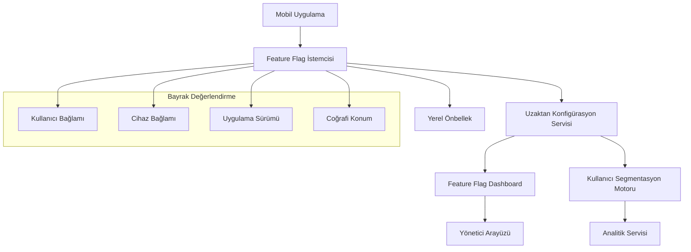

# Özellik Bayrakları (Feature Flags)

Özellik bayrakları (feature toggles), ekiplerin kod değişikliklerini hemen tüm kullanıcılara sunmadan dağıtmasına olanak tanır. Bu yaklaşım, kademeli dağıtımlar, A/B testleri ve uygulama mağazası güncellemesi gerektirmeden hızlı geri alma (rollback) gibi avantajlar sağlar.

## İçindekiler
1. [Feature Flag Mimarisi](#feature-flag-mimarisi)
2. [Uygulama Stratejileri](#uygulama-stratejileri)
3. [Platforma Özel Uygulamalar](#platforma-özel-uygulamalar)
4. [Backend Servisleri](#backend-servisleri)
5. [Gelişmiş Özellikler](#gelişmiş-özellikler)
6. [En İyi Uygulamalar](#en-iyi-uygulamalar)

## Feature Flag Mimarisi

### Sistem Bileşenleri



### Bayrak Türleri

1. **Kill Switches**: Acil durumlarda özellikleri devre dışı bırakma
2. **Release Flags**: Özellikleri kademeli olarak açma
3. **Permission Flags**: Rol tabanlı erişim
4. **Experiment Flags**: A/B testleri
5. **Operational Flags**: Performans ve operasyonel kontroller

## Uygulama Stratejileri

### 1. Konfigürasyon Tabanlı Bayraklar

```typescript
// Feature flag konfigürasyonu
interface FeatureFlag {
  key: string;
  enabled: boolean;
  rolloutPercentage: number;
  targetAudience: string[];
  conditions: FlagCondition[];
  metadata: Record<string, any>;
}

interface FlagCondition {
  type: 'user_id' | 'app_version' | 'device_type' | 'location';
  operator: 'equals' | 'contains' | 'greater_than' | 'in_list';
  value: any;
}
```

### 2. Çalışma Zamanı Değerlendirme Motoru

```typescript
class FeatureFlagEngine {
  private flags: Map<string, FeatureFlag> = new Map();
  private userContext: UserContext;
  
  constructor(userContext: UserContext) {
    this.userContext = userContext;
  }
  
  isEnabled(flagKey: string): boolean {
    const flag = this.flags.get(flagKey);
    if (!flag) return false;
    
    return this.evaluateFlag(flag);
  }
  
  private evaluateFlag(flag: FeatureFlag): boolean {
    if (!flag.enabled) return false;
    if (!this.isInRollout(flag.rolloutPercentage)) return false;
    return this.evaluateConditions(flag.conditions);
  }
  
  private isInRollout(percentage: number): boolean {
    const userId = this.userContext.userId;
    const hash = this.hashUserId(userId);
    return (hash % 100) < percentage;
  }
  
  private evaluateConditions(conditions: FlagCondition[]): boolean {
    return conditions.every(condition => {
      switch (condition.type) {
        case 'user_id':
          return this.evaluateUserCondition(condition);
        case 'app_version':
          return this.evaluateVersionCondition(condition);
        case 'device_type':
          return this.evaluateDeviceCondition(condition);
        case 'location':
          return this.evaluateLocationCondition(condition);
        default:
          return false;
      }
    });
  }
}
```

## Platforma Özel Uygulamalar

### Android (Kotlin)

```kotlin
// Feature Flag Manager
class FeatureFlagManager private constructor(
    private val context: Context,
    private val remoteConfigService: RemoteConfigService
) {
    companion object {
        @Volatile
        private var INSTANCE: FeatureFlagManager? = null
        
        fun getInstance(context: Context, remoteConfigService: RemoteConfigService): FeatureFlagManager {
            return INSTANCE ?: synchronized(this) {
                INSTANCE ?: FeatureFlagManager(context, remoteConfigService).also { INSTANCE = it }
            }
        }
    }
    
    private val localCache = FeatureFlagCache(context)
    private val evaluationEngine = FlagEvaluationEngine()
    
    suspend fun isFeatureEnabled(flagKey: String): Boolean {
        return try {
            val flag = getFlag(flagKey)
            evaluationEngine.evaluate(flag, getUserContext())
        } catch (e: Exception) {
            Log.e("FeatureFlags", "Error evaluating flag $flagKey", e)
            getDefaultValue(flagKey)
        }
    }
    
    suspend fun getFeatureVariant(flagKey: String): String {
        val flag = getFlag(flagKey)
        return evaluationEngine.getVariant(flag, getUserContext())
    }
    
    private suspend fun getFlag(flagKey: String): FeatureFlag {
        // Önce yerel önbellek
        localCache.getFlag(flagKey)?.let { return it }
        // Uzaktan al
        val flag = remoteConfigService.getFlag(flagKey)
        localCache.saveFlag(flag)
        return flag
    }
    
    private fun getUserContext(): UserContext {
        return UserContext(
            userId = getCurrentUserId(),
            deviceId = getDeviceId(),
            appVersion = getAppVersion(),
            deviceType = getDeviceType(),
            location = getCurrentLocation()
        )
    }
}
```

### React Native

```typescript
// FeatureFlag Service
class FeatureFlagService {
    private flags: Map<string, boolean> = new Map();
    async initialize() {
        try {
            const response = await fetch('/api/feature-flags');
            const flagsData = await response.json();
            Object.entries(flagsData).forEach(([key, value]) => {
                this.flags.set(key, value as boolean);
            });
        } catch (error) {
            console.warn('Feature flags yüklenemedi, varsayılan değerler kullanılıyor');
        }
    }
    isEnabled(flagName: string): boolean {
        return this.flags.get(flagName) ?? false;
    }
    setOverride(flagName: string, value: boolean) {
        this.flags.set(flagName, value);
    }
}
```

### Flutter

```dart
// Feature Flag Manager
class FeatureFlagManager {
  static final FeatureFlagManager _instance = FeatureFlagManager._internal();
  factory FeatureFlagManager() => _instance;
  FeatureFlagManager._internal();
  final Map<String, bool> _flags = {};
  Future<void> initialize() async {
    try {
      final response = await http.get(Uri.parse('/api/feature-flags'));
      final Map<String, dynamic> data = json.decode(response.body);
      data.forEach((key, value) {
        _flags[key] = value as bool;
      });
    } catch (e) {
      print('Feature flags yüklenemedi: $e');
    }
  }
  bool isEnabled(String flagName) {
    return _flags[flagName] ?? false;
  }
  void setLocalOverride(String flagName, bool value) {
    _flags[flagName] = value;
  }
}
```

### iOS (Swift)

```swift
// FeatureFlagManager.swift
class FeatureFlagManager {
    static let shared = FeatureFlagManager()
    private var flags: [String: Bool] = [:]
    private init() {}
    func initialize() async {
        do {
            guard let url = URL(string: "/api/feature-flags") else { return }
            let (data, _) = try await URLSession.shared.data(from: url)
            let flagsDict = try JSONSerialization.jsonObject(with: data) as? [String: Bool]
            self.flags = flagsDict ?? [:]
        } catch {
            print("Feature flags yüklenemedi: \(error)")
        }
    }
    func isEnabled(_ flagName: String) -> Bool {
        return flags[flagName] ?? false
    }
    func setOverride(_ flagName: String, value: Bool) {
        flags[flagName] = value
    }
}
```

## Backend Servisleri

### Remote Config Servisleri

```typescript
// Firebase Remote Config
import { getRemoteConfig, fetchAndActivate, getValue } from 'firebase/remote-config';
class FirebaseFeatureFlags {
    private remoteConfig = getRemoteConfig();
    async initialize() {
        this.remoteConfig.settings = {
            minimumFetchIntervalMillis: 3600000, // 1 saat
        };
        this.remoteConfig.defaultConfig = {
            newCheckoutFlow: false,
            premiumFeatures: false,
            darkModeEnabled: true,
        };
        await fetchAndActivate(this.remoteConfig);
    }
}
```

## Gelişmiş Özellikler

- **Kullanıcı Segmentasyonu**: Belirli kullanıcı gruplarına özel bayraklar
- **Gerçek Zamanlı Güncellemeler**: Bayrak değişikliklerinin anında uygulamaya yansıması
- **Analitik Entegrasyonu**: Bayrak etkinliği ve kullanıcı davranışlarının izlenmesi

## En İyi Uygulamalar

- Bayrakları kısa ömürlü tutun, gereksiz bayrakları temizleyin
- Kritik özellikler için kill switch kullanın
- Bayrak yönetimini merkezi dashboard ile yönetin
- Test ve prod ortamlarında farklı bayrak yapılandırmaları kullanın
- Kodda bayrak kontrollerini açık ve anlaşılır tutun

---

Feature flag mimarisi, mobil uygulamalarda güvenli, esnek ve hızlı dağıtım için modern bir yaklaşımdır. Doğru uygulandığında, hem geliştirme hem de operasyonel süreçlerde büyük avantaj sağlar.
